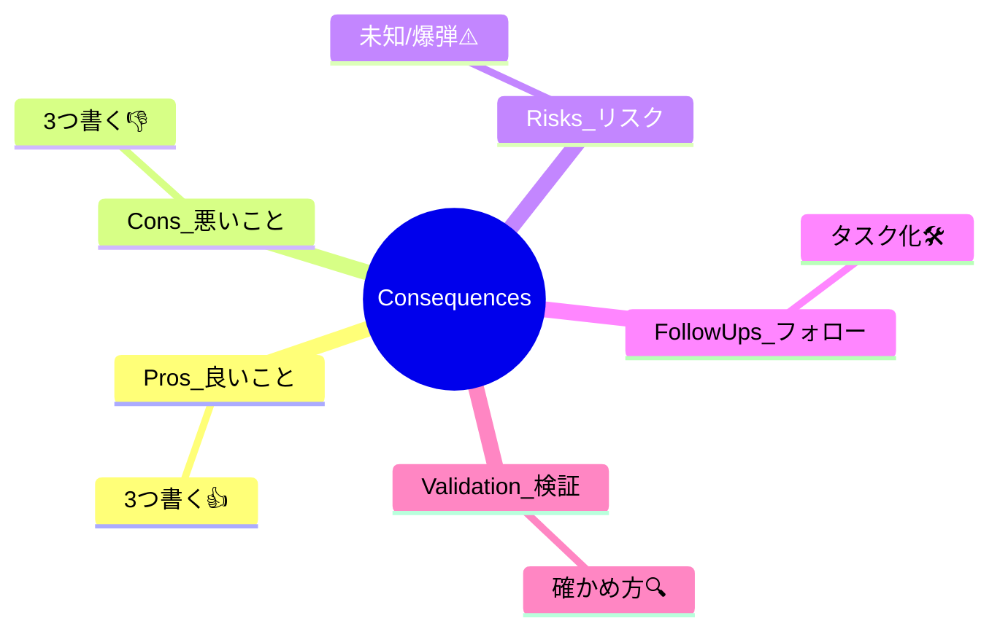
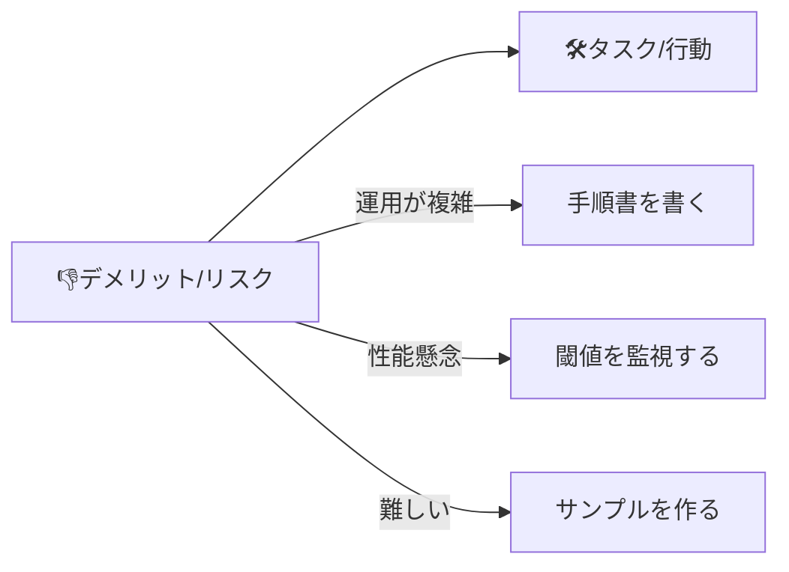

# 第07章：書き方③ Consequences（結果）— “痛み”もちゃんと書く💦💎

この章はね、**「いいことだけ書いた作文ADR」**から卒業して、
**未来の自分とチームを助ける“強いADR”**にする回だよ〜！🫶✨

---

## 7.0 この章でできるようになること🎯✨

* Consequences（結果）に **何を書くべきか** がわかる📌
* **メリットだけじゃなく、デメリット・リスクも**ちゃんと書ける👎⚠️
* 「結果」を **次のアクション（タスク）**に落とせる🧹🛠️
* TypeScript開発でありがちな Consequences ネタが増える🧠💡

---

## 7.1 Consequencesって結局なに？🤔📌

ADRの基本形（Context / Decision / Consequences）の “Consequences” は、
**「この決定をした結果、何が起きる？ 何がラクになって、何がツラくなる？」**を書く場所だよ📝✨

Michael Nygard の ADR 形式でも **Consequences は必須要素**として扱われてるよ。([Architectural Decision Records][1])
さらに元の考え方として、**良い結果だけじゃなく“全部”書く**（都合の悪い話も含めて）ことが大事って言われてるの。([Cognitect.com][2])

そして “Consequences” には、単なる感想じゃなくて、
**効果 / 結果 / フォローアップ（次にやること）**まで含めるのが良いとされるよ。([GitHub][3])


---

## 7.2 なんで「痛み（デメリット）」を書くの？😣➡️😌


「デメリット書くと、決定が弱く見える気がする…」って思いがちなんだけど、逆！🙅‍♀️💦

デメリットを書くとこうなる👇

* **未来の炎上を減らせる**🔥➡️🧯
  「聞いてないんだけど？」が減る
* **レビューが強くなる**👀✨
  反対意見を先回りして潰せる
* **運用がラクになる**🧹
  面倒ポイントが事前に見えるから、準備できる
* **“この決定を選んだ理由”が透明になる**🔍
  トレードオフを理解して合意しやすい

AWSのガイドでも、ADRは「決定・背景・結果」を書くものとして整理されてるよ。([AWS ドキュメント][4])
つまり、結果を薄く書くと、ADRが**半分欠ける**の😵‍💫

---

## 7.3 Consequencesの「書きやすい型」🧩✨（おすすめ）


初心者が強くなるには、型が正義💪🌸
私はこの型をおすすめするよ👇

### ✅ Consequences = 3 + 2 + 1 で書く✨


1. **良いこと（Pros）** 👍（3つ）
2. **悪いこと（Cons）** 👎（3つ）
3. **副作用（Neutral / Side effects）** 🌀（あれば）
4. **リスク・未知（Risks / Unknowns）** ⚠️（2つくらい）
5. **フォローアップ（Follow-ups）** 🛠️（やること）
6. **どう検証する？（Validation）** 🔍（軽く一言）

> ポイント：**「悪いこと」→「じゃあどう備える？」** まで書けると一気にプロっぽい💎



---

## 7.4 “強いConsequences”を書くコツ8つ💡✨


### ① 「何がラク/ツラくなる？」で書き始める📝

* ✅「これにより◯◯が容易になる」
* ✅「一方で◯◯が難しくなる」

### ② 具体名を出す（誰が何をする時？）👥

* ✅「新規参加の開発者が型エラーで詰まりやすい」
* ✅「APIチームとフロントの契約が明確になる」

### ③ コストは“種類”で書く💰⏳

* 学習コスト📚 / 実装コスト🛠️ / 運用コスト🧹 / 更新コスト🔄

### ④ “時間軸”を入れる🕰️

* 短期（今月）🎈 / 中期（次のリリース）📦 / 長期（半年〜）🏔️

### ⑤ 「例外」や「適用範囲」を思い出す🧷

* どこまで適用？ どこは例外？
  → Decision が強くなるし、Consequences も締まる✨

### ⑥ できれば“数字/指標”の匂いを入れる📊

* 例：ビルド時間、バグ率、PRレビュー時間、障害件数…
  ※ガチな計測じゃなくてOK！「見る予定」が大事🙆‍♀️

### ⑦ “次にやること”へ変換する🛠️

* デメリットを書く → そのまま **タスク化**できるのが最強！

### ⑧ “都合のいい未来”を書かない😇💦

* ❌「きっと運用は簡単になるはず」
* ✅「運用は簡単になる見込みだが、◯◯が必要（手順整備など）」

---

## 7.5 TypeScript開発で出やすい Consequences ネタ集🧠✨


「何書けばいいかわかんない😭」って時に、ここから引っ張ってOKだよ〜！📌

### 🧷 型まわり（strict系）

* 👍 バグの早期発見が増える
* 👎 型を書く量が増えて、最初は遅く感じる
* ⚠️ 既存コードの移行が重い（段階導入が必要）

### 🔍 ランタイム検証（zod等）

* 👍 APIレスポンスの事故が減る
* 👎 スキーマ作成の手間・重複（型と二重管理になりやすい）
* ⚠️ パフォーマンス影響や例外処理方針が必要

### 📦 モジュール/ビルド周り（ESM, bundler, nodenext等）

* 👍 ツールチェーンとの整合が良くなることが多い
* 👎 設定の理解コストが上がる（沼ポイント）
* ⚠️ 今後のTypeScriptの大きめ移行（ネイティブ化など）で“前提”が動く可能性があるので、決定の結果に「追従コスト」を書いておくと強いよ🧠
  TypeScriptチームは、5.9系の次に 6.0 を“橋渡し”として位置づけ、7.0をネイティブ化ラインとして進める方針を述べているよ。([TypeScript][5])

---

## 7.6 例：Consequencesを「弱い→強い」にしてみる✍️✨


### テーマ：APIレスポンスの runtime validation を **zod** でやる（例）

#### ❌弱いConsequences（ありがち）

* 良い点：安全になる
* 悪い点：少し大変
* 以上

…うん、かわいいけど、未来の自分が泣くやつ😭💦

#### ✅強いConsequences（この章のゴール）

* 👍 **想定外のレスポンス**が来ても、画面で爆発せずに「扱えるエラー」にできる（障害が減る）

* 👍 API変更が入った時に、型だけでなく**実行時でも検知**できる

* 👍 バグ調査が早くなる（どのフィールドが壊れてるか即わかる）

* 👎 スキーマ定義が増える（型定義と二重になりやすい）

* 👎 バリデーション失敗時の**エラー表現を統一**しないと、UXが崩れる

* 👎 スキーマ設計を雑にすると「全部 optional」みたいになって意味が薄れる

* ⚠️ バリデーションのコストが気になる画面が出るかも（大量データなど）

* ⚠️ 既存コードへの導入は段階的にしないとPRが巨大化する

* 🛠️ Follow-ups

  * 失敗時エラー型（例：`ValidationError`）と表示方針を決める
  * “まずは重要画面だけ”など導入順を決める
  * 代表APIでパフォーマンス確認（簡単な計測でOK）

* 🔍 Validation（検証）

  * 想定外レスポンスの再現テストを1つ入れる / 主要画面のレスポンスサイズで計測する

こう書くと、ADRが一気に「未来の説明書」になるよ📒💎

---

## 7.7 Consequencesを「タスク」に変換する魔法🪄🛠️


書いたデメリットやリスクは、**放置すると呪い**になる👻💦
だから、こうやって変換しよ👇

* 👎「運用が複雑になる」
  → 🛠️「運用手順を docs に書く」
* ⚠️「パフォーマンスが落ちるかも」
  → 🛠️「計測して、閾値超えたら代替案に切り替える条件を書く」
* 👎「学習コストが高い」
  → 🛠️「最小サンプルとチートシートを用意する」



---

## 7.8 ワーク（手を動かすやつ）🎮✨

### ワークA（5分）：「良い3つ＋悪い3つ」縛り✍️

最近の判断を1つ選んで、Consequencesを **3/3** で書く👍👎

### ワークB（5分）：「リスク2つ」だけ追加⚠️

* “起きたらダメージが大きいこと”を2つ

### ワークC（5分）：「Follow-ups」を3つ🛠️

* リスクやデメリットを **潰す行動**に変換する

---

## 7.9 AI活用（Copilot/Codex向け）プロンプト例🤖💕


そのままコピペして使ってOKだよ〜！

```text
あなたはADRレビュー担当です。
以下の Decision と Context から、Consequences を
1) Pros 3つ
2) Cons 3つ
3) Risks/Unknowns 2つ
4) Follow-ups 3つ
の形式で提案してください。
「TypeScript開発で起こりがちな現実的な痛み」を必ず含めてください。

Decision:
（ここに一文）

Context:
（ここに背景）
```

```text
悪魔の代弁者として、上の決定に対して
「反対意見」と「最悪ケース」を5つ挙げてください。
そのうち2つは運用・保守の観点にしてください。
```

```text
上のConsequencesを、初心者にも読みやすい短い文章に整形してください。
曖昧表現（たぶん/きっと等）を減らし、具体名を増やしてください。
```

---

## 7.10 自己採点チェックリスト✅✨（これで完成度アップ）

* [ ] Pros だけじゃなく **Cons がちゃんとある** 👎
* [ ] Cons が「具体的な痛み」になってる（誰が困る？何が増える？）😣
* [ ] リスク（未知）を書いた⚠️
* [ ] リスクを潰す **Follow-ups** がある🛠️
* [ ] “検証する方法”が一言ある🔍
* [ ] 未来の自分が読んで「なるほど」って言える📒✨

---

## おまけ：Consequences用のミニテンプレ🧩💕

必要なら、この塊をADRに貼って埋めるだけでOK！

```md
## Consequences

### Pros 👍
- 
- 
- 

### Cons 👎
- 
- 
- 

### Risks / Unknowns ⚠️
- 
- 

### Follow-ups 🛠️
- 
- 
- 

### Validation 🔍
- 
```

---

次の章（第8章）に行くと、ADRを**迷子にしない置き場所＆管理**の話になるよ📁🧭✨
第7章の内容を使って、もし「この判断で Consequences 作ってみて〜！」って題材があれば、こちらで一緒に書いて磨けるよ🥰📝

[1]: https://adr.github.io/adr-templates/?utm_source=chatgpt.com "ADR Templates | Architectural Decision Records"
[2]: https://www.cognitect.com/blog/2011/11/15/documenting-architecture-decisions?utm_source=chatgpt.com "Documenting Architecture Decisions - Cognitect.com"
[3]: https://github.com/joelparkerhenderson/architecture-decision-record?utm_source=chatgpt.com "Architecture decision record (ADR) examples for software ..."
[4]: https://docs.aws.amazon.com/prescriptive-guidance/latest/architectural-decision-records/adr-process.html?utm_source=chatgpt.com "ADR process - AWS Prescriptive Guidance"
[5]: https://www.typescriptlang.org/docs/handbook/release-notes/typescript-5-9.html?utm_source=chatgpt.com "Documentation - TypeScript 5.9"
