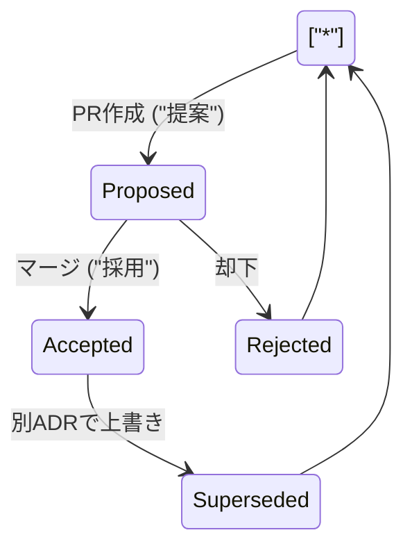

# 第08章：置き場所と管理（VS Codeで迷子にならないADR運用）📁🧭

この章は「**ADRを“書くだけ”で終わらせず、ちゃんと探せて育てられる状態にする**」のがゴールだよ〜！😊💕

---

## 8-1. まず決めるのは「ADRの置き場所」📁✨（迷子防止の最重要ポイント）


ADRって、**どこに置くか**がブレると一瞬で迷子になるの…😵‍💫
だから最初に、**置き場所だけは固定**しちゃうのがいちばん強い！💪✨

### ✅ いちばんシンプルで強い置き場所（おすすめ）

* リポジトリ直下に「docs/adr/」フォルダを作る
  → “誰でもそこを見ればある” って状態になるよ📌

（ADRはMarkdownファイルで運用するのが一般的で、重要な判断を“短く1ファイル”で残す考え方が広まってるよ〜）([Cognitect.com][1])

### 🧠 ちょい応用：規模が大きい時（モノレポなど）

* 全体に効く判断：docs/adr/
* 特定パッケージだけの判断：packages/xxx/docs/adr/

ルールはこれだけ👇
**「影響範囲が広いほど上（ルート）に置く」** 🏠✨

---

## 8-2. 命名ルール：連番＋短い題名で“検索しやすく”🔢🔎


### ✅ 定番の命名

* 0001-runtime-validation.md
* 0002-error-handling-policy.md

ポイントはこれ👇

* **0埋め（0001）**：並びがキレイ✨
* **短い英語スラッグ**：検索に強い🔎（日本語でもOKだけど、リンクやツール連携で困る時があるよ〜💦）

### 💡 連番って何がうれしいの？

* 「ADRの数」が増えても並び順が崩れない✨
* 「0007って何だっけ？」って会話ができる👀

---

## 8-3. “ADR一覧（目次）”を作ると運用が一気にラクになる🧭📚


フォルダにADRが増えると、**一覧がないと探すのが辛い**😭
なので「docs/adr/README.md（目次）」を作るのがおすすめだよ！

### ✅ 目次に書くもの（最小）

* ADR番号
* タイトル
* Status（Proposed / Accepted / Superseded）
* 日付（任意）

#### 例：目次（イメージ）

```md
# ADR Index 🧭

| ID | Title | Status | Date |
|---:|---|---|---|
| 0001 | runtime validation 方針 | Accepted ✅ | 2026-01-14 |
| 0002 | error handling 方針 | Proposed 📝 | 2026-01-20 |
| 0003 | 0001 を置き換え（validation方針更新） | Superseded 🔁 | 2026-02-03 |
```

（表はサンプルなので自由に変えてOKだよ😊）

---

## 8-4. VS Codeで「読む・探す・リンクする」基本操作🔎👀✨

ADR運用で大事なのは、**書くこと**より **“後で探せること”**！🧠✨

### ① Markdownプレビューで読みやすくする👀

* プレビュー切り替え：Ctrl + Shift + V
* 横に並べてプレビュー：Ctrl + K → V

VS CodeのMarkdown機能として公式に案内されてるショートカットだよ✨([Visual Studio Code][2])

### ② プレビューのスクロールが気持ち悪い時の対処🌀

Markdownって編集とプレビューが連動スクロールするんだけど、環境によっては「びょんっ」って飛ぶことあるの🥲
その時は、次の設定で同期を切れるよ👇

* markdown.preview.scrollPreviewWithEditor
* markdown.preview.scrollEditorWithPreview

これはVS CodeのMarkdownドキュメントにちゃんと載ってる設定だよ🧷([Visual Studio Code][2])

### ③ “探す”を制する者がADRを制す🔎🔥

ADRは「読むため」じゃなくて「**未来の自分が探すため**」にあるからね！😊💕

* ファイル名で探す：Ctrl + P（Quick Open）
* 全文検索：Ctrl + Shift + F（ワークスペース検索）

---

## 8-5. “書くハードル”を下げる3点セット🧩✨（テンプレ固定＋自動化）

### ✅ ① テンプレを1つに固定する🧩

チーム（または未来の自分）が迷わないために、テンプレは **1種類に固定**が基本だよ🧠✨

たとえば最小なら👇

* Title
* Status
* Context
* Decision
* Consequences

（この形はADRの定番としてよく紹介されるやつだよ）([Cognitect.com][1])

#### 例：ADRテンプレ（そのまま使えるよ）📝

```md
# ADR 000X: （短いタイトル）📝

Date: 2026-01-14  
Status: Proposed / Accepted / Superseded

## Context 🗺️
- 何が問題？なにが困ってる？
- 制約は？（納期、既存、運用、学習コスト…）
- 何を優先する？（安全性、速度、保守性…）

## Decision ✅
（結論を一文で言い切る）

## Consequences 🌟⚠️
### 👍 Good
- 

### 👎 Bad / Trade-offs
- 

### 🔍 Notes（任意）
- 検証方法（PoC / 計測 / 判断の撤回条件）
```

> 「Decisionを一文で言い切る」＋「デメリットも書く」だけで、ADRの強さが一気に上がるよ💎✨

---

### ✅ ② VS Codeの「ユーザースニペット」で一瞬でテンプレ出す⚡

VS Codeは拡張なしでスニペット作れるよ！って公式に説明されてる✨([Visual Studio Code][3])

#### 例：Markdown用スニペット（超ざっくり）

```json
{
  "ADR Template": {
    "prefix": "adr",
    "body": [
      "# ADR ${1:000X}: ${2:Title} 📝",
      "",
      "Date: ${3:2026-01-14}",
      "Status: ${4|Proposed,Accepted,Superseded|}",
      "",
      "## Context 🗺️",
      "- ${5}",
      "",
      "## Decision ✅",
      "${6}",
      "",
      "## Consequences 🌟⚠️",
      "### 👍 Good",
      "- ${7}",
      "",
      "### 👎 Bad / Trade-offs",
      "- ${8}"
    ],
    "description": "ADR template"
  }
}
```

これで「adr」って打ってEnterしたらテンプレが出るよ〜！🥳✨

---

### ✅ ③ （任意）新規ADRファイルを自動で作る（Nodeスクリプト）🤖📄

連番って、地味にめんどいんだよね…😇
だから「docs/adr/」の中身を見て、次の番号でファイル作るやつを用意すると超ラク💖

#### 例：新規ADR作成スクリプト（nodeで動く）

```js
// scripts/new-adr.mjs
import fs from "node:fs";
import path from "node:path";

const adrDir = path.join(process.cwd(), "docs", "adr");
if (!fs.existsSync(adrDir)) fs.mkdirSync(adrDir, { recursive: true });

const files = fs.readdirSync(adrDir).filter(f => /^\d{4}-.*\.md$/.test(f));
const max = files
  .map(f => Number(f.slice(0, 4)))
  .reduce((a, b) => Math.max(a, b), 0);

const next = String(max + 1).padStart(4, "0");
const slug = (process.argv[2] ?? "new-decision").toLowerCase().replace(/\s+/g, "-");
const filename = `${next}-${slug}.md`;
const fullpath = path.join(adrDir, filename);

const today = new Date().toISOString().slice(0, 10);

const template = `# ADR ${next}: ${slug} 📝

Date: ${today}
Status: Proposed

## Context 🗺️
- 

## Decision ✅
-

## Consequences 🌟⚠️
### 👍 Good
- 

### 👎 Bad / Trade-offs
- 
`;

fs.writeFileSync(fullpath, template, "utf8");
console.log(`Created: ${path.relative(process.cwd(), fullpath)}`);
```

使い方イメージ：

* node scripts/new-adr.mjs "runtime validation"

---

## 8-6. AI導入済みの“勝ち運用”🤖💕（ADRをAIに手伝わせる）

### ✅ ① Copilot Chatで「タイトル案」「要約」「反対意見」を出させる

Copilot ChatはIDE上で質問できて、提案・説明・修正案などを出せるよ✨([GitHub Docs][4])

#### 使えるプロンプト例（コピペOK）💬✨

* 「この判断のタイトルを10案。短く、検索しやすく」
* 「Contextに入れるべき制約の漏れをチェックして」
* 「Decisionの文章を一文で言い切る形に直して」
* 「デメリット（Trade-off）を厳しめに5個出して😈」
* 「このADRを3行で要約して、目次用にして」

---

### ✅ ② “リポジトリ用の指示書”を置く（AIの出力が安定する）📌

Copilotには、リポジトリの指示ファイルを置けるよ！
ファイル名は「.github/copilot-instructions.md」ってGitHub公式ドキュメントに書かれてる✨([GitHub Docs][5])

#### 例：ADR向けの copilot-instructions.md（そのまま使える）🧠💖

```md
# Copilot Instructions for ADR 📝

- ADRは docs/adr/ に置く
- ファイル名は "0001-short-title.md" の形式
- ADR本文は Context / Decision / Consequences を必ず含める
- Decisionは一文で言い切る（曖昧語を避ける）
- Consequencesは Good と Bad/Trade-offs を両方書く
- 日本語で親しみやすく、箇条書きを多めに
```

これがあるだけで「毎回同じお願い」をしなくて済むのが最高…！🥹💕

---

## 8-7. ADRは“育つ”📈✨（Statusと置き換えの考え方）

ADRは「書いたら終わり」じゃなくて、**状況が変わったら置き換える**のが自然だよ🔁✨

### ✅ Statusの最低ライン

* Proposed：提案中📝
* Accepted：採用✅
* Superseded：置き換えられた🔁

置き換えたらこうする👇

* 新しいADR（例：0003）に「0001を置き換える」って書く
* 0001側のStatusをSupersededにする
* 目次（ADR Index）も更新する

（“判断の履歴”が残るのがADRの良さだよ〜）([Cognitect.com][1])



---

## 8-8. VS Codeのおすすめ設定＆小ワザ（気持ちよく運用）🛠️✨

### ✅ Markdownの機能はVS Codeに標準で強い

VS CodeはMarkdownを標準サポートしてて、プレビュー・アウトライン・補完なども育ってきてるよ✨([Visual Studio Code][2])

### ✅ 推奨拡張を“ワークスペースで共有”できる📦

チームで揃えたい拡張があるなら、.vscode/extensions.json に「おすすめ拡張」を書けるよ（VS Code公式）([Visual Studio Code][6])

#### 例：extensions.json（例）

```json
{
  "recommendations": [
    "github.copilot",
    "github.copilot-chat",
    "DavidAnson.vscode-markdownlint"
  ]
}
```

※ 自動インストールじゃなく「おすすめ一覧に出る」タイプだよ😊

---

## 8-9. ワーク（15分）⌛✨：迷子にならないADR置き場を完成させよう！

### ✅ ステップ1：フォルダを作る📁

* docs/adr/ を作る

### ✅ ステップ2：目次を作る📚

* docs/adr/README.md を作る（ADR Index）

### ✅ ステップ3：テンプレを用意する🧩

* docs/adr/_template.md を置く（コピペ用）

### ✅ ステップ4：ADR 0001 を作る📝

* docs/adr/0001-xxx.md を作る
* Context / Decision / Consequences を埋める

### ✅ ステップ5：VS Codeで確認👀

* 横にプレビュー（Ctrl+K → V）で見ながら整える([Visual Studio Code][7])
* 文章が長くなったら箇条書きにする（読みやすさ最強✨）

---

## まとめ：第8章で覚えてほしい“3つだけ”💖

1. **置き場所固定（docs/adr/）** 📁
2. **連番＋短い題名（0001-xxx.md）** 🔢
3. **目次（ADR Index）を育てる** 📚✨

これで「ADRがあるのに見つからない😭」が激減するよ〜！🥳💕

次の章（第9章）では、このADRをPR・レビューに自然に混ぜて「文化」にしていくよ🔁✅

[1]: https://www.cognitect.com/blog/2011/11/15/documenting-architecture-decisions?utm_source=chatgpt.com "Documenting Architecture Decisions - Cognitect.com"
[2]: https://code.visualstudio.com/docs/languages/markdown?utm_source=chatgpt.com "Markdown and Visual Studio Code"
[3]: https://code.visualstudio.com/docs/editing/userdefinedsnippets?utm_source=chatgpt.com "Snippets in Visual Studio Code"
[4]: https://docs.github.com/copilot/using-github-copilot/asking-github-copilot-questions-in-your-ide?utm_source=chatgpt.com "Asking GitHub Copilot questions in your IDE"
[5]: https://docs.github.com/ja/copilot/how-tos/configure-custom-instructions/add-repository-instructions "GitHub Copilot のリポジトリ カスタム命令を追加する - GitHub ドキュメント"
[6]: https://code.visualstudio.com/docs/configure/extensions/extension-marketplace?utm_source=chatgpt.com "Extension Marketplace"
[7]: https://code.visualstudio.com/docs/reference/default-keybindings?utm_source=chatgpt.com "Default keyboard shortcuts reference"
