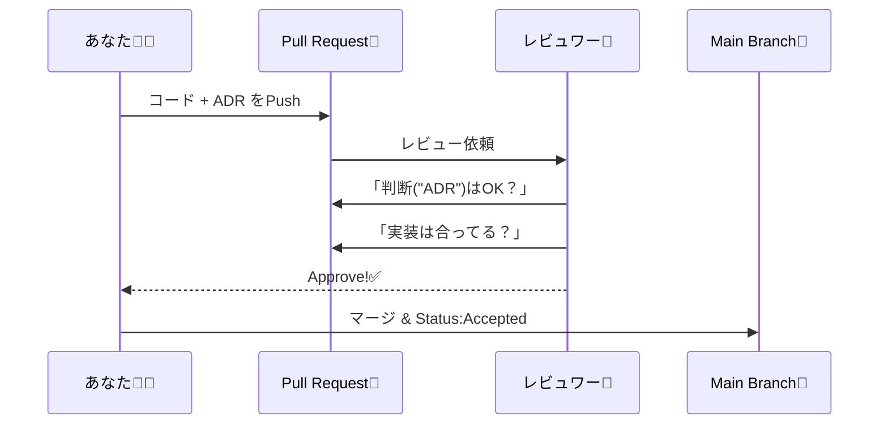

# 第09章：開発フローに組み込む（PRとレビューで文化にする）🔁✅

## 9-0 この章でできるようになること 🎯✨

* 「あとでADR書く…😇」を**仕組みで潰す**方法がわかる💪
* PRにADRを自然に添付できる（テンプレ＋チェック）📝📎
* レビューで「判断の質」を上げるコメントができる👀💬
* 余裕があれば、GitHubの設定で「ADRが無いとマージできない」も作れる⚙️🔒

---

## 9-1 なんで“PRに組み込む”のが強いの？💡😺


ADRって、書こうと思っても忙しいと後回しになりがちだよね…💦
そこで **「コードが入る瞬間＝PR」** にくっつけちゃうのが最強ムーブ✨

* PRは「いつ・誰が・何を」やったか残る📌
* レビューが入る＝判断の穴が見つかる👀🧠
* マージされたら「その判断は採用された」って自然に確定できる✅🎉



---

## 9-2 まずは最小ルール（これだけで回る）🧩✅


いきなりガチガチにしないでOK🙆‍♀️✨
最初はこの3つだけで十分だよ〜🍀

### ルールA：重要な判断があるPRには、ADRを1枚添付📎📝

* 例：ライブラリ選定、エラー方針、型方針、フォルダ構成、API層の作り方…などなど🧠✨

### ルールB：PR本文に “ADRリンク” を貼る🔗💞

* `docs/adr/0007-xxx.md` みたいに、PRの説明から飛べるようにする✈️

### ルールC：レビューは「ADR→コード」の順で見る👀➡️💻

* まず「判断が妥当か？」
* 次に「実装が判断に沿ってるか？」

---

## 9-3 PRテンプレで“書き忘れ”をゼロにする🧻✨


GitHubにはPRテンプレ機能があるよ〜！
リポジトリにテンプレを置いておくと、PR作成時に本文が自動で出てくる🪄
（複数テンプレもOK！） ([GitHub Docs][1])

### おすすめ構成 📁✨

* `.github/PULL_REQUEST_TEMPLATE.md`（全PR共通）
  または
* `.github/PULL_REQUEST_TEMPLATE/adr.md`（ADR付き用テンプレ） ([GitHub Docs][1])

### テンプレ例（コピペOK）📝💞

```md
## 概要 🧁
- 何をしたPR？（1〜2行でOK）

## 関連リンク 🔗
- Issue: #
- ADR: docs/adr/000x-xxxx.md（なければ "なし"）

## このPRに「重要な判断」はある？🧠
- [ ] ない（小さな修正・リネーム・軽いバグ修正など）
- [ ] ある → ADRを書いた / 更新した ✅

## レビューしてほしいポイント 👀✨
- 例：判断の前提は妥当？ / トレードオフ足りてる？ / 例外ケースは？

## 影響範囲 🌍
- どこが変わる？（API / 型 / 実行時挙動 / 運用 など）
```

---

## 9-4 ADRレビューのチェックリスト（優しめ版）🧸💬


レビューって「コードだけ」見がちだけど、ADRは**文章レビュー**だからコツがあるよ✨

### ✅ まず見る（3点セット）

* Context（背景）が読めば再現できる？🗺️
* Decision（結論）が一文で言い切れてる？✅
* Consequences（良い/悪い）がちゃんとある？⚖️

### ✅ 次に見る（判断の質）

* 選択肢が2〜3個あった？（“比較”できてる？）⚖️✨
* 「なぜそれを選んだ？」が言語化されてる？🧠
* デメリットが隠れてない？（作文になってない？）😇💦

### ✅ 最後に見る（運用）

* スコープ（どこまで適用？例外は？）書いてある？📌
* 実装がそのDecisionに沿ってる？💻✅
* Issue/PR/資料リンクが貼れてる？🔗

---

## 9-5 Status運用（Proposed→Accepted）を“PRと同期”させる🔁✅


ADRにはStatusを持たせるのが定番だよ📝
PRとセットにすると、めちゃ自然に回る✨

* **Proposed**：PR作成時点（まだ提案）🗳️
* **Accepted**：PRがマージされたら（採用）🎉
* **Superseded**：後で別ADRに置き換えたら（交代）🔁

「Acceptedにする操作」を人力で忘れがちなら、**“PRがマージされたらAcceptedに更新する”**をPR内で一緒にやっちゃうのがコツ💞

---

## 9-6 仕組み化レベルアップ（できたら強い）⚙️🛡️✨


### 9-6-1 CODEOWNERSで「ADRはこの人たちが見る」を作る👥🔒


GitHubの **CODEOWNERS** を使うと、特定のパスの変更に対してレビュー担当を割り当てられるよ🧑‍🏫✨
さらにブランチ保護で「Code Ownersの承認必須」にできる！ ([GitHub Docs][2])

例：`docs/adr/**` は設計担当チームが見る、みたいにできる🙌

### 9-6-2 さらに新しめ：Rulesetsで「特定チームの承認必須」もできる（ファイル単位）🆕👀

GitHubのRulesetsで、**ファイル/フォルダごとに特定チームの承認を必須**にできる機能が出てるよ（変更範囲ベースのコントロール） ([The GitHub Blog][3])
「ADRが触られたら、設計チームが必ず見る」みたいな運用が作りやすい✨

---

### 9-6-3 GitHub Actionsで「判断があるのにADR無い」を検知する🤖🚨


慣れてきたらここまでやると強い💪✨
GitHub Actionsは`paths` / `paths-ignore`で、特定パス変更時だけ動かす設定ができるよ ([GitHub Docs][4])

ただ、「PR内でファイル差分を見て、ジョブを条件分岐」みたいな細かいことは工夫が必要で、そこで `dorny/paths-filter` みたいなActionが便利✨ ([GitHub][5])

例：「srcが変わったのに docs/adr が1つも変わってなければ警告」⚠️
（最初は “警告コメントだけ” にして、運用が慣れてからFailにすると優しいよ🧸）

---

### 9-6-4 マージキュー運用（人が多いリポジトリ向け）🚦📦

PRが多いチームだと、マージ直前にベースブランチが進んでCI落ち…みたいなのあるよね😭
GitHubの **Merge queue** は、マージ直前に最新の状態で必須チェックを通してから順番にマージしてくれる仕組みだよ ([GitHub Docs][6])
（※第9章の本筋じゃないけど、将来チームが大きくなった時に超助かる✨）

---

## 9-7 VS Codeでの運用テク（ラクして続ける）🧁🧠✨

* `docs/adr/` をワークスペースに固定して、すぐ開けるようにする📌
* Markdownプレビューで読みやすさチェック👀（見出し・箇条書き・リンク）
* 検索（Ctrl+Shift+F）で「Decision:」とか「Superseded」探せる🔎✨

---

## 9-8 AI活用：PR/レビューを“やさしく高速化”🤖💞

### 9-8-1 CopilotのPRサマリー（レビュー補助）🧠📌

GitHub Copilotには、PRの変更点・影響ファイル・注目ポイントをまとめる**PRサマリー**機能があるよ ([GitHub Docs][7])
しかも、PR作成時だけじゃなく、作成後の編集やコメントから起動できるタイプもあるみたい ([GitHub Docs][8])

> 使い方のコツ：
> サマリーは“入口”にして、ADRのDecisionと矛盾がないかを最後に人間がチェック✅✨

### 9-8-2 そのまま使えるAIプロンプト集（コピペ用）🪄💬


```text
あなたは優しいレビュワーです。次のADRをレビューして、
(1) 背景の不足
(2) 選択肢の漏れ
(3) トレードオフの弱さ
(4) Decisionの曖昧さ
を指摘し、改善案を箇条書きでください。口調は丁寧でキツくしないで。
```

```text
このPRの変更内容とADRのDecisionが一致しているかをチェックして。
もしズレてるなら「どこを直すべきか」を具体的に提案して。
```

---

## 9-9 実践ワーク（60分想定）⏱️🎓💞

### ワーク1：ADR付きPRを1本作る📎📝

1. 小さめでも「判断がある」変更を1つ選ぶ🎯
2. ADRを `docs/adr/000x-...md` で作成📝
3. PR本文にADRリンクを貼る🔗
4. チェックリストを全部埋める✅

🎁 ゴール：**“判断→レビュー→マージ”** の流れを1回体験する✨

### ワーク2：セルフレビュー（2分×3回）👀🧠

* 1回目：ADRだけ読む📄
* 2回目：コードだけ読む💻
* 3回目：矛盾がないか照合する🔁

---

## 9-10 よくある事故と対策（めちゃ大事）⚠️😭➡️✨

* **事故①：ADRが長文日記になる**
  → 1判断＝1枚に分割✂️📝

* **事故②：メリットしか書かない（作文）**
  → デメリット3つ書く縛り👎👎👎

* **事故③：PRは通ったけどADR更新忘れ**
  → PRテンプレで強制的にチェック✅🧻

* **事故④：ADRはあるけど実装が違う**
  → レビュー順を「ADR→コード」にする👀➡️💻

---

## まとめ：第9章の合言葉📣💖

* ADRは“書く技術”だけじゃなくて、**増える仕組み**が9割💪✨
* PRテンプレ＋レビュー観点の固定で、文化は作れる🧁
* 慣れたらCODEOWNERSやRulesetsで「自然に守られるルール」に進化👥🔒 ([GitHub Docs][2])

次の章（最終課題パート）に入る前に、まずは**ADR付きPRを1回だけ**やってみよ〜！🎉🚀💕

[1]: https://docs.github.com/en/communities/using-templates-to-encourage-useful-issues-and-pull-requests/creating-a-pull-request-template-for-your-repository?utm_source=chatgpt.com "Creating a pull request template for your repository"
[2]: https://docs.github.com/articles/about-code-owners?utm_source=chatgpt.com "About code owners"
[3]: https://github.blog/changelog/2025-11-03-required-review-by-specific-teams-now-available-in-rulesets/?utm_source=chatgpt.com "Required review by specific teams now available in rulesets"
[4]: https://docs.github.com/actions/using-workflows/workflow-syntax-for-github-actions?utm_source=chatgpt.com "Workflow syntax for GitHub Actions"
[5]: https://github.com/dorny/paths-filter?utm_source=chatgpt.com "dorny/paths-filter: Conditionally run actions based on files ..."
[6]: https://docs.github.com/en/enterprise-server%403.17/repositories/configuring-branches-and-merges-in-your-repository/configuring-pull-request-merges/managing-a-merge-queue?utm_source=chatgpt.com "Managing a merge queue - GitHub Enterprise Server 3.17 ..."
[7]: https://docs.github.com/en/copilot/get-started/features?utm_source=chatgpt.com "GitHub Copilot features"
[8]: https://docs.github.com/en/copilot/responsible-use/pull-request-summaries?utm_source=chatgpt.com "Responsible use of GitHub Copilot pull request summaries"
