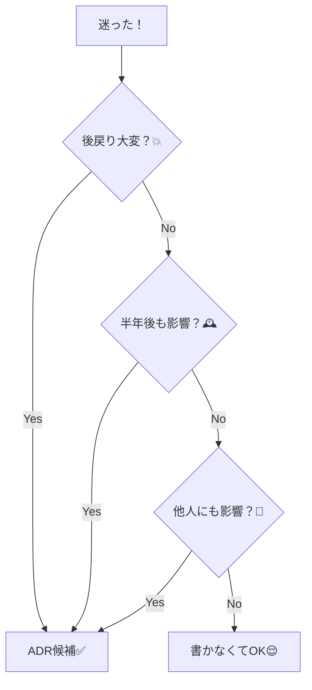

# 第10章：最終課題① テーマ決め＆比較表づくり（1テーマに絞る！）🎯🍀

この章から「最終課題」ゾーンだよ〜！🎓✨
ここでやるのはズバリ👇

* **1つのテーマに絞る**（欲張らない！）🥺🙏
* **選択肢を3つ**つくる（最低3つ！）🧩🧩🧩
* **比較軸を5つ**つくる（判断の物差し）📏✨
* **制約**も書く（現実は大事）⛓️
* 最後に **ざっくり結論案**まで出す（まだ確定じゃなくてOK）🌱

---

## 10.1 ゴールと成果物 🎁✨

### ゴール 🎯

「なんとなく決めた」を卒業して、**“選んだ理由が説明できる状態”**を作るよ😊💕

### 成果物（この章のゴール）📦

* ✅ テーマ（1つ）
* ✅ 選択肢（3つ）
* ✅ 比較軸（5つ）
* ✅ 制約（箇条書きでOK）
* ✅ ざっくり結論案（1〜2文）

> まだADR本文（Context/Decision/Consequences）を完成させなくてOK！
> 第11章でちゃんとADRにするよ〜📝✨

---

## 10.2 テーマ選びのコツ（迷子防止）🧭💕

「何をADRにするか」で詰まりがちだから、ここはルール化しちゃおう！

### ✅ “ADR向きテーマ”の合言葉

* **戻すのが大変**（後戻りコスト大）💥
* **長く効く**（半年後も影響ある）🕰️
* **みんなに影響**（他の人も触る）👥

このへんに当てはまるなら、ADR向き〜！✨



---

## 10.3 テーマ例（1つだけ選んでOK）🌷✨


アウトラインにあった例を、もう少し「決めやすい形」にしておくね👇

### 🧩例A：runtime validation をどうする？

* 例：「APIレスポンスの型安全、どう守る？」🛡️

### 🧱例B：状態管理方針をどうする？

* 例：「状態はどこに置く？どこまで共通化する？」🧠

### 🔌例C：API呼び出し層をどう分ける？

* 例：「fetch直書きOK？ラッパ関数作る？専用client？」📡

### 🧹例D：エラー方針をどうする？

* 例：「例外で投げる？Resultっぽく返す？統一エラー型？」⚠️

---

## 10.4 “テーマ”を1文にする（ここが最重要）✍️✨


テーマが決まったら、まずこれ👇

### ✅ 決める質問（Decision Question）

* 「**私たちは、◯◯を、△△のために、□□として採用するべきか？**」💡

例（runtime validationの場合）

* 「私たちは **外部APIレスポンスの検証**を、**不正データで落ちないために**、**どの方式で行うべきか？**」🧪✨

この1文が決まると、比較表がスッと作れるよ😊💕

---

## 10.5 選択肢（Options）を“3つ”出すコツ 🧩✨

最低3つ！「2つ」だと視野が狭くなりやすい😵‍💫

### ✅ 出し方テンプレ

1. **本命案**（たぶんこれ）🌟
2. **対抗案**（悩むやつ）🤔
3. **保守案**（現状維持 or 自前）🧰

例（runtime validation）

* Option A：ライブラリ方式（例：zodなど）📦
* Option B：別ライブラリ方式（別思想のやつ）🔁
* Option C：自前実装（必要最小限）🛠️

> ライブラリ名は例でOK！この章では「思想の違い」が出れば勝ち🏆✨

---

## 10.6 比較軸（Criteria）を“5つ”作る 📏✨

「何で比べるの？」が曖昧だと、最後は好みで決まっちゃう😢
だから先に物差しを作るよ！

### ✅ よく使う比較軸（ここから5つ選べばOK）🎀

* **型安全**（型で守れる？）🧷
* **DX**（書きやすい？読みやすい？）🧁
* **学習コスト**（チームに優しい？）📚
* **運用の楽さ**（ルールが守られやすい？）🧹
* **変更耐性**（後から拡張しやすい？）🧱
* **依存リスク**（更新や破壊的変更が怖くない？）⚠️
* **実行時コスト**（重くならない？）🚀
* **テストしやすさ**（検証が書きやすい？）🧪

---

## 10.7 制約（Constraints）を書く（現実の壁）⛓️😌

制約を書くと「理想論ADR」にならなくなるよ✨

例：

* 納期：今月中に最低限動かす必要がある📆
* 既存コード：すでにAPI周りが散らばってる🧵
* チームスキル：全員が高度な型テクに強いわけじゃない🙂
* バンドルサイズ：重すぎると困る📦
* 将来：別プロジェクトでも流用したい🔁

---

## 10.8 比較表テンプレ（そのままコピペOK）🧾✨


下のテンプレを埋めるだけで、もう“判断っぽい”よ！🎉

```md
## Decision: （テーマを1文で）

### Options
- A: （本命案）
- B: （対抗案）
- C: （保守案 / 現状維持 / 自前）

### Constraints（制約）
- （例：納期、既存、チームスキル、運用など）

### Criteria（比較軸）
- C1: （例：型安全）
- C2: （例：DX）
- C3: （例：学習コスト）
- C4: （例：運用の楽さ）
- C5: （例：変更耐性）

### Comparison Table
| Criteria | A | B | C |
|---|---|---|---|
| C1 | ◎/○/△/× + 理由 | ... | ... |
| C2 | ... | ... | ... |
| C3 | ... | ... | ... |
| C4 | ... | ... | ... |
| C5 | ... | ... | ... |

### Tentative Conclusion（ざっくり結論案）
- （例：Aを採用。ただしBの強みが必要になったら再検討）
```

> ポイントは「◎○△×」の横に **一言理由** を必ず書くこと！📝✨

---

## 10.9 例：runtime validation（完成イメージ）🪄💕

※これは例だよ（このまま提出でもOKなくらいの粒度）😊

```md
## Decision: 外部APIレスポンスのruntime validationをどの方式で行うか

### Options
- A: validationライブラリ（型推論が強い系）
- B: validationライブラリ（軽量・シンプル系）
- C: 自前実装（必要最小限のみ）

### Constraints（制約）
- 既存APIが複数あり、レスポンス形状が揺れる
- 例外でアプリが落ちるのは避けたい
- チーム全員が高度な型テクに強いわけではない

### Criteria（比較軸）
- C1: 型安全（推論のしやすさ）
- C2: DX（書きやすさ）
- C3: 学習コスト
- C4: 運用の楽さ（ルールが守られやすい）
- C5: 変更耐性（仕様変更に強い）

### Comparison Table
| Criteria | A | B | C |
|---|---|---|---|
| C1 | ◎ 型推論が強く一貫しやすい | ○ 必要十分 | △ 実装ミスが起きやすい |
| C2 | ○ 書き方は覚える必要あり | ◎ シンプルで書きやすい | △ 毎回実装が増える |
| C3 | △ 慣れが必要 | ○ 触れば慣れる | ○ ただし設計力が要る |
| C4 | ◎ バリデーションが統一される | ○ 統一はできる | △ 人に依存しがち |
| C5 | ◎ 形が揺れても追従しやすい | ○ 追従可能 | △ 変更のたびに修正地獄 |

### Tentative Conclusion（ざっくり結論案）
- Aを採用して統一する。まずは1つのAPIから導入して、運用できることを確認してから範囲を広げる。
```

---

## 10.10 AI活用（Copilot/Codex）で爆速にする🤖💨✨

### 使い方のコツ（超大事）💡

AIは「決めてくれる人」じゃなくて、**比較材料を増やしてくれる相棒**だよ😊
最終決定はあなたがやるのがカッコいい✨

### 🪄プロンプト例：選択肢を3つ出す

```text
このテーマでADRを書きたいです：
「（テーマ1文）」
現実的なOptionsを3つ出して、それぞれの特徴と採用しない理由も一言つけてください。
```

### 😈プロンプト例：悪魔の代弁者（反対意見）

```text
Option Aを推したいです。反対側の立場になって、強い反論を5つください。
その上で、反論に対する対策案もセットでください。
```

### 🔎プロンプト例：比較軸の漏れチェック

```text
Optionsと比較軸を作りました。抜けている比較軸があれば追加提案してください。
「長期運用で事故るポイント」に寄せてください。
```

GitHub Copilot には「エージェント的に複数ファイルを編集してタスクを進める」Agent mode の説明が公式にあるよ。うまく使うとテンプレ生成や整理が一気に進む🧠✨ ([GitHub Docs][1])
VS Code側も“エージェントに追加の指示セットを教える”系の仕組みがアップデートで触れられてるので、テンプレや判断ルールを置いておくのも相性いいよ📁🤖 ([Visual Studio Code][2])

---

## 10.11 よくある失敗（ここ踏むとツラい）😵‍💫💦

* ❌ テーマがデカすぎる（「アーキテクチャ全部」みたいな）
  → ✅ **1つの判断**に絞る（この章の勝利条件）🎯

* ❌ 選択肢が2つしかない
  → ✅ “現状維持/自前”を入れて3つにする🧩

* ❌ 比較軸がふわふわ（「良さそう」だけ）
  → ✅ “運用で困るか？”を軸にする🧹⚠️

* ❌ 表が埋まってるのに結論が書けない
  → ✅ 「暫定でこうする」＋「例外条件」を書けばOK🌱

---

## 10.12 チェックリスト（提出前の最終確認）✅🌸

* [ ] テーマは1文で言える？✍️
* [ ] Optionsは3つある？🧩🧩🧩
* [ ] Criteriaは5つある？📏📏📏📏📏
* [ ] Constraintsが書いてある？⛓️
* [ ] 表の各セルに“一言理由”がある？📝
* [ ] ざっくり結論案が1〜2文ある？🌱

---

## 10.13 ちょこっと「最新」メモ（2026年の空気感）🗞️✨

* TypeScriptは **5.9系のリリース情報**が公開されていて、`import defer` みたいな新しい構文サポートも出てるよ（採用するかはプロダクト次第！）📦✨ ([GitHub][3])
* さらにTypeScript 7に向けた “ネイティブ（高速化）” 系の動きも進捗が出てるので、「ビルド時間」や「型チェック時間」が判断材料になる場面は増えそうだね🚀 ([InfoQ][4])
* ADRの基本形（Title/Status/Context/Decision/Consequences）は、テンプレ集でも定番としてまとまってるよ📝 ([Architectural Decision Records][5])

---

## 次章予告（第11章）📣💖

第11章では、今日作った比較表をベースにして
**ADR 0001 を完成**させて、コードにも反映していくよ〜！📝🧑‍💻✨

[1]: https://docs.github.com/en/copilot/get-started/features?utm_source=chatgpt.com "GitHub Copilot features"
[2]: https://code.visualstudio.com/updates?utm_source=chatgpt.com "December 2025 (version 1.108)"
[3]: https://github.com/microsoft/typescript/releases?utm_source=chatgpt.com "Releases · microsoft/TypeScript"
[4]: https://www.infoq.com/news/2026/01/typescript-7-progress/?utm_source=chatgpt.com "Microsoft Share Update on TypeScript 7"
[5]: https://adr.github.io/adr-templates/?utm_source=chatgpt.com "ADR Templates | Architectural Decision Records"
