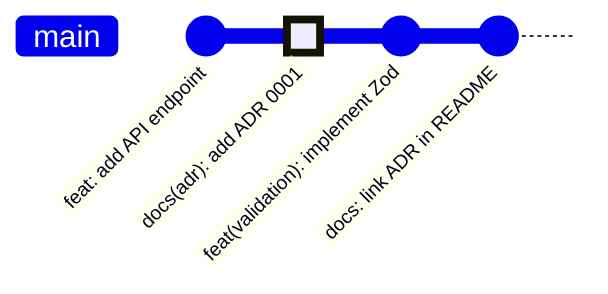

# 第11章：最終課題② ADRを書いて、実装に反映する📝🧑‍💻

この章は「ADRを**書くだけ**で終わらせず、**コードとセットで動かす**」体験をする回だよ〜！💞
“設計の理由”が **ドキュメント ↔ 実装** でつながると、未来の自分がめっちゃ助かる🥹🌸

---

## 11.1 この章のゴール🎯✨

章が終わったら、これができてればOK！✅

* ADR **0001** が完成している📄✨（Context / Decision / Consequences）
* ADRで決めた内容が、**実装にちゃんと反映**されてる🧩💻
* ADRから「Issue/PR/関連メモ」へリンクできてる🔗
* コード側にも「この判断はADRにあるよ」って痕跡が残ってる📍

---

## 11.2 まずは超大事な合言葉💡💕

### ADRは「未来の自分への説明責任」🕰️📒

ADRは「メモ」じゃなくて、**判断の証拠と説明書**だよ〜！
（ADRは “重要な設計判断” と、その **背景** と **結果** を残すドキュメント） ([GitHub][1])

---

## 11.3 ADR 0001 の置き場所とファイル名📁🔢

おすすめはこう👇

* フォルダ：`docs/adr/`
* ファイル名：`0001-短いタイトル.md`

例：`docs/adr/0001-runtime-validation.md` 🧪✨

PowerShellならこんな感じ👇

```powershell
mkdir docs\adr
code docs\adr\0001-runtime-validation.md
```

---

## 11.4 ADRの型を一瞬で作る🧩✨

ADRテンプレはいろいろあるけど、**有名どころの型**はこれ👇
**Title / Status / Context / Decision / Consequences** ([Architectural Decision Records][2])

さらに、Markdown運用しやすいテンプレとして **MADR** もよく使われるよ〜📝（markdownlint運用の話も出てる） ([GitHub][3])

---

## 11.5 ADR 0001 テンプレを貼って書く✍️💗


まずはこれをそのまま貼って、空欄を埋めていこう〜！✨

```markdown
# 0001: （短いタイトル）

## Status
Accepted

## Context
- いま困っていること：
- なぜ今決める必要がある？：
- 制約（納期・既存・チーム事情など）：
- 大事にしたい優先度（例：型安全 / DX / 運用コスト など）：

## Decision
（ここは一文で言い切る！）
例：APIレスポンスの runtime validation は zod を採用する。

## Consequences
### Good ✅
- 
- 
- 

### Bad / Trade-offs ⚠️
- 
- 
- 

### Notes 🔎
- 検証方法（PoC/計測/判断の見直し条件など）：
- 関連リンク：
  - Issue:
  - PR:
  - Docs:
```

### コツ🍯✨

* **Context**：長文日記にしない✋😵‍💫（“再現できる情報”だけ）
* **Decision**：**一文で確定**✅（「たぶん」「かも」は減らす）
* **Consequences**：**悪い点も書く**💦（ここがADRの価値💎）

---

## 11.6 具体例で完成させよう🧪✨

ここでは例として「runtime validation」を題材にするね（第10章で選んだテーマに置き換えてOKだよ😊）

### Contextの例🌿

* APIレスポンスが仕様とズレると、実行時に落ちる😱
* TypeScriptの型は **コンパイル時** だけで、実行時は守ってくれない💦
* なるべく早くバグを見つけたい、でも実装コストは増やしすぎたくない🌀

### Decisionの例✅

* 「APIレスポンスの runtime validation は zod を採用する。」
  （Decisionはこのくらいスパッと！✂️✨）

### Consequencesの例💎

* Good ✅：早期検知できる / スキーマがドキュメントにもなる
* Bad ⚠️：依存が増える / スキーマ定義の手間が増える / 学習コストが少しある

---

## 11.7 いよいよ実装に反映する🧑‍💻🔥


ADRに「zod採用」って書いたなら、コードにもそれが見える形にしよ〜！✨
“反映”って言っても、初心者におすすめはこの **3点セット**だよ👇

### 反映セット① 入口にバリデーションを置く🚪🛡️

例：API結果を受け取った直後にvalidateする

```ts
// src/validation/userSchema.ts
import { z } from "zod";

export const UserSchema = z.object({
  id: z.string(),
  name: z.string(),
});

export type User = z.infer<typeof UserSchema>;
```

```ts
// src/api/fetchUser.ts
import { UserSchema } from "../validation/userSchema";

/**
 * Decision link: docs/adr/0001-runtime-validation.md
 */
export async function fetchUser() {
  const res = await fetch("/api/user");
  const json = await res.json();

  // ADR 0001 の判断をここで反映✨
  return UserSchema.parse(json);
}
```

### 反映セット② 「ADRへのリンク」をコードに残す📍🔗

* 全ファイルにベタベタ貼るのは逆にうるさいので🙅‍♀️
* **判断が効いてる入口**にだけ、短いコメントでOK！

### 反映セット③ READMEにも“入口リンク”を作る📚✨

```markdown
## Decision Records
- ADR 0001: Runtime validation 方針（docs/adr/0001-runtime-validation.md）
```

---

## 11.8 ADRから Issue / PR にリンクする🔗🧷

ADRは「その判断がどこで決まって、どこに反映されたか」が辿れると強い💪✨
ADRの末尾にこういうリンク欄を置いてね👇

```markdown
## Related
- Issue: #123
- PR: #456
- Discussion: （必要なら）
```

PR説明文にも、さらっと入れると最高💞

```markdown
## Summary
runtime validation を導入（ADR 0001 に基づく）

## Links
- ADR: docs/adr/0001-runtime-validation.md
- Issue: #123
```

※VS Codeの GitHub Pull Requests 機能は、PR説明文の生成なども進化してるよ〜🧁 ([Visual Studio Code][4])

---

## 11.9 コミットの切り方がキレイだと未来で泣ける🥹✨


おすすめは **「ADR追加」→「実装反映」** を分けること！

例👇

```text
docs(adr): add ADR 0001 for runtime validation decision
feat(validation): add schema validation at API boundary
docs: link ADR 0001 from README
```



---

## 11.10 AIの使い方🤖💗

（“自動で書かせる”より “一緒に整える” が相性いいよ〜！✨）

### AIに投げると強いプロンプト例🪄

* 「このADRのContext、長すぎるから **箇条書きで短く**して。前提と制約と痛みだけ残して」
* 「Decisionを **一文で言い切り**にして。曖昧表現を消して」
* 「Consequencesの **Bad/Trade-offs を3つ**追加して。現実的なやつで⚠️」
* 「このコード変更が ADRのDecisionに合ってるかチェックして、ズレてたら指摘して」

最近の開発支援は“Copilotだけ”じゃなく、VS Code側の統合や拡張の動きも大きいよ〜（拡張の扱いが変わる話も出てる） ([Visual Studio Code][5])

---

## 11.11 仕上げチェックリスト✅✨

提出前にこれだけ見て！👀💕

* [ ] Decisionが一文で確定してる✅
* [ ] Contextに「制約」と「優先度」がある📌
* [ ] Consequencesに **Bad/Trade-offs** が書かれてる⚠️
* [ ] ADRに Issue/PRリンクがある🔗
* [ ] コードの入口に ADRリンク or ADR番号がある📍
* [ ] READMEなどに ADR入口リンクがある📚

---

## 11.12 よくある失敗あるある😵‍💫➡️こう直す✨

* ❌ ADRが“お気持ち作文”
  ✅ Contextは「事実＋制約＋優先度」に絞る🧊
* ❌ Decisionが「検討する」止まり
  ✅ 一文で「採用する」「採用しない」まで言う✂️
* ❌ ADRはあるのにコードが何も変わってない
  ✅ 「判断が効くポイント」に小さく反映する🌱

---

## 11.13 この章のまとめ🎀✨

ADRって、**書いた瞬間**よりも
**数ヶ月後に見返して辿れる瞬間**に価値が爆発するんだよね…！🕰️💥

次の第12章では、レビューで磨いて、さらに **置き換え（Superseded）** まで体験して「運用として卒業」するよ〜！🎓🌸

[1]: https://github.com/joelparkerhenderson/architecture-decision-record?utm_source=chatgpt.com "Architecture decision record (ADR) examples for software ..."
[2]: https://adr.github.io/adr-templates/?utm_source=chatgpt.com "ADR Templates | Architectural Decision Records"
[3]: https://github.com/adr/madr?utm_source=chatgpt.com "adr/madr: Markdown Architectural Decision Records"
[4]: https://code.visualstudio.com/updates?utm_source=chatgpt.com "December 2025 (version 1.108)"
[5]: https://code.visualstudio.com/blogs/2025/11/04/openSourceAIEditorSecondMilestone?utm_source=chatgpt.com "Open Source AI Editor: Second Milestone"
