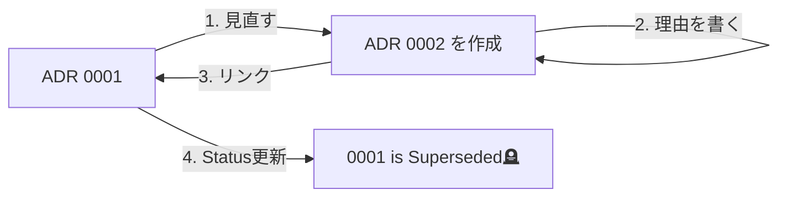

# 第12章：最終課題③ レビュー反映＆置き換え体験（Superseded）で卒業🎓🌸

この章は「ADRって、一回書いたら終わりじゃないんだ！」を体験する回だよ〜🫶💕
**レビューでADRを磨いて💎 → 前提が変わった想定で新しいADRを作って🔁 → 古いADRをSupersededにして履歴として残す📚**
これができたら、もうADR運用は“卒業”ですっ🎉✨

---

## 12-1 まず知っておく大事ルール「ADRは履歴が価値」📜✨


ADRは「今の結論」だけじゃなくて、**その結論に至った理由**が価値だよね🧠💡
だから、前提が変わったときは…

* 既存ADRを消す❌ → **しない**
* 既存ADRを“置き換え扱い”にして残す✅
* 新しいADR（0002）を作って、そこに「なぜ変えたか」を書く✅

この「置き換え」ステータスが **Superseded** だよ🔁✨
AWSのガイドでも「履歴を残す」「古いADRのStatusをSupersededにする」「新しいADR側に変更点を残す」みたいな流れが推奨されてるよ📌 ([AWS ドキュメント][1])
（ADRの“ログ”としての強さが出るやつ〜！）

---

## 12-2 レビューで見るポイント👀🧾✨


ADRレビューって、コードレビューより「文章のツッコミ」が多めになりがち🙋‍♀️💬
よくあるレビュー観点はこのへん👇

* Contextが「状況再現できる」くらい書けてる？🗺️
* 選択肢（Options）と比較軸、ほんとにある？⚖️
* Decisionが“一文で言い切れてる”？✅
* Consequencesが「良いことだけ作文」になってない？💦
* リンク（Issue/PR/調査メモ）で追跡できる？🔗
* 未来の自分が読んで、迷いが減る？🕰️

あと「定期的にADRをレビューする習慣（cadence）」も推奨されてるよ📅 ([AWS ドキュメント][1])

---

## 12-3 変更の種類を仕分けよう✂️✨


レビュー後の対応って、だいたい2種類だよ👇

### A. そのまま0001を改善してOKな変更

* 誤字脱字、読みやすさ改善✍️
* 追記（リンク追加、補足情報追加）📎
* 具体例の追加、曖昧表現の削除🧼

### B. 0002を作って置き換えるべき変更

* **前提が変わった**（制約、要件、チーム状況）🧱
* **選んだ技術が変わった**（ライブラリ方針、運用方針）🔧
* **トレードオフが逆転**した（コスト/安全性/性能）📉📈

「置き換えるなら、新しいADR作って、古いのはSuperseded」って考え方は、ADRの“Immutable（原則として過去を改ざんしない）”の流れとも相性いいよ📌 ([GitHub][2])

---

## 12-4 最終課題 置き換えシナリオを作ろう🎭✨


ここでは例として、よくあるTS案件の“変化”を使うよ🧩

### 例シナリオ（どれか1つ選んだ体でOK）🎯

* runtime validation を「zod」から別方針にしたくなった🧪➡️🧪
* API層の設計を「fetch直書き」→「ラッパ導入」に変えたくなった🔌
* エラー方針を「例外」→「Result風」に変えたくなった⚠️

最近はTypeScript本体も大きな変化が続いていて、2026年1月時点だと **TypeScript 5.9.x（GitHub上のLatestは5.9.3）** が確認できるよ📌 ([GitHub][3])
さらに“ネイティブ化”の大きい話題（TypeScript 7系）も出てきてるから、こういう環境変化が判断に影響するケースは今後も増えがちだよ〜🌀 ([InfoQ][4])

---

## 12-5 手順 0002を作って0001をSupersededにする🔁✅


### Step 1 0002を新規作成🆕

`docs/adr/0002-xxxx.md` を作るよ✍️
タイトルは「変化後の結論」が分かる感じにするのがおすすめ！

#### 0002の例テンプレ

```md
# 0002-<短いタイトル>

- Date: 2026-01-14
- Status: Accepted
- Supersedes: 0001

## Context
（何が変わった？なぜ見直す？制約は？）

## Decision
（新しい結論を一文で言い切る）

## Consequences
### Good 👍
- 

### Bad 👎
- 

### Risks ⚠️
- 

## Change History
- 2026-01-14 (Owner: <あなた>): 0001 を見直して 0002 へ置き換え
```

ポイント💡
AWSのガイドでも「変更履歴」「オーナー」を残すのが推奨されてるよ🧾 ([AWS ドキュメント][1])



---

### Step 2 0001のStatusをSupersededに更新🪦➡️📚

0001の先頭付近（Status行）をこんな感じに変えるよ👇

```md
- Status: Superseded by 0002
```

さらに、0001の冒頭に「どこが変わったか」一言があると親切💞

---

### Step 3 相互リンクを張る🔗✨

* 0002には `Supersedes: 0001`
* 0001には `Superseded by 0002`

これで“辿れる”ADRになるよ🧭
「置き換え時に相互参照＆理由を書く」ってのは、ADRのベストプラクティスとしてよく出てくるやつ！ ([TechTarget][5])

---

## 12-6 便利ツール派向け adr-tools で置き換えもできる🛠️✨


手動でも全然OKなんだけど、もしCLI管理したいなら **adr-tools** って定番があるよ〜🔧
`-s` オプションで「旧ADRをSupersededにして、新ADRを作る」動きができるのが特徴だよ✨ ([GitHub][6])

例（イメージ）👇

```sh
adr new -s 1 ここに新ADRのタイトル
```

※Windowsだと Git Bash とかで動かす運用にしてる人が多いよ（無理に使わなくてOK🙆‍♀️）

---

## 12-7 PRでレビューを回すと「文化」になる🧑‍💻🔁💕


ADRを“運用”にする一番かんたんな方法は、**PRテンプレにADRチェックを入れちゃう**こと！📎
GitHub公式でも、PRテンプレを置くとPR本文に自動で出せるよって説明があるよ🧾 ([GitHub Docs][7])
さらにVS Code側でもPR作業がどんどん便利になってて、PR説明文の生成みたいな改善も入ってるよ🧠✨ ([Visual Studio Code][8])

### `.github/PULL_REQUEST_TEMPLATE.md` 例

```md
## 変更概要 🧩
- 

## 関連Issue / ADR 🔗
- Issue:
- ADR: docs/adr/0002-xxxx.md

## ADRチェック ✅
- [ ] Contextに「制約」「優先順位」が書かれてる
- [ ] Decisionが一文で言い切れてる
- [ ] Consequencesにデメリット/リスクもある
- [ ] Supersededの相互リンクがある（置き換え時）
- [ ] 実装に判断が反映されてる（コード/README/コメント）

## テスト 🧪
- [ ] 実行した / 影響範囲確認した
```

---

## 12-8 AI活用 最終レビュー用プロンプト集🤖💬✨

そのままコピペで使えるやつ置いとくね🫶💕

### 1 ADRの抜け漏れチェック🔎

```txt
次のADRをレビューして、足りない情報・曖昧な表現・反対意見（悪魔の代弁者）を箇条書きで出して。
その後、改善案として「短く明確なDecision文」「追加すべきConsequences」を提案して。
```

### 2 Supersededとして自然か確認🔁

```txt
ADR 0001 を ADR 0002 で置き換える流れは妥当？
0001側に残すべき情報、0002側に書くべき変更理由、相互リンクの形式をチェックして。
```

### 3 優しめレビューコメント案💞

```txt
このADRに対するレビューコメントを、攻撃的にならない優しい口調で5つ作って。
（例：背景もう少しだけ具体例ほしい、など）
```

---

## 12-9 最終成果物チェックリスト これが揃えば卒業🎓🌸✨


提出物（自分用でOK）📦

* ✅ `0002-xxxx.md` が完成（Context/Decision/Consequences/Change History）
* ✅ `0001` が **Superseded by 0002** になっている
* ✅ 0001↔0002 の相互リンクがある
* ✅ PRテンプレ or 自分用チェックリストができてる
* ✅ 「なぜ変えたか」を未来の自分が理解できる

---

## おまけ 自分用ADRチェックリスト雛形🧾✨

これ、最終的にあなたの“型”になるやつ💪💕

* [ ] 判断の対象が1つに絞れてる（欲張ってない）🍰
* [ ] Contextに「痛み」「制約」「優先順位」がある📌
* [ ] Optionsが2〜3個ある⚖️
* [ ] Decisionが一文で言い切り✅、適用範囲も書いた🧷
* [ ] Consequencesにデメリット/リスク/運用コストも書いた⚠️
* [ ] “いつ見直すか”の条件がうっすらある（例：規模が◯倍になったら）🕰️
* [ ] 置き換え時は Superseded を正しく付けて相互リンク🔁
* [ ] 関連リンク（Issue/PR/メモ）がある🔗
* [ ] 未来の自分が読んで迷いが減る👣

---

[1]: https://docs.aws.amazon.com/prescriptive-guidance/latest/architectural-decision-records/best-practices.html "Best practices - AWS Prescriptive Guidance"
[2]: https://github.com/joelparkerhenderson/architecture-decision-record?utm_source=chatgpt.com "Architecture decision record (ADR) examples for software ..."
[3]: https://github.com/microsoft/typescript/releases "Releases · microsoft/TypeScript · GitHub"
[4]: https://www.infoq.com/news/2026/01/typescript-7-progress/?utm_source=chatgpt.com "Microsoft Share Update on TypeScript 7"
[5]: https://www.techtarget.com/searchapparchitecture/tip/4-best-practices-for-creating-architecture-decision-records?utm_source=chatgpt.com "8 best practices for creating architecture decision records"
[6]: https://github.com/npryce/adr-tools?utm_source=chatgpt.com "npryce/adr-tools: Command-line tools for working ..."
[7]: https://docs.github.com/en/communities/using-templates-to-encourage-useful-issues-and-pull-requests/creating-a-pull-request-template-for-your-repository?utm_source=chatgpt.com "Creating a pull request template for your repository"
[8]: https://code.visualstudio.com/updates?utm_source=chatgpt.com "December 2025 (version 1.108)"
