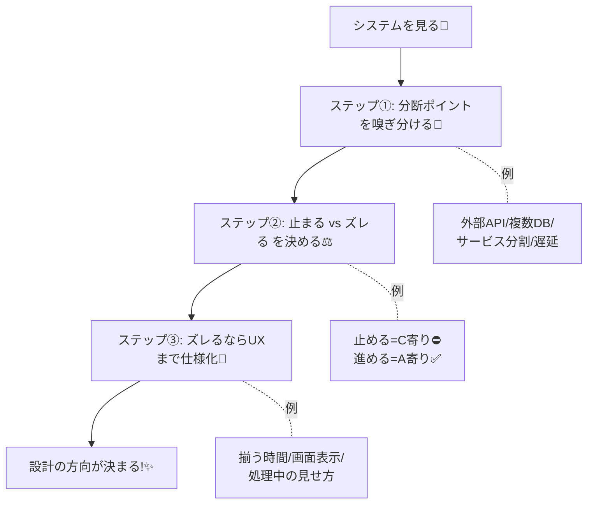

# 第01章：この講座のゴールと“肌感覚”の作り方🎯🧠✨

## 1. この講座でできるようになること（暗記じゃなく“判断”へ）💡✨


この講座のゴールは、CAPを**覚える**ことじゃなくて、次の3つを**選べる**ようになることだよ〜😊🎓

* 「ここは**止まってもいい**？ それとも**止めたくない**？」⛔➡️✅
* 「ここは**ズレたら困る**？ それとも**ちょっとズレてもOK**？」😵‍💫➡️😌
* 「ズレてもOKなら、**どれくらいで揃えば合格**？（秒？分？）⏱️」

この3つが決まると、設計の方向がスッと決まるの🧩✨

---

## 1.2 CAP定理：3つの願いと「選べるのは2つまで」⚖️✨


CAPって、ざっくり言うとこう👇

> **ネットワークが分断（P）したとき**、
> **整合性（C）** と **可用性（A）** を両方“完璧”には守れないから、
> どっちを優先するか決めようね、って話📡⚖️

「3つ全部ほしい」は気持ち的には当然なんだけど、理論的に“保証”できないって示されているよ📚⚠️
（“C/A/P全部は無理”が主張の入口）

---

## 3. 用語は“試験の定義”より、まず“肌感覚”でOK👌🌸

この講座では、用語をこういう感覚で使うよ〜😊

### Consistency（C：整合性）🧾✅

「誰がどこから見ても、**同じ世界**になってる」感じ✨
例：決済が成功したのに、別画面では未払いに見える…は困る😱💳

### Availability（A：可用性）🟢📨

「リクエストしたら、**とにかく返事が返ってくる**」感じ✨
※CAPの“可用性”は、いわゆる「稼働率99.9%」とはニュアンスが違って、**分断中でも返す**みたいな強い定義で語られることが多いよ📌

### Partition tolerance（P：分断耐性）🧱📡

「ネットワークが切れて、**向こうにメッセージが届かない**状況でも耐える」感じ✨
分断は“サーバが2つに割れる”だけじゃなくて、**メッセージが落ちたり遅れたり**も含めて考えるよ〜📮🐢

---

## 4. 題材 “CampusCafe” の世界を1分でつかむ☕📱🗺️

## 1.3 学食モバイルオーダー「CampusCafe」で考えよう☕🍰📱


学食モバイルオーダー “CampusCafe” では、こんな流れがあるよね👇

1. 注文（Order）する☕
2. 在庫（Stock）を減らす📦
3. 決済（Payment）する💳
4. 通知（Notification）する🔔

ここで分散が混ざると、たとえば…

* 注文は成功って出たのに、在庫が戻ってる😳
* 決済できたのに、注文履歴に出ない😵‍💫
* 通知が2回来る or 来ない📨📨🕳️

みたいな“事故”が起きやすいの💥

---

## 5. “肌感覚”を作る最強の3ステップ🧠🧩✨


### ステップ①：分断（P）が起きるポイントを嗅ぎ分ける👃📡

次が1つでも入ったら、Pの候補だよ〜⚠️

* 外部API（決済、通知、配送など）🌐
* DBが複数（読み取り用、在庫用、注文用など）🗄️🗄️
* サービスが分かれてる（注文サービス、在庫サービス…）🔌
* たまに遅い／落ちる／タイムアウトする⏱️💥

### ステップ②：「止まる vs ズレる」どっちがマシ？を決める⚖️😳

分断中に選べるのは、だいたいこの2つ👇

* **止める**：返事を保留・失敗にして、ズレは起こさない（C寄り）⛔✅
* **進める**：返事は返して動かすけど、ズレる可能性がある（A寄り）✅😵‍💫

### ステップ③：ズレるなら“見せ方（UX）”まで仕様に入れる🎨💬

最終的整合性って、「いつか揃う」だけじゃなくて…

* **どれくらいで揃う想定？**（数秒？数分？）⏳
* **揃うまで画面はどう見せる？**（処理中/あとで反映/再読み込み）🖥️✨

ここまで決めて、やっと“設計が決まる”よ〜😊🧠

---

## 6. ミニ演習①：身近なアプリを“即時一致 vs 遅れてOK”で仕分け📱🔎✨

次を、直感でOKだから分類してみよう〜🙌✨

| 機能         | 即時一致が必要？ | 遅れてOK？ | ひとこと理由（ユーザー目線）         |
| ---------- | -------- | ------ | ---------------------- |
| 銀行の残高      | ✅        | ❌      | 間違えると損する💸😱           |
| SNSの「いいね数」 | ❌        | ✅      | 数秒ズレてもだいたい困らない👍😌     |
| 飛行機の座席予約   | ✅        | ❌      | 二重予約は地獄✈️💥            |
| ECのおすすめ表示  | ❌        | ✅      | 多少ズレても体験に響きにくい🛍️🙂    |
| 既読表示       | △        | △      | “どの程度ズレOK？”がサービス次第💬🧐 |

ポイントはこれ👇
**「技術の都合」じゃなくて「ユーザーが困るか」で決める**💘

---

## 7. ミニ演習②：CampusCafeを仕分けしてみよう☕📦💳🔔

CampusCafeの機能を、まずはざっくり置いてみるよ〜（正解は1つじゃない🙆‍♀️✨）

| 機能             | まずの直感     | なぜ？（事故った時の痛さ）          |
| -------------- | --------- | ---------------------- |
| 決済確定           | ✅ 即時一致ほしい | 二重請求・未請求は致命傷💳😱       |
| 在庫確保（最後の1個）    | ✅ 即時一致ほしい | 売りすぎると炎上📦🔥           |
| 注文受付（とりあえず受ける） | ✅/△       | “受けたのに取り消し”を許すか次第😳    |
| 通知（呼び出し）       | ❌ 遅れてOK   | 少し遅れても取り返せる🔔🐢        |
| 注文履歴の表示        | △         | “すぐ反映”が必要かはUX設計で調整🖥️✨ |

この章では「まず分類できた！」が勝ちだよ〜🎉
細かい設計（冪等性・順番・補償など）は後の章でちゃんと積むよ🧩📚

---

## 8. ミニ実験：2つの在庫がズレて、あとで揃うのを見よう👀📦🧪

> ここでは「分断中、Aで在庫を減らしたのにBは古い値を見てる」→「復旧後に追いつく」を体験するよ〜😊
> ※学習用なので、重複・順番逆転みたいな“分散の本番あるある”は次の章で扱うよ📨🔀

### 実行してみよう🚀

新しいコンソールプロジェクトを作って、`Program.cs` をこれに置き換えて実行してね✨

```csharp
using System.Collections.Concurrent;
using System.Threading;

record ReplicationMessage(string Key, int NewValue, long Version);

sealed class Replica
{
    public string Name { get; }
    private readonly ConcurrentDictionary<string, (int Value, long Version)> _data = new();
    private long _clock = 0;

    public Replica(string name) => Name = name;

    public int Read(string key)
        => _data.TryGetValue(key, out var v) ? v.Value : 0;

    // 同じReplicaの中では単調増加するバージョンを付ける（学習用）
    public long Write(string key, int newValue)
    {
        var version = Interlocked.Increment(ref _clock);
        _data[key] = (newValue, version);
        return version;
    }

    // Last-Write-Wins（学習用。衝突解決は後の章で！）
    public void Apply(ReplicationMessage msg)
    {
        _data.AddOrUpdate(
            msg.Key,
            _ => (msg.NewValue, msg.Version),
            (_, current) => msg.Version >= current.Version ? (msg.NewValue, msg.Version) : current
        );
    }
}

sealed class FakeNetwork
{
    private readonly Random _rand = new();
    private readonly List<(Replica Target, ReplicationMessage Msg)> _buffer = new();

    public bool Partitioned { get; set; }

    public async Task SendAsync(Replica target, ReplicationMessage msg)
    {
        if (Partitioned)
        {
            _buffer.Add((target, msg));
            Console.WriteLine($"🧱 [NETWORK] 分断中なのでバッファへ… -> {target.Name}");
            return;
        }

        await Task.Delay(_rand.Next(150, 800)); // 遅延っぽさ
        target.Apply(msg);
        Console.WriteLine($"📬 [NETWORK] 配達！ -> {target.Name}");
    }

    public async Task HealAsync()
    {
        Partitioned = false;
        Console.WriteLine("🩹 [NETWORK] 復旧！バッファを吐き出すよ〜");
        foreach (var (t, m) in _buffer.ToArray())
        {
            await SendAsync(t, m);
        }
        _buffer.Clear();
    }
}

static void Print(Replica a, Replica b, string key)
    => Console.WriteLine($"📦 stock({key})  A={a.Read(key)} / B={b.Read(key)}");

var a = new Replica("A");
var b = new Replica("B");
var net = new FakeNetwork();

const string item = "cheesecake";

// 初期値（両方 5）
a.Write(item, 5);
b.Write(item, 5);

Console.WriteLine("✅ 初期状態");
Print(a, b, item);

Console.WriteLine("\n🧱 ネットワーク分断スタート（Bに届かない）");
net.Partitioned = true;

// Aで「注文確定」→ 在庫 -3
var newStock = a.Read(item) - 3;
var ver = a.Write(item, newStock);

// その更新をBへ送る（でも分断中なのでバッファ行き）
_ = net.SendAsync(b, new ReplicationMessage(item, newStock, ver));

Console.WriteLine("\n💳 Aで注文確定（在庫 -3）した直後…");
Print(a, b, item);
Console.WriteLine("😳 B側はまだ古い値を見てるかも（ズレ！）");

await Task.Delay(1500);

Console.WriteLine("\n🩹 分断が復旧！");
await net.HealAsync();

Console.WriteLine("\n⏳ 少し待った後…");
await Task.Delay(1000);
Print(a, b, item);

Console.WriteLine("\n🎉 いずれ揃う（= 最終的整合性のイメージ）");
```

### 見どころ👀✨

* 分断中：Aは2、Bは5のまま（ズレる😵‍💫）
* 復旧後：Bが追いついて2になる（揃う🎉）

ここで感じてほしいのはこれ👇
「分断（P）が起きた瞬間、**“ズレる or 止める”の選択が必要**になる」ってこと🧠⚡

分断を“メッセージが落ちる/届かない”として扱う考え方は、CAPの定義でも中心にあるよ📮🧱

---

## 9. AI活用コーナー：コピペで使えるプロンプト集🤖📝✨

### ① 自分のアプリ案をCAP視点で仕分け

* 「このアプリ機能一覧を、**即時一致必須 / 遅延OK** に分類して。理由はユーザー目線で。最後に“迷うやつ”だけ質問して」

### ② “分断（P）”が起きる場所を洗い出す

* 「このシステム構成（API/DB/外部サービス）から、**分断ポイント候補**を列挙して。各ポイントで起きうる事故（遅延/取りこぼし/二重）もセットで」

### ③ 遅延OK機能の“画面の見せ方（UX）”を作る

* 「通知や履歴の“遅れて反映”を、ユーザーが不安にならないUI文言にして。候補を10個、やさしい口調で」

---

## 10. まとめ（この章で掴んだ“判断の芯”）🎯✨

* CAPは暗記じゃなくて、**分断（P）が起きたときの意思決定**🧠⚖️
* その意思決定は、結局この2択になりがち👇

  * **止めてズレを防ぐ（C寄り）**⛔✅
  * **動かして返事を返す（A寄り）**✅😵‍💫
* 最終的整合性は「いつか揃う」だけじゃなく、**揃うまでのUX**が仕様🎨💬

CAPの“分断をメッセージ損失として扱う”考え方や、「分断耐性を入れると availability の定義が強くなる」ニュアンスは、定義としても押さえておくと強いよ📌

---

## 11. チェッククイズ（3分）📝⏱️✨

1. 「通知が少し遅れて届く」のは、即時一致が必要？遅延OK？🔔🐢
2. 「最後の1個の在庫」は、ズレたら何が起こる？📦😱
3. 分断中に“返事を返し続ける”方針は、C寄り？A寄り？✅⚖️
4. 最終的整合性で大事なのは「揃う」以外に何？（ヒント：画面）🖥️✨
5. さっきのミニ実験で、AとBの値がズレた理由を一言で！🧱📡

次章では、CampusCafeを実際に作りながら「分散っぽさ」がどこから入るかを、もっと具体的に掴んでいくよ〜☕📱🗺️
