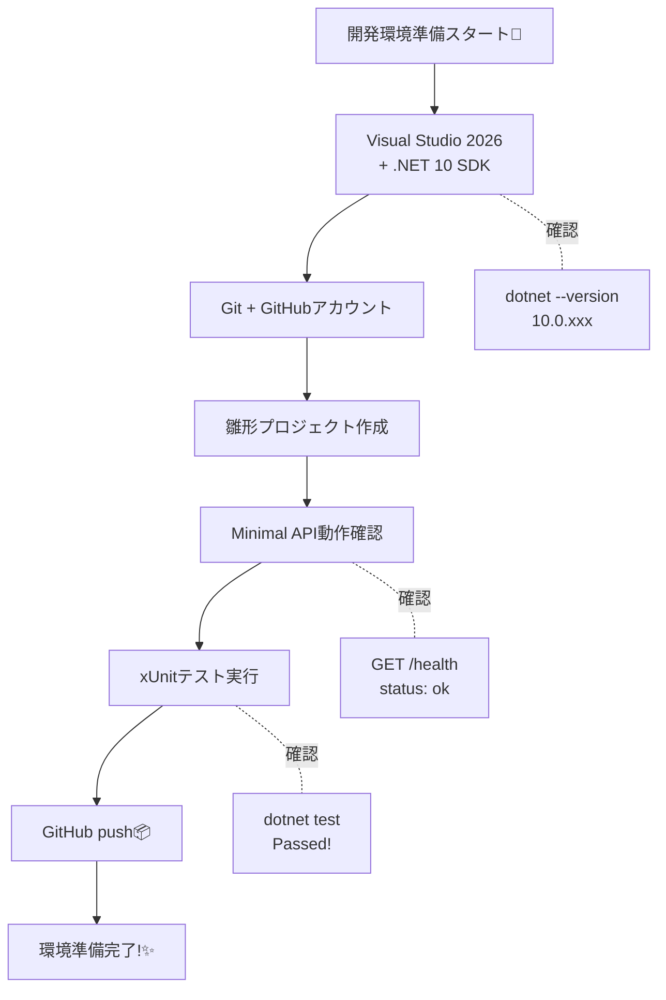

# 第02章：開発環境の準備（Windows）🧰💻✨

## この章のゴール🎯✨

この章が終わったら、次の3つができる状態になります😊💖

* **CampusCafe を動かすための C# / .NET 開発環境が完成**🛠️
* **Minimal API の雛形 + xUnit テスト**が作れる✅
* **GitHub に push**できる📦🚀

---



# 2.1 まずは“揃えるもの”チェックリスト✅🧾✨

* Visual Studio（.NET 10 を気持ちよく使うなら **Visual Studio 2026** がいちばんスムーズ）💡 ([Microsoft][1])
* **.NET 10 SDK**（`dotnet` コマンドが使えるやつ）🧩 ([Microsoft][2])
* Git（GitHubにpushするため）🐙
* GitHubアカウント（Webでリポジトリ作る用）🌍
* （任意）GitHub Desktop（Gitが不安なら超おすすめ）🧁 ([GitHub][3])

> 参考：.NET 10 は 2025/11/11 リリースで、C# 14 は .NET 10 上でサポートされます🧠✨ ([Microsoft][2])

---

# 2.2 “入ってるか確認”しよう🔎💻✨

## ✅ .NET SDK が入ってるか

PowerShell（または Windows Terminal）でこれ👇

```powershell
dotnet --version
dotnet --info
```

* `10.0.xxx` みたいに **10系**が出たらOK🙆‍♀️✨（.NET 10 SDK） ([Microsoft][2])

## ✅ Visual Studio のバージョン確認

Visual Studio を開いて、
**ヘルプ → Microsoft Visual Studio について** でバージョン確認👀✨

※ もし Visual Studio 2022 を使っている場合、2026/01 時点で 17.14 系が配布されています（例：17.14.24）📌 ([Microsoft Learn][4])
（ただし .NET 10 を “全部込みで安心” にやるなら Visual Studio 2026 が楽ちんです） ([Microsoft][1])

---

# 2.3 Visual Studio に入れる機能（ワークロード）🧩🛠️

Visual Studio Installer を開いて、最低これだけ入ってればOK😊✨

* **ASP.NET と Web 開発**（Web API を作るため）🌐
* （任意）**.NET デスクトップ開発**（あとでツール作る時に便利）🪟

> .NET 10 の開発は Visual Studio 2026 がサポートに明記されています📌 ([Microsoft][1])

---

# 2.4 CampusCafe の“雛形”を作ろう（Minimal API）☕📱✨


## A案：コマンドで一気に作る（いちばん速い）⚡

フォルダ構成もキレイにするよ〜📁✨

```powershell
mkdir CampusCafe
cd CampusCafe

dotnet new sln -n CampusCafe

dotnet new webapi -n CampusCafe.Api -o src/CampusCafe.Api
dotnet new classlib -n CampusCafe.Core -o src/CampusCafe.Core
dotnet new xunit -n CampusCafe.Tests -o tests/CampusCafe.Tests

dotnet sln add src/CampusCafe.Api/CampusCafe.Api.csproj
dotnet sln add src/CampusCafe.Core/CampusCafe.Core.csproj
dotnet sln add tests/CampusCafe.Tests/CampusCafe.Tests.csproj

dotnet add src/CampusCafe.Api/CampusCafe.Api.csproj reference src/CampusCafe.Core/CampusCafe.Core.csproj
dotnet add tests/CampusCafe.Tests/CampusCafe.Tests.csproj reference src/CampusCafe.Core/CampusCafe.Core.csproj
```

ポイント💡

* `.NET 10 の webapi テンプレートは、基本が Minimal API 寄り（controllers の既定が false）` になってます🧠✨ ([Microsoft Learn][5])

作れたら、`CampusCafe.sln` を Visual Studio で開いてね😊💕

---

## B案：Visual Studio の画面で作る（UI派はこちら）🖱️✨

Minimal API は **「ASP.NET Core Empty」**から始めるのが分かりやすいです💖
（Microsoft の Minimal API チュートリアルでもこの流れ）📚 ([Microsoft Learn][6])

ざっくり手順👇

1. **新しいプロジェクトの作成**
2. テンプレ検索で `Empty`
3. **ASP.NET Core Empty** を選ぶ
4. ターゲットは **.NET 10**
5. 作成✨

---

# 2.5 最小のAPIを1本だけ生やす🌱✨（動作確認用）

`src/CampusCafe.Api/Program.cs` に、これを入れてみよ〜😊

```csharp
var builder = WebApplication.CreateBuilder(args);
var app = builder.Build();

app.MapGet("/health", () => Results.Ok(new { status = "ok" }));

app.Run();
```

実行して、ブラウザで👇を開く✨

* `https://localhost:xxxx/health`

`{"status":"ok"}` が返ってきたら勝ち🏆💖

---

# 2.6 xUnit を“動く状態”にする🧪✨

ここでは「テストってこういう感じなんだ〜😊」を体験する用に、**超ミニなドメイン関数**を作ります🍰✨

## ① Core に計算クラスを作る（例：合計金額）

`src/CampusCafe.Core/PriceCalculator.cs`

```csharp
namespace CampusCafe.Core;

public static class PriceCalculator
{
    public static int Total(int unitPrice, int quantity)
    {
        if (unitPrice < 0) throw new ArgumentOutOfRangeException(nameof(unitPrice));
        if (quantity < 0) throw new ArgumentOutOfRangeException(nameof(quantity));
        return unitPrice * quantity;
    }
}
```

## ② テストを書く

`tests/CampusCafe.Tests/PriceCalculatorTests.cs`

```csharp
using CampusCafe.Core;

namespace CampusCafe.Tests;

public class PriceCalculatorTests
{
    [Fact]
    public void Total_returns_unitPrice_times_quantity()
    {
        var total = PriceCalculator.Total(unitPrice: 500, quantity: 2);
        Assert.Equal(1000, total);
    }
}
```

## ③ テスト実行✅

```powershell
dotnet test
```

`Passed!` が出たらOK〜🥳💖

---

# 2.7 GitHub に push しよう📦🚀✨（ここまでがミニ演習）

## ① Git 初期化（Visual StudioでもOK）

コマンド派なら👇

```powershell
git init
git add .
git commit -m "ch2: init solution + minimal api + xunit"
```

## ② GitHub にリポジトリを作る🐙✨

GitHub の Web で `CampusCafe` リポジトリを作成して、表示される手順どおりに `remote add` → `push` すればOK😊

（GUIが好きなら GitHub Desktop で “Add existing repository” → “Publish repository” でもOKだよ🍩） ([GitHub][3])

---

# 2.8 AI（Copilot / Codex）に聞くと強いこと🤖💡✨

“ここはAIが得意！”ってところだけ使うのがコツだよ😊💕

## おすすめプロンプト例📝✨

* 「`CampusCafe` のソリューション構成を `src/` と `tests/` で整理して。理由もつけて💡」
* 「Minimal API の `Program.cs` を読みやすくする分割案を出して（今は1ファイルだけど将来増える前提）📁」
* 「`.gitignore` に入れ忘れがちな Visual Studio の項目をチェックして✅」

## 注意ポイント⚠️🔐

* **鍵・接続文字列・個人情報は貼らない**（これは絶対🫶）
* AIの提案は **そのまま採用せず、1回動かして確認**👀✨

---

# 2.9 よくある詰まりポイント集（先回り）🧯😵‍💫

## 🔥 HTTPS がうまく動かない / 証明書が怪しい

これで直ることが多いよ👇

```powershell
dotnet dev-certs https --trust
```

## 🔥 `dotnet` が見つからない

* .NET SDK のインストールが抜けてる可能性大💦
* `dotnet --version` が通るか再確認してね✅

## 🔥 ポートが被る

* さっき起動したプロセスが残ってることあるある😇
* Visual Studio の停止 → もう一回実行、でだいたい解決💡

---

# 2.10 ミニ演習（第2章）🎒✨

できたらチェックしてね✅💖

* [ ] `GET /health` が返る
* [ ] `dotnet test` が通る
* [ ] GitHub にリポジトリがあって、コードが push できてる
* [ ] `src/` と `tests/` の構成ができてる

---

# この章の到達点まとめ🌸✨

ここまでで **「動くAPI」「動くテスト」「履歴が残るGitHub」** が揃いました😊☕🧪🐙
この3点セットがあると、分散とか整合性みたいな難しい話も “ちゃんと試しながら” 進められるようになります✨

[1]: https://dotnet.microsoft.com/ja-JP/download/dotnet/10.0?utm_source=chatgpt.com ".NET 10.0 (Linux、macOS、Windows) のダウンロード | .NET"
[2]: https://dotnet.microsoft.com/en-US/download/dotnet/10.0?utm_source=chatgpt.com "Download .NET 10.0 (Linux, macOS, and Windows) | .NET"
[3]: https://desktop.github.com/download/?utm_source=chatgpt.com "Download GitHub Desktop"
[4]: https://learn.microsoft.com/ja-jp/visualstudio/releases/2022/release-history?utm_source=chatgpt.com "Visual Studio 2022 リリース履歴"
[5]: https://learn.microsoft.com/en-us/dotnet/core/tools/dotnet-new-sdk-templates?utm_source=chatgpt.com "NET default templates for 'dotnet new' - .NET CLI"
[6]: https://learn.microsoft.com/en-us/aspnet/core/tutorials/min-web-api?view=aspnetcore-10.0&utm_source=chatgpt.com "Tutorial: Create a Minimal API with ASP.NET Core"
