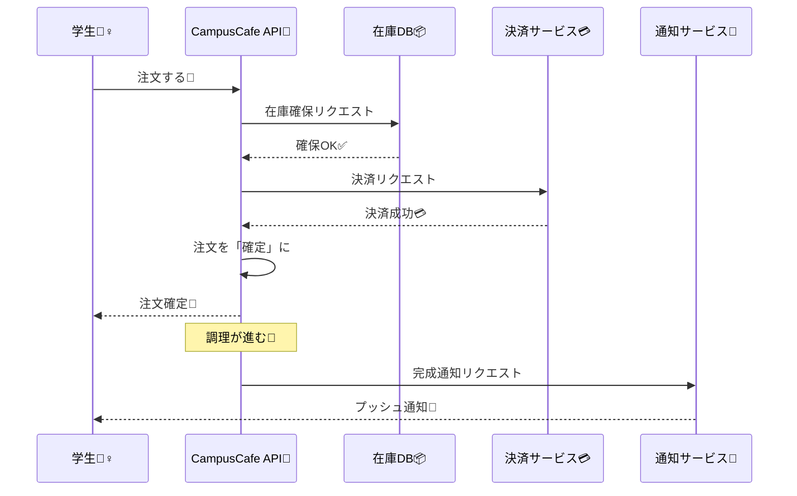

# 第03章：題材アプリの全体像（CampusCafe）☕📱🗺️

## この章でわかること🎯✨

* CampusCafeが「何をするアプリ」なのか（ユーザー体験）😊
* 注文→在庫→決済→通知が、どうつながるか（業務フロー）🔗
* 「分散っぽくなるポイント（＝ズレやすい場所）」の地図🧭📡
* 要件を“整合性の要求”に分解するコツ（次章以降の土台）🧩

---

# 1) CampusCafeってどんなアプリ？☕🍰📱

**学食のモバイルオーダー**だよ〜😊
学生さんがスマホで注文して、学食が作って、できたら通知が来る📣✨
よくあるけど、ちゃんと作ると「分散あるある」がぎゅっと詰まってる題材なんだ〜🧠💡

---

## 3.1 登場人物（アクター）を確認しよう🧑‍🎓🖥️💳


* **学生（お客さん）**：注文して、支払って、受け取る🙋‍♀️🍔
* **学食スタッフ（お店側）**：注文を捌いて、作って、受け渡す👩‍🍳🔥
* **決済サービス**（外部）：支払いを確定する💳🌐
* **通知サービス**（外部）：プッシュ通知・メール等🔔📨

> 外部サービスが出てきた瞬間から、もう“分散の匂い”がするよ〜📡😳

---

# 3) 主要機能（ざっくり）🧩✨

## 学生向け📱

* メニューを見る🍛📖
* カートに入れる🛒
* 注文確定（受取時間も指定）🕒✅
* 決済する💳
* 注文状況を見る（受付/調理中/完成など）👀🚦
* 完成通知を受け取る🔔✨

## お店向け🧑‍🍳

* 注文一覧を見る📋
* 調理ステータス更新（作り始め/完成）🍳➡️✅
* 在庫を減らす・売り切れにする📦✂️
* 混雑状況を見る（簡易でOK）📈🙂

---

# 4) 1回の注文は、どう流れる？（業務フロー）🔁☕

「注文→在庫→決済→通知」の一本道に見えるけど、現実は分岐と例外だらけ〜😇💦
まずは基本の成功ルートから！

## ✅ 成功ルート（理想）



1. 学生が注文する🛒➡️🧾
2. 在庫を“確保”する📦🔒（足りなかったらここで止める）
3. 決済する💳✅
4. 注文を「確定」にする🎉
5. 調理が進む🍳🔥
6. 完成したら通知する🔔✨

---

# 5) システム構成（まずは地図）🗺️📡

最初は「こう分けられるよね」を地図として持っておくと、CAPの判断練習が超やりやすいよ〜🧠✨

```text
[学生アプリ📱]
   |
   v
[API（CampusCafe）🧾]
   |         |          |           |
   v         v          v           v
[注文🧾DB]  [在庫📦DB]  [決済💳(外部)]  [通知🔔(外部)]
```

* **注文**：注文の状態（受付/確定/キャンセル/完了…）を持つ🧾
* **在庫**：メニューごとの残数、確保（予約）を持つ📦
* **決済**：外部。成功/失敗/保留が返る💳🌐
* **通知**：外部。届くとは限らない（後で学ぶやつ）🔔📨

---

# 6) “状態（データ）”はどこにある？（ズレの芽を見つける）🌱👀

分散で一番つらいのは、「どれが正しいの？」って迷子になること😵‍💫
だから、最初に **“正の情報源（ソース・オブ・トゥルース）”** を決めよう✨

| 何の状態？  | 例                                     | 正の情報源（まずは）   | ズレやすい理由😇            |
| ------ | ------------------------------------- | ------------ | -------------------- |
| 注文状態🧾 | Created / Confirmed / Cooking / Ready | 注文DB🗃️      | 外部（決済/通知/在庫）と結果が食い違う |
| 在庫残数📦 | カレー残り12                               | 在庫DB🗃️      | 確保と減算の順番、同時注文でズレる    |
| 決済結果💳 | Success / Failed / Pending            | 決済サービス側🌐    | タイムアウト・遅延・二重実行が起きる   |
| 通知送信🔔 | Sent / Failed                         | 通知サービス側🌐＋記録 | “送った”と“届いた”は別問題      |

---

# 7) どこが“分散になりやすい”ポイント？（この章の核心）📡⚡

CampusCafeは、ここが分散ポイントになりがち👇😳

## 分断ポイント候補🧱

* API ↔ DB（注文DB・在庫DBが別なら、もう分散）🗃️🗃️
* API ↔ 決済サービス（外部API）💳🌐
* API ↔ 通知サービス（外部API）🔔🌐
* さらに将来：学食が複数店舗、キャンパスが複数…🏫🏫

## “起きがち”な現実（予告）😇

* ネットが遅い🐢
* タイムアウトする⏱️
* 同じリクエストが2回届く📨📨
* 順番が入れ替わる🔀
* 成功したのに「失敗に見える」／失敗したのに「成功に見える」😵‍💫

> この“現実あるある”を前提に、あとでCAP判断をしていくよ〜🧠✨

---

# 8) どこが「即時一致が必要」っぽい？どこが「遅れてOK」っぽい？🎛️🧠

まだCAPは暗記しなくてOK🙆‍♀️
でも「ユーザー体験」で見ると、だいたいこういう匂いがするよ〜😊

* **決済**：ズレると大事故になりやすい💳🔥（二重請求・未払い扱いなど）
* **在庫確保**：売り切れなのに買えた…はつらい📦😭
* **通知**：多少遅れても、取りに来る画面が正しければ耐えやすい🔔🙂
* **集計・ランキング**：遅れてOKの代表格📊🐢

.NET / ASP.NET Core は **.NET 10（2025年11月リリースのLTS）** を軸にして進めると、今いちばん素直に学べるよ〜💻✨ ([Microsoft Learn][1])

---

# 9) ミニ演習①：要件を文章で書く（“ユーザー体験”込み）📝🌸

ここ超大事！✨
CAPの判断って、技術じゃなくて **仕様（UX）** で決まることが多いよ〜😊

## ✍️ 書くテンプレ（そのまま使ってOK）

* ユーザーは何をしたい？🙋‍♀️
* 画面で何が見える？👀
* 失敗したらどう見せる？（文言も）💬
* “絶対に間違えたくない”のはどれ？🔥
* “多少遅れてもいい”のはどれ？🐢
* 取り消し（キャンセル）はできる？↩️

## 例（短く）

* 「注文確定ボタンを押したら、**注文番号**が出る。支払いが成功したら注文は確定。失敗なら確定しない」🧾💳
* 「在庫が足りない場合、注文確定前に売り切れ表示を出す」📦🚫
* 「通知は届かない可能性があるので、アプリの注文履歴でも完成が分かる」🔔➡️📱

---

# 10) ミニ演習②：要件を“整合性の要求”に分解する🧩🔎

次の形に分解できると、CAP判断がスムーズになるよ〜😊✨

## 分解テンプレ

* 対象は何？（注文/在庫/決済/通知）🧾📦💳🔔
* いつ揃っててほしい？（今すぐ？数秒後？いつか？）⏱️
* ズレたら誰が困る？（学生/スタッフ/会計）😢
* ズレた時の救済は？（やり直し/取り消し/返金）🧯

## 例（“通知”）

* 対象：完成通知🔔
* いつ：数分遅れてもOK🙆‍♀️
* 困る人：学生（受け取りが遅れる）
* 救済：アプリの注文画面で「完成」が見えるようにする📱✅

---

# 11) AI活用：要件→整合性要求の分解を手伝ってもらう🤖🧩✨

そのままコピペで使えるプロンプト例だよ〜（短くてOK）😊

## 要件を分解してもらう📌

```text
CampusCafeの要件を貼ります。
これを「注文/在庫/決済/通知」に分けて、
それぞれ「即時一致が必要」「遅延OK」「理由（ユーザー体験）」で表にしてください。
```

## “ズレたときの困りごと”を出してもらう📌

```text
CampusCafeで起きうる「ズレ」を10個挙げて、
各ズレについて「ユーザーへの見え方」「最悪の事故」「救済策」をセットで書いてください。
```

## 文章（UX文言）を作ってもらう📌

```text
注文確定・在庫切れ・決済失敗・通知遅延のとき、
ユーザーが不安にならない短い文言を各5パターン作ってください。
敬語すぎず、やさしい口調で。
```

---

# 12) ちいさなC#の下地（“流れ”だけ触る）🧪☕💻

この章ではガッツリ実装しないよ🙆‍♀️
でも「どんなAPIが生まれそう？」の雰囲気だけ先に見ておくと安心✨

```csharp
// 例：将来こんなAPIが欲しくなる（雰囲気）
// POST /orders        注文作成（在庫確保→決済→確定…の入口）
// GET  /orders/{id}   注文状況を見る
// POST /inventory/reserve  在庫の確保（予約）
// POST /payments/charge    決済（外部連携）
// POST /notify             通知（外部連携）
```

ASP.NET Core 10（.NET 10）では Minimal API まわりも継続的に改善されていて、軽いAPIの教材にちょうどいいよ〜✨ ([Microsoft Learn][1])

---

# 13) この章のまとめ🧁✨

* CampusCafeは **注文・在庫・決済・通知** の4つが骨格🧾📦💳🔔
* 外部サービスや複数DBが入ると、すぐ分散の世界になる📡😳
* “状態の正解”を決めて、ズレの芽を見つけるのが最初の一歩🌱👀
* 要件を「いつ揃っててほしい？」に分解できると、CAP判断が上手になる🧠🎛️

開発ツール面でも、Visual Studio 2022 は **17.14.24（2026-01-13 時点の Current）** まで更新が出ていて、最新の環境で学びやすいよ〜💻✨ ([Microsoft Learn][2])

[1]: https://learn.microsoft.com/en-us/dotnet/core/whats-new/dotnet-10/overview?utm_source=chatgpt.com "What's new in .NET 10"
[2]: https://learn.microsoft.com/en-us/visualstudio/releases/2022/release-history?utm_source=chatgpt.com "Visual Studio 2022 Release History"
