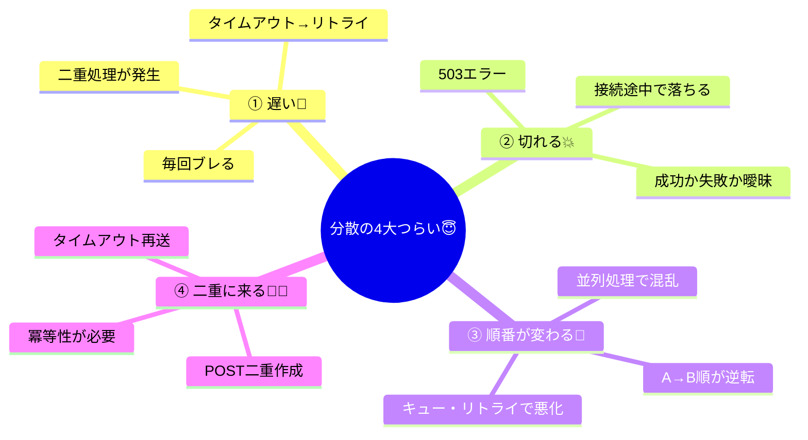

# 第04章：分散が難しい理由（まずここで転ぶ）😵‍💫📡

## この章でできるようになること🎯✨

* 「遅い」「切れる」「順番が変わる」「二重に来る」って何が“つらい”のかを体感できる😇
* “ただのHTTP呼び出し”が、なぜ設計の話に直結するのかがわかる🧠⚡
* 次章以降のCAP判断に必要な「現実のクセ」を、先に身体で覚える💪📚

---

# 4.1 まず最初に：ネット越しは、ローカル呼び出しじゃない🙅‍♀️🌐

同じ `await` でも…

* ローカル関数：だいたい速い・壊れにくい・順番はわりと期待できる
* ネット越し：遅い・切れる・順番が変わる・二重に来る（普通に）😵‍💫

この “勘違いあるある” は有名で、たとえば「ネットワークは信頼できる」「遅延はゼロ」みたいな思い込みが落とし穴になるよ〜って話が整理されています。 ([ウィキペディア][1])

---

# 4.2 分散の4大つらい(この章の主役)😇📦



## ① 遅い🐢⏱️

* 1回だけ遅い、じゃなくて **毎回ブレる（ジッター）** のが地味に痛い
* すると…タイムアウト→リトライ→二重処理、が起きる😵‍💫

## ② 切れる💥📴

* 503が返る、接続が途中で落ちる、返事が来ない…
* 「失敗した」のか「成功したけど返事だけ落ちた」のかが曖昧になる😇

## ③ 順番が変わる🔀😵‍💫

* A→Bの順で投げても、返ってくるのはB→Aだったりする
* 並列処理・キュー・リトライが絡むとさらにぐちゃぐちゃ🌪️

## ④ 二重に来る📨📨

* タイムアウトや再送で「同じ依頼」がもう一回届くのは自然現象
* 特に **POST（作成系）** はそのままだと二重作成になりやすい⚠️ ([Microsoft Learn][2])

---

# 4.3 ミニ実験：わざと不安定な在庫APIを作って転んでみる😇🧪

題材はCampusCafeの **在庫サービス（InventoryService）** と **注文サービス（OrderService）** の2つだけでOK✨
最小限で「遅い・切れる・順番・二重」を全部体験するよ〜☕📱

この章のサンプルは **.NET 10（LTS）** / **C# 14** の想定だよ〜🧁 ([Microsoft][3])

---

# 4.4 作るもの：2つのMinimal API（超ミニ）🧩✨

## ① プロジェクト作成（Solutionに2プロジェクト）📁

ターミナルでも作れるよ（Visual StudioのUIで作ってもOK）😊
`dotnet new webapi` は最近のテンプレだと **Minimal APIが既定** になってるよ〜🪄 ([Microsoft Learn][4])

```bash
mkdir CampusCafe-Ch4
cd CampusCafe-Ch4

dotnet new sln -n CampusCafe

dotnet new webapi -n InventoryService
dotnet new webapi -n OrderService

dotnet sln add InventoryService/InventoryService.csproj
dotnet sln add OrderService/OrderService.csproj
```

---

# 4.5 InventoryService：わざと遅くしたり落ちたりする在庫API🧨📦

## InventoryService の `Program.cs` を置き換え✍️

```csharp
using System.Collections.Concurrent;

var builder = WebApplication.CreateBuilder(args);

builder.Services.AddEndpointsApiExplorer();
builder.Services.AddSwaggerGen();

var app = builder.Build();

app.UseSwagger();
app.UseSwaggerUI();

// 在庫（超ミニ：メモリ）
var stock = new ConcurrentDictionary<string, int>(StringComparer.OrdinalIgnoreCase)
{
    ["cake"] = 10,
    ["coffee"] = 20
};

// 予約（超ミニ：メモリ）
var reservations = new ConcurrentDictionary<string, Reservation>();

// 疑似カオス（遅延/失敗/中断）
static async Task<IResult?> MaybeChaosAsync(HttpContext ctx, string? chaos)
{
    // chaos: none / slow / fail / slowfail / abort / flaky
    chaos = (chaos ?? "none").Trim().ToLowerInvariant();

    if (chaos == "abort")
    {
        // “途中で切れる”っぽい再現（クライアント側は HttpRequestException になりがち）
        ctx.Abort();
        return Results.Empty;
    }

    if (chaos == "fail")
        return Results.StatusCode(StatusCodes.Status503ServiceUnavailable);

    if (chaos == "slow")
        await Task.Delay(2000); // あえてキャンセルトークンを使わない（=クライアントが諦めても処理が続く感じを再現）

    if (chaos == "slowfail")
    {
        await Task.Delay(2000);
        return Results.StatusCode(StatusCodes.Status503ServiceUnavailable);
    }

    if (chaos == "flaky")
    {
        var r = Random.Shared.Next(0, 100);
        if (r < 35) return Results.StatusCode(StatusCodes.Status503ServiceUnavailable);
        if (r < 70) await Task.Delay(1500);
    }

    return null; // 何も起きない
}

app.MapGet("/inventory/state", () =>
{
    return Results.Ok(new
    {
        stock = stock.OrderBy(kv => kv.Key).ToDictionary(kv => kv.Key, kv => kv.Value),
        reservations = reservations.Count
    });
});

app.MapGet("/inventory/ping", async (int? delayMs) =>
{
    var ms = Math.Clamp(delayMs ?? 0, 0, 5000);
    await Task.Delay(ms);
    return Results.Ok(new { ok = true, delayMs = ms, at = DateTimeOffset.UtcNow });
});

app.MapPost("/inventory/reserve", async (HttpContext ctx, ReserveRequest req, string? chaos) =>
{
    var chaosResult = await MaybeChaosAsync(ctx, chaos);
    if (chaosResult is not null) return chaosResult;

    if (req.Quantity <= 0) return Results.BadRequest(new { message = "quantity must be > 0" });

    // 在庫チェック＆確保（超ミニ：排他の雰囲気だけ）
    stock.AddOrUpdate(req.ItemId,
        _ => 0,
        (_, current) => current); // キー保証

    var currentStock = stock[req.ItemId];
    if (currentStock < req.Quantity)
        return Results.Conflict(new { message = "out of stock", itemId = req.ItemId, currentStock });

    stock[req.ItemId] = currentStock - req.Quantity;

    var reservationId = Guid.NewGuid().ToString("N");
    reservations[reservationId] = new Reservation(reservationId, req.ItemId, req.Quantity, DateTimeOffset.UtcNow);

    // リクエスト相関用（あればログに出す用）
    var requestId = ctx.Request.Headers["X-Request-Id"].ToString();

    app.Logger.LogInformation("Reserved: {ItemId} x{Qty} => reservationId={ResId}, X-Request-Id={ReqId}",
        req.ItemId, req.Quantity, reservationId, requestId);

    return Results.Ok(new { reservationId, itemId = req.ItemId, quantity = req.Quantity });
});

app.Run();

record ReserveRequest(string ItemId, int Quantity);
record Reservation(string ReservationId, string ItemId, int Quantity, DateTimeOffset ReservedAt);
```

---

# 4.6 OrderService：在庫APIを呼ぶだけなのに、地獄が始まる😇☎️

## OrderService の `Program.cs` を置き換え✍️

* **タイムアウト1秒**にする
* タイムアウトしたら **同じ注文をリトライ**してみる（←これが“二重”を生む）
* ついでに、**順番が変わる**デモも付ける🔀✨

```csharp
using System.Net.Http.Json;

var builder = WebApplication.CreateBuilder(args);

builder.Services.AddEndpointsApiExplorer();
builder.Services.AddSwaggerGen();

// IHttpClientFactoryでHttpClientを作る（基本はこのやり方が安心）🧰✨
builder.Services.AddHttpClient("inventory", client =>
{
    client.BaseAddress = new Uri("http://localhost:5101"); // InventoryService
    client.Timeout = TimeSpan.FromSeconds(1);              // わざと短い
});

var app = builder.Build();

app.UseSwagger();
app.UseSwaggerUI();

app.MapPost("/orders", async (IHttpClientFactory factory, CreateOrderRequest req) =>
{
    var orderId = Guid.NewGuid().ToString("N");
    var xRequestId = $"order-{orderId}";

    var client = factory.CreateClient("inventory");

    async Task<ReserveResult> CallReserveAsync()
    {
        // chaos は Inventory 側のクエリに渡す（slow/fail/abort/flaky など）
        var url = $"/inventory/reserve?chaos={Uri.EscapeDataString(req.Chaos ?? "none")}";

        using var message = new HttpRequestMessage(HttpMethod.Post, url);
        message.Headers.TryAddWithoutValidation("X-Request-Id", xRequestId);
        message.Content = JsonContent.Create(new { itemId = req.ItemId, quantity = req.Quantity });

        var response = await client.SendAsync(message);
        response.EnsureSuccessStatusCode();

        var body = await response.Content.ReadFromJsonAsync<ReserveResult>();
        return body ?? throw new InvalidOperationException("Invalid response body");
    }

    try
    {
        var result = await CallReserveAsync();
        return Results.Ok(new { orderId, reserved = result, note = "reserved (first try) ✅" });
    }
    catch (TaskCanceledException) when (req.RetryOnTimeout)
    {
        // タイムアウト＝失敗…とは限らないのがポイント😇
        // でも「失敗した気がする」のでリトライすると…？
        try
        {
            var result2 = await CallReserveAsync();
            return Results.Ok(new
            {
                orderId,
                reserved = result2,
                note = "reserved (after timeout retry) ⚠️"
            });
        }
        catch (Exception ex2)
        {
            return Results.Problem(title: "Retry also failed 💥", detail: ex2.Message);
        }
    }
    catch (Exception ex)
    {
        return Results.Problem(title: "Order failed 💥", detail: ex.Message);
    }
});

// 順番が変わるデモ：同時に投げたpingが、遅延次第で戻り順が変わる🔀
app.MapGet("/demo/out-of-order", async (IHttpClientFactory factory, int? count) =>
{
    var n = Math.Clamp(count ?? 6, 2, 20);
    var client = factory.CreateClient("inventory");

    // わざとバラバラな遅延を作る
    var delays = Enumerable.Range(0, n)
        .Select(i => (i, delayMs: Random.Shared.Next(0, 1800)))
        .ToList();

    var tasks = delays.Select(async x =>
    {
        var res = await client.GetFromJsonAsync<PingResult>($"/inventory/ping?delayMs={x.delayMs}");
        return new { x.i, x.delayMs, at = res?.at };
    }).ToList();

    // “完了した順”で取り出す
    var completedOrder = new List<object>();
    while (tasks.Count > 0)
    {
        var finished = await Task.WhenAny(tasks);
        tasks.Remove(finished);
        completedOrder.Add(await finished);
    }

    return Results.Ok(new { planned = delays, completedOrder });
});

app.Run();

record CreateOrderRequest(string ItemId, int Quantity, string? Chaos, bool RetryOnTimeout);
record ReserveResult(string reservationId, string itemId, int quantity);
record PingResult(bool ok, int delayMs, DateTimeOffset at);
```

`IHttpClientFactory` は、ASP.NET CoreでのHTTP呼び出しを扱いやすくする推奨パターンとして整理されてるよ〜🧰 ([Microsoft Learn][5])

---

# 4.7 実行：2つのサービスを別ポートで起動🚀💻

ターミナルを2つ開いてね😊

## InventoryService（ポート5101）

```bash
dotnet run --project InventoryService --urls http://localhost:5101
```

## OrderService（ポート5201）

```bash
dotnet run --project OrderService --urls http://localhost:5201
```

Swaggerを開くとテストしやすいよ〜🧁✨（各サービスで自動表示されるUI）
Minimal APIの基本操作（Swagger含む）は公式チュートリアルにもあるよ📘 ([Microsoft Learn][6])

---

# 4.8 実験タイム🧪✨（転ぶほど理解が深まるやつ😇）

## 実験①「遅い」🐢⏱️：タイムアウトは“曖昧”を生む

1. まず在庫を見る

* `GET http://localhost:5101/inventory/state`

2. 次に注文（遅延させる）

* `POST http://localhost:5201/orders`
* Body例👇

```json
{
  "itemId": "cake",
  "quantity": 1,
  "chaos": "slow",
  "retryOnTimeout": false
}
```

✅ 期待する観察ポイント

* OrderServiceは **タイムアウトで失敗っぽく**なることがある
* でもInventoryService側ログを見ると、**予約が進んでる**ことがある😇（=「失敗」じゃないかも）

ここが分散のいちばんイヤなところ：
**タイムアウトは「失敗」じゃなくて「わからない（Unknown）」** を生むの🥹

---

## 実験②「切れる」💥📴：503 / 接続中断

次は `chaos` を変えるだけでOK✨

* 503を返す：`chaos: "fail"`
* 途中で落とす：`chaos: "abort"`

```json
{
  "itemId": "cake",
  "quantity": 1,
  "chaos": "abort",
  "retryOnTimeout": true
}
```

✅ 期待する観察ポイント

* クライアント視点だと「失敗」に見える
* でもサーバー側が“どこまでやったか”はケース次第😇
* だから「安全にリトライできる設計（冪等性）」が後で超重要になる🛡️🔑 ([Amazon Web Services, Inc.][7])

---

## 実験③「順番が変わる」🔀😵‍💫：完了順がバラける

* `GET http://localhost:5201/demo/out-of-order?count=8`

✅ 期待する観察ポイント

* `planned`（予定の遅延）と
* `completedOrder`（完了した順）
  がズレるよ〜🔀✨

「送った順 = 受け取る順」「処理した順 = 反映される順」って思い込みが壊れる瞬間😇

---

## 実験④「二重に来る」📨📨：タイムアウト→リトライ→二重予約（やばい）

ここが一番の“転びポイント”💥

1. まず在庫を確認

* `GET http://localhost:5101/inventory/state`（cakeが10とか）

2. 注文を投げる（遅延＆リトライON）

```json
{
  "itemId": "cake",
  "quantity": 1,
  "chaos": "slow",
  "retryOnTimeout": true
}
```

3. もう一度在庫を見る

* `GET http://localhost:5101/inventory/state`

✅ 期待する観察ポイント

* cake が **2減ってたり**する😇（= 予約が2回走った）
* 「1回押したのに2回減る」って、ユーザーから見たらホラー👻

この現象は “リトライが悪い” というより、
**リトライが必要になる世界で、二重でも壊れないように作ってないのが問題** なんだよね🧠✨
（安全にリトライするには「冪等性キー」などが定番） ([Amazon Web Services, Inc.][7])

---

## 4.9 失敗パターン図鑑（超ミニ版）📚✨

### 🐢 遅延（Latency / Jitter）

* 症状：遅い・たまにタイムアウト
* 罠：タイムアウト→二重リクエスト
* まずやる：タイムアウト・リトライの方針を“仕様”として決める📝

### 📴 切断（Connection drop / 503）

* 症状：たまに落ちる、たまに復帰する
* 罠：「失敗」に見えても、裏で成功してるかも
* まずやる： “わからない” 状態を前提に、後で整合させる作戦を持つ🧩

### 🔀 順序入れ替わり（Reordering）

* 症状：更新順・通知順が前後する
* 罠：古い状態に戻る／通知が逆順で混乱
* まずやる：順序が必要なところだけ、番号（バージョン）や状態遷移で守る🚦

### 📨 重複（Duplicate）

* 症状：同じ処理が2回走る
* 罠：二重請求・二重予約・在庫が消える👻
* まずやる：作成/決済/予約のような操作は “同じ依頼が複数回来る” 前提にする🛡️ ([Amazon Web Services, Inc.][7])

---

## 4.10 ミニクイズ（答えはすぐ下）🧠✨

### Q1：タイムアウトは「失敗」が確定？⏱️

### Q2：POSTをリトライすると何が起きやすい？📨

### Q3：順番が変わるのは“バグ”？それとも“自然現象”？🔀

**答え✅**

* A1：確定じゃない（“わからない” が増える）😇
* A2：二重作成・二重予約・二重請求が起きやすい⚠️ ([Microsoft Learn][2])
* A3：自然現象（遅延のブレと並列で起きる）🔀 ([ウィキペディア][1])

---

## 4.11 AI活用：失敗パターン“図鑑”を自分の言葉で作る🤖📚✨

Copilot / Codex にこう投げるとめっちゃ整理できるよ〜😊🪄

### プロンプト例①（図鑑化）

* 「CampusCafeで起きる “遅延/切断/順序入れ替わり/重複” を、症状・原因・対策の3列テーブルでまとめて」

### プロンプト例②（ログの読み方）

* 「このログ（貼る）から、どの失敗パターンが起きてるか推理して。根拠も書いて」

### プロンプト例③（安全なリトライの準備）

* 「POST /orders を安全にリトライできるようにするには、どんな“キー”と“保存”が必要？最小構成で案を出して」

AWSやStripeのような現場でも「安全なリトライ＝冪等性」が超重要って整理されてるよ〜🛡️✨ ([Amazon Web Services, Inc.][7])

[1]: https://en.wikipedia.org/wiki/Fallacies_of_distributed_computing?utm_source=chatgpt.com "Fallacies of distributed computing"
[2]: https://learn.microsoft.com/en-us/azure/architecture/best-practices/api-design?utm_source=chatgpt.com "Best practices for RESTful web API design - Azure"
[3]: https://dotnet.microsoft.com/en-us/platform/support/policy/dotnet-core?utm_source=chatgpt.com "NET and .NET Core official support policy"
[4]: https://learn.microsoft.com/ja-jp/dotnet/core/tools/dotnet-new-sdk-templates?utm_source=chatgpt.com "'dotnet new' の .NET の既定のテンプレート - .NET CLI"
[5]: https://learn.microsoft.com/en-us/aspnet/core/fundamentals/http-requests?view=aspnetcore-10.0&utm_source=chatgpt.com "Make HTTP requests using IHttpClientFactory in ASP.NET ..."
[6]: https://learn.microsoft.com/en-us/aspnet/core/tutorials/min-web-api?view=aspnetcore-10.0&utm_source=chatgpt.com "Tutorial: Create a Minimal API with ASP.NET Core"
[7]: https://aws.amazon.com/builders-library/making-retries-safe-with-idempotent-APIs/?utm_source=chatgpt.com "Making retries safe with idempotent APIs"
