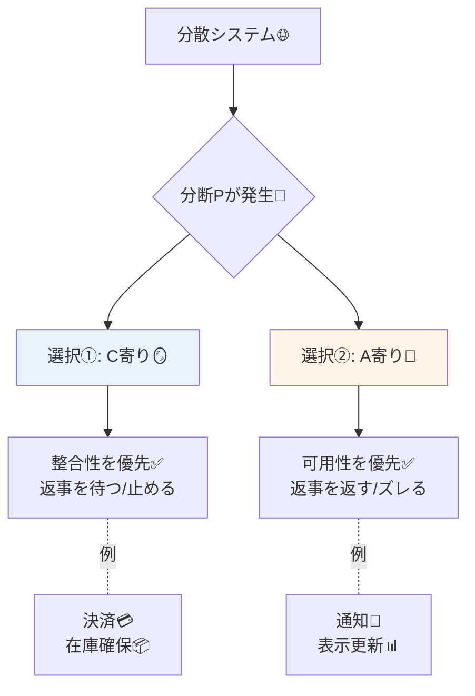

# 第05章：用語の最低限（C/A/P）📘🧩

## この章でわかるようになること🎯✨

* **C（Consistency：整合性）**＝「どこで見ても同じ」に近い感覚🪞✅
* **A（Availability：可用性）**＝「返事が返ってくる・止まりにくい」感覚🚪💨
* **P（Partition：分断）**＝「ネットワークが切れて、会話できない」感覚🧱📡
* そして…**“この場面はC寄り？A寄り？”を口で言える**ようになる🗣️✨

---

## 5-1. まずは題材でイメージしよ☕📱（CampusCafe）

学食モバイルオーダー *CampusCafe* で、ありがちな流れはこんな感じ👇

1. 注文する🍩 → 2) 在庫を減らす📦 → 3) 決済する💳 → 4) 通知する🔔

ここで大事なのは、**全部が同じ強さで「正しく」なくてもいい**ってこと😊
でも、**間違えると困るところ**もあるよね…！💦

---

## 5-2. C（整合性）ってなに？🪞✅

**ひとことで：**「どこから見ても、同じ内容に見える」感じ✨

CampusCafeで例えると👇

* 注文した直後に、**注文履歴にちゃんと出る**🧾✅
* 在庫が「残り1」なら、誰が見ても「残り1」っぽい📦👀
* 決済が成功したなら、**“成功”が一貫している**💳✅

🍀ポイント

* Cが強いほど「安心」だけど、**その分“待つ”や“止まる”が増えがち**になりやすい（この“なりやすい”は、次章で理由が腹落ちするよ）🙂

---

## 5.3 イメージで覚えよう：鏡・扉・壁 🪞🚪🧱


**ひとことで：**「お願いしたら、とにかく返事が返ってくる」感じ✨

CampusCafeで例えると👇

* 在庫サービスが一瞬不調でも、注文画面は**“受付中”って返してくれる**📩✨
* 通知サービスが不調でも、アプリ自体は落ちずに**あとで通知する**🔔🕐
* 混んでても、**とりあえず操作は進められる**😇📱

🍀ポイント

* Aが強いと「止まりにくくて嬉しい」けど、**返事が“仮”になる**ことがある（例：あとで在庫不足が判明😵‍💫）

---

## 5-4. P（分断）ってなに？🧱📡

**ひとことで：**「ネットワークが切れて、別々の島になる」感じ🏝️🏝️

CampusCafeでよくある分断のイメージ👇

* レジ端末🧾 と キッチン端末👩‍🍳 が Wi-Fi 不調でつながらない📶💥
* アプリ📱 と サーバー🖥️ の間が切れる
* サーバー同士（注文DBと在庫DB）が会話できない🧱

🍀ポイント

* 分断は「たまに起きる事故」じゃなくて、**分散があるなら“起きる前提”で考える**のが現実的🙂（ここがCAPの入り口！）

---

## 5-5. 覚え方（超シンプル暗記）🧠✨



* **C：Mirror（鏡）**🪞「どこ見ても同じ」
* **A：Door（ドア）**🚪「いつでも開いてる＝返事がある」
* **P：Wall（壁）**🧱「壁ができて会話できない」

---

## 5-6. ミニ演習①：Cが欲しい？Aが欲しい？を“口で言う”🗣️✨

次の機能、直感でいいから **「C寄り」or「A寄り」** を言ってみてね👇（理由も1行！）

1. **決済（支払い）**💳
2. **在庫の“確保”**📦（注文を受けた瞬間に確保したい）
3. **在庫の“表示”**👀（一覧に残り数を見せるだけ）
4. **通知（注文できたよ！）**🔔
5. **注文履歴の表示**🧾

✅ ありがちな答え（例）

* 決済：**C寄り**（成功/失敗がブレると地獄😇）
* 在庫の確保：**C寄り**（二重に確保したら事故💥）
* 在庫の表示：**A寄り**（多少古くても“買える/買えない”は次の画面で確定でもいい）
* 通知：**A寄り**（多少遅れても致命傷じゃないことが多い）
* 注文履歴：ケース次第（**自分の注文だけはすぐ見たい**ならC寄りの気持ちが強くなる）🙂

---

## 5-7. ミニ演習②：超ミニC#デモで「ズレ」を見る👀🧪

分断が起きると、**同じ“在庫”でもA側とB側でズレる**のを体験するミニプログラムだよ📦🧱
（わざと単純化してるから安心してね😊）

### 手順🛠️

1. コンソール作成

```bash
dotnet new console -n CapTermsDemo
cd CapTermsDemo
```

2. `Program.cs` を置き換え

```csharp
using System;

var nodeA = new Node("A", stock: 3);
var nodeB = new Node("B", stock: 3);

var partitioned = false;

Console.WriteLine("CapTermsDemo 🧪");
Console.WriteLine("o: order on A   r: replicate A->B   p: toggle partition   s: show   q: quit");

while (true)
{
    Console.Write("\n> ");
    var key = Console.ReadKey().KeyChar;
    Console.WriteLine();

    if (key == 'q') break;

    switch (key)
    {
        case 'o':
            // Aは「可用性」寄りに、まず注文を受けちゃう（在庫がズレる可能性あり）
            var ok = nodeA.TryPlaceOrder();
            Console.WriteLine(ok
                ? "A: order accepted ✅ (stock decremented)"
                : "A: order rejected ❌ (out of stock)");
            break;

        case 'p':
            partitioned = !partitioned;
            Console.WriteLine(partitioned
                ? "Partition ON 🧱📡 (A and B can't talk)"
                : "Partition OFF ✅📡 (A and B can talk)");
            break;

        case 'r':
            if (partitioned)
            {
                Console.WriteLine("Replicate failed 😵‍💫 (partition)");
            }
            else
            {
                nodeB.Stock = nodeA.Stock; // 超ざっくり同期（Cっぽさの回復）
                Console.WriteLine("Replicated A -> B ✅ (B now matches A)");
            }
            break;

        case 's':
            Console.WriteLine($"A stock = {nodeA.Stock}");
            Console.WriteLine($"B stock = {nodeB.Stock}");
            Console.WriteLine(partitioned
                ? "Now: A is available, but consistency can drift 🌀"
                : "Now: A and B can be consistent (if replicated) 🪞");
            break;

        default:
            Console.WriteLine("Use o/r/p/s/q 🙏");
            break;
    }
}

class Node
{
    public string Name { get; }
    public int Stock { get; set; }

    public Node(string name, int stock)
    {
        Name = name;
        Stock = stock;
    }

    public bool TryPlaceOrder()
    {
        if (Stock <= 0) return false;
        Stock -= 1;
        return true;
    }
}
```

3. 実行

```bash
dotnet run
```

### 観察ポイント👀✨

* `p` で **分断ON** 🧱 → `o` でAだけ注文 → `s` で見ると **AとBの在庫がズレる**📦🌀
* `p` で **分断OFF** ✅ → `r` で同期 → `s` で **揃う**🪞✨

ここで言えると最高👇

* 「分断中は、**A（返事をする）**を選ぶと、**C（揃ってる）**が崩れやすいかも」🗣️🧠✨

---

## 5-8. 1分チェックテスト✅📝

Q1. 「どこで見ても同じに見える」を指すのは？
A) A　B) C　C) P

Q2. 「お願いしたら返事が返ってくる」を指すのは？
A) A　B) C　C) P

Q3. 「ネットワークが切れて島が分かれる」を指すのは？
A) A　B) C　C) P

<details>
<summary>答えを見る👀</summary>

* Q1：B（C）🪞
* Q2：A（A）🚪
* Q3：C（P）🧱

</details>

---

## 5-9. AI活用（自分の言葉で説明→添削）🤖✅

そのままコピペで使えるよ✨

**プロンプト①：超やさしく言い換え**
「Consistency / Availability / Partition を、学食モバイルオーダーの例で、女子大生に伝わるように各2文で説明して。専門用語は最小で、絵文字多めで！」

**プロンプト②：自分の説明を添削**
「次の説明、わかりやすさを10点満点で採点して、どこを直すと良くなるか3つ教えて：
（ここに自分の説明を貼る）」

**プロンプト③：C寄り/A寄りの理由づけ練習**
「CampusCafeの『決済』『在庫確保』『在庫表示』『通知』を、C寄り or A寄りに分類して、ユーザー体験（不安/安心）視点で理由を一言ずつつけて。」

---

## 5-10. 最新メモ（いまの“現役ど真ん中”）🆕✨

* **.NET は .NET 10 がLTS**で、年1回（11月）メジャーリリースの流れだよ📅✨ ([Microsoft][1])
* **C# 14 が最新**で、.NET 10 でサポートされてるよ🧠✨ ([Microsoft Learn][2])
* **Visual Studio 2026**は .NET 10 を含む形で案内されてるよ🧰✨ ([Microsoft Learn][2])

---

## まとめ🌸✨

* **C＝揃ってる安心**🪞✅
* **A＝止まらない安心**🚪💨
* **P＝会話できない現実**🧱📡
* まずは「この機能は **C寄り？A寄り？**」を口で言えるようになればOKだよ😊🗣️✨

[1]: https://dotnet.microsoft.com/en-us/platform/support/policy/dotnet-core?utm_source=chatgpt.com "NET and .NET Core official support policy"
[2]: https://learn.microsoft.com/en-us/dotnet/csharp/whats-new/csharp-14?utm_source=chatgpt.com "What's new in C# 14"
