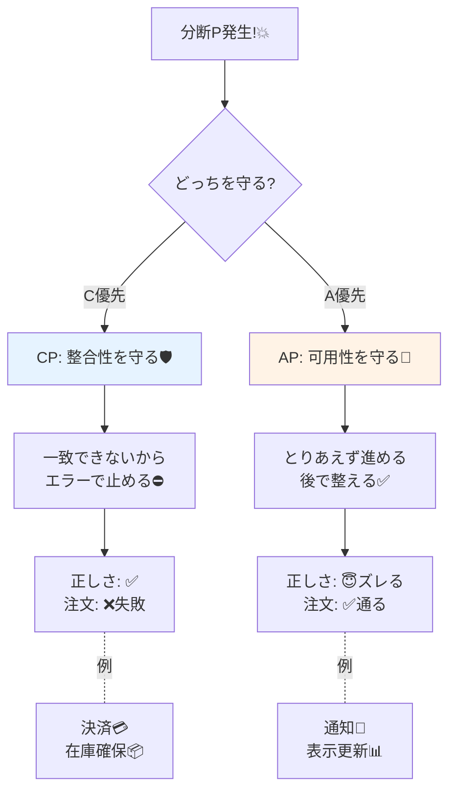

# 第06章：CAP定理の“正しい入口”（誤解しやすい所）⚠️🚪

## この章でできるようになること🎯✨

* CAPの話が **「いつでも3つのうち2つ選ぶ」じゃない**って説明できる🙆‍♀️
* **P（ネットワーク分断）が起きた瞬間**に、何が“二択”になるのか言える⚡
* CampusCafeの例で「ここは止めてでも正しさ」「ここは止めずに後で整える」を考えられる☕📱

---

## 6.1 まず結論：CAPは「Pが起きたときの話」だよ📡💥

CAP定理の超・正しい入口はこれ👇

* **ネットワークが分断（P）した瞬間**、
  **Consistency（C）** と **Availability（A）** を **同時に保証できない**（どっちかを犠牲にする）
  っていう話だよ〜！😳🧠 ([cs.princeton.edu][1])

ここ大事で、**「普段はCもAも（ある程度）両立できる」**のに、
**分断が起きた“あの瞬間”だけ**、めちゃくちゃシビアな選択を迫られる…ってイメージ🙀⚡ ([sites.cs.ucsb.edu][2])

---

## 6.2 分断起きたら「どっちを諦める？」の究極の選択😱⚖️


### 誤解①：「3つのうち2つを“常に”選ぶんでしょ？」🙅‍♀️


→ ちがうよ！
**“Pが起きたときに” CとAのどっちを守るか**の話だよ📌 ([sites.cs.ucsb.edu][2])

### 誤解②：「P（分断耐性）って選べるオプション？」🤔


→ 現実の分散（クラウド/複数ノード/別サービス/別DB）では **分断は起きる前提**になりがち。
だから実務の悩みはだいたい **“Pが起きる世界でどうする？”** に寄るよ📡😵‍💫 ([AWS ドキュメント][3])

### 誤解③：「A＝高可用性（落ちない）だよね？」😇


→ CAPのAは、かなり“数学っぽい”定義で、
**「落ちてないノードに届いたリクエストは、必ずレスポンスを返す（内容が最新とは限らない）」** って意味だよ📮✅ ([cs.princeton.edu][1])
（一般に言う“高可用性”とニュアンスがズレやすいのが罠…🪤）

### 誤解④：「DBをAP/CPってラベル貼れば終わり？」🏷️

→ それも危険⚠️
実際のシステムは設定や使い方で振る舞いが変わるし、状況によっても変わるから、**雑にラベル貼りすると誤解を増やす**って指摘があるよ〜📌 ([マーチン・クレップマンのウェブサイト][4])

---

## 6.3 用語は“最低限だけ”正しく押さえる📘✨

CAPの定義は、ざっくりこう覚えると事故りにくいよ🧯

* **C（Consistency）**：読み取りが **最新の書き込み**（またはエラー）になる、みたいな“強い一貫性”の方向（CAPで言うCは、ACIDのCと同じ意味ではないよ）🧠 ([cs.princeton.edu][1])
* **A（Availability）**：**落ちてないノード**が受け取った要求に、**必ず応答**する（ただし最新保証はしない）📮 ([cs.princeton.edu][1])
* **P（Partition tolerance）**：ノード間の通信が **落ちる/遅れる/届かない** みたいな分断が起きても、システムとして動き続ける前提📡🧱 ([ウィキペディア][5])

---

## 6.4 図で体感：2サーバ＋1データ（この章の主役）🖥️🖥️📦


### 状況セット🎬

CampusCafeの「在庫数」を、2台のサーバで持ってるとするよ👇

* サーバA：Stock = 5
* サーバB：Stock = 5

普段は同期できるから、だいたい一致してる😊✨

### でも…分断（P）が発生！💥📡

AとBが通信できなくなった！（Wi-Fi死んだ/ルータ不調/クラウド区間で分断…）😵‍💫

```text
   (通信OK)                 (分断中P!)
[ Server A ]  <------->  [ Server B ]      →   [ Server A ]   X   [ Server B ]
 Stock=5                  Stock=5               Stock=5            Stock=5
```

### ここで「在庫を1減らす」要求が来たら？🥐📉

#### 選択肢①：Cを守る（CPっぽい判断）🛡️

* Aが「在庫4にしたい」
* でもBに伝わらない（分断）
* **じゃあ“確実に一致させられないからエラー”**にする

➡️ **正しさは守れる**けど、**注文が失敗（Aを落とす）**になりがち😢 ([cs.princeton.edu][1])

#### 選択肢②：Aを守る（APっぽい判断）🚀




* Aはとりあえず「在庫4」にする
* Bは分断中だから「在庫5」のまま
* あとで同期して整える（最終的に辻褄合わせ）

➡️ **注文は通る**けど、**一時的にズレる（Cを落とす）**😇 ([cs.princeton.edu][1])

**はい！ここがCAPの核心だよ〜！**💡✨
Pが起きたとき、**CかAか、どっちを犠牲にするか**を迫られるの😳 ([sites.cs.ucsb.edu][2])

---

## 6.5 CampusCafeで考える：どこが“止めていい”？どこが“止めたくない”？☕📱💭

CAPは「DBの種類当てクイズ」じゃなくて、**機能ごとの仕様（UX）で判断**するのが大事〜！🎨✨ ([マーチン・クレップマンのウェブサイト][4])

### 例：CampusCafeのそれっぽい判断🍰

* 💳 **決済の確定**：ズレると困る → 分断中はエラーでもいい（C寄りになりがち）
* 📦 **在庫の“確保”**：二重確保は地獄 → C寄りに倒したくなりがち
* 🔔 **通知（注文入りました！）**：少し遅れてもOK → A寄りに倒しやすい

このへんの「肌感覚」が次章（CA/CP/APの比較）に直結するよ〜🧠✨

---

## 6.6 ミニ演習①：手書きで説明チャレンジ🖊️🗒️✨

### やること（5分）⏱️

ノートにこれを描いてね👇

1. 四角を2つ（Server A / Server B）
2. 間に線（通信）
3. 線に「X」をつけて分断（P）
4. 片方だけ在庫が変わる図を描く

### 説明テンプレ（声に出すと強い）🗣️💪

* 「P（分断）が起きると、AとBが連絡できない」
* 「このとき **Cを守るなら** “一致できない操作は失敗” にする」
* 「**Aを守るなら** とにかく返事して進めるけど、一時的にズレる」

この3文が言えたら勝ち〜！🏆✨ ([cs.princeton.edu][1])

---

## 6.7 ミニ演習②：C#で“分断スイッチ”を押して体験する🎮🧪

「目で見える」と一気に腹落ちするから、超おすすめ！😆✨
（.NETは最新だと **.NET 10（LTS）** が出てるよ〜📌） ([Microsoft][6])

### ねらい🎯

* 分断ONで **CPモードは失敗（エラー）**
* 分断ONで **APモードは成功（ただしズレる）**
  を、コンソール出力で確認するよ👀✨

### サンプルコード（そのまま貼ってOK）📎

```csharp
using System.Collections.Concurrent;

enum CapMode { CP, AP }

sealed class ReplicaStore
{
    private readonly ConcurrentDictionary<string, int> _data = new();

    public int Read(string key) => _data.TryGetValue(key, out var v) ? v : 0;
    public void Write(string key, int value) => _data[key] = value;
}

sealed class Link
{
    public bool IsPartitioned { get; set; }
}

static class Replication
{
    // 片方向の「レプリケーション」っぽいもの（本物の分散DBじゃなく、体験用だよ🙂）
    public static bool TryReplicate(Link link, ReplicaStore from, ReplicaStore to, string key)
    {
        if (link.IsPartitioned) return false;
        to.Write(key, from.Read(key));
        return true;
    }
}

static class CapDemo
{
    public static void DecrementStock(
        CapMode mode,
        Link link,
        ReplicaStore a,
        ReplicaStore b,
        string key)
    {
        var currentA = a.Read(key);
        var next = currentA - 1;

        // Aで更新
        a.Write(key, next);

        // Bへ伝播できる？
        var replicated = Replication.TryReplicate(link, a, b, key);

        if (mode == CapMode.CP)
        {
            // CP: 一致させられないなら失敗扱い（＝Aを落とす）
            if (!replicated)
            {
                // ロールバック（説明のため簡略化）
                a.Write(key, currentA);
                throw new InvalidOperationException("CPモード：分断中は一貫性を保証できないので失敗（エラー）");
            }
        }
        else
        {
            // AP: 分断中でも成功扱い（＝Cを落とす）。後で整える前提
            // ここでは何もしない（ズレたままにする）
        }
    }
}

class Program
{
    static void Main()
    {
        const string key = "Stock:Croissant";

        var a = new ReplicaStore();
        var b = new ReplicaStore();
        var link = new Link();

        // 初期値を揃える
        a.Write(key, 5);
        b.Write(key, 5);

        Console.WriteLine($"初期: A={a.Read(key)}, B={b.Read(key)}");

        // 分断ON！
        link.IsPartitioned = true;
        Console.WriteLine("📡 分断(P) = ON");

        // 1) CPで試す
        try
        {
            CapDemo.DecrementStock(CapMode.CP, link, a, b, key);
            Console.WriteLine("CP: 成功（ありえないはず）");
        }
        catch (Exception ex)
        {
            Console.WriteLine($"CP: 失敗 👉 {ex.Message}");
        }
        Console.WriteLine($"CP後: A={a.Read(key)}, B={b.Read(key)}");

        // 2) APで試す
        CapDemo.DecrementStock(CapMode.AP, link, a, b, key);
        Console.WriteLine("AP: 成功 ✅（でもズレるよ😇）");
        Console.WriteLine($"AP後: A={a.Read(key)}, B={b.Read(key)}");

        // 分断OFF → 後で同期（整える）
        link.IsPartitioned = false;
        Console.WriteLine("📡 分断(P) = OFF（同期するよ）");
        Replication.TryReplicate(link, a, b, key);
        Console.WriteLine($"同期後: A={a.Read(key)}, B={b.Read(key)}");
    }
}
```

### 見たいポイント👀✨

* CP：分断中は **エラー**（＝Aを落とす判断）
* AP：分断中も **成功**（＝Cを落としてズレる）
* 分断OFF後に同期して **最終的に揃う**（“後で整える”の入口）

---

## 6.8 AI活用（コピペでOK）🤖📝✨

### ① 説明が言葉にならないとき🫠

* 「CAPの“Pが起きたときだけ”って感覚を、学食アプリの例で20秒で説明する台本作って」

### ② 自分の言葉が正しいか不安なとき😳

* 「この説明、CAPの定義的に変なところある？やさしく直して：
  （ここに自分の説明を貼る）」

### ③ 追加で図が欲しいとき🖼️

* 「2ノード＋分断の図をASCIIアートで3パターン作って（CP/APの違いが見えるやつ）」

---

## 6.9 理解度チェック✅🌸

Q1. CAPのトレードオフが“本気で出る”のはどんなとき？📡
Q2. CAPのAは「常に最新を返す」こと？それとも…？📮
Q3. 分断中、Cを守ると何が起きやすい？😢
Q4. 分断中、Aを守ると何が起きやすい？😇
Q5. 「2 of 3」を雑に信じると危ない理由は？🪤

（答えがスラスラ出たら、この章は合格〜！🎉）

---

## まとめ🧁✨

* CAPは **「Pが起きたとき」** に **CとAが両立できない**って話📡💥 ([cs.princeton.edu][1])
* CAPのAは、一般的な“高可用性”とズレやすい（定義に注意）📮⚠️ ([cs.princeton.edu][1])
* 「DBをAP/CPって一言で言う」のは雑になりがち。**仕様（UX）と状況**で判断するのが大事🏷️🧠 ([マーチン・クレップマンのウェブサイト][4])

[1]: https://www.cs.princeton.edu/courses/archive/spr22/cos418/papers/cap.pdf?utm_source=chatgpt.com "Brewer's Conjecture and the Feasibility of Consistent ..."
[2]: https://sites.cs.ucsb.edu/~rich/class/cs293b-cloud/papers/brewer-cap.pdf?utm_source=chatgpt.com "CAP Twelve Years Later: How the “Rules” Have Changed"
[3]: https://docs.aws.amazon.com/whitepapers/latest/availability-and-beyond-improving-resilience/cap-theorem.html?utm_source=chatgpt.com "CAP theorem - Availability and Beyond"
[4]: https://martin.kleppmann.com/2015/05/11/please-stop-calling-databases-cp-or-ap.html?utm_source=chatgpt.com "Please stop calling databases CP or AP"
[5]: https://en.wikipedia.org/wiki/CAP_theorem?utm_source=chatgpt.com "CAP theorem"
[6]: https://dotnet.microsoft.com/ja-jp/platform/support/policy/dotnet-core?utm_source=chatgpt.com ".NET および .NET Core の公式サポート ポリシー"
