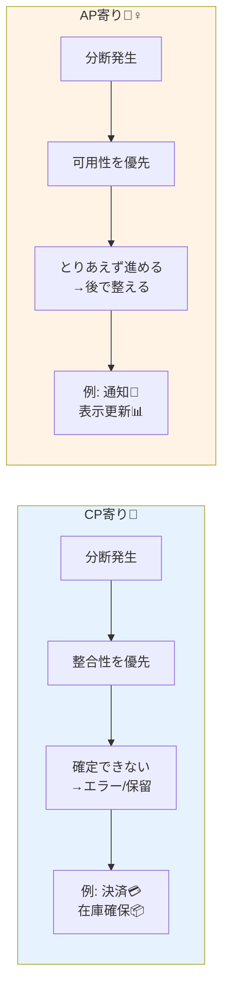

# 第07章：CA/CP/APの肌感覚（ざっくり比較）🎛️😊

## 7.0 まず超ざっくり結論✨

* **CP**＝「正しさ（最新であること）」を守るために、**止まる（エラー/待つ）**ことがある🧊🛑
* **AP**＝「止まらない（応答する）」を守るために、**ズレ（古い/未反映）**が起きても進む🏃‍♀️💨
* **CA**＝「そもそも分断（P）が起きない前提」か「1台/1拠点で完結」みたいな世界観（※“分散での保証”としては扱いづらい）🏠✅

> CAPは **“ネットワーク分断（P）が起きたときに、CかAどっちを守る？”** という話がコアだよ〜📡⚡ ([ウィキペディア][1])

---

## 7.1 CAPの「C/A/P」って、普段の言葉とズレる所があるよ⚠️🧠

ここ、誤解ポイントなので軽く押さえるね👇

* **C（Consistency）**：
  「どのノードに聞いても、**最新の書き込みが見える**（またはエラー）」みたいな強い意味合い（ACIDのCとは別物っぽい）📌
* **A（Availability）**：
  「**落ちてないノードに来た要求は必ず応答する**」という意味（“UX的に快適”とは別）📌
* **P（Partition tolerance）**：
  ノード間の通信が **落ちる/遅れる/途切れる** みたいな分断が起きても、システムとして動き続ける前提📌

この“保証”は「だいたいOK」じゃなくて、**最悪条件でも守れる？**って意味だよ〜😇 ([ウィキペディア][1])

---

## 7.2 CA/CP/AP を「学食モバイルオーダー CampusCafe」に当てはめる🍔☕📱


CampusCafe（注文・在庫・決済・通知）って、CAPの練習にちょうどいい✨
まずは“ユーザー体験”で考えると超わかりやすいよ😊

### 🧩 ざっくり分類（この章では “肌感覚” 優先）

| 機能                 | 何を守りたい？       | ざっくり寄り   | ユーザーに起きること                       |
| ------------------ | ------------- | -------- | -------------------------------- |
| 決済（支払い確定）💳        | 二重請求は絶対イヤ     | **CP寄り** | 分断時は「今は確定できない」→エラー/保留になりがち🛑     |
| 在庫の“確保”（最後の1個）📦   | 売り越しは困る       | **CP寄り** | 確保できない時は失敗で返す（または保留）🧊           |
| 在庫の“表示”（残数っぽい表示）👀 | 多少ズレてもOK      | **AP寄り** | 一瞬「残あり」に見えたのに後で「ごめん売り切れ」になることも🙏 |
| 通知（注文完了/呼び出し）🔔    | 多少遅れてもOK      | **AP寄り** | 遅延・重複があり得る（同じ通知が2回来る等）📨📨       |
| 注文履歴の表示🧾          | “自分の注文”はすぐ見たい | **状況次第** | セッション整合性みたいな設計が嬉しいこと多い✨          |

---

## 7.3 CPの“肌感覚”＝「正しさのために、止まる」🧊🛑

**CP寄り**の場面は、こういう気持ち👇

* 「間違った成功（成功と言ったのに実は未確定）より、**失敗と言う方がマシ**」
* 「確定は1回だけ！二重は絶対NG！」

### 💳 決済がCP寄りになりやすい理由

分断中に「支払い成功！」って返して、あとから整合できなかったら…

* 二重請求💥
* 返金地獄😵‍💫
* 信用が溶ける🫠

だから **“分断中は確定しない（＝止める/保留する）”** が起きやすいんだよね。




---

## 7.4 APの“肌感覚”＝「止まらないために、あとで揃える」🏃‍♀️💨🕰️

**AP寄り**の場面は、こういう気持ち👇

* 「多少ズレてもいいから、**まず動いてほしい**」
* 「反映が遅れても、UXでうまく見せればOK」

### 🔔 通知がAP寄りになりやすい理由

通知って、多少遅れても“致命傷”になりづらいことが多いよね😊

* 遅延→「少し遅れて届く」🐢
* 重複→「同じ通知が2回来る」📨📨
* 欠損→「通知来ないことがある」🕳️

この辺は **“実装で吸収（冪等性/再送/再取得）”** しやすいから、APの良さが出る✨

---

## 7.5 CAって何？「CAっぽい」と「CAPのCA」は分けて理解しよ🏠✅🧠

ネットでよく見る「CA/CP/AP」って分類、便利なんだけど…
**“CAは分散システムでは現実的に保証しにくい”** って扱いをされがち🙈

理由はシンプルで、**分散＝いつか分断（P）が起き得る**から。
CAPは「Pが起きたら C と A を同時には保証できないよ」って話なので、
「CA」は **“Pが起きない前提ならね”** というニュアンスになりやすいんだよ〜📌 ([ウィキペディア][1])

### ✅ “CAっぽい”が出る場面（実務あるある）

* 1台のDBに全部集約（実質分散してない）🗄️
* 同一拠点・同一ネットワークで、分断を“ほぼ考えない”運用📍
* 開発中/社内ツールで「まずはシンプル優先」🧪

ただし、スケールしたりクラウド跨いだりすると「やっぱPあるよね😇」ってなる！

---

## 7.6 ミニ演習①：CampusCafeを分類してみよ🏷️😊

次の4つに、**CP寄り / AP寄り** のラベルを付けてみてね👇（まず直感でOK✨）

1. 「支払い確定」💳
2. 「在庫の確保（最後の1個）」📦
3. 「在庫の表示（残り何個っぽい）」👀
4. 「呼び出し通知」🔔

### ✅ 模範っぽい答え（理由もセットで言えると強い！）

* 1. CP寄り：二重請求NG
* 2. CP寄り：売り越し痛い
* 3. AP寄り：表示は多少ズレてもUXで回収できる
* 4. AP寄り：遅れても再送・再取得で回収しやすい

---

## 7.7 ミニ演習②：分断（P）が起きたときの「画面メッセージ」を作ろう💬🌸

CP寄りの機能は、分断時に**“止める”**ことがある。
そのときの表示が雑だと、ユーザー不安MAX😱

### 例：決済（CP寄り）で“確定できない”とき

* NG例：「エラー」だけ💥
* OK例：「通信が不安定みたい。お支払いはまだ確定していません。少し待ってからもう一度試してね🙏」

“確定してない”を明言できると事故が減るよ〜✨

---

## 7.8 C#ミニ実装：CP/APの違いを“手で触る”🧪🖥️

ここでは **1つのAPIの中で「NodeA」「NodeB」2台がある体**にして、
分断フラグをON/OFFしながら「CPだとどうなる？」「APだとどうなる？」を体感するよ🎮✨

> これは学習用の超簡略シミュレーターだよ（本物の分散はもっと色々起きる😇）

### ✅ できること

* `partition=true` にすると **レプリケーションが止まる**（分断っぽい）📡✂️
* **CPモード**：分断中は書き込みを **エラーで拒否**🛑
* **APモード**：分断中でも書き込みを **受け付ける**（ただしノード間でズレる）🏃‍♀️💨

```csharp
using Microsoft.AspNetCore.Builder;
using Microsoft.AspNetCore.Http;
using Microsoft.Extensions.Hosting;

var builder = WebApplication.CreateBuilder(args);
var app = builder.Build();

// ====== 超簡易: 2ノードを模擬するインメモリ状態 ======
var nodeA = new Dictionary<string, string>();
var nodeB = new Dictionary<string, string>();

bool partition = false;     // true で分断（レプリ停止）
string mode = "CP";         // "CP" or "AP"

// レプリケーション（本当は非同期や遅延が絡むけど、ここでは単純化）
void ReplicateAToB()
{
    if (partition) return;
    nodeB.Clear();
    foreach (var kv in nodeA) nodeB[kv.Key] = kv.Value;
}

void ReplicateBToA()
{
    if (partition) return;
    nodeA.Clear();
    foreach (var kv in nodeB) nodeA[kv.Key] = kv.Value;
}

// ====== 操作用エンドポイント ======
app.MapPost("/admin/partition/{on}", (bool on) =>
{
    partition = on;
    return Results.Ok(new { partition });
});

app.MapPost("/admin/mode/{m}", (string m) =>
{
    mode = m.ToUpperInvariant() is "CP" or "AP" ? m.ToUpperInvariant() : mode;
    return Results.Ok(new { mode });
});

// ====== 書き込み（注文確定っぽい） ======
app.MapPost("/orders/{node}/{orderId}", (string node, string orderId) =>
{
    // CP: 分断中は確定させない（=エラーで止める）
    if (mode == "CP" && partition)
        return Results.Problem("分断中なので確定できません（CPモード）", statusCode: 503);

    var target = node.ToUpperInvariant() == "A" ? nodeA : nodeB;
    target[orderId] = $"CONFIRMED@{node.ToUpperInvariant()}";

    // 反対側へレプリ（分断してなければ同期される）
    if (node.ToUpperInvariant() == "A") ReplicateAToB();
    else ReplicateBToA();

    return Results.Ok(new { node = node.ToUpperInvariant(), orderId, status = target[orderId], partition, mode });
});

// ====== 読み取り（注文状態の参照） ======
app.MapGet("/orders/{node}/{orderId}", (string node, string orderId) =>
{
    var target = node.ToUpperInvariant() == "A" ? nodeA : nodeB;
    target.TryGetValue(orderId, out var value);
    return Results.Ok(new { node = node.ToUpperInvariant(), orderId, value, partition, mode });
});

app.Run();
```

### 🎮 触り方（やってみてね）

1. まず分断OFF、CPで試す

* `/admin/partition/false`
* `/admin/mode/cp`
* `POST /orders/A/123` → AにもBにも見えるはず😊

2. 分断ONにして、CPを試す

* `/admin/partition/true`
* `POST /orders/A/124` → **503で止まる**（CPは正しさ優先🛑）

3. 分断ONのまま、APを試す

* `/admin/mode/ap`
* `POST /orders/A/200` → **成功する**
* `GET /orders/B/200` → **Bには見えない（ズレる）** かも😇

4. 分断OFFに戻す

* `/admin/partition/false`
* これでレプリが再開して、**いずれ揃う**（最終的整合性の入口）🕰️✨

---

## 7.9 よくある誤解 3つだけ潰すよ🧹✨

1. **「CP/AP/CAのどれかをシステム全体で一生固定」**
   → 実務は **機能ごと**に違うことが多い（決済CP、通知AP…みたいに）😊

2. **「CAなら最強」**
   → “Pが起きないなら”ね…！分散ならPが起き得る前提で考えるのが現実的📡⚡ ([ウィキペディア][1])

3. **「CAPは普段の運用では関係ない」**
   → 分断が“レア”でも、起きた瞬間に設計の差が出る（そこで事故る）😵‍💫 ([System Design Handbook][2])

---

## 7.10 AI活用（Copilot / Codex / ChatGPT）で爆速理解🤖💨

そのまま投げてOKなプロンプト例だよ📝✨

* 「CampusCafeの決済をCP寄りにする場合、分断時のUX文言を5案。ユーザー不安を減らす口調で」💬🌸
* 「在庫表示をAP寄りにしたときに起きるズレの例を10個。対処（再取得/取り消し/保留）もセットで」📦🧠
* 「この機能はCP/APどっちが良い？判断基準をユーザー目線で箇条書きで」🧑‍🎓✨

---

## 7.11 まとめ（この章で持ち帰る感覚）🎒✨

* **CP**：正しさのために止まる🧊🛑
* **AP**：止まらないためにズレる🏃‍♀️💨
* **CA**：分断しない前提の世界観（“CAっぽい”はあるけど、分散では油断禁物）🏠⚠️
* CampusCafeなら **決済/確保はCP寄り、通知/表示はAP寄り** がまず第一感として掴みやすいよ😊🍔☕

[1]: https://en.wikipedia.org/wiki/CAP_theorem?utm_source=chatgpt.com "CAP theorem"
[2]: https://www.systemdesignhandbook.com/guides/cap-theorem-in-system-design/?utm_source=chatgpt.com "CAP Theorem in System Design: A Complete Interview ..."
