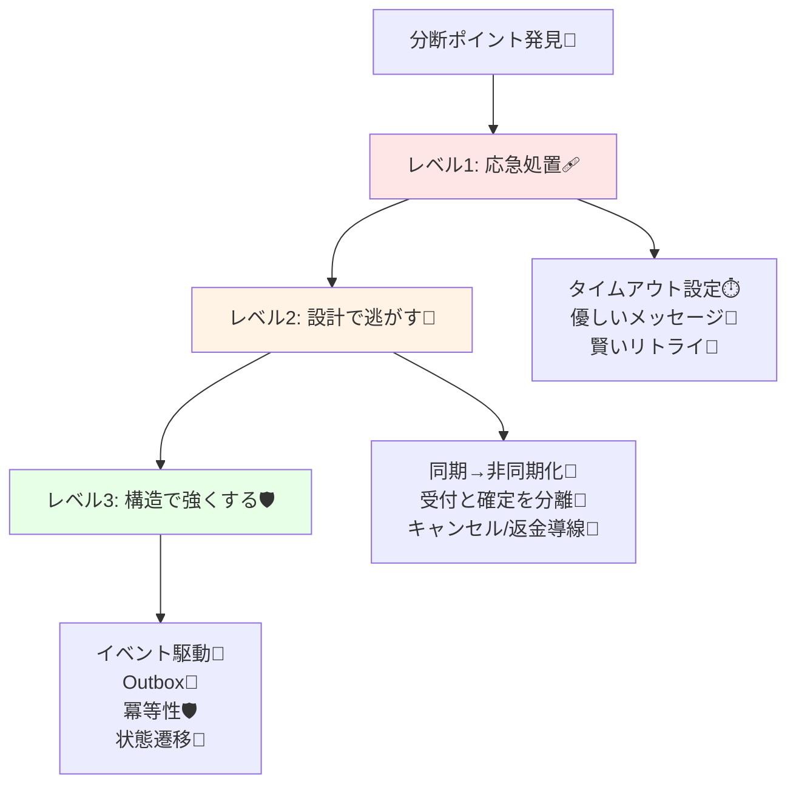

# 第08章：あなたのアプリで“P”は起きる？起きる前提？📡😳

## 8.0 今日のゴール🎯✨

この章でできるようになること👇

* 「分断（P: Partition）」が **起きる場所** を、アプリの中から見つけられる🔎🧱
* 分断ポイントごとに「まず何を決める？」が分かる（次章以降のCAP判断につながる）🧠🎛️
* CampusCafe（学食モバイルオーダー）で **“分断ポイント地図”** を完成させる🗺️☕📱

---

## 8.1 そもそも“P（分断）”って何？📡🧩


分断（Partition）って、ざっくり言うと👇
**「通信できるはずの相手と、通信できない／不安定になる」** 状態のことだよ〜😵‍💫📶
たとえば…

* つながらない（タイムアウト）⏳💥
* たまにつながる（成功と失敗が混ざる）🎲😇
* つながるけど遅い（“遅い”も実質分断の入口）🐢💦
* 片方だけ見える（A→BはOKなのに、B→AがNGとか）🔁🚫

CAPの文脈では「分断が起きたとき、**整合性（C）と可用性（A）を両方は取りきれない**」って話になるよね、ってやつ。([IBM][1])

---

## 8.2 ネットワーク分断は「どこで」起きる？🗺️⚡


超シンプルな判定ルールいくね👇

**✅ ルール：プロセスが分かれた瞬間、P候補**

* 別サービス呼び出し（HTTP/gRPC）🌐
* 別DBアクセス（別サーバ・別クラウド）🗄️
* 外部API（決済・通知・認証など）💳🔔
* メッセージキュー（送った/届いたがズレる）📨
* キャッシュ（古い値が返る）🧊
* モバイル端末（オフライン・電波弱い）📱📶

つまりね…
**「ネットワーク越しの境界」= ほぼP候補** だよ〜😊🧱

---

## 8.3 CampusCafeの“分断ポイント地図”🗺️☕


CampusCafeの流れを、境界が見える形にするとこう👇

```text
[スマホ] 
   |
   | ① 通信（電波/回線）📶  ←P候補
   v
[注文API(Order)]
   |
   | ② サービス間通信（在庫）📦 ←P候補
   v
[在庫API(Stock)]
   |
   | ③ 外部API（決済）💳 ←P候補
   v
[決済プロバイダ]
   |
   | ④ 外部API（通知）🔔 ←P候補
   v
[通知サービス]
```

さらに「データの置き場所」が増えるほど、P候補が増えるよ👇

* 注文DB🗄️
* 在庫DB🗄️
* キャッシュ🧊
* イベント送信（キュー/トピック）📨

---

## 8.4 ミニ演習①：分断ポイント洗い出し（5分）⏱️🧠


CampusCafeを例に、次のチェックを埋めてみよう✍️✨

### ✅ 分断ポイント洗い出しシート（テンプレ）

各行を「1つの境界」だと思ってね👇

* **境界名**：例）注文API → 在庫API
* **何が起きる？**：例）在庫引当ができない／遅い
* **ユーザーの困りごと**：例）注文確定が進まない、でもお腹すいた😭🍔
* **“止める”or“進める”どっち寄り？**：

  * 止める（整合性寄りっぽい）🧱
  * 進める（可用性寄りっぽい）🚀
* **許せるズレ**：例）在庫表示は多少ズレOK、在庫確保はズレNG など📦⚖️
* **最悪の事故**：例）売り切れなのに注文通る😱
* **まずの対策**：例）リトライ／後で確定／返金導線…

ここで大事なのは、まだ正解を決めなくてOK🙆‍♀️✨
**「Pが起きる場所」を“見える化”できたら勝ち**🏆🗺️

---

## 8.5 ミニ演習②：ほんとにPっぽいエラーになるの？（C#で体験）🧪💻


ここでは **「別サービス呼び出し = P候補」** を体で覚えるよ〜😊📡
（Minimal APIで2サービス作る✨）

`dotnet new webapi` は、最近のテンプレだと既定で Minimal API になりやすいよ（controllers既定がfalseなので）🧩([Microsoft Learn][2])
.NET 10 も 2025-11-11 に出てる（LTS）から、教材としてはこの世代の書き方がスッキリするよ✨([Microsoft Learn][3])

### 8.5.1 StockApi（在庫サービス）を作る📦

```powershell
mkdir CampusCafeP
cd CampusCafeP
dotnet new sln -n CampusCafeP

dotnet new webapi -n StockApi
dotnet sln add .\StockApi\StockApi.csproj
```

`StockApi/Program.cs` を超シンプルに👇

```csharp
var builder = WebApplication.CreateBuilder(args);
var app = builder.Build();

// 在庫の“引当っぽい”API
app.MapPost("/stock/reserve", async (ReserveRequest req) =>
{
    // わざと少し待って「遅い」を作る（分断っぽさUP）🐢
    await Task.Delay(TimeSpan.FromMilliseconds(800));

    // 例：商品IDが "soldout" なら売り切れ扱い
    if (req.ItemId == "soldout")
        return Results.Conflict(new { message = "在庫なし" });

    return Results.Ok(new { reserved = true, itemId = req.ItemId, qty = req.Qty });
});

app.Run("http://localhost:5101");

record ReserveRequest(string ItemId, int Qty);
```

### 8.5.2 OrderApi（注文サービス）を作る☕

```powershell
dotnet new webapi -n OrderApi
dotnet sln add .\OrderApi\OrderApi.csproj
```

`OrderApi/Program.cs`👇（StockApiを呼び出す）

```csharp
var builder = WebApplication.CreateBuilder(args);

// HttpClient（在庫サービス用）
builder.Services.AddHttpClient("stock", c =>
{
    c.BaseAddress = new Uri("http://localhost:5101");
    c.Timeout = TimeSpan.FromSeconds(1.2); // “遅い/来ない”の入口⏳
});

var app = builder.Build();

app.MapPost("/order/place", async (PlaceOrder req, IHttpClientFactory factory, CancellationToken ct) =>
{
    var client = factory.CreateClient("stock");

    try
    {
        // 在庫引当（別プロセス呼び出し＝P候補）📡
        var res = await client.PostAsJsonAsync("/stock/reserve",
            new { itemId = req.ItemId, qty = req.Qty }, ct);

        if (res.IsSuccessStatusCode)
            return Results.Ok(new { ordered = true, message = "注文OK☕✨（在庫も確保できた！）" });

        if ((int)res.StatusCode == 409)
            return Results.Conflict(new { ordered = false, message = "売り切れ🥲（在庫確保できなかった）" });

        return Results.StatusCode((int)res.StatusCode);
    }
    catch (TaskCanceledException)
    {
        // タイムアウトやキャンセルがここに来やすい⏱️
        return Results.Problem(title: "在庫サービスが遅い/応答なし🐢💦", statusCode: 504);
    }
    catch (HttpRequestException)
    {
        // 接続できない＝分断っぽい📡💥
        return Results.Problem(title: "在庫サービスに接続できない📡💥", statusCode: 503);
    }
});

app.Run("http://localhost:5100");

record PlaceOrder(string ItemId, int Qty);
```

### 8.5.3 動かしてみよう🚀

1. StockApi 起動（[http://localhost:5101](http://localhost:5101)）
2. OrderApi 起動（[http://localhost:5100](http://localhost:5100)）
3. 注文を叩く👇

```powershell
curl -X POST http://localhost:5100/order/place `
  -H "Content-Type: application/json" `
  -d "{\"itemId\":\"coffee\",\"qty\":1}"
```

✅ ここで **StockApi を止めてから** 同じ curl を叩くと…

* 503（接続不可）や 504（遅い/来ない）が出て、めっちゃPっぽい体験になるよ😳📡💥

---

## 8.6 “Pが起きる前提”に立つと、何がうれしいの？🌟

「分断なんて起きないでしょ〜」って設計すると、現実でこうなる👇

* たまの瞬断で注文が失敗→ユーザーが連打→二重注文😇📨📨
* 外部決済が遅い→画面が固まる→離脱😭💳
* 在庫がズレる→売り切れ事故😱📦

逆に「起きる前提」だと👇

* どこで“止める/進める”かが決めやすい🎛️✨
* UXの逃げ道（処理中表示・後で確定）が作れる🌸🕐
* 次の章の「最終的整合性」の話がスッと入る🕰️💡

---

## 8.7 対策案は“3段階”で考える🧯🧩


分断ポイントが見つかったら、対策は一気に完璧にしなくてOK🙆‍♀️
よくあるのはこの3段階👇

### レベル1：応急処置（UX＋タイムアウト＋再試行）🩹⏳

* タイムアウトを決める（待ちすぎない）⏱️
* 失敗メッセージを優しくする💬🌸
* リトライは“連打”じゃなく“待って賢く”🔁⏳

### レベル2：設計で逃がす（同期→非同期）📨🔀

* 「注文受付」だけ先にOKにして、在庫/決済は後で確定🧾➡️📦💳
* 失敗したら「キャンセル/返金」へ🧯💸

### レベル3：構造で強くする（仕組みを入れる）🏗️🛡️



* イベント駆動、Outbox、冪等性、状態遷移…（後半でやるやつ）📣🧾🛡️🚦

---

## 8.8 AI活用（分断ポイント → 対策案を3段階で出す🤖🧯）

そのままコピペで使えるお願い文いくね💌✨

**プロンプト例①（分断ポイント抽出）**

* CampusCafeの要件（注文→在庫→決済→通知）を貼って👇
* こう聞く：

  * 「この要件の“分断（P）候補”を、境界ごとに列挙して。各境界で起きる症状（遅延/失敗/部分成功）も書いて。」

**プロンプト例②（3段階対策）**

* 「次の分断ポイントごとに、レベル1/2/3の対策案を出して。ユーザー向け表示文言も1つ添えて。」

**プロンプト例③（事故の想像）**

* 「この分断ポイントが起きたときの“最悪の事故”を5個。確率が高い順に。」😱📋

---

## 8.9 章末ミニテスト（5問）📝✨

1. 「別サービス呼び出し」がP候補な理由を一言で言うと？📡
2. “遅い”が分断の入口になるのはなぜ？🐢
3. CampusCafeで外部依存になりやすいのはどこ？（2つ）💳🔔
4. 分断ポイントを洗い出すとき、最初に書くべきなのは「対策」？それとも「境界」？🧱
5. 対策3段階のレベル2は、だいたい何をする？📨🔀

---

## 8.10 今日のまとめ📌💖

* **ネットワーク越しの境界＝P候補**📡🧱
* まずは「分断ポイント地図」を作るのが最強🗺️✨
* 分断が起きたときの 503/504 みたいな症状を、C#で体験すると一気に腑に落ちる😳💥
* 対策は **レベル1→2→3** で段階的に強くすればOK🧯🌱🌳

（次の章から、いよいよ「最終的整合性」＝“揃うまでの時間も仕様”の話に入っていくよ〜🕰️✨）

[1]: https://www.ibm.com/think/topics/cap-theorem?utm_source=chatgpt.com "What Is the CAP Theorem? | IBM"
[2]: https://learn.microsoft.com/en-us/dotnet/core/tools/dotnet-new-sdk-templates?utm_source=chatgpt.com "NET default templates for 'dotnet new' - .NET CLI"
[3]: https://learn.microsoft.com/ja-jp/lifecycle/products/microsoft-net-and-net-core?utm_source=chatgpt.com "Microsoft .NET および .NET Core - Microsoft Lifecycle"
