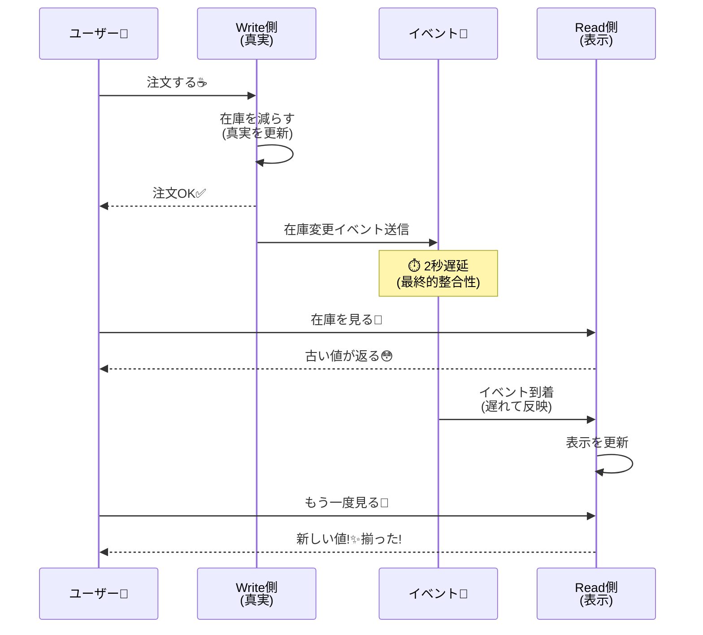

# 第09章：最終的整合性って何？（まずイメージ）🕰️✨

## この章でできるようになること🎯✨

* 「今ズレててもOK / ダメ」を、**ユーザー体験（UX）**で判断できるようになる😊📱
* 「いずれ揃う」を、ふわっとじゃなく **“何秒までOK？”** みたいに **仕様に落とせる** ようになる📝⏱️
* “ズレる世界”を、ミニアプリで **体験して納得** できるようになる☕🧪

---

## 9-1. 「最終的整合性」って、いちばん短い言い方だと？🧠💡


**最終的整合性（Eventual Consistency）**は、

✅ **今はズレてても、時間がたてば揃う**
✅ ただし **揃うまでの時間も仕様（大事！）**

っていう考え方だよ〜🕰️✨

たとえば「別の場所にも同じデータをコピーして表示する」みたいなとき、コピーが届くまでの間はズレが起こりがち😳📡

---

## 9-2. まずは超身近な例で“ズレ許容”を感じる👍📦


### 例①：いいね数👍✨（ズレてもだいたい困らない）

* 投稿に「いいね」した直後、別端末では **1〜数秒遅れて反映**でもたぶん平気😊
* 大事なのは「押したのに消えた？」って不安にさせないこと（表示の工夫が勝ち）🎨💬

### 例②：在庫数📦😳（ズレると困ることがある）

* 表示の在庫が「残り1」なのに、裏ではもう売り切れ…とかあるある💦
* 特に **“確保”**（買える権利を押さえる）部分は、ズレるとトラブルになりやすい⚠️

ここがポイント👇
**「表示（見せ方）」はズレOKでも、 「確保（買える保証）」はズレNGになりやすい** 📦🔒

---

## 9-3. “揃うまでの時間”を仕様にするコツ⏱️📝✨


「最終的に揃うからOK〜」って言い方だけだと、実装も運用も事故りやすい😵‍💫💥
だから、次の3点を決めると一気に現実的になるよ👇

### ✅（1）どれくらい古いのまで許す？（許容遅延）🕰️

* 例：いいね数 → **最大 5秒遅れまでOK** 👍
* 例：在庫表示 → **最大 1秒**、ただし最終判断は“確保API”が持つ📦

### ✅（2）ズレてる間、画面はどう見せる？🎨

* 「反映中…」の表示を出す⏳
* 「最新に更新」ボタンを置く🔄
* 「確定は注文完了画面で」みたいに、確定地点を明確にする✅

### ✅（3）ズレが長引いたら、どうする？🧯

* 10秒超えたら「再取得」促す
* 裏で再同期する
* “在庫は確保できませんでした”を丁寧に出す（メンタル大事🥺💬）

---

## 9-4. CampusCafeで考える☕📱「ズレOK / ズレNG」仕分け練習🏷️✨

CampusCafe（学食モバイルオーダー）だと、ざっくりこんな感じになりやすいよ👇

* ✅ **ズレてもOK寄り（最終的整合性で勝ちやすい）**

  * おすすめメニュー一覧
  * 混雑度（だいたいでOK）
  * 通知の既読/未読（多少ズレても致命傷になりにくい）🔔

* ⚠️ **ズレると困りやすい（強めの整合性が欲しい寄り）**

  * 「在庫の確保」📦🔒
  * 決済の二重請求💳💥
  * 注文確定の状態（注文できてる？できてない？）🧾😳

この章では、まず **“ズレる表示”を体験**して、体に入れるよ〜🧪✨

---

# 9-5. ミニ実験🧪：「表示用の在庫」が遅れて更新される世界を作る📦🐢


ここからは、最終的整合性を **わざと起こす** ミニAPIを作るよ😊
イメージはこんな感じ👇

```text
[Write側(真実)]  ---イベント--->  [Read側(表示)]   （遅れて追いつく🐢）
  在庫を減らす        📩               在庫表示を更新
```

* **Write側**：注文時に在庫を減らす（真実）
* **Read側**：画面表示用の在庫（遅れて反映）
* **イベント**：Write→Readに「在庫減ったよ！」を投げる📨
* **遅延**：わざと 2秒遅らせる（ズレが見える！）⏱️



この構成は、**イベント駆動 + 投影（Projection）**の超ミニ版だよ📣🧩
（背景で動く処理は Hosted Service でよく作るよ〜）([Microsoft Learn][1])

---

## 9-5-1. 最小API（Minimal API）でいくよ🚀

Minimal API は、サクッと試作に向いてる😊✨ ([Microsoft Learn][2])

### フォルダ作成 & テンプレ作成📦

（ターミナルでOK）

```powershell
dotnet new web -n CampusCafe.EC
cd CampusCafe.EC
```

---

## 9-5-2. Program.cs（コピペOK）📄✨

ポイントは👇

* `Channel` でイベントキューを作る📨
* `BackgroundService` でRead側を遅れて更新する🐢
* GETで「古い値が返る」瞬間を見せる👀

```csharp
using System.Collections.Concurrent;
using System.Threading.Channels;
using Microsoft.AspNetCore.Mvc;
using Microsoft.Extensions.Primitives;

var builder = WebApplication.CreateBuilder(args);

// ====== データ置き場（超簡易）======
// Write側（真実）
var writeInventory = new ConcurrentDictionary<string, int>(
    StringComparer.OrdinalIgnoreCase);

// Read側（表示用：遅れて追いつく）
var readInventory = new ConcurrentDictionary<string, int>(
    StringComparer.OrdinalIgnoreCase);

// 初期在庫（例）
writeInventory["cake"] = 5;
writeInventory["coffee"] = 10;

// 最初はRead側も同じにしておく
foreach (var kv in writeInventory)
    readInventory[kv.Key] = kv.Value;

// ====== イベントキュー ======
var channel = Channel.CreateUnbounded<InventoryChanged>();

builder.Services.AddSingleton(channel);
builder.Services.AddSingleton(writeInventory);
builder.Services.AddSingleton(readInventory);
builder.Services.AddHostedService<InventoryProjectionWorker>(); // 背景でRead側を更新🐢

var app = builder.Build();

// --- 在庫表示（Read側：遅れて追いつく） ---
app.MapGet("/inventory/{itemId}", (
    string itemId,
    [FromQuery] bool fresh, // fresh=trueならWrite側（真実）を読む
    ConcurrentDictionary<string, int> write,
    ConcurrentDictionary<string, int> read,
    HttpResponse response) =>
{
    var src = fresh ? write : read;
    if (!src.TryGetValue(itemId, out var qty))
        return Results.NotFound(new { itemId, message = "商品が見つからないよ🥺" });

    response.Headers["X-Inventory-Source"] = fresh ? "WRITE" : "READ";
    return Results.Ok(new { itemId, qty });
});

// --- 注文（Write側で在庫を減らす → イベントでRead側が遅れて更新） ---
app.MapPost("/orders", async (
    PlaceOrderRequest req,
    HttpRequest httpRequest,
    ConcurrentDictionary<string, int> write,
    Channel<InventoryChanged> ch) =>
{
    // ここでは「在庫が足りるか」をWrite側でチェック（真実で判断）
    if (!write.TryGetValue(req.ItemId, out var current))
        return Results.NotFound(new { message = "その商品ないよ🥺" });

    if (current < req.Qty)
        return Results.Conflict(new { message = "在庫が足りないよ💦（確保できなかった）" });

    // 在庫を減らす（真実）
    write[req.ItemId] = current - req.Qty;

    // Read側へ反映するためのイベントを投げる（遅れて届く想定）
    var ev = new InventoryChanged(
        ItemId: req.ItemId,
        NewQty: write[req.ItemId],
        OccurredAtUtc: DateTimeOffset.UtcNow);

    await ch.Writer.WriteAsync(ev);

    // 返す（注文IDは適当なGUIDでOK）
    return Results.Accepted($"/orders/{Guid.NewGuid()}", new
    {
        message = "注文うけたよ☕✨（在庫表示は少し遅れて更新されるよ）",
        itemId = req.ItemId,
        orderedQty = req.Qty,
        writeQtyNow = write[req.ItemId]
    });
});

app.Run();

record PlaceOrderRequest(string ItemId, int Qty);

record InventoryChanged(string ItemId, int NewQty, DateTimeOffset OccurredAtUtc);

class InventoryProjectionWorker : BackgroundService
{
    private readonly Channel<InventoryChanged> _ch;
    private readonly ConcurrentDictionary<string, int> _read;
    private readonly ILogger<InventoryProjectionWorker> _logger;

    public InventoryProjectionWorker(
        Channel<InventoryChanged> ch,
        ConcurrentDictionary<string, int> read,
        ILogger<InventoryProjectionWorker> logger)
    {
        _ch = ch;
        _read = read;
        _logger = logger;
    }

    protected override async Task ExecuteAsync(CancellationToken stoppingToken)
    {
        await foreach (var ev in _ch.Reader.ReadAllAsync(stoppingToken))
        {
            // ★わざと遅らせる：ここが「最終的整合性」を体験するポイント🐢
            await Task.Delay(TimeSpan.FromSeconds(2), stoppingToken);

            _read[ev.ItemId] = ev.NewQty;

            var lagMs = (DateTimeOffset.UtcNow - ev.OccurredAtUtc).TotalMilliseconds;
            _logger.LogInformation("Projection applied: {ItemId} -> {Qty} (lag {LagMs}ms)",
                ev.ItemId, ev.NewQty, (int)lagMs);
        }
    }
}
```

---

## 9-5-3. 動かして観察👀✨

起動👇

```powershell
dotnet run
```

### 9.1 結果整合性を直感で理解する🌟⏱️


### ① まず在庫を見る📦

```powershell
curl http://localhost:5000/inventory/cake
```

### ② 注文する☕

```powershell
curl -X POST http://localhost:5000/orders `
  -H "Content-Type: application/json" `
  -d "{""itemId"":""cake"",""qty"":1}"
```

### ③ すぐ在庫を見る（Read側なので“古い”かも）🐢

```powershell
curl http://localhost:5000/inventory/cake
```

### ④ 2秒くらい待って、もう一回見る（追いつく！）⏱️✨

```powershell
curl http://localhost:5000/inventory/cake
```

### ⑤ 「fresh=true」で真実を見にいく🔎

```powershell
curl "http://localhost:5000/inventory/cake?fresh=true"
```

レスポンスのヘッダ `X-Inventory-Source` が `READ` / `WRITE` で切り替わるよ😊✨
「同じ在庫なのに、見る場所でズレる」を体験できたら勝ち〜！🏆🎉

---

# 9-6. ここが超大事💥「ズレてもOK」にする条件の作り方📝✨


最終的整合性を採用するなら、最低これを決めよう👇

## ✅ ルールA：確定はどこで行う？🔒

* 表示はズレてもOK
* でも **注文確定（在庫の確保）**はWrite側（真実）で判断する📦✅

→ さっきの `/orders` がそれ！

## ✅ ルールB：ユーザーにどう伝える？💬🌸

例：在庫表示が遅れる可能性があるなら、

* 「在庫は目安です」だけだと不安😵‍💫
* 「注文確定時に在庫を確保します」だと納得しやすい😊✅

---

# 9-7. ミニ演習①✍️「遅延が許される条件」を文章にする🤖📄✨

次の2つを、**“仕様っぽい文章”**にしてみよう📝

## お題1：いいね数👍

* どれくらい遅れてOK？（例：5秒）
* その間、どう見せる？（例：押した本人だけ先に+1見せる など）✨

## お題2：在庫数📦

* どこまでズレOK？（例：表示は最大2秒、確定は必ずWriteで）
* 売り切れだったらどう案内する？（例：代替メニュー提案🍰➡️🥪）

---

# 9-8. 🤖AI活用（Copilot / Codex向け）プロンプト例✨

そのまま投げてOKだよ〜💬

## プロンプトA：遅延OK条件の文章化📝

```text
CampusCafeの「在庫表示」は最終的整合性で遅延が起きます。
ユーザー体験を悪化させないための「遅延が許される条件」を、
(1)許容遅延、(2)画面表示、(3)遅延が長引いた時の対応
の3点で、仕様書っぽく短く書いて。
```

## プロンプトB：不安にさせないUI文言案🎨💬

```text
在庫の反映が最大2秒遅れる可能性がある前提で、
ユーザーを不安にさせない「表示文言」を10個作って。
短めで、やさしい口調で。
```

## プロンプトC：この章のミニAPIの改善点チェック🔍

```text
この最終的整合性デモ（Write/Read + Channel + BackgroundService）の設計で、
初心者が誤解しやすい点、事故りやすい点、改善案を箇条書きで出して。
```

---

# 9-9. よくある勘違い3つ⚠️😵‍💫（ここでつまずきやすい！）

## 勘違い①：「最終的整合性＝いつか揃う（いつかは知らん）」🫠

→ **“何秒までOK”** を決めないと、炎上しやすい🔥

## 勘違い②：「表示が合ってればOK」📦👀

→ 表示が合ってても、裏で二重処理や取りこぼしがあると事故る💥
（この先の章で「重複」「遅延」「順不同」やるよ📨🔀🐢）

## 勘違い③：「fresh=trueで真実読めば全部解決」🔎

→ 真実を読むたびに重くなると、今度は遅くて使いにくい😵‍💫
“いつ真実を読むか”も設計だよ〜🎛️✨

---

# 9-10. 理解チェック✅✨（サクッと）

1. 最終的整合性は「ズレてもOK」だけど、何を仕様として決めるべき？🕰️
2. CampusCafeで「表示はズレOKだけど、確定はズレNG」になりやすいのはどこ？📦
3. Read側が遅れて更新されると、ユーザーが不安になる瞬間は？💬
4. その不安を減らすUIの工夫を1つ書いてみて🎨
5. `fresh=true` みたいに真実を読むのは、どんな時が向いてる？🔎

---

## この章のまとめ🎀✨

* 最終的整合性は **“今ズレても、いずれ揃う”** 🕰️
* でも本当に大事なのは **“揃うまでの時間と見せ方を仕様にすること”** 📝🎨
* ミニAPIで「Readが遅れる」体験ができたら、もう肌感覚はできてきてるよ😊🧪✨

（参考：C# 14 は .NET 10 でサポートされるよ）([Microsoft Learn][3])

[1]: https://learn.microsoft.com/en-us/aspnet/core/fundamentals/host/hosted-services?view=aspnetcore-10.0&utm_source=chatgpt.com "Background tasks with hosted services in ASP.NET Core"
[2]: https://learn.microsoft.com/en-us/aspnet/core/fundamentals/minimal-apis?view=aspnetcore-10.0&utm_source=chatgpt.com "Minimal APIs quick reference"
[3]: https://learn.microsoft.com/ja-jp/dotnet/csharp/whats-new/csharp-14?utm_source=chatgpt.com "C# 14 の新機能"
