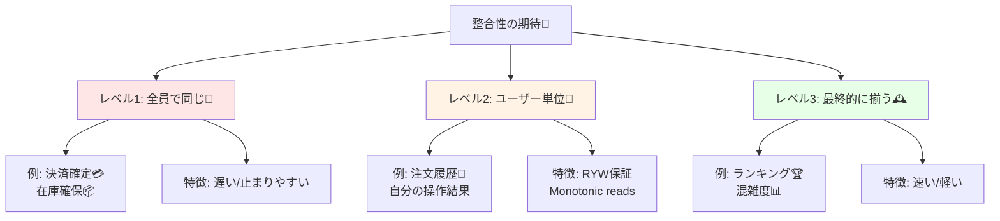

# 第10章：整合性の期待は1種類じゃない（やさしめ）🌈📘

## この章でわかること🎯✨

* 「整合性＝強い/弱い」の二択じゃなくて、**どの“期待”を守るか**で考える感覚🧠✨
* 特に大事な「**ユーザー単位の整合性**（自分の操作がちゃんと見える！）」の作り方👀✅
* CampusCafe（学食モバイルオーダー）を例に、**画面ごとに必要な整合性を決める**練習☕📱

---

## 10.1 「整合性」って、誰にとっての“正しさ”？🤔💭

同じデータでも、**見る人・見るタイミング**で「正しさ」の期待が変わるよ〜！

たとえば CampusCafe で…

* あなたが注文した直後に「注文履歴」を見た
  → **“さっきの注文、見えないんだけど！？😱”** はダメ
* 別の人が「人気メニューランキング」を見た
  → 数分ズレてても、たいてい **“まあいいか😊”** で済むことが多い

つまり、整合性は **画面や体験（UX）ごとに必要度が違う**んだよね🌸✨

---

## 10.2 整合性の“期待”はグラデーション🎨🧩

ざっくり3段階で捉えるとわかりやすいよ👇

1. **全員で同じに見える（強め）** 🧱
2. **“自分に関しては”ちゃんと揃う（ユーザー単位）** 👤✅
3. **だいたい揃えばOK（弱め）** 🕰️



この章は②の「ユーザー単位」が主役！🎉

---

## 10.3 「ユーザー単位の整合性」って何？👤✨

ポイントはこれ👇

> **自分がやった操作は、次の自分の閲覧で必ず見える**
> （“自分だけは裏切らない”整合性💗）

分散DBやクラウドDBでも、この発想はすごく大事。
たとえば Azure Cosmos DB の **Session consistency** は、同一セッション内で「read-your-writes（自分の書き込みが読める）」や「monotonic reads（読んだのが古く戻らない）」などを保証する、って説明されてるよ📘✨ ([Microsoft Learn][1])

---

## 10.4 覚えておくと強い！4つの“セッション保証”🧠🔑

難しい理論より、「ユーザー体験で困るやつ」を防ぐ道具だと思ってOK😊✨

### ① Read-your-writes（自分の書いたものが見える）✍️➡️👀

* 例：注文ボタン押した直後、注文履歴に出ないのはイヤ😵‍💫
* 守りたいUX：**「操作したのに反映されない」不安を消す**💕

### ② Monotonic reads（読んだものが“古く戻らない”）📈🔁

* 例：注文履歴で
  「注文あり」→ 次の更新で「注文なし」に戻る（え？消えた！？）はイヤ😱

### ③ Monotonic writes（同じ人の書き込み順が崩れない）🧾➡️🧾

* 例：同じ人が「注文→キャンセル」したのに、処理順が逆になって地獄💥

### ④ Writes-follow-reads（読んだ内容より古い状態に書かない）📖➡️✍️

* 例：在庫を見て「残り1」と思って注文したのに、古い状態に基づいた処理が混ざる…など😵

この4つは “セッション（ユーザー単位）” の整合性でよく出てくる考え方だよ📘✨ ([ウィキペディア][2])

---

## 10.5 CampusCafe：画面ごとに「守りたい整合性」を決めよう🖥️✅

同じアプリでも画面ごとに違うよ〜！🌈

### ① 注文完了画面（注文直後）🧾✨

* 必須：**Read-your-writes** ✅
  「注文できた」って出たなら、履歴にも出てほしい！

### ② 注文履歴（自分の履歴）📜👤

* ほぼ必須：**Read-your-writes / Monotonic reads** ✅✅
  見えたり消えたりは不安すぎる…😢

### ③ 在庫表示（メニュー一覧の残数）📦🍞

* ケース分けがコツ：

  * **“表示”**：少し古くてもOKなことが多い（弱め）🕰️
  * **“確保”**：ズレると困る（強め or 工夫必須）🧱⚠️
    「表示」と「確保」を同じ整合性で考えると、だいたい事故るよ〜💥

### ④ みんなのランキング（人気メニュー）🏆🍔

* だいたいでOK：最終的に合えば良い（弱め）😊

### ⑤ キッチン側ダッシュボード（調理の順番）👩‍🍳📋

* 必須になりがち：**Monotonic writes / 順序** ✅
  順番が入れ替わると現場が混乱する〜😵‍💫

---

## 10.6 実装の“考え方”：全部を強整合にしないで勝つ💡🏁

整合性を強くすると、だいたい **遅くなる / 止まりやすくなる** 方向になりがち。
だからコツは👇

* **ユーザー体験に直撃する画面だけ**「ユーザー単位の整合性」を厚くする👤✅
* それ以外は **最終的整合性で軽くする**🕰️✨

このバランス感覚が CAP の“肌感覚”に直結するよ🌍⚖️

ちなみに実在DBでも、読み取りは「強い読み/結果整合の読み」みたいに選べるものがある（例：DynamoDB の strongly consistent / eventually consistent reads）📘 ([AWS ドキュメント][3])
逆に「めっちゃ強い整合性」を提供するDBもあって、Spanner はトランザクション整合性（external consistency / strict serializability）を説明してるよ🧠✨ ([Google Cloud Documentation][4])

---

## 10.7 ミニ演習：CampusCafeの“整合性ラベル”を貼ろう🏷️✨

次の表を埋めてみてね！📝💕

| 画面/機能       | 期待する整合性（強/ユーザー単位/弱） | 欲しい保証（例：RYW/Monotonic） | 理由（ユーザーの気持ちで） |
| ----------- | ------------------- | ---------------------- | ------------- |
| 注文完了        |                     |                        |               |
| 注文履歴（自分）    |                     |                        |               |
| メニュー在庫表示    |                     |                        |               |
| 在庫確保（注文処理内） |                     |                        |               |
| 人気ランキング     |                     |                        |               |
| 調理キュー（キッチン） |                     |                        |               |

💡書き方の例（1行だけ見本）

* 注文履歴（自分）＝ユーザー単位／RYW + Monotonic reads／「反映されないと不安で連打しちゃう😢」

---

## 10.8 ちいさなC#デモ：最終的整合っぽい“ズレ”を作ってみる🧪🐢

ここでは「レプリカ反映が遅れる」っぽい状況を **わざと**作るよ！
（本物の分散DBじゃなくても、挙動のイメージが掴めればOK😊）

* `Primary`：書き込み先（最新）
* `Replica`：読み取り先（反映が遅れる）

そして「ユーザー単位の整合性」を作るために、**“自分の最新バージョン”をヘッダで渡す**作戦にするよ🔑✨
（Cosmos DB の session token みたいな発想だと思ってOK）([Microsoft Learn][1])

```csharp
using System.Collections.Concurrent;

var builder = WebApplication.CreateBuilder(args);
var app = builder.Build();

var primary = new ConcurrentDictionary<Guid, OrderRecord>();
var replica = new ConcurrentDictionary<Guid, OrderRecord>();

// ユーザーごとの「自分が最後に書いたバージョン」(超簡易)
var userLatest = new ConcurrentDictionary<string, long>();

app.MapPost("/orders", async (PlaceOrderRequest req) =>
{
    var orderId = Guid.NewGuid();
    var now = DateTimeOffset.UtcNow;

    // バージョンは適当な連番（本物はDBのLSNとかでもOK）
    var version = DateTimeOffset.UtcNow.ToUnixTimeMilliseconds();

    var record = new OrderRecord(orderId, req.UserId, req.MenuId, "Placed", now, version);
    primary[orderId] = record;

    userLatest[req.UserId] = Math.Max(userLatest.GetValueOrDefault(req.UserId), version);

    // レプリカ反映を遅らせる（= 最終的整合性の“ズレ”を再現🐢）
    _ = Task.Run(async () =>
    {
        await Task.Delay(1500);
        replica[orderId] = record;
    });

    return Results.Ok(new
    {
        orderId,
        sessionVersion = version  // クライアントはこれを覚えておく🔑
    });
});

app.MapGet("/orders/{orderId:guid}", (Guid orderId, HttpRequest http) =>
{
    // クライアントが「私はここまで見えてるはず！」という最低バージョンを送る
    var minVersionHeader = http.Headers["X-Session-Version"].ToString();
    long.TryParse(minVersionHeader, out var minVersion);

    // まずレプリカを見る（速い想定）
    if (replica.TryGetValue(orderId, out var r))
    {
        if (r.Version >= minVersion)
            return Results.Ok(new { source = "replica", order = r });

        // レプリカが古い！→ ユーザー体験を守るため primary へフォールバック✨
        if (primary.TryGetValue(orderId, out var p))
            return Results.Ok(new { source = "primary(fallback)", order = p });
    }

    // レプリカにまだない場合でも、primary にはあるかも
    if (primary.TryGetValue(orderId, out var latest))
        return Results.Ok(new { source = "primary", order = latest });

    return Results.NotFound();
});

app.Run();

record PlaceOrderRequest(string UserId, string MenuId);

record OrderRecord(
    Guid OrderId,
    string UserId,
    string MenuId,
    string Status,
    DateTimeOffset CreatedAt,
    long Version
);
```

### これで何が嬉しいの？😊💡

* レプリカが遅れてても、**注文した本人だけは「見えない😱」を回避**できる
* つまり「ユーザー単位の整合性（Read-your-writes）」をアプリ側の工夫で作れる✨

---

## 10.9 AI活用（そのままコピペOK）🤖💬✨

* 「CampusCafeの各画面について、必要な整合性（強/ユーザー単位/弱）を分類して。理由はユーザーの気持ちで書いて」
* 「注文履歴画面で“見えたり消えたり”が起きるパターンを3つ出して。防ぐ保証（RYW/Monotonic reads）もセットで」
* 「在庫の“表示”と“確保”を分けた要件文を、短くわかりやすく整えて」

---

## 10.10 理解チェック✅🧠

1. 「注文直後に履歴に出ない」がヤバいのは、どの保証が欲しいから？✍️➡️👀
2. 「見えたはずの注文が次の更新で消える」系は、どの保証で防ぎたい？📈🔁
3. 在庫の「表示」と「確保」は、同じ整合性で考えていい？📦🤔
4. “全部を強整合にする”のデメリットを1つ言える？🐢⛔
5. 「ユーザー単位の整合性」を守るために、アプリ側でできる工夫を1つ挙げてみて🔑✨

---

## まとめ🌸✨

* 整合性は **一種類じゃない**！「誰にとって」「どの画面で」必要かで決まる🌈
* まずは **ユーザー単位の整合性**（自分の操作が見える・古く戻らない）を意識すると、UXが一気に良くなる👤✅
* 次章では、この「期待」を **仕様として書く（即時必須/遅延OKを決める）** ほうに進むよ📝🎯

（参考：C#は 2025年11月に C# 14 がリリース、.NET も 2025年11月に .NET 10 がリリースされ、2026年1月時点でも最新版系として配布・更新されているよ📦✨） ([Microsoft Learn][5])

[1]: https://learn.microsoft.com/en-us/azure/cosmos-db/consistency-levels?utm_source=chatgpt.com "Consistency level choices - Azure Cosmos DB"
[2]: https://en.wikipedia.org/wiki/Consistency_model?utm_source=chatgpt.com "Consistency model"
[3]: https://docs.aws.amazon.com/amazondynamodb/latest/developerguide/HowItWorks.ReadConsistency.html?utm_source=chatgpt.com "DynamoDB read consistency"
[4]: https://docs.cloud.google.com/spanner/docs/true-time-external-consistency?utm_source=chatgpt.com "Spanner: TrueTime and external consistency"
[5]: https://learn.microsoft.com/en-us/dotnet/csharp/whats-new/csharp-version-history?utm_source=chatgpt.com "The history of C# | Microsoft Learn"
