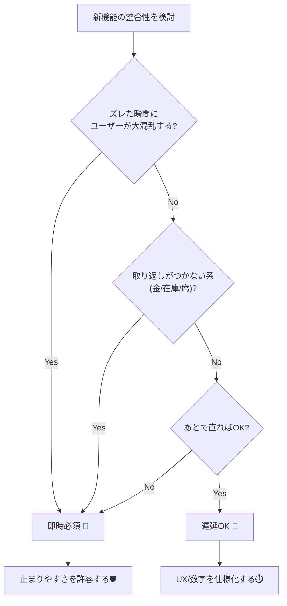

# 第11章：仕様の書き方（即時必須 / 遅延OK を決める）📝🎯

## この章でできるようになること😊✨

* 「どこは即時一致が必要？どこは遅れてOK？」を**仕様として言語化**できる📌
* 「遅延OK」を**“何秒まで・どう見せる・失敗したら？”**まで決められる⏱️💬
* その仕様を、APIや画面、運用（監視）に**つなげられる**🔗📈

---

# 11.1 CAPは“技術”じゃなく“仕様＋UX”で決まるよ🧩🌸


分散が入ると、どこかで「ズレ」が起きやすい📡💦
でも、全部を“常に即時一致”にしようとすると、今度は**止まりやすい**・**遅くなりやすい**…みたいな別の苦しさが出るよね😵‍💫

だから大事なのはこれ👇

* **即時必須（Strong寄り）**：ズレたら困るから、多少止まっても正しさ優先💎
* **遅延OK（Eventual寄り）**：ズレてもユーザー体験が壊れないなら、止まりにくさ優先🌿

ポイントは、「遅延OK」は“ゆるふわ”じゃダメで、**仕様として数字や見せ方まで決める**ことだよ📏✨

---

# 11.2 「即時必須 / 遅延OK」を決める5つの質問🎛️🤔





機能ごとに、次の5問でサクッと判定していくよ💡

1. **ズレた瞬間に、ユーザーが困る？**😣

* 例：決済が成功なのに失敗表示 → 大混乱💳💥（即時寄り）

2. **ズレても“あとで直る”ならOK？**🧹✨

* 例：通知が数秒遅れる → だいたいOK🔔🐢（遅延OK寄り）

3. **ズレると“お金・在庫・席”みたいに取り返しつかない？**💰📦

* 取り返しつかない系は基本「即時必須」寄りになりやすい⚠️

4. **ズレる間、画面に何て出せば安心？**💬🌸

* “処理中です” “後で反映されます” “更新”ボタン、みたいなUXが用意できる？🪄

5. **“何秒以内に揃う”って言える？**⏱️✅

* 遅延OKでも、「だいたいそのうち」じゃなくて
  **“収束の目標（例：3秒以内、1分以内）”**を置くのが強い💪

この「目標」は、SLO（Service Level Objective）みたいに数値で置けるよ📈
SLO/SLIは“サービス品質を数値で測る”考え方で、SLIが測定指標、SLOが目標値だよ🧠✨ ([sre.google][1])

---

# 11.3 仕様テンプレ（これを書けば迷子になりにくい）🧾🧩

機能ごとに、次のテンプレで1枚「仕様カード」を作るのがおすすめ🏷️✨

## ✅ 仕様カード（テンプレ）


* **機能名**：
* **ユーザーストーリー**：誰が何をしたい？👤🎯
* **ズレたときの困り度**：高 / 中 / 低😵‍💫
* **即時必須 or 遅延OK**：どっち？🏷️
* **許容遅延（目標）**：例）95%は3秒以内に反映、など⏱️📈
* **ズレてる間の画面**：何て表示する？（不安にさせない）💬🌸
* **失敗時の扱い**：やり直し？保留？キャンセル？🔁🧯
* **最終的に揃える方法**：再取得？非同期処理？後追い更新？🧹🔄
* **監視したい指標（SLI案）**：遅延時間、失敗率、滞留件数…📊👀 ([sre.google][1])

---

# 11.4 CampusCafeを“即時/遅延”でラベル付けしてみよう🏷️☕📱


題材（注文・在庫・決済・通知）で、ありがちな判定例を置くね😊✨
※「正解」は1つじゃないけど、**理由をUXで説明できる**のが大事だよ💬🌸

| 機能             | ラベル        | ズレるとどう困る？😣           | 許容遅延（目標）⏱️      | 画面の見せ方💬              |
| -------------- | ---------- | --------------------- | --------------- | --------------------- |
| 注文ボタン押下→受付番号発行 | **即時必須**寄り | 押したのに注文できたか不明は怖い😵‍💫 | ほぼ即時（例：数百ms〜数秒） | 「受付しました✅」＋ステータス表示     |
| 在庫の“表示”        | **遅延OK**寄り | 少し古くても大事故になりにくい📦🌿   | 例：数秒〜数十秒        | 「在庫は目安です」＋更新ボタン🔄     |
| 在庫の“確保（予約）”    | **即時必須**寄り | ダブル確保は地獄💥            | ほぼ即時            | 「確保しました✅ / できませんでした❌」 |
| 決済の確定          | **即時必須**寄り | 二重請求・未請求は致命的💳⚠️      | ほぼ即時（ただし外部次第）   | 「決済処理中…⏳」→確定したら更新     |
| 通知（注文できたよ）     | **遅延OK**寄り | 遅れても大事故じゃない🔔🐢       | 例：1分以内          | アプリ内でも確認できる導線📱       |
| 注文履歴の反映        | **遅延OK**寄り | すぐ見えなくても“処理中”なら納得✨    | 例：数秒〜数十秒        | 「反映まで少し時間がかかるよ」🌸     |
| 売上集計・ランキング     | **遅延OK**寄り | リアルタイムじゃなくてOK📊🌿     | 例：数分〜           | 「集計は遅れて反映」🧮          |

ここでのコツ👇

* 「遅延OK」にした瞬間に、**“何秒までに揃える？”**と**“揃うまで何て見せる？”**をセットで決める🎯💬
* これが決まると、CAPの判断が“雰囲気”じゃなくて仕様になるよ🧠✨

---

# 11.5 仕様をAPIの“約束（契約）”に落とす🧾🔗


「遅延OK」を採用するなら、APIや画面はこういう“約束”があると安心😊✨

## パターンA：受け付けは即時、確定はあと（王道）🏁⏳

* POST（注文）で返すのは **確定ではなく“受付”**
* 受付後、ステータスが **Pending → Confirmed/Rejected** みたいに進む🚦

例：注文受付レスポンス（イメージ）👇

```json
{
  "orderId": "ORD-20260130-000123",
  "status": "Pending",
  "message": "注文を受け付けました。確定まで少し待ってね☕⏳"
}
```

（※確定したらGETで取りに行く、通知で知らせる、など）📩🔄

## パターンB：Idempotency-Keyで“押し直し”に強くする🔑🛡️


分散では「返事が来ないから、ユーザーがもう一回押す」って普通に起きるよね📡💦
そこで **Idempotency-Key** を使うと、POSTみたいな操作でも「同じキーなら1回として扱う」設計にしやすい✨
このヘッダーは、POST/PATCHをフォールトトレラントにする目的で標準化が進んでいるよ📌 ([IETF Datatracker][2])

C#側の“受け付けイメージ”（超ざっくり）👇

```csharp
public record PlaceOrderRequest(string MenuId, int Quantity);

public record PlaceOrderResponse(string OrderId, string Status, string Message);

app.MapPost("/orders", async (HttpRequest http, PlaceOrderRequest req) =>
{
    var key = http.Headers["Idempotency-Key"].ToString();
    if (string.IsNullOrWhiteSpace(key))
        return Results.BadRequest(new { message = "Idempotency-Key が必要だよ🔑" });

    // ここで key を保存して「同じ key は同じ結果を返す」ようにする（重複防止）🛡️
    // この章では“仕様としてそう決める”のがゴールだよ📝✨

    var orderId = $"ORD-{DateTime.UtcNow:yyyyMMdd}-000123";
    return Results.Accepted($"/orders/{orderId}",
        new PlaceOrderResponse(orderId, "Pending", "注文を受け付けたよ☕⏳"));
});
```

Idempotency-Keyの考え方・用途の説明はMDNやIETFドラフトにもまとまってるよ📚✨ ([MDN ウェブドキュメント][3])

---

# 11.6 ミニ演習：CampusCafeの“仕様カード”を作ろう✍️☕✨

## STEP 1：機能を6つに切る🔪🧩

例）注文受付 / 在庫表示 / 在庫確保 / 決済 / 通知 / 注文履歴

## STEP 2：各機能にラベルを貼る🏷️

* 即時必須 or 遅延OK
* その理由を**ユーザー体験で**1〜2行で書く💬🌸

## STEP 3：遅延OKには“期限”を必ず書く⏱️

* 「何秒以内に揃う」を書けたら強い💪
* それがそのまま、整合性のSLO（目標）になっていくよ📈✨ ([sre.google][1])

---

# 11.7 AI活用（コピペで使える）🤖📝✨

## ① ラベル貼りを手伝ってもらう🏷️

```text
題材アプリ：学食モバイルオーダー CampusCafe。
機能一覧：注文受付、在庫表示、在庫確保、決済確定、通知、注文履歴。
各機能について「即時必須 / 遅延OK」を判定して、理由を“ユーザー体験”で説明して。
遅延OKのものは「許容遅延（例：95%が3秒以内など）」も提案して。
```

（SLO/SLIの考え方に沿って、数字も出してもらう感じ📈✨） ([sre.google][1])

## ② 仕様カードの穴を探してもらう🔍

```text
以下は機能ごとの仕様カード案です。
「遅延OKなのに“いつ揃うか”が書けていない」
「画面表示が不安を増やす」
「失敗時の扱いが曖昧」
などの観点で、改善点を箇条書きで指摘して。
```

---

# 11.8 仕上げチェックリスト✅✨

* [ ] 即時必須 / 遅延OK を**機能ごと**に決めた🏷️
* [ ] 遅延OKには **“何秒（何分）以内に揃う”** が書いてある⏱️
* [ ] ズレてる間の **画面表示（安心ワード）** が決まってる💬🌸
* [ ] 失敗時に「保留／再試行／キャンセル」どれか言えてる🧯🔁
* [ ] 監視したい指標（SLI）を1つ以上言えてる📊👀 ([sre.google][1])

---

# 次の章（第12章）は、この章で決めた「遅延OK」を**UXで勝てる見せ方**に変えていくよ🎨🕐✨

[1]: https://sre.google/sre-book/service-level-objectives/?utm_source=chatgpt.com "Defining slo: service level objective meaning"
[2]: https://datatracker.ietf.org/doc/draft-ietf-httpapi-idempotency-key-header/?utm_source=chatgpt.com "The Idempotency-Key HTTP Header Field - Datatracker - IETF"
[3]: https://developer.mozilla.org/en-US/docs/Web/HTTP/Reference/Headers/Idempotency-Key?utm_source=chatgpt.com "Idempotency-Key header - HTTP - MDN Web Docs"
