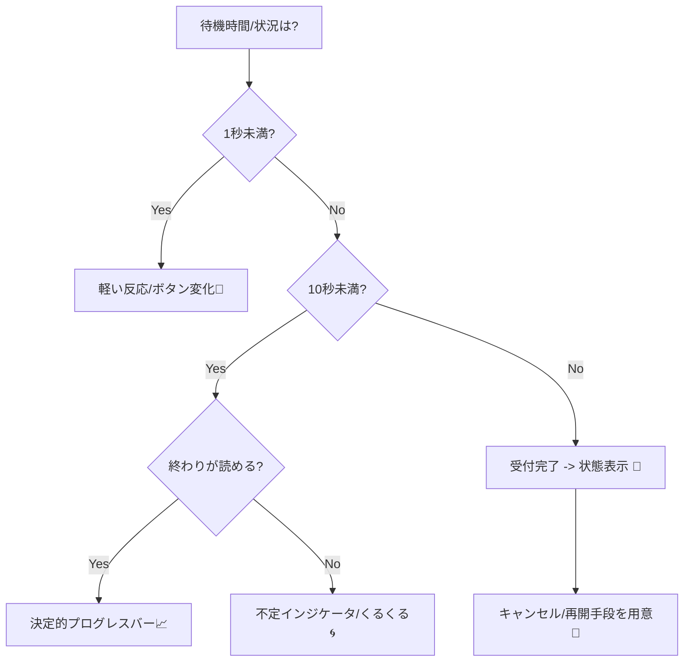

# 第12章：UXで勝つ！遅延の見せ方パターン🎨🕐

## 12.1 「遅延」はバグじゃない。UXで“勝てる差”になる🧠✨

分散システム（最終的整合性あり）では、**「反映が遅れる」**のはわりと普通に起きます📡🐢
だから大事なのは、遅延をゼロにするよりも――

* ユーザーを不安にさせない😌🌸
* “今なにが起きてるか”を伝える📣
* 取り消し・再取得などの逃げ道を用意する🧯
* 失敗しても立て直せるように見せる🔁

この章は「待たせ方」じゃなくて、**“安心させ方”の設計**です😊💕

---

## 12.2 人間の“待てる時間”ざっくり3ライン⏱️📏


UI/UXでは、体感の節目がよく3つで語られます：

* **0.1秒**：反応が“瞬時”に見える（触ったら即反応✨）
* **1秒**：ちょい遅いけど思考は途切れにくい（許容ライン🙂）
* **10秒**：注意が切れやすい（放置や離脱が増える🥺）

この時間を超えそうなら、**進捗/状態/次の行動**を出すのが基本です。 ([Nielsen Norman Group][1])

---

## 12.3 遅延の見せ方パターン：まずは“使い分け表”🗺️✨




| 状況           | 使うもの                 | ねらい              |
| ------------ | -------------------- | ---------------- |
| 0.1秒〜1秒くらい   | その場の軽い反応（ボタン押下の即変化）  | “反応してる”安心🙂      |
| 1秒〜数秒        | ローディング（リング/バー）、スケルトン | “待てば出る”安心⏳       |
| 終わりが読める      | **決定的（%が進む）**プログレス   | “あとどれくらい？”に答える📈 |
| 終わりが読めない     | **不定（くるくる）**インジケータ   | “処理中”だけ伝える🌀     |
| 最終的整合性（後で揃う） | 受付→保留→確定（状態表示）       | “いま未確定”を正直に🧾    |
| 途中で止めたい      | キャンセルボタン             | “戻れる”安心🧯        |
| 失敗しやすい       | リトライ/再取得/あとで通知       | “立て直せる”安心🔁      |

「決定的/不定」は設計の基本ルール。Material/Apple/Windowsでも同じ方向性です。 ([Material Design][2])

---

## 12.4 CampusCafeでやるなら：どこが遅れやすい？☕📱

学食モバイルオーダーは遅延ポイントが多いです🍰

* **在庫確認**：別DB/別サービスで遅れがち📦
* **決済**：外部決済APIで遅れがち💳
* **通知**：非同期で後追いになりがち🔔

だからUXも「一発で確定」じゃなく、**段階表示**が強いです💪✨

例：

1. 受付（すぐ返す）✅
2. 在庫確認中…📦🕐
3. 決済処理中…💳🕐
4. 確定！（レシート表示）🎉🧾

---

## 12.5 パターン①：処理中表示（ローディング）🌀✨

### ✅ 使いどころ

* 1秒以上かかりそうな処理
* 画面が止まって見えると不安になる処理

Fluent（Microsoft）でも「1秒以上なら進捗UIを使う」「構造が決まってるならスケルトンを検討」が明言されています。 ([Fluent 2 Design System][3])

### 💬 文言テンプレ（不安にさせない言い方）🌸

* 「注文を受け付けました✅ ただいま確認中です…」
* 「在庫を確認しています📦 少しだけお待ちください」
* 「決済を確定しています💳 画面は閉じないでね」
* （10秒超えそうなら）「まだ処理中です⏳ 通信状況により時間がかかることがあります」

### 🎨 デザインのコツ

* **押した場所の近くに出す**（ボタンのそばに小さくでもOK）
* **操作不能にするなら理由を出す**（例：「確認中のため編集できません」）
* ローディングは「処理してる感」で体感遅延を軽くする目的もあります。 ([Material Design][4])

---

## 12.6 パターン②：スケルトン（“先に形だけ出す”）🦴✨

### ✅ 使いどころ

* 結果画面の**構造が決まってる**（カード一覧、明細、プロフィールなど）
* “真っ白”より「もうすぐ出る感」を出したいとき

FluentのSkeletonは「読み込み中のワイヤーフレーム表示」として説明されています。 ([Microsoft Learn][5])

### ⚠️ 注意

* 作り込みすぎない（四角と丸で十分）🙂
* スケルトン表示中でも、フォーカスや読み上げが壊れないよう配慮（アクセシビリティ） ([Fluent 2 Design System][6])

---

## 12.7 パターン③：進捗バー（決定的 / 不定）📊🌀

### ✅ “決定的（%）”を使うとき

* 終了が予測できる（アップロード、インポートなど）
  Windowsのガイドでも「期間が定義できるなら決定的ProgressBar」という方針です。 ([Microsoft Learn][7])

### ✅ “不定（くるくる）”を使うとき

* 終了が予測できない（外部API待ち、在庫照会、決済照会など）
  Apple HIGでも「不定は“進行してる”ことは示すが、残り時間は示せない」と整理されています。 ([Apple Developer][8])

### 💬 文言テンプレ（%がないときの代替）

* 「在庫確認中（1/3）📦」みたいな**段階表示**が強い✨
* 例：`受付 → 在庫 → 決済 → 確定`（“今どこ”が分かる）

---

## 12.8 パターン④：受付（Accepted）→あとで確定（最終的整合性の王道）🧾🕐✨

### ✅ 使いどころ

* “今すぐ確定”が難しい（在庫・決済・通知が絡む）
* サーバー側が「今は確定できないけど、処理は進める」ケース

### 💬 見せ方の基本（3点セット）

1. **今は未確定**をはっきり言う（ごまかさない）
2. **確定したらどうなるか**を言う（通知/画面更新/履歴反映）
3. **ユーザーの次の行動**を用意（待つ/キャンセル/再取得）

文言例：

* 「注文を受け付けました✅（確定まで数秒かかることがあります）」
* 「確定したら“注文履歴”に反映されます📄」
* 「不安なときは“再読み込み”できます🔄」

---

## 12.9 パターン⑤：楽観的UI（先に成功っぽく見せる）😎✨

**“体感速い”**が作れる反面、**戻し方（取り消し）**が弱いと事故ります💥

CampusCafeなら、こんな使い分けが安全😊

* ✅ 通知のON/OFF、見た目の切替：楽観的UIでOK🔔
* ⚠️ 決済完了：楽観的に「完了！」は危険（確定後に出す）💳
* ⚠️ 在庫確保：楽観的に「確保済み！」は危険（保留→確定が安全）📦

---

## 12.10 パターン⑥：キャンセルできる設計🧯✨

“待たせる”より“逃げ道がある”方が安心感が強いです😌

* 「キャンセル」ボタン（処理中だけ出す）
* 「あとで確認」導線（注文履歴へ）
* 「通知を受け取る」導線（確定時に知らせる）

---

## 12.11 すぐ使える！UI文言のひな形10選💬✨

CampusCafe（注文・在庫・決済）向けに、コピペで使えるやつ👇

1. 「注文を受け付けました✅」
2. 「在庫を確認しています📦 少しだけ待ってね」
3. 「決済を確定しています💳 画面は閉じないでね」
4. 「まもなく完了します⏳」
5. 「まだ処理中です…🔄（通信状況で時間がかかる場合があります）」
6. 「いったん受付だけ完了しました✅ 確定したら反映されます📄」
7. 「更新しました🔄 最新の状態を表示しています」
8. 「混み合っています🥺 少し待ってから再試行してください」
9. 「失敗しました💦 もう一度試しますか？（再試行）」
10. 「不安なときは注文履歴で確認できます📄」

---

## 12.12 ミニ演習①：不安にさせない文言を作ろう📝🌸

**課題**：次の3場面で、ユーザーが安心する一言を作ってみよう😊

* A) 在庫確認に3〜8秒かかる📦
* B) 決済がタイムアウトしたけど、実は裏で処理が続いてるかも💳⏱️
* C) 通知が遅れて、注文履歴だけ先に更新される🔔📄

**コツ**：

* “何が起きてるか”＋“次どうなるか”＋“何ができるか” の3点セット🎁

---

## 12.13 ミニ演習②：AIで文言を量産→良いのだけ採用🤖✨

そのまま貼って使えるプロンプト例👇

* 「学食アプリの“在庫確認中”の文言を、優しい口調で10個。短めで、不安を減らす感じで」
* 「“決済確認中”の文言。注意喚起は強すぎない。画面を閉じないで、を自然に含めて」
* 「“受付はしたが未確定（最終的整合性）”を説明する文言を、1行・2行・丁寧版で」
* 「失敗時の再試行導線の文言を、責めない感じで5個」

---

## 12.14 ハンズオン：遅延を“見せる”最小実装（C#）🧑‍💻☕✨

### やること（完成イメージ）

* 「注文する」→ すぐ **受付**（202 Accepted）✅
* 裏で数秒かけて「在庫→決済→確定」
* 画面は「確認中…」を出しつつ、ステータスをポーリングして更新🔄

.NET 10 は 2025-11-11 にリリースされたLTSで、2026-01-13時点の最新パッチなどが公式に整理されています。 ([Microsoft][9])

---

### ① Program.cs（Minimal API）

```csharp
using System.Collections.Concurrent;

var builder = WebApplication.CreateBuilder(args);
var app = builder.Build();

app.UseDefaultFiles();
app.UseStaticFiles();

var orders = new ConcurrentDictionary<string, OrderState>();

app.MapPost("/api/orders", (PlaceOrderRequest req) =>
{
    var id = Guid.NewGuid().ToString("N");
    var state = new OrderState(
        OrderId: id,
        Phase: OrderPhase.Accepted,
        Message: "注文を受け付けました✅（確認中）",
        UpdatedAt: DateTimeOffset.UtcNow
    );

    orders[id] = state;

    // 擬似的に“分散っぽい遅延”を再現（在庫→決済→確定）
    _ = Task.Run(async () =>
    {
        await Update(id, OrderPhase.CheckingStock, "在庫を確認しています📦", 1200);
        await Update(id, OrderPhase.ProcessingPayment, "決済を確定しています💳", 1800);

        // たまに失敗も混ぜたいなら、ここで乱数判定してもOK
        await Update(id, OrderPhase.Confirmed, "注文が確定しました🎉", 900);
    });

    return Results.Accepted($"/api/orders/{id}", new
    {
        orderId = id,
        statusUrl = $"/api/orders/{id}"
    });
});

app.MapGet("/api/orders/{id}", (string id) =>
{
    if (!orders.TryGetValue(id, out var state))
        return Results.NotFound(new { message = "注文が見つかりませんでした🥺" });

    return Results.Ok(state);
});

app.Run();

async Task Update(string id, OrderPhase phase, string message, int delayMs)
{
    await Task.Delay(delayMs);
    orders.AddOrUpdate(
        id,
        _ => new OrderState(id, phase, message, DateTimeOffset.UtcNow),
        (_, old) => old with { Phase = phase, Message = message, UpdatedAt = DateTimeOffset.UtcNow }
    );
}

record PlaceOrderRequest(string MenuId, int Quantity);

record OrderState(string OrderId, OrderPhase Phase, string Message, DateTimeOffset UpdatedAt);

enum OrderPhase
{
    Accepted,
    CheckingStock,
    ProcessingPayment,
    Confirmed
}
```

---

### ② wwwroot/index.html（超ミニUI：ローディング＋段階表示）

```html
<!doctype html>
<html lang="ja">
<head>
  <meta charset="utf-8" />
  <meta name="viewport" content="width=device-width,initial-scale=1" />
  <title>CampusCafe - 注文</title>
  <style>
    body { font-family: system-ui, "Segoe UI", sans-serif; padding: 24px; }
    button { padding: 10px 14px; font-size: 16px; }
    .box { margin-top: 16px; padding: 12px; border: 1px solid #ddd; border-radius: 10px; }
    .spinner {
      display: inline-block; width: 14px; height: 14px; border: 2px solid #ccc;
      border-top-color: #333; border-radius: 50%; animation: spin 0.8s linear infinite;
      vertical-align: -2px; margin-right: 6px;
    }
    @keyframes spin { to { transform: rotate(360deg); } }
    .muted { opacity: 0.75; }
  </style>
</head>
<body>
  <h1>CampusCafe ☕🍰</h1>

  <button id="orderBtn">注文する（カレー）🍛</button>

  <div id="status" class="box muted">未注文です🙂</div>

  <script>
    const btn = document.getElementById("orderBtn");
    const status = document.getElementById("status");

    btn.addEventListener("click", async () => {
      btn.disabled = true;
      status.classList.remove("muted");
      status.innerHTML = `<span class="spinner"></span>注文を送信しています…`;

      const res = await fetch("/api/orders", {
        method: "POST",
        headers: { "Content-Type": "application/json" },
        body: JSON.stringify({ menuId: "curry", quantity: 1 })
      });

      const data = await res.json();

      // 受付されたら、状態を取りに行く（ポーリング）
      const statusUrl = data.statusUrl;
      let done = false;

      while (!done) {
        await new Promise(r => setTimeout(r, 700));
        const sres = await fetch(statusUrl);
        const st = await sres.json();

        const loading = (st.phase !== "Confirmed");
        status.innerHTML = `${loading ? `<span class="spinner"></span>` : "✅ "}${st.message}<br><small>phase: ${st.phase}</small>`;

        done = (st.phase === "Confirmed");
      }

      btn.disabled = false;
    });
  </script>
</body>
</html>
```

---

## 12.15 仕上げチェックリスト（この章のゴール）✅🎯

* 押した瞬間に“反応”がある（0.1〜1秒の安心）😊 ([Nielsen Norman Group][1])
* 1秒を超えるなら、ローディング/スケルトン等で“処理中”が見える👀 ([Fluent 2 Design System][3])
* 終わりが読めるなら決定的、読めないなら不定（混ぜない）📏 ([Material Design][2])
* 最終的整合性は「受付→保留→確定」を段階表示して、未確定を正直に🧾✨
* “再取得”“キャンセル”“履歴で確認”の逃げ道がある🧯🔄

[1]: https://www.nngroup.com/articles/response-times-3-important-limits/?utm_source=chatgpt.com "Response Time Limits: Article by Jakob Nielsen"
[2]: https://m3.material.io/components/progress-indicators/guidelines?utm_source=chatgpt.com "Progress indicators – Material Design 3"
[3]: https://fluent2.microsoft.design/components/web/react/core/progressbar/usage?utm_source=chatgpt.com "React Progress Bar - Fluent 2 Design System"
[4]: https://m3.material.io/components/loading-indicator/guidelines?utm_source=chatgpt.com "Loading indicator"
[5]: https://learn.microsoft.com/en-us/fluent-ui/web-components/components/skeleton?utm_source=chatgpt.com "fluent-skeleton"
[6]: https://fluent2.microsoft.design/components/web/react/core/skeleton/usage?utm_source=chatgpt.com "React Skeleton - Fluent 2 Design System"
[7]: https://learn.microsoft.com/en-us/windows/apps/develop/ui/controls/progress-controls?utm_source=chatgpt.com "Guidelines for progress controls - Windows apps"
[8]: https://developer.apple.com/design/human-interface-guidelines/progress-indicators?utm_source=chatgpt.com "Progress indicators | Apple Developer Documentation"
[9]: https://dotnet.microsoft.com/en-us/platform/support/policy/dotnet-core?utm_source=chatgpt.com "NET and .NET Core official support policy"
