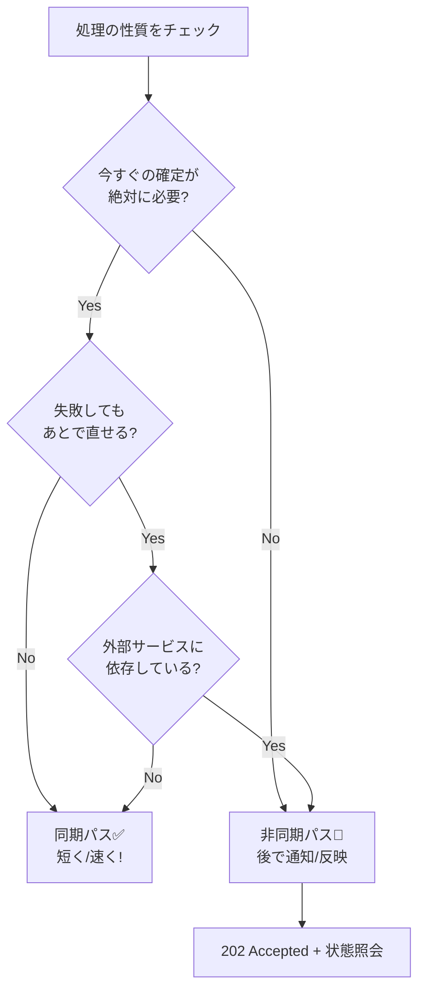

# 第13章：同期と非同期の分け方（迷ったらここ）🔀📬

## この章でできるようになること🎯✨

* 「同期で返すべきこと」と「非同期に逃がすべきこと」を、**UXと失敗パターン**で判断できるようになる😊
* 「注文API」の中身を、**同期パス（短く）**と**非同期パス（強く）**に分けて設計できるようになる💪
* 2026時点の .NET 10（LTS）で、**最小の“疑似キュー＋ワーカー”**を動かして体感できる☕🧪 ([Microsoft][1])

---

## まず超大事：ここで言う「同期/非同期」って何？🧠💡


この章の「非同期」は、C# の async/await（同じスレッドを待たずに進めるやつ）**だけの話じゃない**よ🙅‍♀️
ここで扱うのは **“システム設計としての同期/非同期”**👇

* **同期（Sync）**：リクエストが来たら、その場で処理して結果を返す（呼び出し元は待つ）⏱️
* **非同期（Async）**：いったん受け付けてすぐ返す。重い処理は後でやる（結果はステータス照会や通知で知る）📨

分散システムでつらいのは、**ネットが切れる/遅い/順番がズレる/重複する**が普通に起きること😵‍💫
だから「全部同期でつなぐ」は、意外と簡単に詰む…💥

---

## 迷ったらこの“質問リスト”で決める✅📝




同期にするか非同期にするかは、技術じゃなくて **「仕様＋UX」**で決まるよ🌸

### ① ユーザーは“今この瞬間の確定”が必要？👀

* 必要 → 同期寄り（例：入力ミス、在庫が絶対必要な最後の1個など）
* そこまでじゃない → 非同期寄り（例：通知送信、集計反映）

### ② 失敗したら“あとで取り消せる/やり直せる”？↩️

* できる（補償できる）→ 非同期にしやすい
* できない（戻せない）→ 同期で確実に決めたい

### ③ その処理、遅い/不安定な外部に依存してる？🌩️

* 依存してる → 同期に入れるほどタイムアウト地獄になりやすい🥲
  → 非同期で隔離しやすい

### ④ “今すぐ返す”ために、何を最小にすべき？✂️

同期パスは **短く・少なく・速く**が正義🏃‍♀️💨
後でやれるものは後でやる！

### ⑤ 分断（P）が起きたらどうする？📡

* 同期で強くつなぐほど「返せない＝止まる」になりやすい（Aが落ちる）
* 非同期に逃がすほど「受け付ける＝止まりにくい」になりやすい（Aを守れる）

---

## CampusCafe（学食モバイルオーダー）で線引きしてみよ☕🍰📱

### 例：注文（Place Order）でよくある“やりたいこと”

1. 入力チェック（商品ある？数量おかしい？）
2. 注文の受付（注文番号発行）
3. 在庫の確保（席数・個数の確保）
4. 決済（外部決済）
5. 通知（厨房・ユーザーへ）

### ここでのおすすめ線引き（基本形）🎛️✨


| 処理           | 同期/非同期         | 理由            | 画面の見せ方（UX）   |
| ------------ | -------------- | ------------- | ------------ |
| 入力チェック       | 同期✅            | その場で直してほしい    | 「入力エラー」を即返す  |
| 注文受付（注文ID発行） | 同期✅            | “受け付けた”はすぐ返せる | 「受付完了：準備中」   |
| 在庫確保         | 非同期📨（場合により同期） | 競合・遅延が起きやすい   | ステータス「在庫確認中」 |
| 決済           | 非同期📨（ただし注意）   | 外部が遅い/落ちる     | 「決済処理中」→完了通知 |
| 通知           | 非同期📨          | 失敗しても再送できる    | 後で届く（再送OK）   |

💡ポイント：同期で“完了”まで求めると、**外部が遅いだけで注文が通らない**になりがち😇
まずは「受付」まで同期で返して、残りを非同期で堅くするのが分散では強いよ💪✨

---

## APIの形：非同期を“ちゃんとAPIとして表現”する📮


非同期にしたいなら、HTTP的にはこの形が定番👇

* **202 Accepted**：受け付けたけど、処理はまだ終わってないよ🙆‍♀️
* **状態を見るURL（LocationやステータスAPI）**：あとで状況を見に行ける👀

MicrosoftのAPI設計ガイダンスでも、時間がかかる処理は 202 を返すのが推奨されてるよ📘✨ ([Microsoft Learn][2])

---

## ミニ演習①：注文APIの中で「同期/非同期」を線引きしよ🧩✍️


次の質問に答えて、線引きしてみてね😊

### 問1：同期に残す“最小セット”はどれ？✅

* A. 入力チェック＋注文ID発行
* B. さらに在庫確保まで
* C. 決済まで全部
  （おすすめは A からスタートしやすいよ☕）

### 問2：非同期にした処理の“結果の伝え方”は？📣

* ステータス照会（注文詳細で「処理中/成功/失敗」）
* プッシュ通知
* メール（学内ならやらないかも）

### 問3：失敗したらどうする？😵‍💫

* 在庫確保失敗 → 注文を「失敗」にして理由を表示
* 決済失敗 → 注文を「失敗」にして再試行導線（または自動再試行）

---

## ハンズオン：最小の“同期受付＋非同期処理”を動かす🧪✨


ここでは、**本物のメッセージブローカーの代わりに**、.NETの Channel を使って「疑似キュー」を作るよ📬
Channel は「生産者→消費者へ、非同期にデータを渡す」ための仕組みだよ📦✨ ([Microsoft Learn][3])

ワーカーは BackgroundService で動かすよ（長く動くバックグラウンド処理の基本）🚶‍♀️🔁 ([Microsoft Learn][4])

> 目標：POST した直後は「Pending」で返ってきて、少し待つと「Completed」になるのを体感する⏳🎉

### 1) コード（1ファイルでOK）📄✨

ファイル「Program.cs」をこれにするよ👇

```csharp
using System.Collections.Concurrent;
using System.Threading.Channels;
using Microsoft.AspNetCore.Http.HttpResults;
using Microsoft.Extensions.Hosting;

var builder = WebApplication.CreateBuilder(args);

builder.Services.AddEndpointsApiExplorer();
builder.Services.AddSwaggerGen();

// かんたんDB（本当はDBを使うよ！）
var orders = new ConcurrentDictionary<Guid, Order>();

// 疑似キュー（生産者: API / 消費者: ワーカー）
var channel = Channel.CreateUnbounded<OrderWorkItem>();
builder.Services.AddSingleton(channel);

// ワーカー登録
builder.Services.AddHostedService(sp => new OrderWorker(
    sp.GetRequiredService<Channel<OrderWorkItem>>(),
    orders
));

var app = builder.Build();

app.UseSwagger();
app.UseSwaggerUI();

app.MapPost("/orders", (CreateOrderRequest req) =>
{
    // ✅ 同期でやる：入力チェック（最小！）
    if (req.Items is null || req.Items.Count == 0)
        return Results.BadRequest(new { message = "商品を1つ以上入れてね🍰" });

    if (req.Items.Any(x => x.Quantity <= 0))
        return Results.BadRequest(new { message = "数量は1以上にしてね🍴" });

    // ✅ 同期でやる：注文ID発行＆受付保存（最小！）
    var id = Guid.NewGuid();
    var order = new Order(
        Id: id,
        Status: OrderStatus.Pending,
        CreatedAtUtc: DateTime.UtcNow,
        Message: "受付したよ！これから準備するね☕✨"
    );

    orders[id] = order;

    // 📩 非同期に逃がす：在庫確保・決済・通知（今回は疑似）
    channel.Writer.TryWrite(new OrderWorkItem(id));

    // ✅ 非同期APIの定番：202 Accepted + 状態確認URL
    return Results.Accepted($"/orders/{id}", new { id, status = order.Status.ToString() });
});

app.MapGet("/orders/{id:guid}", (Guid id) =>
{
    if (!orders.TryGetValue(id, out var order))
        return Results.NotFound(new { message = "その注文は見つからなかったよ🥲" });

    return Results.Ok(order);
});

app.Run();

record CreateOrderRequest(List<OrderItem> Items);
record OrderItem(string MenuId, int Quantity);

enum OrderStatus
{
    Pending,
    Processing,
    Completed,
    Failed
}

record Order(Guid Id, OrderStatus Status, DateTime CreatedAtUtc, string Message);

record OrderWorkItem(Guid OrderId);

sealed class OrderWorker : BackgroundService
{
    private readonly Channel<OrderWorkItem> _channel;
    private readonly ConcurrentDictionary<Guid, Order> _orders;
    private readonly Random _random = new();

    public OrderWorker(Channel<OrderWorkItem> channel, ConcurrentDictionary<Guid, Order> orders)
    {
        _channel = channel;
        _orders = orders;
    }

    protected override async Task ExecuteAsync(CancellationToken stoppingToken)
    {
        await foreach (var work in _channel.Reader.ReadAllAsync(stoppingToken))
        {
            if (!_orders.TryGetValue(work.OrderId, out var current))
                continue;

            _orders[work.OrderId] = current with
            {
                Status = OrderStatus.Processing,
                Message = "在庫確認＆決済中だよ…ちょっと待ってね⏳💳"
            };

            // 疑似：外部が遅い世界を再現
            await Task.Delay(TimeSpan.FromSeconds(_random.Next(2, 6)), stoppingToken);

            // 疑似：たまに失敗させる（分散のリアル😇）
            var ok = _random.NextDouble() >= 0.2;

            _orders[work.OrderId] = ok
                ? current with { Status = OrderStatus.Completed, Message = "注文完了！受け取りに来てね🎉🍱" }
                : current with { Status = OrderStatus.Failed, Message = "ごめんね、処理に失敗…再試行してね🥲🔁" };
        }
    }
}
```

### 2) 動かして確認👀✨

* Swagger UI を開く
* POST /orders を実行
* 返ってきた id を使って GET /orders/{id} を何回か叩く

最初は Pending → Processing → Completed / Failed って変わるはずだよ🔁🎮

---

## ミニ演習②：同期パスをもっと“短く”してみよ✂️⚡

次のうち、**同期パスから追い出したい**のはどれ？（理由も書いてね😊）

* (a) 在庫確保
* (b) 決済
* (c) 通知
* (d) 注文ID発行
* (e) 入力チェック

💡ヒント：同期パスは「最小の受付」だけに寄せると、P（分断）に強くなりがち📡🧱

---

## AI活用（Copilot / Codex）で“線引きレビュー”しよ🤖✅

そのまま貼って使えるプロンプト例だよ💬✨

### 1) 線引きレビュー🔀

* 「CampusCafeの注文処理で、同期に残すべき処理と非同期に回すべき処理を、UXと失敗時の補償（取り消し/再試行）込みで提案して」

### 2) 202 AcceptedのAPI設計レビュー📮

* 「非同期処理のAPIとして、202 Accepted とステータス取得エンドポイントの設計をレビューして。レスポンス例も出して」

### 3) 同期パス短縮のアイデア⚡

* 「この注文APIの同期パスを 200ms 以内を目標に短くするなら、どんな分割（非同期化/キャッシュ/事前計算）が効く？」

---

## よくある落とし穴あるある😇🕳️

* **“全部同期”で外部サービスを直列に呼ぶ** → どれか遅いだけで全滅💥
* **非同期にしたのに、結果の見せ方がない** → ユーザーが不安で連打→重複地獄📨📨📨
* **非同期に逃がしたのに、失敗時の扱いが未定** → 「失敗したけど何もできない」になる🥲
* **“非同期＝設計が楽”と思う** → 実は冪等性・重複・順序が後で効いてくる（次の章で強くなるよ🛡️）

---

## 理解チェック✅🎓

### Q1：同期に向いてるのはどっち？🤔

* A. 通知送信
* B. 入力チェック（バリデーション）

### Q2：非同期APIでよく使うステータスコードは？📮

* A. 200 OK
* B. 202 Accepted

### Q3：同期パスの合言葉は？🏃‍♀️💨

* 「短く・少なく・速く」←これ言えたら勝ち🎉

---

## まとめ✨

* 同期/非同期は「技術」じゃなく **UX＋失敗時の扱い**で決めるよ😊
* 同期は“受付を最短で返す”のが強い⚡
* 非同期は“結果の伝え方（ステータス/通知）”までセットで設計する📬
* .NET 10（LTS）で Minimal API＋BackgroundService なら、体感しながら学べるよ🧪✨ ([Microsoft][1])

[1]: https://dotnet.microsoft.com/en-us/platform/support/policy/dotnet-core?utm_source=chatgpt.com "NET and .NET Core official support policy"
[2]: https://learn.microsoft.com/en-us/azure/architecture/best-practices/api-design?utm_source=chatgpt.com "Best practices for RESTful web API design - Azure"
[3]: https://learn.microsoft.com/en-us/dotnet/core/extensions/channels?utm_source=chatgpt.com "Channels - .NET"
[4]: https://learn.microsoft.com/en-us/aspnet/core/fundamentals/host/hosted-services?view=aspnetcore-10.0&utm_source=chatgpt.com "Background tasks with hosted services in ASP.NET Core"
