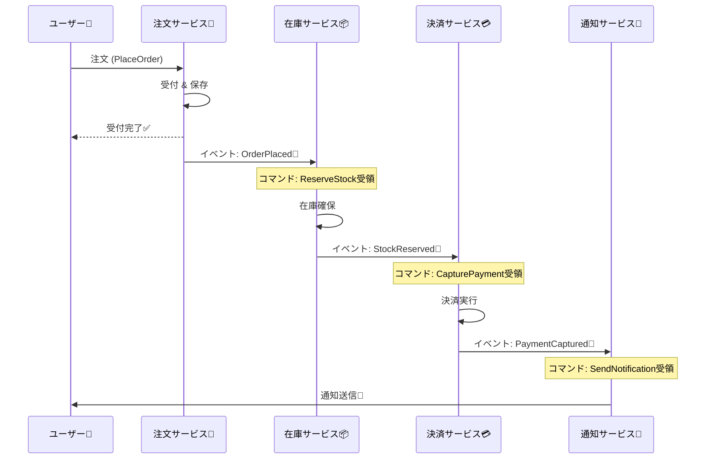

# 第14章：メッセージング基礎＋“現実のクセ”予告📨⚠️

## この章でできるようになること🎯✨

* **イベント**と**コマンド**を、迷わず言い分けられる😊
* 「メッセージは**少なくとも1回届く**（=同じのが来るかも）」を**前提**にできる🧠🛡️
* CampusCafeの流れ（注文→在庫→決済→通知）を、**メッセージ設計**に落とせる☕📦💳🔔

---

## まず超重要：メッセージングは“分散の筋トレ”🏋️‍♀️📨

HTTPで同期連鎖すると、どこかが遅い/落ちた瞬間に全体が引きずられがち…😵‍💫
そこで **「今は依頼だけして、処理は後で」** を作れるのがメッセージングだよ📬✨

---

# 1) イベントとコマンド、いちばん簡単な見分け方🔍


## ✅ コマンド（Command）🧾👉

* **「やって！」**（依頼・命令）
* 宛先がだいたい**1つ**（担当者/担当サービスがいる）
* 失敗したら「できなかった」って返したい気持ちが強い🥺

例：

* `PlaceOrder`（注文して！）☕
* `ReserveStock`（在庫確保して！）📦
* `CapturePayment`（決済確定して！）💳

## ✅ イベント（Event）📣✨

* **「起きたよ！」**（事実の通知）
* 宛先は**不特定多数**（誰が聞いてもいい）
* 失敗したら「イベントが消える」のが一番こわい😱（後で取り返せない）

例：

* `OrderPlaced`（注文が作られたよ）☕✨
* `StockReserved`（在庫確保できたよ）📦✅
* `PaymentCaptured`（決済できたよ）💳✅
* `CustomerNotified`（通知したよ）🔔✅

---

# 2) 命名の鉄板ルール（これだけで迷い激減）🧠✨

## 命名テンプレ🧩

* **コマンド**：動詞の原形（命令形っぽい）

  * `PlaceOrder`, `ReserveStock`, `SendNotification`
* **イベント**：過去形（起きた事実）

  * `OrderPlaced`, `StockReserved`, `NotificationSent`

> “イベントはログに残す事実”、コマンドは“やってほしいお願い”だよ😊📝

---

# 3) CampusCafeをメッセージで表すとこうなる☕📨

## ざっくり流れ（理想形）🗺️✨




1. ユーザーが注文

   * コマンド：`PlaceOrder`
2. 注文が作られた

   * イベント：`OrderPlaced`
3. 在庫を確保する

   * コマンド：`ReserveStock`
4. 在庫が確保できた

   * イベント：`StockReserved`
5. 決済を確定する

   * コマンド：`CapturePayment`
6. 決済できた

   * イベント：`PaymentCaptured`
7. 通知する

   * コマンド：`SendNotification`
8. 通知した

   * イベント：`NotificationSent`

「イベントが次のコマンドを呼ぶ」形にすると、同期の鎖が減って、止まりにくくなるよ📣➡️🧾✨

---

# 4) “少なくとも1回届く”って何？（この講座の超大前提）📨📨😇

メッセージング基盤は、信頼性のために**再送**することがあるよ🔁
だから **同じメッセージが2回届く** のは普通に起きる…！😳

* Azure Service Bus は信頼性機能として **at-least-once（少なくとも1回）配送** や DLQ を含む、と説明されてるよ📬🧱 ([Microsoft Learn][1])
* RabbitMQ も **ACK（確認応答）を使うと at-least-once** になる、って公式で言ってるよ🐇📨 ([rabbitmq.com][2])
* 自動リトライの世界では **同じメッセージを再処理する可能性がある**（だから冪等が必要）という話も定番だよ🔁🛡️ ([docs.particular.net][3])

✅ 結論：**「1回だけ来る」前提は禁止🙅‍♀️**
代わりに、受け手は **“また来ても壊れない”** を目指す（冪等性は次の章で本格的にやるよ🛡️✨）

---

# 5) 最低限つけたい“メッセージの封筒（エンベロープ）”✉️🧾

メッセージ本文（Payload）だけだと、運用で詰みがち😇
まずはこのへんを持たせるのが超おすすめ👇

* `MessageId`：メッセージ自体のID（Guid）🆔
* `CorrelationId`：一連の流れのID（注文全体の追跡）🧵
* `CausationId`：このメッセージの原因になったメッセージID（因果関係）🔗
* `OccurredAt`：発生時刻🕒
* （あれば）`IdempotencyKey`：重複排除のキー🔑

---

# 6) ミニ実装：疑似メッセージングで“2回届く世界”を体験しよう🧪📨

ここでは本物のブローカーの代わりに、**Channel + BackgroundService** で「それっぽい」メッセージングを作るよ😊
BackgroundService は .NET のホスティングで長期処理を作る定番クラスだよ🧰 ([Microsoft Learn][4])

## 6-1) メッセージ定義（イベント/コマンド）🧩

```csharp
using System.Text.Json.Serialization;

public interface IMessage
{
    Guid MessageId { get; }
    Guid CorrelationId { get; }
    Guid? CausationId { get; }
    DateTimeOffset OccurredAt { get; }
}

public abstract record MessageBase(
    Guid MessageId,
    Guid CorrelationId,
    Guid? CausationId,
    DateTimeOffset OccurredAt
) : IMessage;

public interface ICommand : IMessage;
public interface IEvent : IMessage;

// Command
public sealed record PlaceOrder(
    Guid MessageId,
    Guid CorrelationId,
    Guid? CausationId,
    DateTimeOffset OccurredAt,
    string UserId,
    string[] ItemIds
) : MessageBase(MessageId, CorrelationId, CausationId, OccurredAt), ICommand;

// Event
public sealed record OrderPlaced(
    Guid MessageId,
    Guid CorrelationId,
    Guid? CausationId,
    DateTimeOffset OccurredAt,
    string OrderId,
    string UserId,
    string[] ItemIds
) : MessageBase(MessageId, CorrelationId, CausationId, OccurredAt), IEvent;
```

## 6-2) “とりあえず動く”バス（Channel）📬

```csharp
using System.Threading.Channels;

public interface IMessageBus
{
    ValueTask PublishAsync(IMessage message, CancellationToken ct = default);
    ChannelReader<IMessage> Reader { get; }
}

public sealed class InMemoryMessageBus : IMessageBus
{
    private readonly Channel<IMessage> _channel = Channel.CreateUnbounded<IMessage>();

    public ChannelReader<IMessage> Reader => _channel.Reader;

    public ValueTask PublishAsync(IMessage message, CancellationToken ct = default)
        => _channel.Writer.WriteAsync(message, ct);
}
```

## 6-3) Consumer（受け手）— わざと“重複”を発生させる😈📨📨

```csharp
using Microsoft.Extensions.Hosting;

public sealed class MessageConsumer : BackgroundService
{
    private readonly IMessageBus _bus;
    private readonly Random _random = new();

    public MessageConsumer(IMessageBus bus) => _bus = bus;

    protected override async Task ExecuteAsync(CancellationToken stoppingToken)
    {
        await foreach (var msg in _bus.Reader.ReadAllAsync(stoppingToken))
        {
            Console.WriteLine($"📨 Received: {msg.GetType().Name} id={msg.MessageId} corr={msg.CorrelationId}");

            // 💥 “少なくとも1回”の雰囲気：たまに同じメッセージを再投入（=重複配送っぽい）
            if (_random.NextDouble() < 0.25)
            {
                Console.WriteLine("⚠️ Simulate redelivery (duplicate)!");
                await _bus.PublishAsync(msg, stoppingToken);
            }

            // ここでは処理は最小限：コマンドが来たらイベントを出す
            if (msg is PlaceOrder cmd)
            {
                var evt = new OrderPlaced(
                    MessageId: Guid.NewGuid(),
                    CorrelationId: cmd.CorrelationId,
                    CausationId: cmd.MessageId,
                    OccurredAt: DateTimeOffset.UtcNow,
                    OrderId: $"ORD-{Guid.NewGuid():N}",
                    UserId: cmd.UserId,
                    ItemIds: cmd.ItemIds
                );

                await _bus.PublishAsync(evt, stoppingToken);
                Console.WriteLine("📣 Published: OrderPlaced");
            }
        }
    }
}
```

## 6-4) Minimal APIで投入（/orders）☕📱

Minimal API は ASP.NET Core の軽量APIの作り方として公式チュートリアルがあるよ🧰✨ ([Microsoft Learn][5])

```csharp
using Microsoft.AspNetCore.Builder;
using Microsoft.Extensions.DependencyInjection;

var builder = WebApplication.CreateBuilder(args);

builder.Services.AddSingleton<IMessageBus, InMemoryMessageBus>();
builder.Services.AddHostedService<MessageConsumer>();

var app = builder.Build();

app.MapPost("/orders", async (IMessageBus bus) =>
{
    var corr = Guid.NewGuid();

    var cmd = new PlaceOrder(
        MessageId: Guid.NewGuid(),
        CorrelationId: corr,
        CausationId: null,
        OccurredAt: DateTimeOffset.UtcNow,
        UserId: "u-001",
        ItemIds: new[] { "cake-01", "coffee-02" }
    );

    await bus.PublishAsync(cmd);
    return Results.Ok(new { message = "queued", correlationId = corr });
});

app.Run();
```

## 6-5) 動かし方（超かんたん）▶️✨

1. 起動して `/orders` を叩く
2. コンソールに **同じ MessageId が複数回出る**ことがある（＝重複配送の体験）📨📨😇
3. `OrderPlaced` が `CausationId` で `PlaceOrder` を指してるのも観察🔗✨

---

# 7) ミニ演習：イベント？コマンド？どっち？📝🌸

次を分類してみてね👇（直感でOK！）

1. `CancelOrder`
2. `OrderCancelled`
3. `ReserveStock`
4. `StockReservationFailed`
5. `SendNotification`
6. `NotificationSent`
7. `CapturePayment`
8. `PaymentCaptured`
9. `RefundPayment`
10. `PaymentRefunded`

## ✅ 答え合わせ🎯

* コマンド🧾👉：1, 3, 5, 7, 9
* イベント📣✨：2, 4, 6, 8, 10

---

# 8) “現実のクセ”予告（次章で地獄を見るやつ😇）⚠️

この章で作ったミニ実装でも、すでに雰囲気は出てたはず👇

* **重複**：同じメッセージが2回以上届く📨📨
* **順番前後**：後で起きたのが先に処理される🔀
* **遅延/取りこぼし**：来ない/遅い/タイムアウト🐢🕳️

次の章から、これを **ちゃんと設計で受け止める** よ🛡️✨

---

# 9) AI活用（命名とメッセージ設計のブースト）🤖✨

## 命名案を増やす🧠📛

* 「CampusCafeの注文〜決済〜通知で、コマンド名とイベント名を“英語の自然な命名”で20個ずつ出して。過去形/命令形ルールも守って」

## メッセージの中身を整える🧾🧩

* 「`OrderPlaced` の payload に入れるべき最小項目と、入れない方がいい項目を理由つきで整理して」

## 因果関係をチェック🔗🔍

* 「このイベント駆動フローの causation/correlation の付け方が破綻してないか、変なところを指摘して」

---

## 参考（この章で触れた“最新の根拠”）📚✨

* .NET の現行サポート表（.NET 10 は LTS、最新パッチなど） ([Microsoft][6])
* Azure Service Bus の信頼性機能（at-least-once, DLQ など） ([Microsoft Learn][1])
* RabbitMQ の at-least-once と ACK の説明 ([rabbitmq.com][2])

[1]: https://learn.microsoft.com/en-us/azure/reliability/reliability-service-bus?utm_source=chatgpt.com "Reliability in Azure Service Bus"
[2]: https://www.rabbitmq.com/docs/reliability?utm_source=chatgpt.com "Reliability Guide"
[3]: https://docs.particular.net/nservicebus/azure/ways-to-live-without-transactions?utm_source=chatgpt.com "Avoiding Transactions in Azure • NServiceBus"
[4]: https://learn.microsoft.com/en-us/dotnet/api/microsoft.extensions.hosting.backgroundservice?view=net-10.0-pp&utm_source=chatgpt.com "BackgroundService Class (Microsoft.Extensions.Hosting)"
[5]: https://learn.microsoft.com/ja-jp/aspnet/core/tutorials/min-web-api?view=aspnetcore-10.0&utm_source=chatgpt.com "ASP.NET Core を使用して最小限の API を作成する"
[6]: https://dotnet.microsoft.com/ja-jp/platform/support/policy/dotnet-core?utm_source=chatgpt.com ".NET および .NET Core の公式サポート ポリシー"
