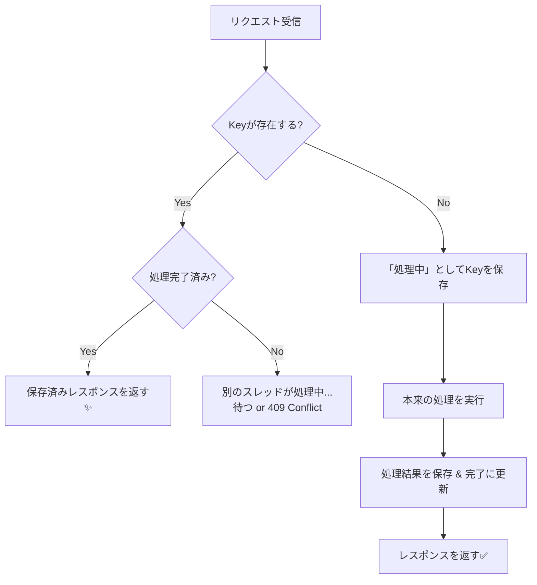

# 第15章：現実その①「重複（同じのが2回来る）」📨📨😇

## この章でできるようになること🎯✨

* 「え、同じ注文が2回入ってるんだけど!?😱」が **なぜ普通に起きるか** を説明できる
* 「重複が来ても壊れない」ための **基本設計（冪等性の入口）** をつくれる🛡️
* CampusCafe（学食モバイルオーダー）で、**わざと壊す → 直す** を体験できる☕️🍰

---

# 1) どうして“同じのが2回来る”の？😳📡


結論：**ネットワーク＆リトライの世界では、重複は“仕様”です**😇

よくある原因👇

* **クライアントがタイムアウト** → 「失敗したかも…」で **同じPOSTを再送**⏱️🔁
* **通信が切れかけ**で、サーバーは処理完了したのに、クライアント側は結果を受け取れず再送📶💦
* **HTTPクライアント側の自動リトライ**（ポリシー設定・回復性ライブラリ）で再送が起きる🔁🧯
* もっと分散っぽい世界だと「少なくとも1回届く（at-least-once）」が基本で、**同じイベントが複数回届く**📨📨

※最近のHTTP世界では `Idempotency-Key` ヘッダーを使って **POST/PATCHの“安全な再送”** をやりやすくする流れが進んでるよ（仕様はドラフトだけど方向性はかなり強い）📌 ([IETF Datatracker][1])
※.NET側も “回復性（resilience）” の公式ドキュメント・パッケージが整ってて、**リトライ自体が当たり前に使える** 状況になってる＝重複も当たり前に起こり得る、ってこと🧯 ([Microsoft Learn][2])

---

# 2) CampusCafeでの“壊れ方”あるある💥☕️

例：注文POSTで、在庫を減らす処理が入ってるとします📦

* 1回目：注文成功 → 在庫 -1 ✅
* 2回目（重複）：また注文扱い → 在庫 -1 ✅（←これが地獄😇）

結果：
**お客さんは1回しか押してないのに、在庫が2回減る**📉😱
（決済が絡むと、もっとヤバい💳💥）

---

# 3) ミニ演習：まず“壊す”🔨😈

Minimal APIで「重複したら壊れる」注文APIを作って、実際に見ます👀✨
（Minimal API自体は公式チュートリアルも継続アップデートされてるよ📚） ([Microsoft Learn][3])

## 3-1. 壊れる版：Idempotencyなし😇

### Program.cs（壊れるミニ版）

```csharp
using Microsoft.AspNetCore.Mvc;

var builder = WebApplication.CreateBuilder(args);
var app = builder.Build();

// 超簡易：在庫（本当はDBだけど、まず壊れ方を見るためにメモリで）
var stock = new Dictionary<string, int>
{
    ["cake"] = 3
};

// 超簡易：注文履歴（本当はDB）
var orders = new List<object>();

app.MapPost("/orders", ([FromBody] PlaceOrderRequest req) =>
{
    // 在庫確認
    if (!stock.TryGetValue(req.Item, out var current) || current <= 0)
        return Results.Problem("売り切れです😢", statusCode: 409);

    // 在庫を減らす（副作用）
    stock[req.Item] = current - 1;

    // 注文作成
    var orderId = Guid.NewGuid().ToString("N");
    orders.Add(new { orderId, req.UserId, req.Item });

    return Results.Ok(new
    {
        orderId,
        remaining = stock[req.Item]
    });
});

app.MapGet("/stock/{item}", (string item) =>
{
    var remaining = stock.TryGetValue(item, out var v) ? v : 0;
    return Results.Ok(new { item, remaining });
});

app.Run();

record PlaceOrderRequest(string UserId, string Item);
```

## 3-2. 叩いてみる（2回送る）📨📨

HTTPファイル（.http）でOK✨（VSでもVS Codeでもやりやすい）

```http
@baseUrl = http://localhost:5000

### 在庫確認
GET {{baseUrl}}/stock/cake

### 1回目の注文
POST {{baseUrl}}/orders
Content-Type: application/json

{
  "userId": "u-001",
  "item": "cake"
}

### 2回目（わざと同じ内容でもう一回）
POST {{baseUrl}}/orders
Content-Type: application/json

{
  "userId": "u-001",
  "item": "cake"
}

### 在庫確認（2減ってたら“壊れてる”）
GET {{baseUrl}}/stock/cake
```

✅ 観察ポイント👀

* 2回POSTすると、在庫が2回減る📉
* 「押したの1回なのに…」は現実で普通に起きる😇

---

# 4) 直し方の基本：サーバー側で“重複”を吸収する🛡️✨

重複対策の王道はこの3つ👇（CampusCafeなら①がまず強い）

## ① Idempotency-Key方式（おすすめ）🔑✨

* クライアントが `Idempotency-Key`（GUIDとか）を付けて送る
* サーバーは「このキー、前にも見た？」を保存して判定
* **同じキーの2回目以降は、前回の結果を返す**（または“既に処理済み”を返す）

`Idempotency-Key` はHTTPの標準化の流れがあり、POST/PATCHの再送を扱いやすくする目的で議論が進んでるよ📌 ([IETF Datatracker][1])

## ② “自然キー＋一意制約”方式🧱

* 注文IDを **クライアント側で生成** して送る（例：OrderId = GUID）
* DBで OrderId を UNIQUE にして、2回目は弾く
* ただし「2回目に同じレスポンスを返したい」なら、レスポンス保存が別途ほしくなる📦

## ③ 状態遷移（ステートマシン）で二重適用を防ぐ🚦

* 「支払い済み→支払い済み」は無効、みたいに **遷移ルール** で二重適用を防ぐ
* これはこのあと出てくる章（冪等性/状態遷移）に繋がるやつ✨

---

# 5) ミニ実装：Idempotency-Keyで“重複を無害化”🔑🛡️




ここから「最低限ちゃんとした形」にします💪✨
やることはシンプル👇

1. `Idempotency-Key` を受け取る
2. そのキーで **処理済みか確認**
3. 未処理なら処理して、**レスポンスを保存**
4. 処理済みなら、**保存済みレスポンスを返す**

## 5-1. DB（SQLite）で“キーと結果”を保存する🗃️✨

今回は分かりやすく SQLite を使うよ（1ファイルDBで楽ちん）💿
（※実運用ではSQL Server等でも同じ考え方でOK）

### 追加するパッケージ（例）

* `Microsoft.EntityFrameworkCore.Sqlite`

## 5-2. Entity & DbContext

```csharp
using Microsoft.EntityFrameworkCore;

public sealed class CampusCafeDbContext : DbContext
{
    public CampusCafeDbContext(DbContextOptions<CampusCafeDbContext> options) : base(options) { }

    public DbSet<Order> Orders => Set<Order>();
    public DbSet<IdempotencyRecord> IdempotencyRecords => Set<IdempotencyRecord>();

    protected override void OnModelCreating(ModelBuilder modelBuilder)
    {
        modelBuilder.Entity<Order>()
            .HasKey(x => x.OrderId);

        modelBuilder.Entity<IdempotencyRecord>()
            .HasKey(x => x.Id);

        // 「同じエンドポイントで、同じIdempotency-Key」は1件だけ
        modelBuilder.Entity<IdempotencyRecord>()
            .HasIndex(x => new { x.Key, x.Method, x.Path })
            .IsUnique();
    }
}

public sealed class Order
{
    public string OrderId { get; set; } = default!;
    public string UserId { get; set; } = default!;
    public string Item { get; set; } = default!;
    public DateTimeOffset CreatedAt { get; set; }
}

public sealed class IdempotencyRecord
{
    public long Id { get; set; }

    public string Key { get; set; } = default!;
    public string Method { get; set; } = default!;
    public string Path { get; set; } = default!;

    // リクエスト内容が同じかチェックしたいならハッシュ等を置く（今回は簡略）
    public string? RequestHash { get; set; }

    // 2回目以降に返すために「結果」を保存
    public int? StatusCode { get; set; }
    public string? ResponseJson { get; set; }

    public bool Completed { get; set; }
    public DateTimeOffset CreatedAt { get; set; }
    public DateTimeOffset? CompletedAt { get; set; }
}
```

## 5-3. “重複吸収”つきの注文API（Minimal API）

ポイント👇

* まず `IdempotencyRecord` を **先に作る（INSERT）**
* UNIQUE制約により、同時に2つ来てもどちらかは弾かれる
* 弾かれた側は、既存レコードを読み直して結果を返す💡

```csharp
using System.Security.Cryptography;
using System.Text;
using Microsoft.AspNetCore.Mvc;
using Microsoft.EntityFrameworkCore;

var builder = WebApplication.CreateBuilder(args);

builder.Services.AddDbContext<CampusCafeDbContext>(opt =>
{
    opt.UseSqlite("Data Source=campuscafe.db");
});

var app = builder.Build();

// DB作成（開発用の簡略。実運用はMigration推奨）
using (var scope = app.Services.CreateScope())
{
    var db = scope.ServiceProvider.GetRequiredService<CampusCafeDbContext>();
    db.Database.EnsureCreated();
}

app.MapPost("/orders", async (
    HttpContext http,
    [FromBody] PlaceOrderRequest req,
    CampusCafeDbContext db) =>
{
    var method = http.Request.Method;
    var path = http.Request.Path.ToString();

    // ★クライアントが送ってくるキー（推奨ヘッダー名）
    // ドラフトの標準名は "Idempotency-Key" がよく使われる流れ📌
    if (!http.Request.Headers.TryGetValue("Idempotency-Key", out var keyValues))
        return Results.Problem("Idempotency-Key が必要だよ🔑😇", statusCode: 400);

    var idemKey = keyValues.ToString().Trim();
    if (idemKey.Length is < 8 or > 200)
        return Results.Problem("Idempotency-Key の形式が変だよ🔑😵", statusCode: 400);

    // （任意）同一リクエスト判定用：内容ハッシュ（今回は簡略で付ける）
    var requestHash = Sha256($"{req.UserId}|{req.Item}");

    // まず既存チェック（処理済みなら結果を返す）
    var existing = await db.IdempotencyRecords
        .Where(x => x.Key == idemKey && x.Method == method && x.Path == path)
        .FirstOrDefaultAsync();

    if (existing is { Completed: true })
    {
        // 同じキーでも中身が違うのは危険なので弾く（安全寄り）
        if (existing.RequestHash != requestHash)
            return Results.Problem("同じIdempotency-Keyで内容が違うよ😱（危険）", statusCode: 409);

        return Results.Text(existing.ResponseJson ?? "{}", "application/json", statusCode: existing.StatusCode ?? 200);
    }

    // まだ無いなら「処理開始レコード」を作る（同時重複の競合はUNIQUEで吸収）
    if (existing is null)
    {
        db.IdempotencyRecords.Add(new IdempotencyRecord
        {
            Key = idemKey,
            Method = method,
            Path = path,
            RequestHash = requestHash,
            Completed = false,
            CreatedAt = DateTimeOffset.UtcNow
        });

        try
        {
            await db.SaveChangesAsync();
        }
        catch (DbUpdateException)
        {
            // ほぼ同時に同じキーが来た！→ 既存を取り直す
        }
    }

    // 取り直し（ここで既に別リクエストが完成させてるかも）
    existing = await db.IdempotencyRecords
        .Where(x => x.Key == idemKey && x.Method == method && x.Path == path)
        .FirstAsync();

    if (existing.Completed)
    {
        if (existing.RequestHash != requestHash)
            return Results.Problem("同じIdempotency-Keyで内容が違うよ😱（危険）", statusCode: 409);

        return Results.Text(existing.ResponseJson ?? "{}", "application/json", statusCode: existing.StatusCode ?? 200);
    }

    // ★ここから“本来の処理”（今回は超ミニ：注文作成だけ）
    var orderId = Guid.NewGuid().ToString("N");
    var order = new Order
    {
        OrderId = orderId,
        UserId = req.UserId,
        Item = req.Item,
        CreatedAt = DateTimeOffset.UtcNow
    };
    db.Orders.Add(order);

    var responseObj = new { orderId, message = "注文できたよ☕️✨" };
    var responseJson = System.Text.Json.JsonSerializer.Serialize(responseObj);

    // 結果を保存（2回目以降はこれを返す）
    existing.StatusCode = 200;
    existing.ResponseJson = responseJson;
    existing.Completed = true;
    existing.CompletedAt = DateTimeOffset.UtcNow;

    await db.SaveChangesAsync();

    return Results.Text(responseJson, "application/json", statusCode: 200);
});

app.Run();

static string Sha256(string s)
{
    var bytes = SHA256.HashData(Encoding.UTF8.GetBytes(s));
    return Convert.ToHexString(bytes);
}

record PlaceOrderRequest(string UserId, string Item);
```

---

# 6) もう一回ミニ演習：今度は“2回送っても壊れない”✅📨📨

```http
@baseUrl = http://localhost:5000
@idemKey = 7b9a9d2c-6f37-4f5a-9df6-2c9f0c2e9a77

### 1回目
POST {{baseUrl}}/orders
Content-Type: application/json
Idempotency-Key: {{idemKey}}

{
  "userId": "u-001",
  "item": "cake"
}

### 2回目（同じキーで再送）
POST {{baseUrl}}/orders
Content-Type: application/json
Idempotency-Key: {{idemKey}}

{
  "userId": "u-001",
  "item": "cake"
}
```

✅ 期待する結果🎉

* 2回目でも **新しい注文は増えない**（同じレスポンスが返る）🛡️
* 「タイムアウトしたから再送」でも安全🔁✨

---

# 7) “重複”対策のチェックリスト🧾✅

## サーバー側🛠️

* [ ] POSTのような“副作用あり”操作は **重複が来る前提**にする😇
* [ ] `Idempotency-Key` を受け取り、**キー＋(Method/Path)** で保存する🔑
* [ ] **結果（status/response）を保存**して2回目以降に返せるようにする📦
* [ ] 同じキーで内容が違う場合は **409で弾く**（安全寄り）🚫
* [ ] キー保存の期限（TTL）を決める（例：24時間など）⏳🧹

## クライアント側📱

* [ ] タイムアウトや再送があり得る操作は **毎回キーを生成して付ける**🔑
* [ ] リトライを使うなら、**POSTには必ず冪等設計をセット**にする🔁🧯
  （.NETの回復性パターンは公式に整備されてるので、リトライが増えるほど重複対策の価値も上がるよ）([Microsoft Learn][2])

---

# 8) AI活用（コピペでOK）🤖✨

* 「`Idempotency-Key` を受け取って、重複なら前回レスポンスを返すMinimal APIを書いて。SQLite + EF Coreで、同時重複もUNIQUEで吸収して」🧠🔑
* 「同じIdempotency-Keyで内容が違う場合の挙動（409）を、テスト（xUnit）で書いて」🧪✅
* 「TTL（期限切れ掃除）を入れるなら、どこでどう実装するのが安全？」🧹⏳

---

# 9) ちいさな確認クイズ🎓✨

1. 「ユーザーが1回しか押してないのに、POSTが2回届く」理由を2つ言える？📨📨
2. `Idempotency-Key` が同じで、リクエスト内容が違ったらどうする？（安全寄りの答え）🚫
3. “結果を保存して返す” のが強いのは、どんなとき？（ヒント：タイムアウト）⏱️🔁

---

## この章のミニまとめ🍰✨

* **重複はエラーじゃなく日常**📨📨😇
* 対策の第一歩は **Idempotency-Key＋結果保存**🔑📦
* これができると、次の「冪等性」「状態遷移」「Outbox」「Saga」にめちゃ繋がるよ🧩🚦

[1]: https://datatracker.ietf.org/doc/draft-ietf-httpapi-idempotency-key-header/?utm_source=chatgpt.com "The Idempotency-Key HTTP Header Field - Datatracker - IETF"
[2]: https://learn.microsoft.com/ja-jp/dotnet/core/resilience/http-resilience?utm_source=chatgpt.com "回復性がある HTTP アプリを構築する: 主要な開発パターン"
[3]: https://learn.microsoft.com/en-us/aspnet/core/tutorials/min-web-api?view=aspnetcore-10.0&utm_source=chatgpt.com "Tutorial: Create a Minimal API with ASP.NET Core"
