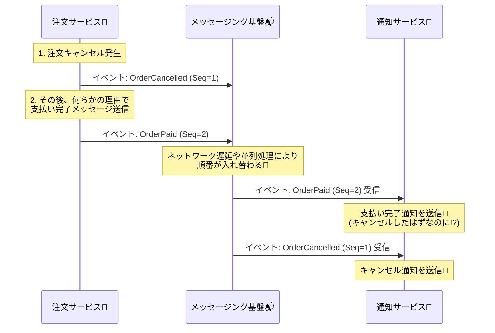
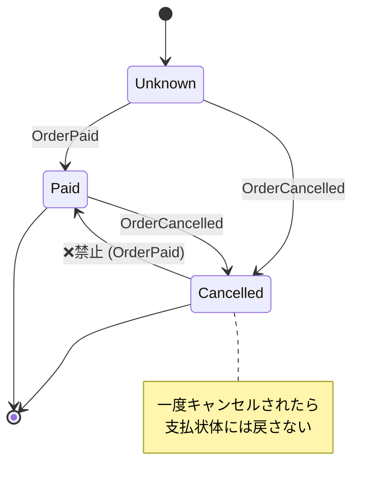

# 第16章：現実その②「順番が前後する」🔀😵‍💫

## 16.1 何が起きるの？（ざっくりイメージ）🧠✨




分散（ネットワーク越し）だと、**「後で送ったはず」なのに「先に届く」**がふつうに起きます😵‍💫
たとえば CampusCafe でこんな事故👇

* 本当の順番：`注文キャンセル` →（払い戻し処理）→ `キャンセル通知`
* 届いた順番：`キャンセル通知` → `支払い完了通知`（えっ！？）🔔💥

こうなると「キャンセルしたのに支払い完了通知が来る」みたいな地獄が発生します🥲📱

---

## 16.2 なんで順番が前後するの？📡🌀

よくある原因はこれ👇

* **遅い処理が後回しになる**（片方だけ重い・混んでる）🐢
* **リトライで再送される**（同じメッセージが“後から”もう一回飛ぶ）🔁
* **並列処理してる**（コンシューマーを増やしたら順番が崩れる）👯‍♀️
* **ネットワークの都合**（経路が違う、詰まる、パケット再送など）🌐

結論：**「届く順＝起きた順」じゃない**です🙅‍♀️💦

---

## 16.3 まず“壊して”体感しよう💥（ミニ演習）🧪

ここでは、**通知サービス**がイベントを受け取って通知する、というミニ構成を作ってみます🔔
（わざと）順番を崩して投入して、壊れ方を見るよ〜😈✨

### 使う道具（超シンプル）

* インメモリのキューとして **`System.Threading.Channels`** を使います📬
  Channel は「FIFOキュー」としてデータ受け渡しに使える仕組みだよ〜🧺✨ ([GitHub][1])

---

## 16.4 壊れる例（ナイーブ実装）😇➡️💥

### ① イベント定義

```csharp
public interface IOrderEvent
{
    Guid OrderId { get; }
    long Sequence { get; }              // 「起きた順」を表す番号（後で使う）
    DateTimeOffset OccurredAt { get; }  // 参考（時刻はズレるので過信しない）
}

public record OrderPaid(Guid OrderId, long Sequence, DateTimeOffset OccurredAt) : IOrderEvent;
public record OrderCancelled(Guid OrderId, long Sequence, DateTimeOffset OccurredAt) : IOrderEvent;
```

### ② 雑な通知サービス（順番が前後すると事故る）

```csharp
public enum OrderStatus { Unknown, Paid, Cancelled }

public sealed class NotificationService
{
    private readonly Dictionary<Guid, OrderStatus> _status = new();

    public void Handle(IOrderEvent ev)
    {
        var current = _status.GetValueOrDefault(ev.OrderId, OrderStatus.Unknown);

        switch (ev)
        {
            case OrderPaid:
                _status[ev.OrderId] = OrderStatus.Paid;
                Console.WriteLine($"✅ 支払い完了通知を送信しました OrderId={ev.OrderId}");
                break;

            case OrderCancelled:
                _status[ev.OrderId] = OrderStatus.Cancelled;
                Console.WriteLine($"🛑 キャンセル通知を送信しました OrderId={ev.OrderId}");
                break;
        }

        Console.WriteLine($"   状態: {current} -> {_status[ev.OrderId]}  (Seq={ev.Sequence})");
    }
}
```

### ③ わざと順番を崩して投入する（再現装置）🔀

```csharp
using System.Threading.Channels;

var ch = Channel.CreateUnbounded<IOrderEvent>();
var svc = new NotificationService();

var orderId = Guid.NewGuid();

// 本当は 1→2 の順に起きたことにする
var paid      = new OrderPaid(orderId,      Sequence: 2, OccurredAt: DateTimeOffset.UtcNow);
var cancelled = new OrderCancelled(orderId, Sequence: 1, OccurredAt: DateTimeOffset.UtcNow);

// わざと「キャンセル→支払い完了」の順で流す（前後！）
await ch.Writer.WriteAsync(cancelled);
await ch.Writer.WriteAsync(paid);
ch.Writer.Complete();

// コンシューマー
await foreach (var ev in ch.Reader.ReadAllAsync())
{
    svc.Handle(ev);
}
```

### 期待される“事故”

* `キャンセル通知`が行ったあとに、`支払い完了通知`が飛んでしまう😇💥
* 状態も `Cancelled -> Paid` みたいに戻る（最悪）😵‍💫

---

## 16.5 対策パターン①：状態遷移（State Machine）で“変な遷移を拒否”🚦🛡️




いちばん簡単で強い考え方✨
**「キャンセル済みの注文に、支払い完了は適用しない」**ってルールを入れます🙅‍♀️

```csharp
public static class OrderTransitions
{
    public static bool CanApply(OrderStatus current, IOrderEvent ev) =>
        (current, ev) switch
        {
            (OrderStatus.Unknown,   OrderPaid)      => true,
            (OrderStatus.Unknown,   OrderCancelled) => true,
            (OrderStatus.Paid,      OrderCancelled) => true,  // 例：支払い後キャンセルOK（返金へ）
            (OrderStatus.Cancelled, OrderPaid)      => false, // ← ここが重要！
            _ => false
        };
}

public sealed class SafeNotificationService
{
    private readonly Dictionary<Guid, OrderStatus> _status = new();

    public void Handle(IOrderEvent ev)
    {
        var current = _status.GetValueOrDefault(ev.OrderId, OrderStatus.Unknown);

        if (!OrderTransitions.CanApply(current, ev))
        {
            Console.WriteLine($"⚠️ 適用しない（不正な遷移） {current} + {ev.GetType().Name} (Seq={ev.Sequence})");
            return;
        }

        _status[ev.OrderId] = ev switch
        {
            OrderPaid      => OrderStatus.Paid,
            OrderCancelled => OrderStatus.Cancelled,
            _              => current
        };

        Console.WriteLine($"✅ 適用 {current} -> {_status[ev.OrderId]} (Seq={ev.Sequence})");
    }
}
```

✅ 良いところ

* 実装がわかりやすい😍
* “事故通知”がかなり止まる🛑✨

⚠️ 注意

* 「先に未来のイベントが来た」ケースで、**大事なイベントを捨てる**可能性もあるよ😵‍💫
  → そこで次のパターン②が出番！

---

## 16.6 対策パターン②：Sequence（版番号）で“並び替え or 保留”🔢⏳


ここでさっきの `Sequence` を使います✨
発行元（例：注文サービス）が **「注文に関するイベントは 1,2,3… と連番」** を付けるイメージです📌

### ルール（超重要）📌

* `今のVersion=5` のとき

  * `Sequence=5` や `4` が来た → **古いので無視**（重複/遅延対策）🧹
  * `Sequence=6` が来た → **即適用**✅
  * `Sequence=8` が来た → **7が来てない！保留**🫸🫷（順不同対策）

### “保留して並び替える”ミニ実装

```csharp
public sealed class VersionedHandler
{
    private sealed record OrderState(long Version, OrderStatus Status);

    private readonly Dictionary<Guid, OrderState> _state = new();
    private readonly Dictionary<Guid, SortedDictionary<long, IOrderEvent>> _buffer = new();

    public void Handle(IOrderEvent ev)
    {
        var st = _state.GetValueOrDefault(ev.OrderId, new OrderState(0, OrderStatus.Unknown));

        if (ev.Sequence <= st.Version)
        {
            Console.WriteLine($"🧹 古いので無視 Seq={ev.Sequence} (Current={st.Version})");
            return;
        }

        // 未来が来たら保留
        if (ev.Sequence > st.Version + 1)
        {
            Console.WriteLine($"⏸️ 保留 Seq={ev.Sequence} (Next={st.Version + 1})");
            Buffer(ev);
            return;
        }

        // ちょうど次なら適用
        Apply(ev);

        // バッファに続きがあれば連鎖適用
        Drain(ev.OrderId);
    }

    private void Buffer(IOrderEvent ev)
    {
        if (!_buffer.TryGetValue(ev.OrderId, out var dict))
        {
            dict = new SortedDictionary<long, IOrderEvent>();
            _buffer[ev.OrderId] = dict;
        }
        dict[ev.Sequence] = ev;
    }

    private void Drain(Guid orderId)
    {
        if (!_buffer.TryGetValue(orderId, out var dict)) return;

        while (dict.Count > 0)
        {
            var st = _state.GetValueOrDefault(orderId, new OrderState(0, OrderStatus.Unknown));
            var next = st.Version + 1;

            if (!dict.TryGetValue(next, out var ev)) break;

            dict.Remove(next);
            Apply(ev);
        }
    }

    private void Apply(IOrderEvent ev)
    {
        var st = _state.GetValueOrDefault(ev.OrderId, new OrderState(0, OrderStatus.Unknown));

        var nextStatus = ev switch
        {
            OrderPaid      => OrderStatus.Paid,
            OrderCancelled => OrderStatus.Cancelled,
            _              => st.Status
        };

        _state[ev.OrderId] = new OrderState(ev.Sequence, nextStatus);
        Console.WriteLine($"✅ 適用 Status={nextStatus} Version={ev.Sequence}");
    }
}
```

✅ 良いところ

* 「未来が先に来た」を **捨てずに待てる**🥹✨
* 重複にも強い（古いのを無視）🧹🛡️

⚠️ 現実の追加ポイント

* ずっと待つと詰まるので、**待ち時間上限**を決める⏱️
* 上限を超えたら、**発行元の正（ソースオブトゥルース）を再取得**して整合させる🔄✨

---

## 16.7 対策パターン③：そもそも“順序保証”できる仕組みを使う📬🔒

「同じ注文（OrderId）のイベントだけは順番保証したい！」ってときは、**メッセージ基盤側の機能**を使うのも手です🙆‍♀️✨

例：Azure Service Bus では **Sessions を使うと FIFO（先入れ先出し）を保証**できるよ、って公式ドキュメントで案内されています📘✨ ([Microsoft Learn][2])

✅ 良いところ

* アプリ側がラクになる😍

⚠️ 注意

* “同じキー（OrderId）を同じ列に集める”ので、**偏り（ホットスポット）**があると詰まりやすい🥲
* スケール設計（キー設計）が大事になるよ🧩

---

## 16.8 「順序が必要」vs「不要」どう見分ける？👀✨

目安はこれ👇

| 例（CampusCafe）                         | 順序が超重要？ | 理由                         | まず入れる対策           |
| ------------------------------------- | ------: | -------------------------- | ----------------- |
| 決済の状態（Authorized→Captured→Refunded）💳 |       ✅ | 間違うとお金が事故る                 | Sequence + 状態遷移🚦 |
| 在庫確保→在庫戻し📦                           |       ✅ | 逆順で数が壊れる                   | 状態遷移 + 冪等🛡️      |
| 通知（Push/メール）🔔                        |       △ | 「送っていい状態か」を確認できれば順序依存を減らせる | “現在状態チェック”✅       |
| 集計（人気メニューランキング）📊                     |     ❌寄り | 多少遅れてもUXで吸収できる             | 遅延許容 + 再計算🔁      |

ポイント：**「順序が必要な場所を小さくする」**ほど強いです✂️✨

---

## 16.9 CampusCafeに落とす（おすすめ設計）☕📱✨

### 注文（Order）まわりのイベントに付けるもの

* `OrderId`（同じ注文のまとまり）🪪
* `Sequence`（注文の出来事の連番）🔢
* `EventId`（重複排除にも使える）🧾

### 通知サービス側の鉄板ムーブ🔔🛡️

* 受け取ったイベントだけで判断しない🙅‍♀️
* **「いま注文は何状態？」を確認してから通知**する✅

  * 例：`Cancelled` なら `Paid通知` は送らない
* さらに強くするなら

  * `Sequence` で **順番が揃うまで待つ（保留）** ⏸️
  * 期限超えなら **注文サービスに再取得** 🔄

---

## 16.10 ミニ演習（やってみよう）🧪✨

1. 16.4 のナイーブ版で、順番前後の事故ログを出す📄💥
2. 16.5 の状態遷移を入れて、事故通知が止まるのを確認🛑✨
3. 16.6 の Sequence 保留を入れて、「未来が先に来ても」正しく並ぶのを確認🔢✅
4. おまけ：`Sequence` が欠けたときのタイムアウト方針を決める⏱️🧠

---

## 16.11 AI活用（そのままコピペでOK）🤖✨

* 「このイベント一覧で、順序が前後すると致命傷になるもの／ならないものを分類して。理由も“ユーザー体験”で説明して」📋💬
* 「Order の状態遷移図（ステートマシン）を作って。禁止遷移も明示して」🚦🧩
* 「Sequence方式の“保留バッファ”で起きる落とし穴（メモリ増大、欠番、タイムアウト）を洗い出して、対策案を3つ出して」🧯📈
* 「xUnitで“順不同投入でも最終状態が正しい”テストを書いて」🧪✅

---

## 16.12 まとめ✨🎀

* 分散では **順番は守られない**のが前提🔀😵‍💫
* 対策はだいたいこの3つセットが強い💪✨

  1. **状態遷移で拒否**🚦
  2. **Sequenceで保留・並び替え**🔢⏸️
  3. **基盤で順序保証（必要な所だけ）**📬🔒
* 「順序が必要な範囲を小さくする」ほど、設計がラクで強くなるよ〜✂️🛡️

---

### （参考：2026年1月時点の言語・SDKメモ）📝✨

* **C# 14 は最新の C# リリース**で、**.NET 10 でサポート**されています📘✨ ([Microsoft Learn][3])
* **.NET 10 は 2025年11月11日に正式リリース（LTS）**として案内されています📅✨ ([infoq.com][4])

[1]: https://github.com/dotnet/docs/blob/main/docs/core/extensions/channels.md?utm_source=chatgpt.com "System.Threading.Channels library - dotnet/docs"
[2]: https://learn.microsoft.com/en-us/azure/service-bus-messaging/advanced-features-overview?utm_source=chatgpt.com "Azure Service Bus messaging - advanced features"
[3]: https://learn.microsoft.com/ja-jp/dotnet/csharp/whats-new/csharp-14?utm_source=chatgpt.com "C# 14 の新機能"
[4]: https://www.infoq.com/news/2025/10/dotnet-10-rc-2-release/?utm_source=chatgpt.com ".NET 10 Release Candidate 2: Finalizes SDK, MAUI ..."
