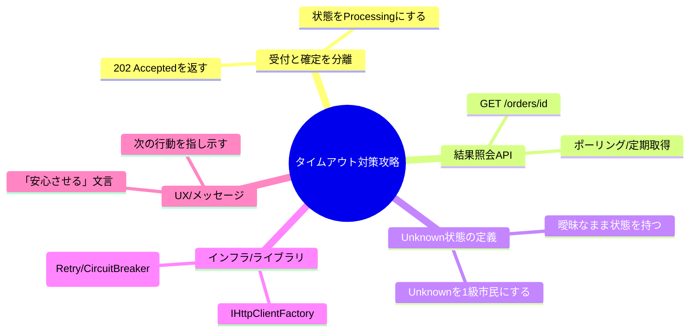

# 第17章：現実その③「来ない/遅い（取りこぼし・遅延）」🕳️🐢

## 1) この章でつかむ“肌感覚”🎯✨

分散の世界では、**「タイムアウト＝失敗」じゃない**ことが普通に起きます😳💦
むしろタイムアウトは、だいたいこういう意味です👇

* **「結果がまだ分からない（未確定）」**🫥⏳
* **相手が死んだとは限らない**（ただ遅いだけかも）🐢💨
* **後から成功が届くことがある**（いちばん混乱ポイント！）🎭

この章のゴールはこれ👇✨
**“未確定”をちゃんと設計する（仕様・UX・実装・運用ぜんぶ）** 🧩🛠️🌈

---

## 2) CampusCafeで起きる“遅い/来ない”あるある☕📱⚡

たとえば、学食モバイルオーダーで…

### ケースA：決済が遅い（でも成功する）💳🐢✅

* 注文API → 決済APIを呼ぶ
* 2秒でタイムアウト（注文画面は失敗表示）😵‍💫
* でも決済側は **5秒後に成功**してる（決済だけ通ってる）😇💦

### ケースB：通知が来ない（実はどこかに詰まってる）🔔🕳️

* OrderPaid イベントを出した
* 通知サービスが落ちてて処理できない
* するとメッセージが **DLQ（Dead-letter queue）** に入ったりする📮🧟‍♀️
  （Azure Service Bus のDLQは「処理できないメッセージの避難場所」だよ〜） ([Microsoft Learn][1])

### ケースC：メッセージが“遅れて”来る（順番も崩れやすい）📨🐢🔀

* 在庫確保イベントが遅延
* 先に「決済完了」が来て、後から在庫が動く…みたいなことが起きる😵‍💫

---

## 3) まず超重要：結果は3種類あるよ🧠🧊

分散あるあるを雑にまとめると👇

* **成功** ✅
* **失敗** ❌
* **未確定（Unknown）** 🫥 ← ここが設計の主役！

タイムアウトは、たいてい **「未確定」** です⏱️🫥
この“未確定”を **失敗扱い** すると、あとで地獄が来ます🔥👹
（「失敗表示したのに請求は通ってる」みたいなやつ…）

---

## 4) タイムアウトの正体：どこで切れてる？⛓️✂️


タイムアウトには層があるよ〜🧅✨

### (1) クライアント側タイムアウト（ブラウザ/アプリ）📱⏱️

UIが待ちきれなくて「通信失敗」になるやつ。

### (2) サーバー側タイムアウト（受信リクエスト制限）🖥️⏳

ASP.NET Core には **Request timeouts middleware** があって、
全体のデフォルトタイムアウトや、エンドポイント別のポリシーが作れるよ🧰
（`AddRequestTimeouts` や `WithRequestTimeout` など） ([Microsoft Learn][2])

### (3) サーバー→下流のタイムアウト（HttpClient）🌐⏱️

`HttpClient.Timeout` の既定値は **100秒**（意外と長い！） ([Microsoft Learn][3])
放置すると「ずっと待って詰まる」系の事故が起きやすい😵‍💫💦

### (4) メッセージのTTL（時間切れで期限切れ）📨⌛

メッセージングでは **TTL（Time to Live）** があって、期限を過ぎると消えたりDLQに行ったりする設計になるよ📮
（Azure Service Bus の TTL の説明） ([Azure 文档][4])

---

## 5) 設計パターン：未確定を安全にする“型”🧩🛟✨




CampusCafeでおすすめの考え方を、実戦寄りにまとめるね😊🫶

### パターン①：同期で確定させない（202 Acceptedに逃がす）🏃‍♀️💨

**注文は「受付」だけ先に返す**✨

* 返す：`orderId`、状態=`Processing`
* 決済は裏で進める
* 画面は「処理中」「あとで確定」表示

これで、タイムアウトしても **“失敗”って言い切らなくて済む**🙆‍♀️🌸

### パターン②：結果照会APIを用意する（ポーリングOK）🔄📡

`GET /orders/{orderId}` みたいにして、状態を取りにいけるようにする✅
UIは「最新状態を取得」ボタンがあるだけでも安心感が爆上がり💖✨

### パターン③：状態を“段階”に分ける（曖昧を曖昧のまま持つ）🚦

例👇

* `Accepted`（受付）📥
* `PaymentProcessing`（決済中）💳
* `Paid`（確定）✅
* `PaymentUnknown`（未確定）🫥
* `Failed`（確定失敗）❌

**Unknown をちゃんと状態として認める**のがコツだよ〜🫶🧠

### パターン④：タイムアウトは「失敗」じゃなく「保留」扱い🫥⏱️

タイムアウト時にやるべきこと👇

* 状態を `Unknown`（または `Processing`）にする
* 裏で「照合」や「再取得」をする
* ユーザーへは「確認中」メッセージにする💬🌸

### パターン⑤：HttpClientはIHttpClientFactoryで管理（枯れた王道）🏗️✨

.NETでは **HttpClient の使い方ガイド**があって、使い回し/Factory運用が推奨だよ〜（ポート枯渇回避など） ([Microsoft Learn][5])

### パターン⑥：リトライは“正しく”やる（耐障害の作法）🔁🧠

.NETには回復性（resilience）の仕組みが整ってきてて、`Microsoft.Extensions.Http.Resilience` / `Microsoft.Extensions.Resilience` が **Pollyベース**で提供されてるよ🧰✨ ([Microsoft Learn][6])
さらに HttpClient には標準のレジリエンス・ハンドラーを付けられて、**むやみに重ねて積むのは避けよう**ってガイドもあるよ✅ ([Microsoft Learn][7])

> ただし注意⚠️
> リトライは「同じ処理が2回起きる」世界とセットなので、**冪等性（次章以降）**と一緒に設計するのが前提だよ🛡️🔑

---

## 6) UXの勝ちパターン：タイムアウト時に“安心”を作る💬🌸✨

タイムアウトって、ユーザーはめちゃ不安になります🥺💦
だから「言い方」で救えるよ〜🫶

### 使いやすい文言テンプレ（例）📝✨

* 「ただいま確認中です。結果が確定したら反映します」🫥✅
* 「通信が混み合っています。注文の受付は完了しています」📥🐢
* 「決済の確定に少し時間がかかっています。履歴で状態を確認できます」💳📜
* 「二重注文を防ぐため、同じ操作は繰り返さなくて大丈夫です」🛡️✨

ポイントはこれ👇

* **失敗と言い切らない**（未確定だから）🫥
* **次に何をすればいいか**を必ず書く🧭✨
* **二重操作しなくていい**安心を出す🛡️💖

---

## 7) ミニ演習：タイムアウトしたのに“後から成功”を観察する⏱️😳🔬

ここから実験だよ〜！✨
**「注文APIはタイムアウト扱い。でも決済は後から成功してる」**を、目で見て納得しよう👀💡

### 7.1 やること（完成形イメージ）🧩

* `POST /orders/place?delayMs=5000&timeoutMs=2000`

  * 注文APIは 2秒で諦める（タイムアウト相当）⏱️
* でも裏で決済APIは 5秒かけて処理して **成功にする**🐢✅
* `GET /orders/{orderId}` で状態を見ると
  **最初は Timeout/Unknown → 数秒後に Paid** に変わる😳✨

### 7.2 Program.cs（1ファイルで実験）🧪

```csharp
using System.Collections.Concurrent;
using System.Net;

var builder = WebApplication.CreateBuilder(args);

builder.Services.AddEndpointsApiExplorer();
builder.Services.AddSwaggerGen();

// HttpClient は Factory 経由で使う（王道）
// ここでは同一アプリ内の "fake-payments" を叩くため BaseAddress を自分に向ける
builder.Services.AddHttpClient("Payments", client =>
{
    // 実行ログに出るURL(https://localhost:xxxx)に合わせて後で上書きできるようにする
    client.Timeout = Timeout.InfiniteTimeSpan; // タイムアウトは CancellationToken 側で管理する
});

var app = builder.Build();
app.UseSwagger();
app.UseSwaggerUI();

// --- かんたん状態ストア（本番はDB想定） ---
var orders = new ConcurrentDictionary<Guid, Order>();

app.MapPost("/orders/place", async (HttpContext ctx, IHttpClientFactory factory, int delayMs = 5000, int timeoutMs = 2000) =>
{
    var orderId = Guid.NewGuid();
    orders[orderId] = new Order(orderId, "PaymentProcessing", DateTimeOffset.UtcNow, null);

    // このリクエスト自体が切れたら止めたいので RequestAborted とリンクする
    // さらに「下流呼び出しの予算」として timeoutMs を設定
    using var cts = CancellationTokenSource.CreateLinkedTokenSource(ctx.RequestAborted);
    cts.CancelAfter(TimeSpan.FromMilliseconds(timeoutMs));

    // 実験のため：同一アプリ内の fake-payments を叩く
    // Host(ポート)は実行環境で変わるので、実際のリクエストの Host を使う
    var baseUrl = $"{ctx.Request.Scheme}://{ctx.Request.Host}";
    var client = factory.CreateClient("Payments");
    client.BaseAddress = new Uri(baseUrl);

    try
    {
        // わざと遅い決済（delayMs）を呼ぶ
        var url = $"/fake-payments/charge?orderId={orderId}&delayMs={delayMs}";
        var res = await client.GetAsync(url, cts.Token);

        if (res.IsSuccessStatusCode)
        {
            orders[orderId] = orders[orderId] with { Status = "Paid", PaidAt = DateTimeOffset.UtcNow };
            return Results.Ok(new { orderId, status = "Paid" });
        }

        orders[orderId] = orders[orderId] with { Status = $"PaymentFailed({(int)res.StatusCode})" };
        return Results.Problem("Payment failed", statusCode: (int)HttpStatusCode.BadGateway);
    }
    catch (TaskCanceledException)
    {
        // ここがポイント！
        // タイムアウト = 失敗確定 ではなく「未確定」
        orders[orderId] = orders[orderId] with { Status = "PaymentUnknown(Timeout)" };

        // UX的には「受付はした」方が優しいので 202 を返す
        return Results.Accepted($"/orders/{orderId}", new
        {
            orderId,
            status = "PaymentUnknown(Timeout)",
            message = "決済の確定に時間がかかっています。注文履歴で状態を確認できます。"
        });
    }
});

app.MapGet("/orders/{orderId:guid}", (Guid orderId) =>
{
    if (!orders.TryGetValue(orderId, out var order))
        return Results.NotFound(new { message = "Order not found" });

    return Results.Ok(order);
});

// --- 遅い決済のシミュレータ ---
// 重要：このエンドポイントはキャンセル（RequestAborted）を無視して最後まで走る。
// 現実でも「クライアントが諦めても相手側は処理継続」が起きるので、それを再現してるよ。
app.MapGet("/fake-payments/charge", async (Guid orderId, int delayMs = 5000) =>
{
    await Task.Delay(delayMs); // キャンセルしない（わざと）

    // 決済が後から成功する（＝注文側はタイムアウト済みでも、結果は確定していく）
    if (orders.TryGetValue(orderId, out var order))
        orders[orderId] = order with { Status = "Paid", PaidAt = DateTimeOffset.UtcNow };

    return Results.Ok(new { orderId, status = "Paid", tookMs = delayMs });
});

app.Run();

public record Order(Guid OrderId, string Status, DateTimeOffset CreatedAt, DateTimeOffset? PaidAt);
```

**ここで使ってる知識メモ**📝✨

* `CancelAfter` で「指定時間でキャンセル」を作れるよ ([Microsoft Learn][8])
* `HttpClient.Timeout` の既定は 100秒なので、放置すると長く待ちがちだよ ([Microsoft Learn][3])

### 7.3 動かして観察しよう👀✨

1. 起動して、コンソールに出る `https://localhost:xxxx` を控える📝
2. まずは注文（わざとタイムアウト）👇

PowerShell 例：

```powershell
$base="https://localhost:####"  # 実際のポートに置き換え
Invoke-RestMethod -Method Post "$base/orders/place?delayMs=5000&timeoutMs=2000"
```

返ってくるのはだいたいこんな感じ（202）👇

* `status = PaymentUnknown(Timeout)` 🫥⏱️
* `orderId` がもらえる🆔✨

3. すぐに状態を見る👇

```powershell
Invoke-RestMethod "$base/orders/<orderId>"
```

最初：`PaymentUnknown(Timeout)` 🫥⏱️
数秒待ってもう一回：`Paid` ✅🎉
→ **「タイムアウトしたのに後から成功」が目で見える！** 😳✨

---

## 8) “来ない”世界のメッセージ設計：DLQとTTLの肌感覚📨🧟‍♀️⌛

HTTPだけじゃなく、イベント駆動でも「来ない/遅い」は起きるよ〜📨🐢

### DLQ（Dead-letter queue）って？📮

「配れない」「処理できない」メッセージを隔離して置いておく箱だよ🧰
後で調査して、必要なら再投入できる設計にするのが王道✨ ([Microsoft Learn][1])

### TTL（Time to Live）って？⌛

「このメッセージ、いつまで有効？」の期限だよ📅
期限が過ぎたら“期限切れ”になる（設計で扱いを決める） ([Azure 文档][4])

### 運用の現実：DLQ掃除も必要🧹

Azure Service Bus には、DLQ内のメッセージを削除する運用（バッチ削除）も用意されてるよ🧹🗑️ ([Microsoft Learn][9])

---

## 9) AI活用（Copilot / Codex）🤖✨

“未確定”は仕様と文言が超大事なので、AIがめちゃ役立つよ〜🫶

### 9.1 タイムアウト時のUX文言を作ってもらう💬🌸

**プロンプト例：**

* 「学食モバイルオーダーで、決済が未確定のときの画面文言を10案。安心感、二重操作防止、次の行動（履歴で確認）を必ず入れて」

### 9.2 “未確定”の状態遷移案を作ってもらう🚦🧠

**プロンプト例：**

* 「Orderの状態遷移を提案して。Accepted / PaymentProcessing / Paid / PaymentUnknown / Failed を含めて、各状態の意味と遷移条件も」

### 9.3 HttpClientの回復性（timeout/retry）方針を草案にしてもらう🧰🔁

**プロンプト例：**

* 「下流決済APIが遅い/落ちる前提で、.NETのHttpClient回復性の方針案を作って。Retry/Timeout/CircuitBreakerの役割分担と注意点（冪等性）も」

（.NETでは Polly ベースの回復性パッケージが公式に整備されてるよ） ([Microsoft Learn][6])

---

## 10) まとめチェックリスト✅🧾✨

この章の“できてる？”確認だよ〜😊🫶

* タイムアウトを **失敗確定** と扱ってない？🫥⏱️
* “未確定（Unknown）”を **状態として持ててる？** 🚦
* UIは「次に何をすればいいか」を言えてる？💬🧭
* 結果照会（`GET /orders/{id}`）がある？🔄
* HttpClientはFactory運用＆待ちすぎない設計？🏗️ ([Microsoft Learn][5])
* メッセージングはDLQ/TTLを前提に設計できてる？📮⌛ ([Microsoft Learn][1])

次の章では、この「未確定」や「リトライ」が引き起こす **二重適用** を、冪等性で止めていくよ〜🛡️🔑✨

[1]: https://learn.microsoft.com/en-us/azure/service-bus-messaging/service-bus-dead-letter-queues?utm_source=chatgpt.com "Service Bus dead-letter queues - Azure"
[2]: https://learn.microsoft.com/en-us/aspnet/core/performance/timeouts?view=aspnetcore-10.0 "Request timeouts middleware in ASP.NET Core | Microsoft Learn"
[3]: https://learn.microsoft.com/en-us/dotnet/api/system.net.http.httpclient.timeout?view=net-10.0&utm_source=chatgpt.com "HttpClient.Timeout Property (System.Net.Http)"
[4]: https://docs.azure.cn/en-us/service-bus-messaging/message-expiration?utm_source=chatgpt.com "Azure Service Bus - Message expiration (Time to Live)"
[5]: https://learn.microsoft.com/en-us/dotnet/fundamentals/networking/http/httpclient-guidelines?utm_source=chatgpt.com "Guidelines for using HttpClient"
[6]: https://learn.microsoft.com/en-us/dotnet/core/resilience/?utm_source=chatgpt.com "Introduction to resilient app development - .NET"
[7]: https://learn.microsoft.com/en-us/dotnet/core/resilience/http-resilience "Build resilient HTTP apps: Key development patterns - .NET | Microsoft Learn"
[8]: https://learn.microsoft.com/en-us/dotnet/csharp/asynchronous-programming/cancel-async-tasks-after-a-period-of-time?utm_source=chatgpt.com "Cancel async tasks after a period of time\" - C#"
[9]: https://learn.microsoft.com/en-us/azure/service-bus-messaging/batch-delete?utm_source=chatgpt.com "Batch delete messages in Azure Service Bus (Preview)"
