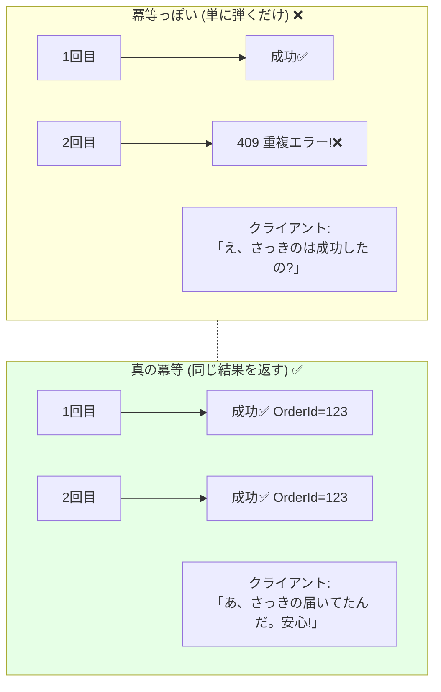

# 第18章：冪等性① まず概念（同じ要求でも壊れない）🛡️🔑

## 18.1 今日のゴール🎯✨

この章が終わったら、次ができるようになります😊🌸

* 「冪等性（べきとうせい）」が **なぜ分散で必須**なのか説明できる🗣️✨
* 「同じ操作が2回届く」を前提に、**壊れない仕様の言い方**ができる📄✅
* CampusCafe（学食モバイルオーダー）で、**冪等が必要な場所**を見つけられる🔎☕📱

---

## 18.2 分散の世界は「同じのが何回も来る」📨📨😇

分散システムでは、これが普通に起きます👇

* 通信が遅くて、クライアントが **「失敗したかも？」** と思って再送する🐢🔁
* サーバ側は実は成功してたのに、返事が届かず **もう1回** が来る📡😵‍💫
* メッセージングは **「少なくとも1回届く」** を採用することが多く、重複が前提📬📬

たとえば Azure Event Grid は「イベントを少なくとも1回」届けようとして、失敗するとリトライします📨🔁。 ([Microsoft Learn][1])
Amazon SQS（Standard）も「少なくとも1回」配送で、状況により同じメッセージが複数回届くことがあるので、**重複をさばける設計（冪等）**が推奨されています📦✅。 ([AWS Documentation][2])

---

## 18.3 冪等性ってなに？（超ざっくり）🧠✨


冪等性（Idempotency）はひとことで言うと👇

> **同じ要求が何回届いても、結果（サーバの状態）が1回分と同じになる性質**🛡️

HTTP の世界でも「冪等」の定義があって、**同じリクエストを複数回しても、1回と同じ効果になる**のが冪等だよ、と説明されています📘✨。 ([RFCエディタ][3])

### たとえ話でつかむ🍟🎫

* エレベータの「上」ボタンを連打しても、エレベータが3台来たら困るよね？😇
  → **1回押したのと同じ結果**にしたい
* 注文ボタンを2回タップしちゃっても、**注文が2件になったら事故**😱☕
  → **1回分だけ**にしたい

---

## 18.4 CampusCafeで冪等が欲しい場所☕📱🔎

「2回来たら困る」操作は、だいたい冪等が必要です🛡️✨

| 操作（例）                    | 2回起きたら何がヤバい？😱 | 冪等のゴール🎯    |
| ------------------------ | -------------- | ----------- |
| 注文確定（PlaceOrder）🧾       | 注文が二重になる       | 注文は1件だけ     |
| 決済確定（CapturePayment）💳   | 二重請求           | 課金は1回だけ     |
| 在庫確保（ReserveStock）📦     | 在庫が二重に減る       | 引き当ては1回だけ   |
| キャンセル（CancelOrder）↩️     | 二重キャンセルで状態が壊れる | キャンセル後はそのまま |
| 通知送信（SendNotification）🔔 | 同じ通知が連打される     | 「同じ通知」は1回分に |

**ポイント**：
「増える」「引かれる」「作られる」系（副作用がある）は、重複に弱いです💥😵‍💫

---

## 18.5 ミニ演習：まず“壊れる”を体験しよう💥😈

### お題：注文APIを2回叩いたらどうなる？

1回目：注文が作られる✅
2回目：同じ注文がまた作られる❌（二重注文）

この「壊れ方」を見た上で、次で「壊れない」へ直します🛡️✨

---

## 18.6 ミニ演習：冪等な注文API（最小）🧩🛡️

ここでは「同じ操作」を見分けるために **`Idempotency-Key`** を使います🔑✨
（詳細設計は次章でガッツリやるので、今は“概念を体に入れる”のが目的だよ😊）

### コード（.NET 10 Minimal API / C# 14）💻✨

.NET 10 は LTS として提供され、Visual Studio 2026 などから利用できます📦✨。 ([Microsoft for Developers][4])
C# 14 は .NET 10 でサポートされています🧠✨。 ([Microsoft Learn][5])

```csharp
using System.Collections.Concurrent;

var builder = WebApplication.CreateBuilder(args);
var app = builder.Build();

// 「このIdempotency-Keyは処理済み？」を覚えておく場所（最小のデモ）
// ※本番はDBや分散キャッシュなどで永続化することが多いよ（次章で！）
var processed = new ConcurrentDictionary<string, OrderResponse>();

app.MapPost("/orders", (HttpRequest request, OrderRequest body) =>
{
    // 1) クライアントから「この操作の札（キー）」を受け取る
    if (!request.Headers.TryGetValue("Idempotency-Key", out var keyValues))
        return Results.BadRequest(new { message = "Idempotency-Key ヘッダーが必要です🗝️" });

    var key = keyValues.ToString().Trim();
    if (string.IsNullOrWhiteSpace(key))
        return Results.BadRequest(new { message = "Idempotency-Key が空です🗝️" });

    // 2) すでに処理済みなら「同じ結果」を返す（＝二重に作らない）
    if (processed.TryGetValue(key, out var existing))
        return Results.Ok(existing);

    // 3) まだなら1回だけ作る
    var created = new OrderResponse(
        OrderId: Guid.NewGuid(),
        Status: "Created",
        CreatedAt: DateTimeOffset.UtcNow,
        MenuId: body.MenuId,
        Quantity: body.Quantity
    );

    // 4) 作った結果を「処理済み」として登録
    // 競合したら、先に登録した方の結果を返す
    if (!processed.TryAdd(key, created))
        return Results.Ok(processed[key]);

    return Results.Created($"/orders/{created.OrderId}", created);
});

app.Run();

record OrderRequest(string MenuId, int Quantity);

record OrderResponse(
    Guid OrderId,
    string Status,
    DateTimeOffset CreatedAt,
    string MenuId,
    int Quantity
);
```

### 試し方（Windows）🪟🔁

**同じ `Idempotency-Key` で2回送る**のがコツです🔑✨

**A. PowerShell でキーを作って2回送る🧪**

```powershell
$key = [guid]::NewGuid().ToString()

# 1回目（作られる）
Invoke-RestMethod -Method Post -Uri "http://localhost:5000/orders" `
  -Headers @{ "Idempotency-Key" = $key } `
  -ContentType "application/json" `
  -Body '{"menuId":"sandwich","quantity":1}'

# 2回目（同じ結果が返る＝二重に作られない）
Invoke-RestMethod -Method Post -Uri "http://localhost:5000/orders" `
  -Headers @{ "Idempotency-Key" = $key } `
  -ContentType "application/json" `
  -Body '{"menuId":"sandwich","quantity":1}'
```

観察ポイント👀✨

* **OrderId が同じ**なら成功🎉（「同じ操作」は1回分だけ）
* 2回目で 200 OK になってもOK（大事なのは“状態が壊れない”こと）🛡️

---

## 18.7 “冪等っぽい”と“冪等”の違い⚠️😵‍💫



よくある「惜しい」パターン👇


* ❌ 2回目は「重複です！」で 409 を返すだけ
  → クライアントは「結局、成功したの？失敗したの？」で混乱しやすい😵‍💫
* ✅ 2回目は **1回目と同じ結果**（少なくとも同じ OrderId / 状態）を返す
  → リトライが安全になる🔁🛡️

Stripe みたいに「同じキーなら、最初のレスポンス（成功でも失敗でも）を保存して同じ結果を返す」方式があるのは、この問題を潰すためだよ📦🔁。 ([Stripeドキュメント][6])

---

## 18.8 チェックリスト✅🛡️

APIや処理を見たら、まずこれを確認します😊✨

* 「これ2回来たら困る？」（二重注文・二重課金・二重減算…）😱
* “同じ操作”を識別できる？（操作の札：キー）🔑
* 2回目に来たとき、**1回目と同じ結果**を返せる？📦
* 重複が来ても、在庫・金額・状態が壊れない？📦💳🚦

---

## 18.9 AI活用プロンプト例🤖📝✨

そのままコピペで使えるやつです😊🌸

### ① 冪等性が必要な操作リストを作る🔎

```text
CampusCafe（注文・在庫・決済・通知）で「重複したら事故になる操作」を列挙して。
各操作について「事故の内容」と「冪等にするゴール（何が1回だけであるべきか）」も書いて。
```

### ② 仕様の言い方に直す📄✨

```text
次の仕様文を「冪等性のある仕様文」に書き換えて。
- 注文確定API
- 決済確定API
- 在庫確保API
ユーザー向けの期待（2回押しても1回分）も入れて。
```

### ③ テストケースを作る🧪🔁

```text
「同じIdempotency-Keyで2回送る」「別キーで2回送る」「途中でタイムアウトしてリトライ」など、
冪等性を壊しやすい観点のテストケースを10個作って。
期待結果も書いて。
```

---

## 18.10 まとめ（覚える一言）✨🛡️

* 分散では **重複は起きる前提**📨📨
* だから **「同じ要求でも壊れない」= 冪等性**が必要🛡️🔑
* ゴールは「2回届いても、結果（状態）が1回分と同じ」🎯✨

次章では、この「札（キー）」を **どう作る？どこに保存する？いつ捨てる？** を設計として固めます🔑🗃️✨

[1]: https://learn.microsoft.com/en-us/azure/event-grid/delivery-and-retry?utm_source=chatgpt.com "Event Grid message delivery and retry - Azure"
[2]: https://docs.aws.amazon.com/AWSSimpleQueueService/latest/SQSDeveloperGuide/sqs-queue-types.html?utm_source=chatgpt.com "Amazon SQS queue types - Amazon Simple Queue Service"
[3]: https://www.rfc-editor.org/rfc/rfc9110.html?utm_source=chatgpt.com "RFC 9110: HTTP Semantics"
[4]: https://devblogs.microsoft.com/dotnet/announcing-dotnet-10/?utm_source=chatgpt.com "Announcing .NET 10"
[5]: https://learn.microsoft.com/en-us/dotnet/csharp/whats-new/csharp-14?utm_source=chatgpt.com "What's new in C# 14"
[6]: https://docs.stripe.com/api/idempotent_requests?utm_source=chatgpt.com "Idempotent requests | Stripe API Reference"
