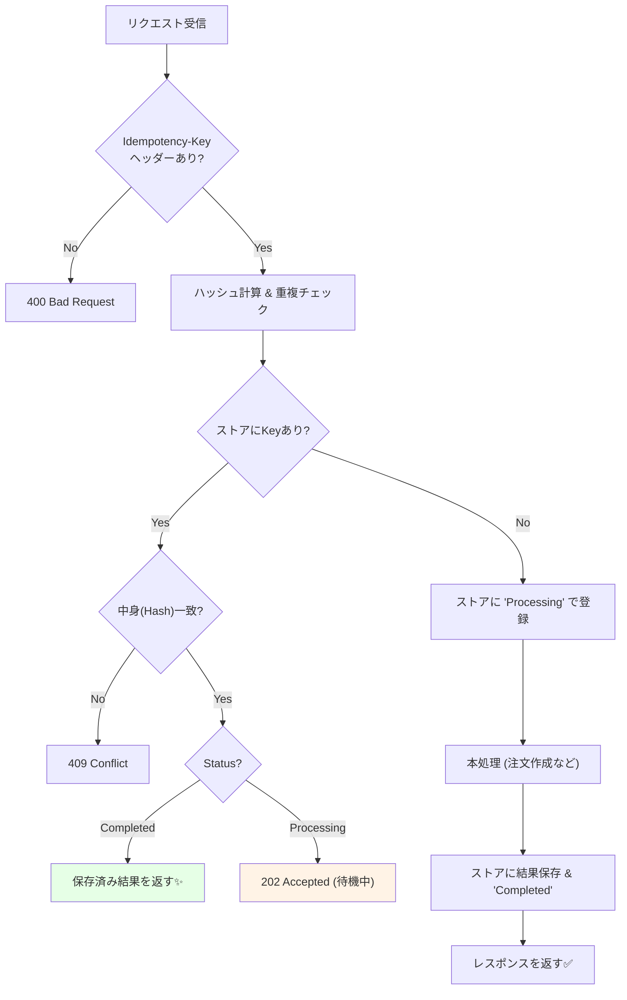

# 第19章：冪等性② 冪等キーと重複排除の基本設計🔑🗃️

## この章でできるようになること🎯✨

* 「同じ注文が2回送られても、**注文が増えない**」設計ができる🛡️
* **Idempotency-Key（冪等キー）**を使って、重複リクエストを安全にさばける🔑
* キーの保存・期限・衝突・同時実行（同じ瞬間に2回）まで、基本の考え方がわかる🚦

---

## 1) なんで“冪等キー”が必要なの？📨📨😇


分散・ネットワークの世界では、こういうのが日常茶飯事です🍵

* 通信が切れたっぽい→アプリが**再送**する📶🔁
* タップ連打→**同じ注文が2回**飛ぶ👉👉💥
* サーバが返事する前にタイムアウト→クライアントが再試行⏱️🐢

ここで「POST /orders」がそのままだと…
**注文が2つ作られて、在庫も2回減って、決済も2回…** みたいな地獄が起きます😵‍💫💳📉

そこで登場するのが **Idempotency-Key（冪等キー）** 🔑✨
「このリクエストは“これ”だよ」という一意な印をつけて、サーバが重複を見抜けるようにします🕵️‍♀️

---

## 2) Idempotency-Key って何？🔑🤔

超ざっくり言うと👇

* クライアントが **一意なキー** を作る（例：GUID）🧬
* リクエストにそのキーを付ける（多くは `Idempotency-Key` ヘッダー）📩
* サーバは「そのキー、前に処理した？」を確認👀

  * してた → **前回と同じ結果**を返す（再実行しない）✅
  * してない → 普通に処理して、結果をキーと一緒に保存🗃️

実際に決済APIなどでも一般的な作法として使われていて、キーの作り方として **UUID v4** を勧めたり、キー長や保存期間の考え方も提示されています🧾🔑 ([Stripeドキュメント][1])

---

## 3) CampusCafeだと、どこで使う？☕📱

まずはここが最優先です👇

### ✅ 注文確定 API（例：`POST /orders`）

* ここは「副作用」が大きい（注文作成・在庫確保・決済…）💥
* だから **重複が起きたら致命傷** になりやすい😇

通知（Pushとか）は、最悪ちょい重複しても「受け手側でまとめる」戦略が取りやすいけど、
注文は“増えたら終わり”なので、キーでガードが超重要です🛡️✨

---

## 4) 基本設計：キーのルールを決めよう📏🔑

ここ、曖昧だと事故りやすいので、先に“ルール化”しちゃいます😊📝

### 4-1. キーは誰が作る？👩‍💻

基本は **クライアント（アプリ側）** で作るのが王道です📱✨
理由：再送するときに **同じキー** を付けないと意味がないから🔁

* 注文確定ボタンを押した瞬間に GUID を作る
* ネットワーク失敗→再送するときも **同じGUIDを再利用**✅
* ユーザーがカート内容を変えたら → **新しいGUID** にする🛒✨

> UUID v4 / ランダム文字列で衝突しにくくするのが定番です🧬 ([Stripeドキュメント][1])

### 4-2. キーはどこに付ける？📩

よくあるのは HTTP ヘッダー👇

* `Idempotency-Key: {key}`

Stripeのドキュメントでもこの名前で案内されています📌 ([Stripeドキュメント][1])

### 4-3. “同じキー”の意味のスコープ🧭


サーバ側では、だいたいこういう単位で「同じ」を判定します👇

* **(ユーザーID + エンドポイント + キー)** をユニークにする

  * 例：`UserId=123` の `POST /orders` で `key=AAA` は1回だけ

※ユーザーIDがないAPIなら、クライアントIDや認証トークン由来の識別子でもOK👌

### 4-4. 同じキーで“違う中身”を送ってきたら？⚠️


これは超危険です💥
「前回はカレー、今回はパスタ」みたいに中身が違うのにキーが同じだと、サーバが迷子になります🌀

なのでルールはこれ👇

* **同じキーは、同じリクエスト内容でのみ再送OK** ✅
* 中身が違うなら **409 Conflict** などでエラーにする🚫

Stripeも「同じキーでパラメータが違うとエラーになる」方針を説明しています🧾 ([Stripeドキュメント][1])

---

## 5) サーバ側の重複排除ストア設計🗃️🧱

冪等キーを受け取ったサーバは、「キーと結果」を保存します📦
これを **Idempotency Store**（冪等ストア）と呼ぶことが多いです😊

### 5-1. 何を保存する？（最低限）✅

* `UserId`（または ClientId）
* `Endpoint`（例：`POST:/orders`）
* `IdempotencyKey`
* `RequestHash`（中身が同じか確認するためのハッシュ）🔍
* `Status`（Processing / Completed / Failed など）🚦
* `ResponseCode`（例：201）
* `ResponseBody`（注文IDなど、返した内容）📦
* `CreatedAt`, `ExpiresAt`（期限）🕰️

### 5-2. “同時に2回来た”問題（並行実行）⚔️


連打やリトライで、**ほぼ同時に同じキー**が来ることがあります📨📨

これを安全にするコツ👇

* DBに **ユニーク制約**（ユニークインデックス）を付ける
* 先に入れた方だけが勝つ🏆
* 後から来た方は「もうあるじゃん！」で既存レコードを読んで同じ結果を返す🔁✅

---

## 6) 期限（TTL）と掃除（クリーンアップ）🧹🕰️


冪等キーはずっと保存すると、ストアが無限に肥大化します🍙📈

だから **期限**を決めます👇

* 例：24時間、48時間、7日など
* 「クライアントが再送してくる可能性のある期間」に合わせる📱🔁

参考として、Stripeはキーの自動削除（少なくとも24時間以上経過したもの）という考え方を示しています🧹 ([Stripeドキュメント][1])

---

## 7) 衝突（Collision）の考え方💥🧬

衝突＝「別の注文なのに、たまたま同じキーになる」事故😱

対策はシンプル👇

* **GUID（UUID v4）**を使う
* ある程度長いランダム文字列を使う
* キーの長さ制限を設ける（例：255文字まで、など）📏

Stripeはキー長（最大255文字）や UUID v4 推奨を明記しています📌 ([Stripeドキュメント][1])

---

## 8) ミニ実装：`POST /orders` を冪等にしてみよう🧩💻

ここでは **Minimal API + EF Core** で、冪等キーを受けて重複排除する最小構成を作ります✨
（EF Core 10 は .NET 10 世代のLTSとして案内されています📌 ([Microsoft Learn][2]) / C# 14 は .NET 10 をサポートしています🧷 ([Microsoft Learn][3])）

### 8-1. エンティティ例（冪等ストア）🗃️

```csharp
public sealed class IdempotencyRecord
{
    public long Id { get; set; }

    public required string UserId { get; set; }               // 認証から取る想定
    public required string Endpoint { get; set; }             // 例: "POST:/orders"
    public required string IdempotencyKey { get; set; }       // ヘッダー値

    public required string RequestHash { get; set; }          // SHA-256等（16進文字列など）
    public required string Status { get; set; }               // "Processing" / "Completed" / "Failed"

    public int? ResponseStatusCode { get; set; }
    public string? ResponseBodyJson { get; set; }             // 返したい内容（注文IDなど）

    public DateTimeOffset CreatedAt { get; set; }
    public DateTimeOffset ExpiresAt { get; set; }
}
```

### 8-2. ユニーク制約（超重要）🔒


```csharp
protected override void OnModelCreating(ModelBuilder modelBuilder)
{
    modelBuilder.Entity<IdempotencyRecord>()
        .HasIndex(x => new { x.UserId, x.Endpoint, x.IdempotencyKey })
        .IsUnique();

    base.OnModelCreating(modelBuilder);
}
```

### 8-3. エンドポイント例（疑似コード寄りで読みやすく）🧠✨



ポイントは「最初にキーを確保してから本処理」です🔑


```csharp
app.MapPost("/orders", async (HttpContext http, AppDbContext db, PlaceOrderRequest req) =>
{
    // 1) Idempotency-Key を読む
    if (!http.Request.Headers.TryGetValue("Idempotency-Key", out var keyValues))
        return Results.BadRequest(new { message = "Idempotency-Key header is required." });

    var idemKey = keyValues.ToString().Trim();
    if (string.IsNullOrWhiteSpace(idemKey) || idemKey.Length > 255)
        return Results.BadRequest(new { message = "Invalid Idempotency-Key." });

    // 2) スコープ情報（例：認証ユーザー）
    var userId = http.User.Identity?.Name ?? "demo-user";
    var endpoint = "POST:/orders";

    // 3) リクエストのハッシュ（同じキーで中身が違うのを検出する）
    var requestHash = RequestHashUtil.Sha256AsHex(req);

    var now = DateTimeOffset.UtcNow;
    var expiresAt = now.AddHours(48); // 例：48時間

    // 4) まずストアに「Processing」で登録を試みる（ユニーク制約で競争に勝った人だけ通る）
    IdempotencyRecord record;
    try
    {
        record = new IdempotencyRecord
        {
            UserId = userId,
            Endpoint = endpoint,
            IdempotencyKey = idemKey,
            RequestHash = requestHash,
            Status = "Processing",
            CreatedAt = now,
            ExpiresAt = expiresAt
        };

        db.IdempotencyRecords.Add(record);
        await db.SaveChangesAsync();
    }
    catch (DbUpdateException)
    {
        // 既に同じキーが存在する（=重複 or 同時リクエスト）
        var existing = await db.IdempotencyRecords
            .Where(x => x.UserId == userId && x.Endpoint == endpoint && x.IdempotencyKey == idemKey)
            .SingleAsync();

        // 中身が違うなら拒否
        if (existing.RequestHash != requestHash)
            return Results.Conflict(new { message = "Idempotency-Key reused with different request body." });

        // 既に完了していれば、そのまま同じ結果を返す
        if (existing.Status == "Completed")
        {
            return Results.Json(
                data: JsonSerializer.Deserialize<object>(existing.ResponseBodyJson!),
                statusCode: existing.ResponseStatusCode ?? 200
            );
        }

        // まだ処理中なら、クライアントに「待ってね」を返す（設計次第でポーリング or 202）
        return Results.Accepted(new { message = "Request is being processed. Please retry later." });
    }

    // 5) ここから本処理（例：注文作成）
    // ※本当は「注文テーブル」へ保存し、注文IDを作る、在庫確保へ、など…
    var orderId = Guid.NewGuid().ToString("N");

    var response = new { orderId, status = "Created" };

    // 6) 結果をストアへ保存して Completed にする
    record.Status = "Completed";
    record.ResponseStatusCode = StatusCodes.Status201Created;
    record.ResponseBodyJson = JsonSerializer.Serialize(response);

    await db.SaveChangesAsync();

    return Results.Created($"/orders/{orderId}", response);
});
```

### 8-4. RequestHash ユーティリティ例🔍

「同じ内容か？」の比較なので、最初は雑でOKです👌
（慣れてきたら“順序が変わっても同じ”にするなど強化💪）

```csharp
public static class RequestHashUtil
{
    public static string Sha256AsHex<T>(T obj)
    {
        var json = JsonSerializer.Serialize(obj);
        var bytes = System.Security.Cryptography.SHA256.HashData(System.Text.Encoding.UTF8.GetBytes(json));
        return Convert.ToHexString(bytes); // 16進文字列
    }
}
```

---

## 9) よくある落とし穴まとめ⚠️🧨

* **キーをサーバが生成**しちゃう → 再送で同じキーにならず意味が薄い🙅‍♀️
* **ユニーク制約なし** → 同時2回で両方通って二重注文💥
* **同じキーで中身違いを許す** → 「何の結果返すの？」事故🌀
* **期限なし** → ストアが無限に増殖📈🍙
* **Processing中の扱いが未定** → クライアントが困る（202返す/待つ/ポーリングなど決める）📱😵‍💫

---

## 10) ミニ演習（手を動かすやつ）🧪✨

### 演習A：重複排除が効くか確認🔁✅

1. 同じ `Idempotency-Key` で `POST /orders` を2回送る📨📨
2. 1回目：201 + orderId
3. 2回目：**同じ orderId が返る**（または Completed を返す）🎉

### 演習B：同じキーで中身を変えてみる🍛➡️🍝

* 同じキーで `items` を変える
* **409 Conflict** になることを確認⚠️✅

### 演習C：Processing中の挙動を決める🚦

* 「処理中なら 202」以外にも案を出す

  * 例：短時間だけ待ってから Completed を返す、など⏳✨

---

## 11) AI活用プロンプト例🤖📝✨


* 「学食注文の `Idempotency-Key` のルール（生成タイミング・再利用条件・期限）を、初心者向けに箇条書きで整理して」🍀
* 「このテーブル設計で不足しがちなカラムやインデックス案を出して」🗃️🔍
* 「Processing中の返し方（202/ポーリング/待機）を、ユーザー体験が良い順に提案して」📱🌸
* 「同じキーで中身が違う時の、エラー文言をやさしく10個」💬✨

---

## まとめ🎀

* 冪等キーは「重複が当たり前」の世界で、**二重注文を防ぐ最重要ガード**🛡️🔑
* サーバは「キー + 結果」を保存して、重複は**前回と同じ結果を返す**🔁✅
* 設計のキモはこの4つ👇

  * **ユニーク制約**🔒
  * **中身違いは拒否**⚠️
  * **期限（TTL）**🕰️
  * **同時実行（競合）対策**⚔️

次章では、この冪等キーだけだと守りきれない場面も出るので、**状態遷移（State Machine）**でさらに堅くしていきます🚦🧠✨

[1]: https://docs.stripe.com/api/idempotent_requests?utm_source=chatgpt.com "Idempotent requests | Stripe API Reference"
[2]: https://learn.microsoft.com/en-us/ef/core/what-is-new/ef-core-10.0/whatsnew?utm_source=chatgpt.com "What's New in EF Core 10"
[3]: https://learn.microsoft.com/en-us/dotnet/csharp/whats-new/csharp-14?utm_source=chatgpt.com "What's new in C# 14"
