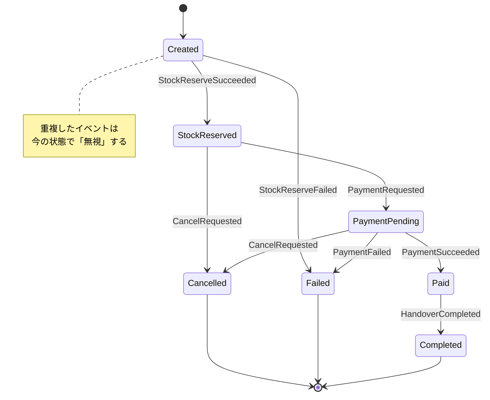

# 第20章：冪等性③ 状態遷移（State Machine）で二重適用を防ぐ🚦🧠

## 20.0 まずは“事故”を想像しよ…😇💥

CampusCafeでありがちな事故👇

* 決済成功イベントが **同じ内容で2回届く** 📩📩
* リトライで **同じAPIが2回叩かれる** 🔁
* ネットワーク都合で **順番が逆に届く** 🔀

このとき、設計が甘いと…

* 二重決済💳💳（最悪）
* 在庫が二重に減る📦📦
* 通知が2回飛ぶ🔔🔔

ここで活躍するのが **状態遷移（ステートマシン）** だよ〜🚦✨
「今この状態なら、このイベントは受けていい／ダメ」を **ルール化** して、**2回目を弾く**（or 無害化）する感じ😊🛡️

---

## 20.1 この章のゴール🎯✨

* 注文（Order）の「状態」を決める📋
* 「状態→イベント→次の状態」を表にする🧾
* 実装で **二重適用を防ぐ**（超重要ポイント：DBで守る）🗃️🛡️
* テストで「2回来ても壊れない」を確認✅🧪

---

## 20.2 ステートマシンが冪等性に効く理由🛡️🚦


冪等性って「同じことが複数回起きても結果が壊れない」だったよね🙂
でも現実は、冪等キーだけでは守りきれない場面があるの。

例👇

* API入口では冪等キーで弾けても、**内部のイベント処理** が2回走ることがある📩📩
* “処理途中”のイベントが来て、**同じ状態更新が二重で適用** されることがある🔁

だから、**状態のルール**を持つのが強い💪✨

* 「Createdの注文に、PaymentSucceededが来たらPaidへ」✅
* 「すでにPaidなら、PaymentSucceededは無視」✅（＝冪等！）
* 「Cancelledなら、何が来ても無視」✅（終端状態！）

---

## 20.3 CampusCafeの注文状態を決めよう☕📱📦

まずは“増やしすぎない”がコツだよ〜😺✨
今回はわかりやすさ重視でこの7つ👇

* Created（注文できた）🆕
* StockReserved（在庫確保できた）📦✅
* PaymentPending（決済中）⏳💳
* Paid（支払い完了）💳✅
* Completed（受け渡し完了）🎉
* Cancelled（キャンセル確定）🛑
* Failed（失敗で終了）💥

> 💡「Cancelled / Failed / Completed」は **終端状態**（Terminal）にすると楽😊
> ここに入ったら基本 “もう動かさない” 🚪🔒

---

## 20.4 遷移表（これが仕様のコア）📋✨



「状態 × イベント → 次の状態」を表にすると、迷子になりにくいよ🗺️💕


| 現在の状態                                    | 受け取るイベント（トリガ）         | 次の状態           | 2回目が来たら？                 |
| ---------------------------------------- | --------------------- | -------------- | ------------------------ |
| Created                                  | StockReserveSucceeded | StockReserved  | すでにStockReserved以上なら無視✅  |
| Created                                  | StockReserveFailed    | Failed         | 終端なので以後無視✅               |
| StockReserved                            | PaymentRequested      | PaymentPending | すでにPaymentPending以上なら無視✅ |
| PaymentPending                           | PaymentSucceeded      | Paid           | すでにPaid以上なら無視✅           |
| PaymentPending                           | PaymentFailed         | Failed         | 終端なので以後無視✅               |
| Paid                                     | HandoverCompleted     | Completed      | すでにCompletedなら無視✅        |
| Created / StockReserved / PaymentPending | CancelRequested       | Cancelled      | すでに終端なら無視✅               |

ここで大事なのは👇

* **「許可される遷移」以外は拒否 or 無視**🚫
* **2回目は“成功扱いで無視”** にすると運用が安定しやすい😊（イベントは“少なくとも1回”の世界なので）

---

## 20.5 実装は3択！おすすめ順にいくよ🧩✨

### A) DBの条件付き更新（いちばん強い）🗃️💪

複数サーバでも効くし、同時実行に強い！
やることは超シンプル👇

* 「注文IDが一致」かつ「現在の状態が期待通り」なら更新する
* 更新件数が0なら、**二重・順不同・競合** なので “無害化”（無視/扱い分け）

### B) コードのswitchで守る（最小構成）🔀

単体ではわかりやすいけど、**同時実行** で負けやすいので
AのDB条件付き更新とセットが安心😊

### C) ライブラリ（Stateless）を使う🧠📦

状態遷移の宣言がキレイに書ける✨（人気ライブラリ）
ただし、**最終防衛線はDB** に置くのが鉄板だよ〜🛡️
（Stateless自体は .NET のコードで状態機械を作れるライブラリだよ） ([GitHub][1])

---

## 20.6 ハンズオン：DBで“二重適用を防ぐ”実装🛠️✨

ここでは **「PaymentSucceededが2回届いてもPaidは1回だけ」** を作るよ💳✅

### 20.6.1 ドメイン（状態の定義）🚦

```csharp
public enum OrderStatus
{
    Created = 0,
    StockReserved = 1,
    PaymentPending = 2,
    Paid = 3,
    Completed = 4,
    Cancelled = 5,
    Failed = 6
}
```

### 20.6.2 “状態遷移”をDB条件付き更新で守る🗃️🛡️

EF Core の「条件に合う行だけ更新」を使うと、すっごく安全にできるよ😊
（EF Core 10 は .NET 10 向けで、2025年11月のLTSリリース） ([Microsoft Learn][2])

```csharp
using Microsoft.EntityFrameworkCore;

public sealed class OrdersService
{
    private readonly AppDbContext _db;
    public OrdersService(AppDbContext db) => _db = db;

    // ✅ 期待する状態（expected）から次の状態（next）へ遷移できたら true
    public async Task<bool> TryTransitionAsync(
        Guid orderId,
        OrderStatus expected,
        OrderStatus next,
        CancellationToken ct)
    {
        var updated = await _db.Orders
            .Where(o => o.Id == orderId && o.Status == expected)
            .ExecuteUpdateAsync(setters => setters
                .SetProperty(o => o.Status, next)
                .SetProperty(o => o.UpdatedAtUtc, DateTime.UtcNow),
                ct);

        return updated == 1; // 1件更新できた = 初回だけ成功
    }
}
```

✅ これが何を守ってるかというと…

* 初回：Status=PaymentPending なので Paid に更新できる → updated=1
* 2回目：もう Status=Paid なので条件に合わない → updated=0
  → **二重適用が物理的に起きない**🎉🛡️

### 20.6.3 API側は「2回目でも落とさない」がコツ😊🌸

イベントが2回届くのは“正常”なので、2回目は穏やかに扱うと強いよ〜📩✨

```csharp
app.MapPost("/orders/{id:guid}/payment-succeeded", async (
    Guid id,
    OrdersService svc,
    AppDbContext db,
    CancellationToken ct) =>
{
    // PaymentPending → Paid へ遷移を試す
    var applied = await svc.TryTransitionAsync(id, OrderStatus.PaymentPending, OrderStatus.Paid, ct);

    if (applied)
        return Results.Ok(new { id, status = "Paid", applied = true });

    // すでにPaid以上かもしれないので“現状”を返す（冪等）
    var current = await db.Orders
        .Where(o => o.Id == id)
        .Select(o => o.Status)
        .SingleOrDefaultAsync(ct);

    return Results.Ok(new { id, status = current.ToString(), applied = false });
});
```

> 💡「2回目はOKで返す」= リトライしやすい／運用が荒れにくい😊
> エラーにしたいケースは「順不同で危険」みたいな時だけに絞ると安定しやすいよ🚥

---

## 20.7 ミニ演習：遷移表を“穴なく”完成させよう📋🧩✨

### 演習1：終端状態ルールを追加🧱🔒

* Completed / Cancelled / Failed に来たイベントは全部「無視」でOK？
* 「返金」や「在庫戻し」が必要なら、どの状態からどこへ行く？💸📦

### 演習2：CancelRequestedの扱いを決める🛑

* PaymentPendingでキャンセル要求が来たらどうする？

  * 「Cancelledへ」だけで済む？
  * 「決済取り消し（補償）」が必要？（次の章のSagaで効いてくるよ🧯）

---

## 20.8 テスト：2回来ても壊れないを証明✅🧪

ポイントは2つだよ👇

* 1回目で遷移できる✅
* 2回目は遷移できないけど、結果は安定✅（同じ最終状態）

```csharp
[Fact]
public async Task PaymentSucceeded_Twice_ShouldApplyOnlyOnce()
{
    // Arrange: PaymentPending の注文を用意
    var id = Guid.NewGuid();
    db.Orders.Add(new Order { Id = id, Status = OrderStatus.PaymentPending });
    await db.SaveChangesAsync();

    // Act: 1回目
    var first = await svc.TryTransitionAsync(id, OrderStatus.PaymentPending, OrderStatus.Paid, CancellationToken.None);

    // Act: 2回目（同じイベントが再配達された想定）
    var second = await svc.TryTransitionAsync(id, OrderStatus.PaymentPending, OrderStatus.Paid, CancellationToken.None);

    // Assert
    first.Should().BeTrue();
    second.Should().BeFalse();

    var status = await db.Orders.Where(o => o.Id == id).Select(o => o.Status).SingleAsync();
    status.Should().Be(OrderStatus.Paid);
}
```

---

## 20.9 よくある落とし穴（ここ踏みがち）😵‍💫🕳️

* 状態が増えすぎて、表が破綻する📈💥
  → まずは少なめ＋後から追加が安全😊
* 「画面の表示状態」と「業務の状態」を混ぜる🌀
  → 状態は“業務の事実”に寄せると強いよ🧾✨
* DBで守らず、メモリ上のifだけで防ごうとする⚠️
  → サーバが複数だと負けやすいので、**DB条件付き更新**が最強🛡️

---

## 20.10 運用・監視のコツ📈👀✨

「2回目が来た」自体は普通だから、**数を見える化**すると安心😊
おすすめログ（最低限）👇

* orderId
* currentStatus
* trigger（例：PaymentSucceeded）
* applied（適用した？無視した？）

おすすめメトリクス👇

* 遷移成功数✅
* 遷移無視数（重複）📩📩
* 遷移拒否数（順不同/異常）🚫🔀

重複が急に増えたら「通信不安定」「キュー再配達増」みたいなサインになったりするよ📡💡

---

## 20.11 AI活用（チェックが爆速になるやつ）🤖✨

コピペして使えるよ〜🩷

* 「この遷移表で“漏れてるイベント”や“危険な遷移”を指摘して。終端状態の扱いも確認して」🧠🔍
* 「PaymentSucceededが重複/順不同で届く前提で、APIの戻り値（HTTPコード）設計をレビューして」📬🚥
* 「Statelessで同じ遷移を宣言的に書く例を出して。DB条件付き更新と併用する設計で」🧩🛡️

---

## 20.12 この章のまとめ🎀✨

* 分散では「同じイベントが2回」は日常📩📩
* ステートマシンで「受けていい遷移」だけ許可🚦
* **最終防衛線はDB**（条件付き更新で二重適用を物理的に防ぐ）🗃️🛡️
* 2回目は“穏やかに無視”が運用強い😊🌸

（ちなみに今どきの .NET は .NET 10 がLTSで、C# 14 が .NET 10 上で最新として案内されてるよ✨） ([Microsoft for Developers][3])

[1]: https://github.com/dotnet-state-machine/stateless?utm_source=chatgpt.com "dotnet-state-machine/stateless: A simple library for creating ..."
[2]: https://learn.microsoft.com/en-us/ef/core/what-is-new/ef-core-10.0/whatsnew?utm_source=chatgpt.com "What's New in EF Core 10"
[3]: https://devblogs.microsoft.com/dotnet/announcing-dotnet-10/?utm_source=chatgpt.com "Announcing .NET 10"
