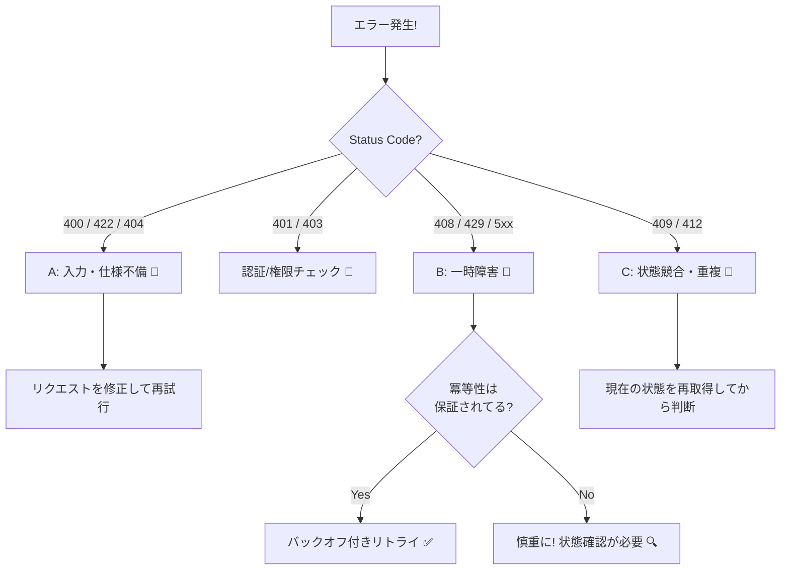

# 第21章：エラー分類（リトライしていい？ダメ？）🚥⚠️

分散システムって、**失敗が「たまに」じゃなくて「普通に起きる」**世界なんだよね…😇📡
だから大事なのは、失敗した瞬間にこう判断できること👇

* 🔁 **リトライしてOK？**（待てば直る系？）
* ⛔ **リトライしちゃダメ？**（入力ミス・仕様違反系？）
* 🧩 **まず状態確認？**（二重処理や競合がありえる系？）

この章では、CampusCafe（学食モバイルオーダー☕📱）の例で「エラーを見た瞬間の判断力」を作るよ〜✨

---

## 1. まず結論：エラーは “3つに分ける” のが最強🧠✨


### A) 入力・依頼の問題（基本リトライ❌）📝🚫

* ユーザーが変な値を入れた
* 必須項目が足りない
* ルール違反（在庫ゼロなのに購入 など）

👉 **同じリクエストを何回送っても、結果は変わらない**タイプ。
だから **直すべきは「入力」「仕様」「画面」**だよ💡

---

### B) 一時的な障害（リトライ✅）⏳🔁

* ネットワークが一瞬詰まった📶💦
* サーバーが混雑してる🐢
* 相手が一時的に落ちてる💥

👉 **待てば直る可能性がある**タイプ。
ただし、**連打は最悪**（相手をさらに潰す）なので、次章の「バックオフ＋ジッター」へつながるよ🔁🌪️

---

### C) 状態競合・重複が絡む（リトライより “状態確認/再取得” が先）🧩🔍

* 「もう処理済み」かもしれない（二重送信）📨📨
* 同時更新で競合（ラスト1個の在庫争奪戦）📦⚔️

👉 **“とりあえずリトライ” すると二重課金💳💥とか起きる**ので、
**冪等キー（第19章）＋状態遷移（第20章）**が効いてくるよ🛡️🔑🚦

---


## 2. HTTPステータスでの “だいたい判定” ルール📡📘



HTTPはステータスコードで「何が起きたか」をざっくり伝える仕組みだよ〜📨

（仕様の定義は RFC 9110 がベースだよ📘） ([RFCエディタ][1])

### ✅ リトライ候補になりやすい（基本：一時障害）🔁

* **408 Request Timeout**：サーバー側が待ちきれなかった⏱️
* **429 Too Many Requests**：今は混みすぎ！（レート制限）🚦
* **500 / 502 / 503 / 504**：サーバー都合の失敗💥🖥️

特に **503** などでは **Retry-After** ヘッダーで「何秒待ってね」が来ることがあるよ⏳✨（HTTP-date や秒数で指定） ([Mako][2])

---

### ❌ リトライしない（基本：入力・仕様）🚫

* **400 Bad Request**：リクエストが変（入力ミス/形式ミス）📝
* **401 Unauthorized**：認証が必要（※後述）🔑
* **403 Forbidden**：権限がない🚪
* **404 Not Found**：対象がない🔎
* **422 Unprocessable Entity**：値は読めるけどルール違反🧾⚠️

---

### 🔶 “条件付き”：リトライというより「手順が必要」🧩


* **401 Unauthorized**：

  * 🔁 *トークン更新 → 1回だけ再実行* はアリ（同じまま連打はナシ）
* **409 Conflict**：

  * 競合・二重・在庫争奪戦の匂い🔥
  * 👉 **状態再取得（GET）→ 次の手** が基本
* **412 Precondition Failed**：

  * ETagなどの前提条件が崩れた（誰かが先に更新した）🧩
  * 👉 **再取得→再適用** の流れ

---

## 3. CampusCafeで “どれが何？” を具体例で覚える☕📱✨


### 注文（Order）🧾

* 📝 **400/422**：メニューIDが変、数量が0、受取時刻が営業時間外
  👉 入力修正が必要（リトライ❌）
* 🧩 **409**：同じ注文IDで2回送った / すでに確定済み
  👉 注文状態を取り直す（GET）＋冪等処理が大事✅

### 在庫（Stock）📦

* 🧩 **409**：ラスト1個が取られた
  👉 画面で「売り切れ」表示へ😭📦
* 🔁 **503**：在庫サービスが一時落ち
  👉 少し待って再試行（ただしバックオフ）🐢

### 決済（Payment）💳

* 🔁 **504**：タイムアウト（結果が不明…！）😱
  👉 **“決済状態照会”** を用意して、二重課金を避けるのが王道🧾🔍
* 📝 **400/422**：カード情報の形式エラー等
  👉 修正して再実行（リトライではない）

### 通知（Notification）🔔

* 🔁 **429**：今は送りすぎ！
  👉 Retry-After があれば尊重して待つ⏳
* 🔁 **503**：通知サービスが落ちてる
  👉 キューに積んで後で送る（AP寄り）📨✨

---

## 4. ミニ演習：このエラー、どの箱？📊🧠✨

次のケースを **A/B/C** に分類してみてね👇（答えは下にあるよ🙈）

1. 注文APIが **400**（menuId が空）
2. 決済APIが **504**（タイムアウト、課金されたか不明）
3. 通知APIが **429**（Retry-After: 20）
4. 在庫APIが **409**（conflict）
5. 注文APIが **503**（Service Unavailable）

**答え**🎉

1. A（入力）📝🚫
2. C（状態確認が先）💳🔍
3. B（待って再試行）⏳🔁
4. C（競合なので再取得して判断）📦🧩
5. B（一時障害）🖥️🔁

---

## 5. C#で “エラー分類” をコードにする（超実用）🛠️✨


ここでは「例外/HTTPレスポンス」を受け取って、**どう動くべきか**を返すミニ設計にするよ😊

### 5.1 分類の型を作る📦

```csharp
public enum ErrorKind
{
    Input,          // 入力・仕様の問題（リトライしない）
    Transient,      // 一時障害（リトライ候補）
    Concurrency,    // 競合・状態確認が必要
    Auth,           // 認証（更新して再試行など）
    Unknown         // どれか不明（慎重に）
}

public enum NextAction
{
    FixRequest,     // 入力修正・画面へ戻す
    RetryWithBackoff,
    RefreshAndRetry,
    FetchStateAndDecide,
    FailAndAlert
}

public sealed record ErrorDecision(
    ErrorKind Kind,
    NextAction Action,
    string Reason
);
```

---

### 5.2 HTTPステータスから分類する📨🔍

```csharp
using System.Net;

public static class HttpErrorClassifier
{
    public static ErrorDecision Classify(HttpStatusCode code)
    {
        return code switch
        {
            // 入力・仕様（リトライしても意味なし）
            HttpStatusCode.BadRequest => new(ErrorKind.Input, NextAction.FixRequest, "400: リクエストが不正"),
            HttpStatusCode.NotFound => new(ErrorKind.Input, NextAction.FixRequest, "404: 対象が見つからない"),
            HttpStatusCode.Forbidden => new(ErrorKind.Input, NextAction.FixRequest, "403: 権限がない"),
            HttpStatusCode.UnprocessableEntity => new(ErrorKind.Input, NextAction.FixRequest, "422: ルール違反"),

            // 認証（更新してから 1回だけ再試行、みたいな戦略）
            HttpStatusCode.Unauthorized => new(ErrorKind.Auth, NextAction.RefreshAndRetry, "401: 認証が必要"),

            // 競合（状態確認が先）
            HttpStatusCode.Conflict => new(ErrorKind.Concurrency, NextAction.FetchStateAndDecide, "409: 競合/二重/先勝ちの可能性"),

            // 一時障害（待って再試行）
            HttpStatusCode.RequestTimeout => new(ErrorKind.Transient, NextAction.RetryWithBackoff, "408: タイムアウト"),
            (HttpStatusCode)429 => new(ErrorKind.Transient, NextAction.RetryWithBackoff, "429: レート制限（Retry-After確認）"),
            HttpStatusCode.InternalServerError => new(ErrorKind.Transient, NextAction.RetryWithBackoff, "500: サーバー内部エラー"),
            HttpStatusCode.BadGateway => new(ErrorKind.Transient, NextAction.RetryWithBackoff, "502: ゲートウェイ不良"),
            HttpStatusCode.ServiceUnavailable => new(ErrorKind.Transient, NextAction.RetryWithBackoff, "503: 利用不可（Retry-After確認）"),
            HttpStatusCode.GatewayTimeout => new(ErrorKind.Transient, NextAction.RetryWithBackoff, "504: ゲートウェイタイムアウト"),

            _ => new(ErrorKind.Unknown, NextAction.FailAndAlert, $"想定外: {(int)code}")
        };
    }
}
```

> 408/5xx などの意味（サーバー都合の失敗クラス）は HTTP Semantics に説明があるよ📘 ([RFCエディタ][1])
> Retry-After の扱いも仕様にあるよ⏳ ([Mako][2])

---

### 5.3 例外（ネットワーク/タイムアウト）も分類する📶💥

```csharp
using System.Net.Http;

public static class ExceptionClassifier
{
    public static ErrorDecision Classify(Exception ex, CancellationToken ct)
    {
        // ユーザーがキャンセルしただけ → リトライ不要
        if (ex is OperationCanceledException && ct.IsCancellationRequested)
            return new(ErrorKind.Input, NextAction.FixRequest, "キャンセルされた（ユーザー操作）");

        // タイムアウトっぽい（HttpClientのタイムアウト等）
        if (ex is TaskCanceledException)
            return new(ErrorKind.Transient, NextAction.RetryWithBackoff, "タイムアウトっぽい（TaskCanceledException）");

        // ネットワーク断・DNS・接続拒否など（中身は色々だけど、まず一時障害扱いが多い）
        if (ex is HttpRequestException)
            return new(ErrorKind.Transient, NextAction.RetryWithBackoff, "HTTP通信失敗（HttpRequestException）");

        return new(ErrorKind.Unknown, NextAction.FailAndAlert, $"未分類例外: {ex.GetType().Name}");
    }
}
```

---

## 6. “リトライするなら” 最低限守る4ルール🔁🧯✨


1. 🛡️ **冪等性がある操作だけ**（POSTは冪等キー必須になりがち）
2. ⏳ **バックオフで待つ**（すぐ連打しない）
3. 🌪️ **ジッターでズラす**（みんな同時に突撃しない）
4. 🧯 **Retry-Afterが来たら優先**（429/503で特に大事）

このへんは次章（第22章）でガッツリやるよ🔁📈

---

## 7. API側は “Problem Details” で返すと超きれい✨📦


エラーをクライアントが正しく分類するには、サーバーが **機械可読なエラー**を返してくれると最高だよね🫶
そこで使うのが **Problem Details（RFC 9457）**！
RFC 9457 は、HTTP APIのエラー詳細を共通フォーマットで返す標準で、古い RFC 7807 を置き換えるよ📘✨ ([RFCエディタ][3])

* Content-Type: `application/problem+json`
* 例：`type`, `title`, `status`, `detail` など

---

## 8. AI活用（Copilot / Codex / ChatGPT など）🤖✨


### プロンプト例①：分類表を作る📊

「CampusCafeの機能（注文/在庫/決済/通知）について、起きがちなエラーを20個列挙して、A:入力/B:一時障害/C:状態確認 のどれかに分類して。各行に“ユーザーへの表示文言案”も付けて」

### プロンプト例②：409/504の “危険ケース” を洗い出す💥

「409 Conflict と 504 Timeout が起きた時に、二重課金・二重確保が発生するシナリオを具体例で10個。防止策（冪等キー/状態遷移/照会API）もセットで」

### プロンプト例③：xUnitテスト生成✅

「HttpErrorClassifier.Classify のテストをxUnitで。400/401/409/429/503/504 と unknown のケースを網羅して」

---

## この章のまとめ🎀✨

* エラーはまず **A:入力 / B:一時障害 / C:状態確認** に分けると迷わない🧠✅
* **429/503 は Retry-After を尊重**すると上品⏳✨ ([Mako][2])
* サーバー側は **RFC 9457 Problem Details** で返すと、クライアントが賢く動ける📦🤝 ([RFCエディタ][3])
* 次章は「じゃあリトライをどう設計する？」を、バックオフ/ジッター込みで実装していくよ🔁⏳🌪️

---

[1]: https://www.rfc-editor.org/rfc/rfc9110.html?utm_source=chatgpt.com "RFC 9110: HTTP Semantics"
[2]: https://tex2e.github.io/rfc-translater/html/rfc9110.html?utm_source=chatgpt.com "HTTP Semantics (RFC 9110) 日本語訳"
[3]: https://www.rfc-editor.org/rfc/rfc9457.html?utm_source=chatgpt.com "RFC 9457: Problem Details for HTTP APIs"
