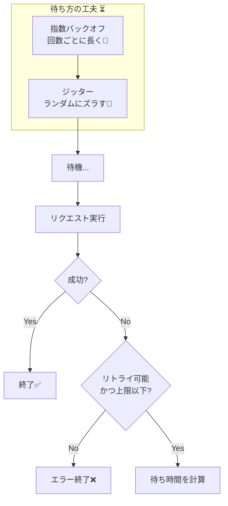

# 第22章：リトライ設計（バックオフ/ジッター/キャンセル）🔁⏳

## 22.1 リトライって何のため？（CampusCafeで起きる“あるある”）☕📱

CampusCafeは「注文→在庫→決済→通知」で外部や別コンポーネントが絡むので、通信が一瞬コケるのは日常茶飯事です😇📡
そこで **“もう一回だけ試す”** のがリトライ。でも、**やり方を間違えると事故ります**💥

* ✅ 直したいこと：一時的な不調（たまたま遅い／瞬断／混雑）で失敗にしない💪✨
* ❌ 事故るやつ：失敗した瞬間に **全員が同じタイミングで再突撃** → サーバがさらに死ぬ😵‍💫🔥

---

## 22.2 まず最重要：リトライしていい失敗／ダメな失敗 🚥⚠️

リトライは「一時的なら効く」「永久にダメなら無駄」です😊

### ✅ リトライしやすい（=一時的っぽい）代表

* サーバ側のエラー（**HTTP 500以上**）
* タイムアウト系（**HTTP 408**）
* 混雑で制限（**HTTP 429**）
* 例外：`HttpRequestException`、`TimeoutRejectedException`（タイムアウト戦略で投げられる）
  ※.NETの標準リトライ方針でも、だいたいこの辺を対象にします📌 ([Microsoft Learn][1])

### ❌ 基本リトライしない（=永久にダメ／仕様エラー）代表

* 入力ミス（400系の多く：例 400/401/403/404 など）🙅‍♀️
* “在庫なし”みたいな業務エラー（もう一回やっても増えない）📦❌
* **二重実行が致命傷になる処理**（後述の「POSTの地雷」）💣

---

## 22.3 “待ち方”が本体：バックオフ（Backoff）⏳📈




失敗した瞬間に「0秒で3回連打！」は一番ダメです😇
**待ち時間を伸ばしながら再試行**します。

代表的な形👇

* **一定（Constant）**：毎回同じ待ち（例：1秒、1秒、1秒…）🕐
* **線形（Linear）**：1秒、2秒、3秒…📏
* **指数（Exponential）**：0.2秒、0.4秒、0.8秒、1.6秒…🚀
  → 分散/外部API相手は、基本これが使いやすいです✨

---

## 22.4 ジッター（Jitter）= “ゆらぎ”で同時突撃を防ぐ 🎲🧯

バックオフだけでも「みんなが同じ待ち→同時に再開」になりがちです😵‍💫
そこで **待ち時間にランダム性（ジッター）を混ぜて、再試行の山（スパイク）を崩す**のがコツです✨

AWSも「ジッターでスパイクを散らして、負荷と総呼び出し回数を大きく減らせる」って説明しています📉🫶 ([Amazon Web Services, Inc.][2])

Pollyでも `UseJitter = true` で「待ち時間にランダム要素」を足せます🎲
特に指数バックオフ＋ジッターは内部で **Decorrelated Jitter Backoff** 系の計算を使う、と明記されています📌 ([PollyDocs][3])

---

## 22.5 キャンセル（Cancellation）= “やめたい”をちゃんと止める 🛑🙋‍♀️

ユーザーが「キャンセル」したのに、裏でリトライが走り続けたら怖いですよね😱
そこで **CancellationToken を最後まで通す**のが大事です✨

* Web APIなら `HttpContext.RequestAborted` を下流まで渡すのが基本🎯
* Pollyのリトライは既定で `OperationCanceledException` は対象外（=キャンセルは止まる）になっています✅ ([PollyDocs][3])
  → なので「キャンセルを握りつぶさない」だけで、かなり安全になります😊

---

## 22.6 “待つ予算”を決めよう（ユーザー体験の設計）💸⏱️

リトライは無限にやるものじゃなくて、**待てる時間の予算**で決めます🧾✨

### 例：CampusCafeの「決済確認」画面（ユーザー待ち）

* 目安：**合計 5〜10秒くらい**で決着させたい（長いと不安）😣
* その中で：

  * 1回あたりの上限（Attempt Timeout）
  * 合計の上限（Total Timeout）
  * リトライ回数（MaxRetryAttempts）
  * 待ち方（Exponential + Jitter）
    をセットにします🎛️


.NETの標準ハンドラーは「合計タイムアウト」「リトライ」「試行タイムアウト」などを **順番に重ねて**持っていて、既定値も公開されています（例：合計30秒、最大再試行3回、指数＋ジッター、遅延2秒…など）📌 ([Microsoft Learn][1])

---

## 22.7 最大の地雷：POSTをリトライすると“二重課金”になりうる 💣💳

たとえば決済APIが `POST /payments` で「課金を作る」タイプだと、
リトライ＝**同じ課金を2回作る**危険があります😇

だから.NET標準でも「危険なHTTPメソッドはリトライ無効にできる」仕組みがあります👇 ([Microsoft Learn][1])

* `DisableFor(HttpMethod.Post, …)`
* `DisableForUnsafeHttpMethods()`（POST/PUT/PATCH/DELETE/CONNECTなどをまとめてOFF）

**じゃあ決済はどうするの？**
→ 第18〜20章でやった **冪等キー（Idempotency-Key）** を入れて「同じ要求は1回だけ」になるなら、POSTでもリトライ可能になります🔑🛡️
（※この章では“設計としてそれを前提にする”のがポイント！）

---

## 22.8 実装：HttpClientに“標準の回復性”を付ける（まずは簡単に）🧩🧰

### ① 安全側：まずは危険メソッドのリトライを切る（初心者向け）✂️

```csharp
using Microsoft.Extensions.Http.Resilience;

var builder = WebApplication.CreateBuilder(args);

builder.Services.AddHttpClient("PaymentClient")
    .AddStandardResilienceHandler(options =>
    {
        // POST等の危険メソッドをまとめてリトライしない（安全側）
        options.Retry.DisableForUnsafeHttpMethods();
    });

var app = builder.Build();
app.Run();
```

※ `DisableForUnsafeHttpMethods()` の例は公式ドキュメントにも載っています📌 ([Microsoft Learn][1])

---

## 22.9 実装：待ち方を“自分で決める”（バックオフ＋ジッター＋タイムアウト）🎛️✨

「決済確認は最大10秒で諦めたい」みたいに、UXから逆算して数値を入れていきます😊

公式ドキュメントの `AddResilienceHandler` 例（Retry + CircuitBreaker + Timeout）をベースに、CampusCafe用に調整してみます👇 ([Microsoft Learn][1])

```csharp
using System.Net;
using Microsoft.Extensions.Http.Resilience;
using Polly;

var builder = WebApplication.CreateBuilder(args);

builder.Services.AddHttpClient("PaymentClient")
    .AddResilienceHandler("PaymentPipeline", static pipeline =>
    {
        // ✅ リトライ：指数バックオフ + ジッター
        pipeline.AddRetry(new HttpRetryStrategyOptions
        {
            BackoffType = DelayBackoffType.Exponential,
            UseJitter = true,
            MaxRetryAttempts = 3,
            // Delay なども状況に応じて調整（画面の待てる時間に合わせる）
        });

        // ✅ 1回の試行の上限（例：1リクエストをだらだら待たない）
        pipeline.AddTimeout(TimeSpan.FromSeconds(2));
    });

var app = builder.Build();
app.Run();
```

ポイント💡

* **指数＋ジッター**は “同時に再突撃” を避けるための定番です🎲🚀 ([Amazon Web Services, Inc.][2])
* キャンセルは `CancellationToken` を渡して握りつぶさなければOK（キャンセルはリトライ対象外が基本）🛑 ([PollyDocs][3])

---

## 22.10 ミニ演習：CampusCafeのリトライ方針を“数字で”決めてみよう 🎛️🧪

### お題：決済サービスが「たまに遅い／たまに429を返す」😵‍💫

**あなたの方針（例）**を、下の表を埋めて決めてください✍️✨

| 項目      |            例 | あなたの案 |
| ------- | -----------: | ----- |
| 最大再試行回数 |           3回 |       |
| 待ち方     |  Exponential |       |
| ジッター    |           ON |       |
| 1回の試行上限 |           2秒 |       |
| 合計の待ち予算 |           8秒 |       |
| 対象エラー   | 500+/408/429 |       |

ヒント🎀

* 429は「混んでるから待ってね」なので、**待ちを長め**にするのが相性良いです（しかもジッターで散らす）🐢🎲
* 500+ / 408 / 429 を対象にするのは、標準方針でも採用されています📌 ([Microsoft Learn][1])

---

## 22.11 ちょい上級：相手が「Retry-After」を返したら、その秒数だけ待ちたい 🕰️📩

Pollyのリトライは「結果から次の待ち時間を取り出す」パターンも紹介されています✨（DelayGeneratorで調整）([PollyDocs][3])
→ 決済/外部APIが `Retry-After` を返す設計なら、かなり賢くなれます😊

---

## 22.12 よくある事故まとめ（これだけ避ければ勝ち）🏆😇

* ❌ 固定待ちで全員が同時再開（スパイク地獄）
  → ✅ ジッターON🎲 ([Amazon Web Services, Inc.][2])
* ❌ POSTを無邪気にリトライして二重処理
  → ✅ 危険メソッドはOFF、もしくは冪等キーで守る🔑🛡️ ([Microsoft Learn][1])
* ❌ キャンセルしても裏で回り続ける
  → ✅ CancellationTokenを通す🛑 ([PollyDocs][3])
* ❌ ずっと待たせる（ユーザーが不安）
  → ✅ 合計の待ち予算を決めて打ち切り⏱️ ([Microsoft Learn][1])

---

## 22.13 AI活用（Copilot / Codex向け）🤖✨

* 「このAPI（決済/在庫/通知）で **リトライ対象にしていい失敗**と、**してはいけない失敗**を列挙して。理由もつけて」🧠
* 「決済確認は最大8秒まで待てる前提で、**指数バックオフ＋ジッター**の待ち時間の例（各試行のタイムライン）を作って」⏳🎲
* 「`AddResilienceHandler` の設定を、**POSTは冪等キー前提で安全にする版／安全側でPOSTを無効にする版**の2つ書いて」🔑🛡️

[1]: https://learn.microsoft.com/ja-jp/dotnet/core/resilience/http-resilience "回復性がある HTTP アプリを構築する: 主要な開発パターン - .NET | Microsoft Learn"
[2]: https://aws.amazon.com/blogs/architecture/exponential-backoff-and-jitter/ "Exponential Backoff And Jitter | AWS Architecture Blog"
[3]: https://www.pollydocs.org/strategies/retry.html "Retry resilience strategy | Polly "
