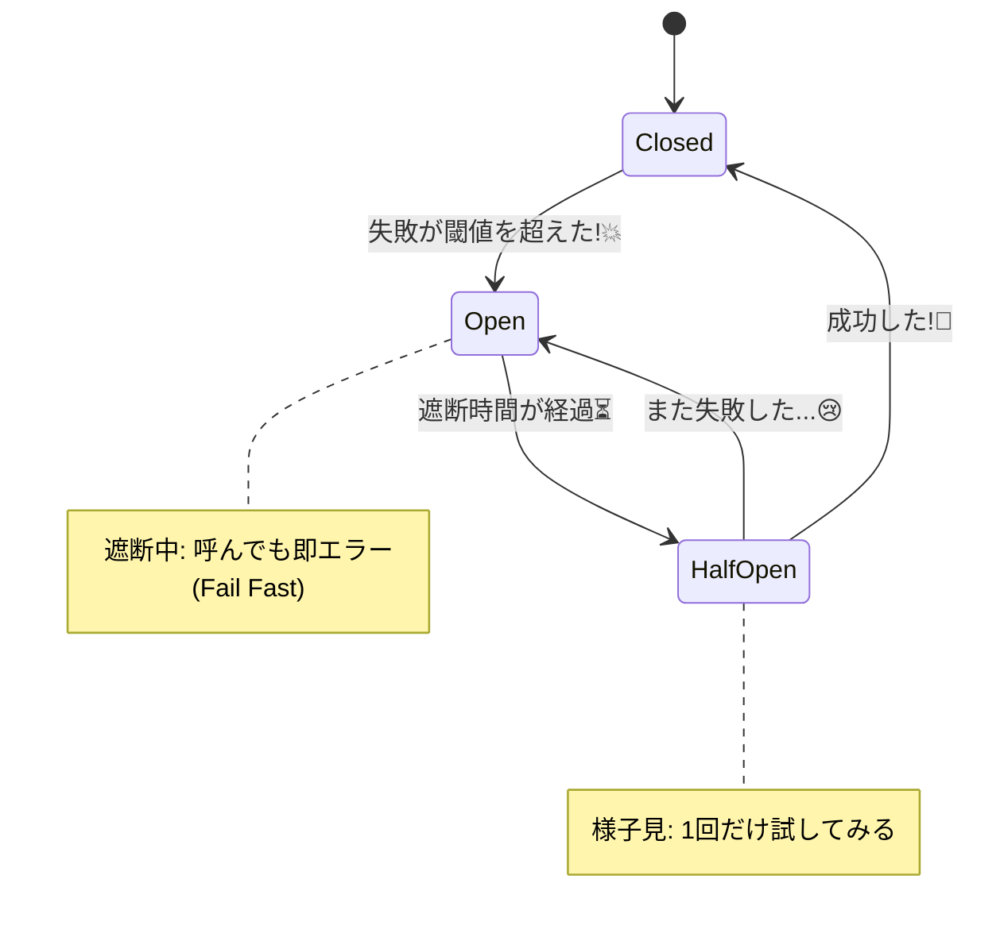

# 第23章：サーキットブレーカの肌感覚（押しつぶさない）🧯🚧

## この章でできるようになること🎯✨

* 「壊れてる相手に突撃し続ける」をやめて、**自分のサービスを守る**考え方がわかる🛡️
* **Closed / Open / Half-Open** の状態が「いま何をしてるのか」説明できるようになる🚦
* CampusCafe の **決済サービスが不調**なときに、注文APIが巻き添えで死なない設計ができる☕💳😵‍💫→😌
* 失敗率・遅延を見ながら「いつ止める？」のルール（閾値）を決められる📉📈

---

## まずイメージ：サーキットブレーカって何？🔌⚡

サーキットブレーカは、電気のブレーカみたいに **危ない状態になったら一旦遮断して**、しばらくしてから **様子見（テスト）**して回復したら復帰する仕組みだよ🧯✨
「相手が壊れてるのに呼び続けて、自分のスレッドや接続や待ち時間が詰まって、こっちまで死ぬ💥」のを防ぐのが目的。

Microsoft の Circuit Breaker Pattern でも「リモート呼び出しの失敗が続くなら、すぐ失敗させて資源を守る」発想が中心だよ。([Microsoft Learn][1])

---

## CampusCafe だと、どこで効く？☕📱

例：**注文API（Order）→ 決済API（Payment）** を呼ぶ

* 決済APIが不調（遅い・落ちてる・タイムアウト）😵‍💫
* 注文APIが毎回待たされると、注文API側のスレッド/接続/キューが渋滞🚗🚗🚗
* そのうち **注文APIが健康でも、注文APIが落ちる**（巻き添え）💥

そこでサーキットブレーカ✨
「今は決済が怪しいから、**即座に“今は無理”で返す**」に切り替えて、注文APIを延命する🛡️

---

## 状態の肌感覚：Closed / Open / Half-Open 🚦




ざっくりこの3つが超大事！

* **Closed（通常）**：普通に呼ぶ✅
* **Open（遮断）**：しばらく呼ばない🚫（呼んでも即失敗＝“Fail Fast”）
* **Half-Open（様子見）**：少しだけ試して、成功したらClosedへ、失敗したらOpenへ戻る🔁

この状態遷移が「サーキットブレーカの心臓」だよ🫀([Microsoft Learn][1])

---

## 何を見て「遮断する」って決めるの？📉

よく使うパラメータはこの4つ👇（ここが“設計ポイント”！）

* **FailureRatio（失敗率）**：何割失敗したら危険？（例：50%）
* **MinimumThroughput（最低試行数）**：サンプルが少なすぎるとブレるので、最低何回は見よう？（例：8回）
* **SamplingDuration（観測時間）**：直近どれくらいの期間を見る？（例：10秒）
* **BreakDuration（遮断時間）**：Openになったらどれくらい止める？（例：5秒）

標準のHTTPレジリエンス設定でも、サーキットブレーカは **失敗率10%・最低100回・観測30秒・遮断5秒**みたいな既定値があるよ。([Microsoft Learn][2])
ただし、学習用や小規模システムだと **MinimumThroughput=100** はなかなか到達しないので、今回は“動きが見える”値に下げて体験するね😊

---

## 「リトライ」との関係は？🔁🧠

* **リトライ**：たまたまの失敗なら、もう一回やってみる（優しい）💞
* **サーキットブレーカ**：失敗が続くなら、もう突撃しない（守る）🛡️

標準のHTTPレジリエンスは、（外側→内側）に **レート制限→全体タイムアウト→リトライ→サーキットブレーカ→試行タイムアウト** みたいに積まれるよ。([Microsoft Learn][2])
つまり「まずリトライで軽く粘る → それでもダメが続くなら遮断」って発想になってる😊

---

# ミニ演習：遮断ルールを考えてみよう✍️🧯

CampusCafe の「決済」を想像して、次を決めてみよう💭💳

1. **失敗率（FailureRatio）**：何割失敗したら遮断？（例：0.5）
2. **最低回数（MinimumThroughput）**：何回見たら判断していい？（例：8）
3. **観測時間（SamplingDuration）**：直近何秒の出来事を見る？（例：10秒）
4. **遮断時間（BreakDuration）**：遮断は何秒？（例：5秒）

💡考え方のコツ

* 利用者が多い時間帯は、短時間でも失敗が集中しやすい→早めに遮断が役立つかも📈
* 遮断が長すぎると「復活してるのに機会損失」になる→短め＋Half-Openで様子見が無難かも🐣

---

# ハンズオン：壊れる決済APIを作って、遮断を体験しよう☕💥→🧯✨

## 1) 決済スタブ（PaymentStub）を作る💳🧪

やること：**成功したり失敗したり、たまに遅い**APIを用意する（現実っぽい！）

### PaymentStub / Program.cs

```csharp
using Microsoft.AspNetCore.Mvc;

var builder = WebApplication.CreateBuilder(args);
var app = builder.Build();

var random = new Random();

// 失敗率と遅延を雑に再現（学習用）
const double failRate = 0.7;      // 70% 失敗
const int slowRatePercent = 30;   // 30% 遅い
const int slowMs = 1500;          // 遅いとき 1.5s

app.MapGet("/health", () => Results.Ok(new { ok = true }));

app.MapPost("/charge", async ([FromBody] ChargeRequest req) =>
{
    // たまに遅くする
    if (random.Next(100) < slowRatePercent)
        await Task.Delay(slowMs);

    // よく落ちる
    if (random.NextDouble() < failRate)
        return Results.StatusCode(500);

    return Results.Ok(new { paid = true, orderId = req.OrderId, amount = req.Amount });
});

app.Run();

record ChargeRequest(string OrderId, int Amount);
```

---

## 2) 注文API（OrderApi）側にサーキットブレーカを入れる🧯🚧

ここでは **HttpClientにレジリエンス（Circuit Breaker + Timeout）** を付けるよ。

この章のポイントは「**サーキットブレーカがOpenのとき、即失敗（Fail Fast）になって注文APIが軽くなる**」を体感すること✨

### OrderApi / 追加パッケージ📦

* `Microsoft.Extensions.Http.Resilience`

（Microsoft Learn でも `AddResilienceHandler` と `HttpCircuitBreakerStrategyOptions` を使う例が載ってるよ）([Microsoft Learn][2])

### OrderApi / Program.cs（重要なところだけ）

```csharp
using System.Diagnostics;
using System.Net;
using System.Net.Http.Json;
using Microsoft.AspNetCore.Mvc;
using Polly.CircuitBreaker;
using Polly.Timeout;

var builder = WebApplication.CreateBuilder(args);

// Payment への HttpClient
builder.Services.AddHttpClient("payment", client =>
{
    client.BaseAddress = new Uri("http://localhost:5005"); // PaymentStub のURLに合わせてね
})
.AddResilienceHandler("payment-pipeline", static pipeline =>
{
    // ① サーキットブレーカ（学習用に “動く値” に調整）
    pipeline.AddCircuitBreaker(new HttpCircuitBreakerStrategyOptions
    {
        SamplingDuration = TimeSpan.FromSeconds(10),
        FailureRatio = 0.5,
        MinimumThroughput = 8,
        BreakDuration = TimeSpan.FromSeconds(5),

        // 何を「失敗」として数えるか（例：5xx / 408 / 429 / 例外）
        ShouldHandle = static args =>
        {
            if (args.Outcome.Exception is HttpRequestException or TimeoutRejectedException)
                return ValueTask.FromResult(true);

            var code = args.Outcome.Result?.StatusCode;
            return ValueTask.FromResult(code is
                >= HttpStatusCode.InternalServerError or
                HttpStatusCode.RequestTimeout or
                HttpStatusCode.TooManyRequests);
        }
    });

    // ② 1回の試行のタイムアウト（遅い相手に待ち続けない）
    pipeline.AddTimeout(TimeSpan.FromMilliseconds(700));
});

var app = builder.Build();

app.MapPost("/orders", async ([FromBody] PlaceOrderRequest req, IHttpClientFactory factory) =>
{
    var client = factory.CreateClient("payment");
    var sw = Stopwatch.StartNew();

    try
    {
        var res = await client.PostAsJsonAsync("/charge", new { orderId = req.OrderId, amount = req.Amount });

        // 決済が500なら、そのまま「一時的失敗」として扱う
        if (!res.IsSuccessStatusCode)
        {
            return Results.Problem(
                title: "決済がうまくいかなかったよ…😢",
                detail: $"status={(int)res.StatusCode}, elapsed={sw.ElapsedMilliseconds}ms",
                statusCode: 502);
        }

        return Results.Ok(new
        {
            ok = true,
            message = "注文できたよ〜☕✨",
            elapsedMs = sw.ElapsedMilliseconds
        });
    }
    catch (BrokenCircuitException ex)
    {
        // ここが“Fail Fast”体験ポイント✨
        var retryAfter = ex.RetryAfter?.TotalSeconds;

        return Results.Problem(
            title: "いま決済が混雑中なので、少し待ってね🧯💦",
            detail: $"circuit=OPEN, elapsed={sw.ElapsedMilliseconds}ms, retryAfterSeconds={retryAfter}",
            statusCode: 503);
    }
    catch (TimeoutRejectedException)
    {
        return Results.Problem(
            title: "決済が遅すぎたので中断したよ⏱️💦",
            detail: $"elapsed={sw.ElapsedMilliseconds}ms",
            statusCode: 504);
    }
});

app.Run();

record PlaceOrderRequest(string OrderId, int Amount);
```

* `BrokenCircuitException` は「回路がOpenだから即遮断したよ！」の合図で、`RetryAfter` を持てるよ。([PollyDocs][3])
* `HttpCircuitBreakerStrategyOptions` を `AddResilienceHandler` で足す形は Microsoft Learn の例と同じ流れだよ。([Microsoft Learn][2])

---

## 3) 体験：Openになると“速く失敗する”のを見よう👀⚡

同じ注文を連打して、最初は「遅く失敗」→ しばらくすると「一瞬で503」になるのが見えたら成功🎉

PowerShellでの連打例（OrderApiのURLは自分のに合わせてね）

```powershell
1..25 | % {
  try {
    $body = @{ orderId = "o-$_"; amount = 500 } | ConvertTo-Json
    $r = Invoke-WebRequest -Method Post -Uri "http://localhost:5001/orders" -ContentType "application/json" -Body $body
    "$($_): $($r.StatusCode)"
  } catch {
    "$($_): $($_.Exception.Response.StatusCode.value__)"
  }
}
```

✅ 観察ポイント

* **遮断前**：500や504が出る。しかも遅いときは待たされる🐢
* **遮断後（Open）**：503が増える。しかも返ってくるのが速い⚡（注文APIが守られてる！）

---

# 閾値の決め方：超入門の“型”📌😊

迷ったらこの順で考えるとラクだよ〜✨

1. **まずは「どれくらい待たせたくない？」** → Timeout を決める⏱️
2. **次に「何割失敗したら危険？」** → FailureRatio（例：0.5）📉
3. **「誤判定が怖い」なら最低回数を上げる** → MinimumThroughput📊
4. **「復活が早い相手」なら遮断を短く** → BreakDuration🐣

公式の既定値（失敗率10%など）もあるけど、交通量が少ない環境だと MinimumThroughput が効きすぎることがあるから、状況に合わせて調整が必要だよ。([Microsoft Learn][2])

---

# ありがちな失敗パターン集😇💥

## ❌ 失敗パターン1：遮断しない（突撃し続ける）

→ 自分のAPIが詰まって巻き添えで落ちる😵‍💫

## ❌ 失敗パターン2：遮断が長すぎる

→ もう治ってるのにずっと503で機会損失🥲

## ❌ 失敗パターン3：トラフィックが少ないのに MinimumThroughput が大きい

→ いつまで経ってもOpenにならず「効いてるのか分からない」問題🤔
（今回は学習用に小さくしたね）

---

# AI活用コーナー🤖💡（コピペOK）

* 「決済APIが落ちやすいんだけど、FailureRatio/MinimumThroughput/SamplingDuration/BreakDuration の初期案を3パターン出して。根拠も短く」📌
* 「CampusCafeの“決済失敗時のユーザー向け文言”を、不安にさせない感じで10案ちょうだい💬🌸」
* 「503が出た時に、UXとして何を画面に出すべき？（再試行ボタン、待ち時間、キャンセル導線）」🧯✨

---

# まとめ🧯✨

* サーキットブレーカは「壊れてる相手に突撃し続けない」ための安全装置🚧
* **OpenになったらFail Fast**で、自分のサービスの可用性を守れる🛡️
* 閾値は **失敗率・最低回数・観測時間・遮断時間** の4点セットで決める📉
* `HttpClient` にレジリエンスを付けるなら、`AddResilienceHandler` で `HttpCircuitBreakerStrategyOptions` を設定できるよ。([Microsoft Learn][2])

[1]: https://learn.microsoft.com/en-us/azure/architecture/patterns/circuit-breaker "Circuit Breaker Pattern - Azure Architecture Center | Microsoft Learn"
[2]: https://learn.microsoft.com/en-us/dotnet/core/resilience/http-resilience "Build resilient HTTP apps: Key development patterns - .NET | Microsoft Learn"
[3]: https://www.pollydocs.org/strategies/circuit-breaker.html "Circuit breaker resilience strategy | Polly "
