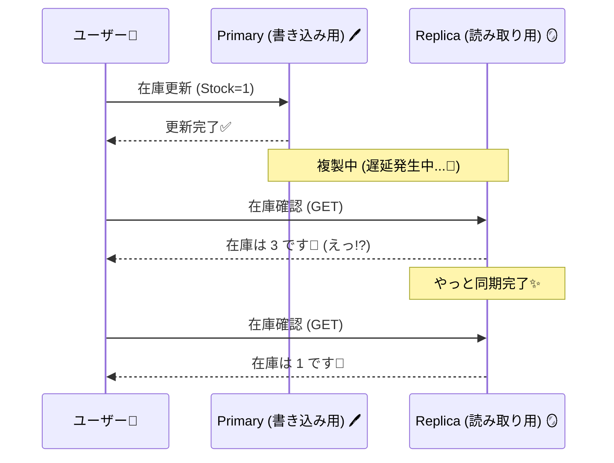

# 第24章：複製（レプリケーション）と“古い読み”🪞🕰️

## この章で身につくこと🎯✨

* 「読み取りレプリカ（Read Replica）」が何で、何がうれしいかがわかる📚
* “古い読み”（ちょい古い値が返る）で起きがちな事故パターンがわかる😵‍💫
* CampusCafe（学食モバイルオーダー）で **「表示は古くてOK」「確保は最新必須」** を切り分けられるようになる☕📦
* C#（.NET 10 / EF Core 10）で **Read/Write を分ける実装の形** が描けるようになる🧩✨ ([Microsoft for Developers][1])

---

## 1) まず“複製”ってなに？🪞


**複製（レプリケーション）**は、ざっくり言うと

* **書き込みの本体（Primary / Writer）** がいて🖊️
* その内容を **読み取り専用のコピー（Replica / Reader）** に配る📨

って仕組みだよ〜✨

目的はだいたいこの2つ💡

* **読み取りを分散して速くする**（人気メニューの一覧・集計など）⚡
* **障害に強くする**（本体が落ちても復旧しやすい）🧯

---

## 2) “古い読み”ってどういうこと？🕰️💦




読み取りレプリカは「コピー」だから、コピーが届くまでに少し時間がかかることがあるよね。

すると…

* 本体にはもう書き込まれてるのに
* レプリカにはまだ反映されてなくて
* **GET したら古い値が返る**（これが“古い読み”）😇

これ、**非同期レプリケーション**だと普通に起きる（性能・可用性のためにそうすることが多い）んだ〜。

---

## 3) CampusCafeで起きる“あるある事故”☕📦😵‍💫


### 例：ドーナツの在庫表示🍩

* 画面の在庫表示（Replica）：「残り3」
* でもその直前に誰かが2個買ってて、本体（Primary）は「残り1」
* あなたが注文確定しようとすると…
  **「ごめん、在庫足りなかった🙏」** が発生💥

ここで大事なのは👇
✅ **在庫“表示”** は多少ズレてもUXで許容できることが多い
✅ **在庫“確保”** はズレると事故る（売りすぎる、二重引き当て）ので最新必須

---

## 4) どれが“古くてOK”で、どれが“最新必須”？🎛️


CampusCafeだと、こんな切り分けが超実用的だよ〜😊✨

| 機能      | 例             |    古くてOK？ | 理由                |
| ------- | ------------- | --------: | ----------------- |
| メニュー一覧  | 今日のおすすめ、価格、説明 |       ✅OK | 少し遅れても致命傷になりにくい🍰 |
| 注文履歴の表示 | 「注文したよね？」確認   |     △条件つき | “自分の操作が見える”が欲しい👀 |
| 在庫の表示   | 「残り3」みたいな表示   | ✅OK（注意つき） | “目安”として出すならOK📦   |
| 在庫の確保   | 引き当て、減算       |       ❌NG | ここがズレると売りすぎる💥    |
| 決済確定    | 支払い確定、請求      |       ❌NG | お金はズレたら地獄💳🔥     |

---

## 5) “古い読み”と上手に付き合う定番パターン3つ🧩✨

### パターンA：Read/Write を分ける（基本の王道）🔀

* GET系（一覧・参照）は Replica
* POST系（確定・確保）は Primary

いちばんわかりやすくて、運用も現実的😊

### パターンB：「今だけ最新で読ませて」フラグ🕯️


たとえば、注文直後の画面だけは
**「fresh=true のときは Primary を読む」** みたいにする✨

* “注文したのに履歴に出ない”の不安が減る😮‍💨
* 全部をPrimaryで読むよりコスパ良い💰

### パターンC：セッション整合性っぽくする（Read-your-writes）🧷

「自分が書いたものは、自分にはすぐ見える」って体験を作るやつ😊
たとえば Cosmos DB だと **Session consistency が read-your-writes を保証**してくれる、みたいな発想だよ〜。 ([Microsoft Learn][2])

---

## 6) 体感ミニ実装：わざと“遅れて反映されるレプリカ”を作る🧪🐢

DBを本物のレプリカ構成にしなくても、**概念を体で覚える**にはこれが最強💪✨
（まず“古い読み”に慣れるのが勝ち！）

### 6.1 ざっくり設計🗺️


* Primary在庫：更新は即反映🖊️
* Replica在庫：更新が **3秒遅れ** で反映🐢🕒

### 6.2 コード（最小サンプル）💻✨

```csharp
using System.Collections.Concurrent;
using System.Threading.Channels;

var builder = WebApplication.CreateBuilder(args);
builder.Services.AddSingleton<PrimaryInventory>();
builder.Services.AddSingleton<ReplicaInventory>();
builder.Services.AddSingleton<ReplicationQueue>();
builder.Services.AddHostedService<ReplicaReplicator>();

var app = builder.Build();

// 在庫表示（replica）
app.MapGet("/inventory/{sku}", (string sku, ReplicaInventory replica) =>
{
    var item = replica.Get(sku);
    return item is null ? Results.NotFound() : Results.Ok(new { source = "replica", item });
});

// 在庫表示（primary）: 最新を見る用
app.MapGet("/inventory/{sku}/fresh", (string sku, PrimaryInventory primary) =>
{
    var item = primary.Get(sku);
    return item is null ? Results.NotFound() : Results.Ok(new { source = "primary", item });
});

// 在庫確保（primaryで確定）
app.MapPost("/reserve/{sku}", async (string sku, int qty, PrimaryInventory primary, ReplicationQueue q) =>
{
    var ok = primary.TryReserve(sku, qty, out var after);
    if (!ok) return Results.Conflict(new { message = "在庫足りないよ🙏", sku, qty });

    // レプリカ反映は遅れて届く（キューへ）
    await q.EnqueueAsync(new InventoryUpdate(sku, after));

    return Results.Ok(new { message = "確保できたよ✨", sku, after });
});

app.Run();

record InventoryItem(string Sku, int Stock);
record InventoryUpdate(string Sku, int NewStock);

sealed class PrimaryInventory
{
    private readonly ConcurrentDictionary<string, InventoryItem> _db = new();

    public PrimaryInventory()
    {
        _db["donut"] = new InventoryItem("donut", 3);
    }

    public InventoryItem? Get(string sku) => _db.TryGetValue(sku, out var v) ? v : null;

    public bool TryReserve(string sku, int qty, out int after)
    {
        after = 0;
        return _db.AddOrUpdate(
            sku,
            addValueFactory: _ => new InventoryItem(sku, 0),
            updateValueFactory: (_, cur) =>
            {
                if (cur.Stock < qty) return cur; // そのまま
                after = cur.Stock - qty;
                return cur with { Stock = after };
            }
        ).Stock == after;
    }
}

sealed class ReplicaInventory
{
    private readonly ConcurrentDictionary<string, InventoryItem> _db = new();
    public ReplicaInventory()
    {
        _db["donut"] = new InventoryItem("donut", 3);
    }

    public InventoryItem? Get(string sku) => _db.TryGetValue(sku, out var v) ? v : null;
    public void Apply(InventoryUpdate u) => _db[u.Sku] = new InventoryItem(u.Sku, u.NewStock);
}

sealed class ReplicationQueue
{
    private readonly Channel<InventoryUpdate> _ch = Channel.CreateUnbounded<InventoryUpdate>();
    public ValueTask EnqueueAsync(InventoryUpdate u) => _ch.Writer.WriteAsync(u);
    public IAsyncEnumerable<InventoryUpdate> DequeueAllAsync(CancellationToken ct) => _ch.Reader.ReadAllAsync(ct);
}

sealed class ReplicaReplicator : BackgroundService
{
    private readonly ReplicationQueue _q;
    private readonly ReplicaInventory _replica;
    public ReplicaReplicator(ReplicationQueue q, ReplicaInventory replica) { _q = q; _replica = replica; }

    protected override async Task ExecuteAsync(CancellationToken stoppingToken)
    {
        await foreach (var u in _q.DequeueAllAsync(stoppingToken))
        {
            await Task.Delay(TimeSpan.FromSeconds(3), stoppingToken); // わざと遅延🐢
            _replica.Apply(u);
        }
    }
}
```

### 6.3 体感手順（やってみて！）🎮✨

1. `GET /inventory/donut` → replicaで「3」🍩
2. `POST /reserve/donut?qty=2` → primaryで確保成功✨
3. すぐ `GET /inventory/donut` → まだ「3」のまま（古い読み！）😇
4. `GET /inventory/donut/fresh` → primaryでは「1」😳
5. 3秒待って `GET /inventory/donut` → replicaも「1」に追いつく🐢✨

この“ズレる感じ”が分かれば、この章ほぼ勝ち🏆💕

---

## 7) 実務の接続イメージ：DBのRead Replicaに繋ぐには？🔌🗄️


### 7.1 SQL Server / Azure SQL：ApplicationIntent=ReadOnly 🧭

Azure SQL の **Read scale-out** は、読み取り専用レプリカへ **`ApplicationIntent=ReadOnly`** でルーティングできるよ。 ([Microsoft Learn][3])

SQL Server の Always On でも、**read-only routing** を構成しておくと、同じ考え方で「読みに行く先」を振り分けられる😊 ([Microsoft Learn][4])

* 書き込み用（Primaryへ）

  * `...;ApplicationIntent=ReadWrite;`
* 読み取り用（Replicaへ）

  * `...;ApplicationIntent=ReadOnly;`

### 7.2 PostgreSQL：Hot Standby（読み取り可能なスタンバイ）🐘

PostgreSQLには、スタンバイで **read-only クエリ**を流せる “Hot Standby” があるよ。 ([PostgreSQL][5])

さらに .NET 側（Npgsql）では、複数ホスト指定＋ターゲット指定ができる✨
「primaryだけ」「standby優先」みたいな作戦が取りやすいよ〜。 ([Npgsql][6])

---

## 8) C#（EF Core）で Read/Write 分離の形（実務っぽい型）🧩✨


EF Core 10 は .NET 10 のLTSに合わせた世代だよ。 ([Microsoft Learn][7])

* `WriteDbContext`：注文確定・在庫確保（Primary）
* `ReadDbContext`：メニュー表示・在庫表示（Replica）

ポイントはこれ👇

* Read側は **`AsNoTracking()`** を基本にして軽くする⚡
* “最新必須”な画面だけ **Primaryへフォールバック**🕯️

（※ここは概念が大事なので、DbContextの細かい設定はプロジェクト方針でOK😊）

---

## 9) ミニ演習✍️✨（CampusCafeに落とす）

### 演習①：「在庫の表示」と「在庫の確保」を分けよう📦🔀

* `/inventory/{sku}` は replica（目安表示）
* `/reserve/{sku}` は primary（確保は絶対最新）

### 演習②：「注文直後の履歴」は fresh にしよう📜🕯️

* `/orders/me` は replica
* `/orders/me?fresh=true` は primary

### 演習③：UX文言を作ろう💬🌸

在庫表示がズレる可能性があるなら、UIでちゃんと優しく言うのが勝ち✨
例：

* 「在庫は目安だよ🍩（確保時に最終チェックするよ✅）」
* 「注文確定中…少し待ってね🐢」
* 「売り切れちゃった🙏 代わりにこちらはどう？」

---

## 10) AI活用（Copilot / Codex で爆速にする）🤖✨

そのままコピって使える指示例だよ〜💕

* 「ReadモデルとWriteモデルを分けた最小のAPI設計を、CampusCafeの在庫で提案して。GETは古くてOK、確保は最新必須」🧩
* 「“古い読み”が起きた時のUX文言を、丁寧で不安にさせない感じで20個」💬✨
* 「注文直後だけPrimaryを読ませる設計（fresh=true）で、危険な落とし穴がないかレビューして」🔍🧯

---

## まとめ😊✨

* レプリカは便利だけど **“古い読み”は仕様として起きる** 🪞🕰️
* **表示（Read）** と **確保/確定（Write）** を分けると事故が減る🔀✅
* “最新必須”のところだけ Primary を使うと、性能と体験のバランスが取りやすい⚖️✨

# 次の章（第25章）は、ここで出てきた「どれくらい正しさを取りに行く？」を **クォーラム（R/W/N）** の感覚でつかむよ〜🗳️🎛️

[1]: https://devblogs.microsoft.com/dotnet/announcing-dotnet-10/?utm_source=chatgpt.com "Announcing .NET 10"
[2]: https://learn.microsoft.com/en-us/azure/cosmos-db/consistency-levels?utm_source=chatgpt.com "Consistency level choices - Azure Cosmos DB"
[3]: https://learn.microsoft.com/en-us/azure/azure-sql/database/read-scale-out?view=azuresql&utm_source=chatgpt.com "Read Queries on Replicas - Azure SQL Database & ..."
[4]: https://learn.microsoft.com/en-us/sql/database-engine/availability-groups/windows/configure-read-only-routing-for-an-availability-group-sql-server?view=sql-server-ver17&utm_source=chatgpt.com "Configure read-only routing for an availability group"
[5]: https://www.postgresql.org/docs/current/hot-standby.html?utm_source=chatgpt.com "Documentation: 18: 26.4. Hot Standby"
[6]: https://www.npgsql.org/doc/failover-and-load-balancing.html "Multiple Hosts, Failover and Load Balancing | Npgsql Documentation "
[7]: https://learn.microsoft.com/en-us/ef/core/what-is-new/ef-core-10.0/whatsnew?utm_source=chatgpt.com "What's New in EF Core 10"
