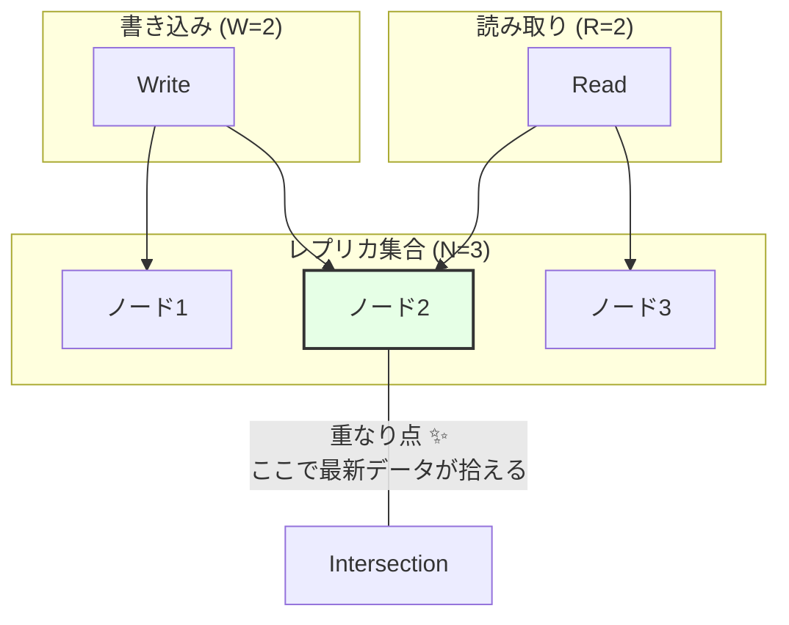

# 第25章：クォーラムの感覚（どれくらい“正しさ”を取りに行く？）🗳️🎛️

### この章でできるようになること🎯✨

* クォーラム（quorum）を「多数決っぽいやつ」じゃなく **R / W / N で説明できる** 🙆‍♀️🧠
* **速さ🕐・止まりにくさ🧱・正しさ✅** のトレードオフを、表で整理できる📊✨
* CampusCafe（学食モバイルオーダー☕📱）の **在庫/決済/通知/集計** に「おすすめ設定」を言えるようになる🧩💡

---

## 25.1 クォーラムって何？（“何人賛成ならOK”のルール）🗳️✅

分散システムでは、同じデータを複数台（レプリカ）にコピーして持つことが多いよね🪞🖥️
でも、ネットワークが遅い・切れる・順番が前後する…が普通に起きる📡🐢💥

そこで出てくるのが **クォーラム** だよ🗳️✨
ざっくり言うと：

> 「**何台の返事がそろったら成功にする？**」を決めるルール📨✅

この章では、Dynamo系の「チューナブル（一件ごとに調整できる）整合性」の考え方として **R / W / N** を扱うよ🎛️🧠
（Apache Cassandraのドキュメントでも `R + W > N` という形で説明されてるよ📘） ([Apache Cassandra][1])

---

## 25.2 R / W / N の3つだけ覚えよう🔤✨

### N（または RF）= レプリカの台数🖥️🖥️🖥️

* 例：N=3 なら、同じデータを3台にコピーして持つ🪞🪞🪞

### W = 書き込み成功に必要な「OK返事」の台数✍️✅

* 例：W=2 なら、3台中2台から「書けたよ！」が返ってきたら成功扱い✨

### R = 読み取りで「見に行く」台数📖🔎

* 例：R=2 なら、3台中2台から値を取ってきて判断する✨

---

## 25.3 いちばん大事：R + W > N で “ちゃんと見える” が強くなる➕✅




クォーラムの超有名ルールがこれ👇

* **R + W > N なら、読み取りクォーラムと書き込みクォーラムが必ずどこかで重なる**
* だから「W個のOKが出た最新の書き込み」が、次の読み取りで見えやすくなる📈✨

Cassandraの公式ドキュメントでも、Dynamoの `R + W > N`（正確にはRF）として説明されてるよ📘 ([Apache Cassandra][1])
（直感の補助として、同じルールの説明ページもあるよ🧠） ([System Overflow][2])

### 例：N=3 のとき🧩

* W=2（2台に書けたら成功）
* R=2（2台から読んでくる）
  → **2+2 > 3** なので “重なり” が起きる✅✨

---

## 25.4 でも注意：クォーラムは「万能の正しさ魔法」じゃない🪄⚠️

クォーラムで強くなるのは主にこういう感覚👇

* 「**成功扱いになった書き込み**」が「次の読み取り」で見えやすくなる📖✅

でも、次の章で扱うような **同時更新の衝突（コンフリクト）** そのものが消えるわけじゃないよ💥😳
（衝突は LWW とかマージとか、別のルールが必要になる🧩🔧）

---

## 25.5 “正しさ”を取りに行くほど、どうなる？⚖️🐢🧱

ざっくりトレードオフはこう👇

* **R や W を増やす**

  * ✅ 正しさ（新しい値を読みやすい）
  * ❌ 遅くなる（待つ返事が増える）🕐
  * ❌ 止まりやすい（返事くれるノードが足りないと失敗）🧱

---

## 25.6 ミニ演習①：遅延と正しさのトレードオフ表📊🐢✅

N=3 のシステムだとして、次を埋めてみよう✍️✨
（“速さ”＝だいたいの体感でOK！）

| パターン |  R |  W | 速さ🕐        | 止まりにくさ🧱    | 正しさ✅（新しさ）       |
| ---- | -: | -: | ----------- | ----------- | --------------- |
| A    |  1 |  1 | 速い🏃‍♀️     | 強い💪        | 弱め（古い可能性）🕰️    |
| B    |  1 |  2 | ふつう🙂       | ふつう🙂       | ちょい強い（でも保証薄め）🧠 |
| C    |  2 |  2 | 遅め🐢        | 弱め（2台必要）🧱  | 強い✨             |
| D    |  1 |  3 | 書くの遅い🐢🐢   | 書きは弱い🧱🧱   | 書いた後は強め✨        |
| E    |  3 |  3 | かなり遅い🐢🐢🐢 | かなり弱い🧱🧱🧱 | 最強✅             |

### 自分でチェック用ヒント🔎

* **R+W>N を満たすのはどれ？**

  * N=3 なら、R+W が 4以上だと満たす✅

---

## 25.7 CampusCafeに当てはめる（おすすめ感覚）☕📱🧩

### ① 在庫「表示」📦👀（多少古くても許されやすい）

* お客さんが見る「残り◯個」は、多少ズレても “すぐ買えなくなる” 表示を工夫できる🕐✨
* なので **R は小さめ** にして、速さを優先しがち🏃‍♀️💨

  * 例：R=1（とにかく速い）

✅ただし！「表示」だけで在庫を確保すると売り越し地獄😵‍💫
→ 確保は次👇

### ② 在庫「確保」📦🔒（売り越ししたくない）

* “最後の1個”は強めに守りたいよね😳
* だから **書き込み側 W を上げる** or **Rも上げる** が候補🎛️✨

  * 例：N=3 で **W=2, R=2**（強めの定番）✅

### ③ 決済💳🔥（一番事故りたくない）

決済は「クォーラムでなんとかする」よりも、
**そもそも“強い一貫性”前提の設計（単一の台帳、トランザクション、決済プロバイダの整合性）** に寄せがち💪
とはいえ、分散ストレージに「決済結果」を書く場合は **W強め** が選ばれやすいよ🧾✅

### ④ 通知🔔😊（遅れてもだいたい許される）

* 通知は “止まらない” のほうが嬉しいことが多い
* なので **R/W は軽め**（ただし冪等性は必須🛡️）

---

## 25.8 ミニ実装：3レプリカの“疑似クォーラム”を体験しよう🧪🧠

ここでは **「感覚」を作るためのミニ実験** をやるよ✨
`.NET 10 / C# 14` が今の最新ラインとして整理されてるよ（C# 14は .NET 10 対応） ([Microsoft Learn][3])

### 目的🎯

* W を増やすと「成功」になりにくい（でも強い）🧱✅
* R を増やすと「新しい値」を拾いやすい（でも遅い）🐢✅

### コード（超ミニ・シミュレーター）🧩

* 3台のレプリカに並列でアクセスして
* 書き込みは **W 個の成功** を待つ
* 読み取りは **R 個の応答** を集めて、いちばん新しい `Version` を採用する

```csharp
using System.Collections.Concurrent;

public record ValueWithVersion(string Value, long Version);

public sealed class Replica
{
    private readonly Random _rand = new();
    private readonly ConcurrentDictionary<string, ValueWithVersion> _store = new();

    public async Task<bool> TryWriteAsync(string key, ValueWithVersion value, CancellationToken ct)
    {
        await Task.Delay(_rand.Next(10, 120), ct); // 遅延をランダムに入れる🐢
        // たまに失敗させる（ネットワーク断っぽい）📡💥
        if (_rand.NextDouble() < 0.15) return false;

        _store.AddOrUpdate(
            key,
            value,
            (_, old) => old.Version >= value.Version ? old : value);

        return true;
    }

    public async Task<(bool ok, ValueWithVersion? value)> TryReadAsync(string key, CancellationToken ct)
    {
        await Task.Delay(_rand.Next(10, 120), ct);
        if (_rand.NextDouble() < 0.15) return (false, null);

        return _store.TryGetValue(key, out var v) ? (true, v) : (true, null);
    }
}

public sealed class QuorumClient
{
    private readonly Replica[] _replicas;

    public QuorumClient(params Replica[] replicas) => _replicas = replicas;

    public async Task<bool> WriteAsync(string key, string value, int w, CancellationToken ct)
    {
        var version = DateTimeOffset.UtcNow.ToUnixTimeMilliseconds(); // 雑に単調増加っぽく🕰️
        var payload = new ValueWithVersion(value, version);

        var tasks = _replicas.Select(r => r.TryWriteAsync(key, payload, ct)).ToList();

        var success = 0;
        while (tasks.Count > 0)
        {
            var finished = await Task.WhenAny(tasks);
            tasks.Remove(finished);

            if (await finished) success++;

            if (success >= w) return true; // W個成功で成功扱い✅
        }
        return false;
    }

    public async Task<(bool ok, ValueWithVersion? value)> ReadAsync(string key, int r, CancellationToken ct)
    {
        var tasks = _replicas.Select(rep => rep.TryReadAsync(key, ct)).ToList();

        var results = new List<ValueWithVersion?>();
        var okCount = 0;

        while (tasks.Count > 0)
        {
            var finished = await Task.WhenAny(tasks);
            tasks.Remove(finished);

            var (ok, v) = await finished;
            if (!ok) continue;

            okCount++;
            results.Add(v);

            if (okCount >= r)
            {
                // R個集まったら、その中で一番新しいVersionを選ぶ📌
                var best = results
                    .Where(x => x is not null)
                    .OrderByDescending(x => x!.Version)
                    .FirstOrDefault();

                return (true, best);
            }
        }

        return (false, null); // R個集まらなかった（止まった）🧱
    }
}

public static class Program
{
    public static async Task Main()
    {
        var cts = new CancellationTokenSource(TimeSpan.FromSeconds(2));

        var client = new QuorumClient(new Replica(), new Replica(), new Replica());

        var n = 3;
        var r = 2;
        var w = 2;

        Console.WriteLine($"N={n}, R={r}, W={w} で試すよ🧪");

        var okW = await client.WriteAsync("stock:cookie", "reserved", w, cts.Token);
        Console.WriteLine($"Write => {okW}");

        var (okR, v) = await client.ReadAsync("stock:cookie", r, cts.Token);
        Console.WriteLine($"Read  => {okR}, value={v?.Value}, ver={v?.Version}");
    }
}
```

### やってみよう（観察ポイント）👀✨

* R=1/W=1 にすると、だいたい速いけど「古い値」っぽいのを拾う場面が増える🕰️
* R=2/W=2 にすると、成功率が少し下がる代わりに “揃ってる感じ” が出る✅
* R=3/W=3 は強いけど、失敗しやすい＆遅い🐢🧱

---

## 25.9 ミニ演習②：CampusCafeのケース別おすすめを言語化📝✨

次の3つについて、N=3 を想定して **R/W を決めて理由を書く** よ👇

1. 在庫の「表示」📦👀
2. 在庫の「確保」📦🔒
3. 通知🔔

書くときはこのテンプレが便利✍️

* 目的：何を守りたい？（速さ/止まりにくさ/正しさ）🎯
* 事故：何が起きると最悪？😱
* だから：R/W をこうする🎛️

---

## 25.10 “現実のシステム”ではどう呼ばれる？（QUORUM の正体）📘🗳️

たとえば Cassandra では、Consistency Level に **QUORUM** があって、RF=3 なら「2/3の応答が必要」みたいに動くよ📌 ([Apache Cassandra][1])
つまり、ここでやった **N=3 の W=2（または R=2）** のような設定が、実務用語として出てくる感じ🧠✨

---

## 25.11 よくある落とし穴⚠️😵‍💫

* **R+W>N でも “同時更新の衝突” は起きる** 💥
  → 次章のコンフリクト解決へ続く🧩
* **R/W を上げれば上げるほど、障害に弱くなる** 🧱
  → ランチピークみたいな時間帯は「止まる」がUX最悪になることも😱
* **“表示”と“確保”を同じ読み書きにしちゃう** 📦💦
  → 表示は軽く、確保は強く、みたいに役割分けが効くことが多い🎛️✨

---

## 25.12 実装チェックリスト✅🧾

* [ ] N（レプリカ数）を言える🖥️
* [ ] R/W を “目的” で決めてる🎯
* [ ] **速さ🕐・止まりにくさ🧱・正しさ✅** のどれを優先したか説明できる
* [ ] 「表示」と「確保」を分ける判断ができる📦👀/📦🔒
* [ ] “強さ” を上げたぶんのUX（遅い/失敗する）を想像できてる💬🐢

---

## 25.13 AI活用（コピペでOK）🤖✨

* 「N=3 のとき、R/Wの組み合わせを全部列挙して、R+W>N を満たすものに✅を付けて表にして」📊✅
* 「在庫表示/在庫確保/通知/決済/集計それぞれで、優先すべき CAP と R/W の候補を3案ずつ、理由つきで」🧩📝
* 「この設定（R=?, W=?, N=?）の弱点を3つ挙げて。障害時UXも含めて」⚠️💬

[1]: https://cassandra.apache.org/doc/latest/cassandra/architecture/dynamo.html?utm_source=chatgpt.com "Dynamo | Apache Cassandra Documentation"
[2]: https://www.systemoverflow.com/learn/replication-consistency/consistency-models/quorum-based-tunable-consistency-the-rwn-formula?utm_source=chatgpt.com "Quorum Based Tunable Consistency: The R+W>N Formula"
[3]: https://learn.microsoft.com/en-us/dotnet/csharp/whats-new/csharp-14?utm_source=chatgpt.com "What's new in C# 14"
