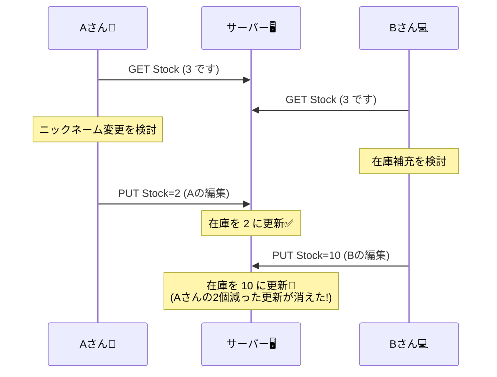

# 第26章：衝突（コンフリクト）はどう起きる？💥😳

## この章のゴール🎯✨

この章を読み終わったら…

* 「衝突って、どういう現象？」を**自分の言葉で説明**できる🗣️💡
* 衝突が起きる代表パターン（同時更新／オフライン／順不同…）を**具体例で想像**できる🧠🧩
* 一番ありがちな事故「上書き（Lost Update）」を**再現して怖さを体感**できる😱🧪
* 次の章（第27章）でやる「解決方法」を学ぶための**前提の肌感覚**ができる🌱✨

---

## 1) そもそも「衝突」って何？🤔💥

**同じデータ**に対して、**別々の場所・別々のタイミング**で更新が入って、
「どっちが正しいの？」が決められなくなる（または勝手に決まって事故る）状態のことだよ😳💦

### CampusCafeで超わかりやすい例☕📱

* Aさん（スマホ）：「受け取り時間を 12:10 に変更」🕛
* Bさん（売店タブレット）：「受け取り時間を 12:30 に変更」🕧
  …が、ほぼ同時に起きたら？
  **最後に届いたほうが勝つ**とか、**混ざって変な状態**になるとか、いろいろ地獄が起きる😇🔥

---

## 2) 衝突が起きる“3大パターン”🧨🧠

### パターンA：同時更新（並行更新）🧑‍🤝‍🧑⚡




同じデータを、2人（または2端末・2サービス）が**ほぼ同時に更新**するやつ！

#### ありがちシーン🍰

* 商品「いちごケーキ」の在庫数を

  * キッチン端末が減らす📉
  * 管理画面が補充で増やす📈
    これが同時に走ると、最後に書いた方が**もう片方を消す**ことがある💦

---

### パターンB：オフライン更新（あとから合流）📴➡️🌐

スマホが電波悪い・地下・学内Wi-Fi死んでる…あるあるだよね🥲📶
**オフラインで編集した内容が、あとからサーバに合流**するときに衝突する！

#### ありがちシーン🍙

* スマホがオフライン中に「アレルギー情報」を更新📝
* その間に、別端末で「通知設定」を更新🔔
* 後で同期したら、**“古い状態を丸ごと上書き”**して事故ることがある😱

---

### パターンC：順不同（順番がズレて届く）🔀📨

イベント駆動や非同期だと、**順番通りに届く保証がない**のが普通だったよね（第16章でもやったやつ！）🔀😵‍💫
順番がズレると「結果的に矛盾」＝衝突っぽい状態になる。

#### ありがちシーン🔔

* OrderPaid（支払い完了）💳✅
* OrderCancelled（キャンセル）❌
  が順番逆で来ると、「キャンセル済みなのに支払い完了扱い」みたいな**変な最終状態**になりがち😇🔥

---

## 3) さらに増える：マルチリージョン／複数書き込み拠点🌍✍️

クラウドの分散DBで「複数リージョンから書き込める」構成（マルチライト）にすると、
**別リージョンで同じアイテムを同時更新**できちゃうので、衝突が現実に起きるよ📡💥
（Azure Cosmos DB でも「複数 write リージョンだと更新衝突が起き得る」前提で説明されてるよ）([Microsoft Learn][1])

---

## 4) 一番ありがちな事故：「上書き（Lost Update）」😱🧻


衝突って聞くと「DBがエラー出してくれるのかな？」って思いがちだけど…
**いちばん怖いのは“静かに壊れる”タイプ**😇

### Lost Update の典型パターン🧨

「更新」って実装によっては、こうなりがち👇

1. GET でデータを取る📥
2. 画面で編集する📝
3. PUT で“全体”を保存する📤

このとき、**別の人が先に更新してても**、あとから来た PUT が**全体を上書き**しちゃうことがある😱
（「自分が触ってないフィールドまで一緒に上書き」←これが本当に多い💦）

---

## 5) 「衝突が見えない」こともある👻🫥

分散DBによっては、衝突した瞬間に「はい衝突ね！」って表に出ず、
内部のルールで**自動的に勝者を決めて終わり**、という場合もあるよ。

たとえば Cosmos DB の Last-Writer-Wins（LWW）では、比較に使うパスが `_ts`（タイムスタンプ）などになっていて、**最大値のものが勝つ**。さらにこのポリシーで解決された衝突は、**conflicts feed に出てこない**（＝気づきにくい）と説明されてるよ😳([Microsoft Learn][2])

※「最後に書いた人が勝つ」は分散の世界では昔からよくあるやり方で、Amazon Dynamo の論文でも “timestamp based reconciliation（LWW）” が出てくるよ🕰️([All Things Distributed][3])

---

## 6) 衝突が起きやすい“設計あるある”🧩💦

### あるある①：1つのキーに更新が集中する🎯

* 在庫（人気商品）
* 予約枠（昼休みの時間帯）
* 注文のステータス（みんな触る）
  → **ホットスポット**になって衝突しやすい🔥

### あるある②：ドキュメントを“丸ごと”更新する📄➡️🧨

* PUT で全フィールド送って保存
  → 触ってない項目まで巻き込んで上書きしがち😇

### あるある③：「加算」より「代入」が多い✍️

* `Stock = 10`（代入）←衝突で壊れやすい
* `Stock -= 1`（差分）←扱いやすい場面が増える（ただし万能じゃない）

---

## 7) “衝突の匂い”を検知する方法（チラ見せ）👃⚠️

第27章で本格的にやるけど、この章でも「どうやって気づくか」だけ先に肌感覚を付けよ〜✨

### 代表的な考え方：楽観的同時実行制御（Optimistic Concurrency）🕊️🔒

ざっくり言うと…

* 「ぶつかったらそのとき考える」
* だから**更新時に“前提条件”をつけて確認**する

AWS DynamoDB のドキュメントでも、**バージョン番号を使う楽観ロック**で「他者の書き込みで上書きされるのを防ぐ」説明があるよ🔢🛡️([AWS ドキュメント][4])

### HTTPでもできる：ETag と If-Match 🏷️🧷

Web API の世界だと、更新時に
「あなたが編集したのは、このバージョンのデータだよね？」
を確認するために、**条件付きリクエスト**（If-Match など）を使えるよ。これは HTTP の仕様（RFC 7232）で定義されてる📜([IETF Datatracker][5])

---

## 8) ミニ演習：プロフィール更新で“上書き事故”を再現しよう🧑‍💻💦

この演習は CampusCafe の「プロフィール」っぽい例でやるよ😊
（ニックネームと通知設定、みたいに“別々の人が別々の項目を編集する”が起きやすい！）

### 8-1. まずは“事故る版”（ETagなし）😇🔥

```csharp
using Microsoft.AspNetCore.Mvc;

var builder = WebApplication.CreateBuilder(args);
var app = builder.Build();

var store = new Dictionary<string, Profile>
{
    ["u1"] = new Profile("u1", "Mika", true, 1)
};

app.MapGet("/profiles/{id}", ([FromRoute] string id) =>
{
    if (!store.TryGetValue(id, out var p)) return Results.NotFound();
    return Results.Json(p);
});

// ❌ 事故る：同時更新を検知しない（後勝ちで上書き）
app.MapPut("/profiles/{id}", ([FromRoute] string id, ProfileUpdate dto) =>
{
    if (!store.TryGetValue(id, out var cur)) return Results.NotFound();

    // ありがちな「全体更新」ノリ（dtoにない項目も、いつか増えると危険！）
    var next = cur with
    {
        Nickname = dto.Nickname,
        NotificationEnabled = dto.NotificationEnabled,
        Version = cur.Version + 1
    };

    store[id] = next;
    return Results.Json(next);
});

app.Run();

public record Profile(string Id, string Nickname, bool NotificationEnabled, int Version);
public record ProfileUpdate(string Nickname, bool NotificationEnabled);
```

### 8-2. 事故の起こし方（2人が同時に編集した想定）📱💻

1. まず GET（AさんもBさんも同じものを見る）📥
2. Aさん：ニックネーム変更して PUT ✍️
3. Bさん：通知設定変更して PUT 🔔

でも Bさんが **古い画面のまま PUT** すると、
Aさんの更新が **なかったことにされる**（または逆）😱🧻

#### PowerShell例（雰囲気でOK）🪄

```powershell
# GET
Invoke-RestMethod http://localhost:5000/profiles/u1

# Aが更新（ニックネームだけ変えるつもりだった…）
Invoke-RestMethod http://localhost:5000/profiles/u1 -Method Put -ContentType "application/json" `
  -Body '{"nickname":"Mika-chan","notificationEnabled":true}'

# Bが更新（通知だけ変えるつもりだった…）
Invoke-RestMethod http://localhost:5000/profiles/u1 -Method Put -ContentType "application/json" `
  -Body '{"nickname":"Mika","notificationEnabled":false}'
```

最後の1行、Bさんの送った `nickname:"Mika"` が混ざって
Aさんの `Mika-chan` が消える…みたいな事故が起きる😇🔥

---

### 8-3. “衝突が起きた”と気づける版（ETag/If-Match）👀🛡️

次章の内容に近いけど、「気づけるってこういうこと！」をちょい体験しよ✨
（HTTPの条件付き更新のイメージね📜([IETF Datatracker][5])）

```csharp
using Microsoft.AspNetCore.Mvc;
using Microsoft.Net.Http.Headers;

var builder = WebApplication.CreateBuilder(args);
var app = builder.Build();

var store = new Dictionary<string, Profile>
{
    ["u1"] = new Profile("u1", "Mika", true, 1)
};

static string MakeEtag(int version) => $"\"v{version}\"";

app.MapGet("/profiles/{id}", (HttpContext http, [FromRoute] string id) =>
{
    if (!store.TryGetValue(id, out var p)) return Results.NotFound();

    http.Response.Headers.ETag = MakeEtag(p.Version);
    return Results.Json(p);
});

// ✅ 衝突を“検知”できる：If-Match が一致しないと 412
app.MapPut("/profiles/{id}", (HttpContext http, [FromRoute] string id, ProfileUpdate dto) =>
{
    if (!store.TryGetValue(id, out var cur)) return Results.NotFound();

    var ifMatch = http.Request.Headers[HeaderNames.IfMatch].ToString();
    var curEtag = MakeEtag(cur.Version);

    if (string.IsNullOrWhiteSpace(ifMatch) || ifMatch != curEtag)
    {
        // 「あなたが見てた版じゃないよ！」って返す
        return Results.StatusCode(StatusCodes.Status412PreconditionFailed);
    }

    var next = cur with
    {
        Nickname = dto.Nickname,
        NotificationEnabled = dto.NotificationEnabled,
        Version = cur.Version + 1
    };

    store[id] = next;
    http.Response.Headers.ETag = MakeEtag(next.Version);
    return Results.Json(next);
});

app.Run();

public record Profile(string Id, string Nickname, bool NotificationEnabled, int Version);
public record ProfileUpdate(string Nickname, bool NotificationEnabled);
```

これで Bさんが古い画面のまま更新しようとすると、**412** になって止まる✋💥
「静かに壊れる」から「衝突に気づける」へ進化する感じだよ😊✨

---

## 9) ミニ理解チェック✅🧠

次のうち「衝突が起きやすい」ものはどれ？（複数OK）👀

1. 1つの注文ステータスを複数サービスが更新する🚦
2. 人気商品の在庫を大量アクセスが更新する📦🔥
3. GET→編集→PUT（全体上書き）で更新する📄🧨
4. 1つの画面からしか更新できない、単一端末のローカルアプリ📱

👉 1〜3 は起きやすい！4 は“分散してない”なら衝突は起きにくいよ😊

---

## 10) AI活用🤖🧠✨（衝突シナリオを量産！）

「衝突の想像力」を増やすと、設計がめちゃ強くなるよ💪🔥

### そのまま投げてOKプロンプト例📮

* 「CampusCafeで衝突が起きるシナリオを10個。誰がどのデータをいつ更新して、どうズレるかまで書いて」☕🧩
* 「“上書き（Lost Update）”が起きるUI/API設計の典型パターンを5個。改善の方向性も一言」😇➡️🛡️
* 「“オフライン更新→再接続”で衝突する例を、ユーザー目線のストーリーで3本」📴➡️🌐

---

## この章のまとめ🧁✨

* 衝突は「同じデータに別々の更新がぶつかる」こと💥
* 原因はだいたい **同時更新／オフライン合流／順不同**＋マルチライト🌍✍️
* いちばん怖いのは「衝突してるのに気づかず上書き」😱
* 次の章（第27章）では、**LWW・マージ・手動解決**みたいな「どう解く？」をちゃんとやるよ🔧🧩
  （Cosmos DB でも LWW やカスタム解決の仕組みが整理されてるよ）([Microsoft Learn][2])

[1]: https://learn.microsoft.com/en-us/azure/cosmos-db/conflict-resolution-policies?utm_source=chatgpt.com "Conflict Resolution Types and Resolution Policies"
[2]: https://learn.microsoft.com/en-us/azure/cosmos-db/how-to-manage-conflicts?utm_source=chatgpt.com "Manage conflict resolution policies in Azure Cosmos DB"
[3]: https://www.allthingsdistributed.com/files/amazon-dynamo-sosp2007.pdf?utm_source=chatgpt.com "Dynamo: Amazon's Highly Available Key-value Store"
[4]: https://docs.aws.amazon.com/amazondynamodb/latest/developerguide/DynamoDBMapper.OptimisticLocking.html?utm_source=chatgpt.com "DynamoDB and optimistic locking with version number"
[5]: https://datatracker.ietf.org/doc/html/rfc7232?utm_source=chatgpt.com "RFC 7232 - Hypertext Transfer Protocol (HTTP/1.1)"
