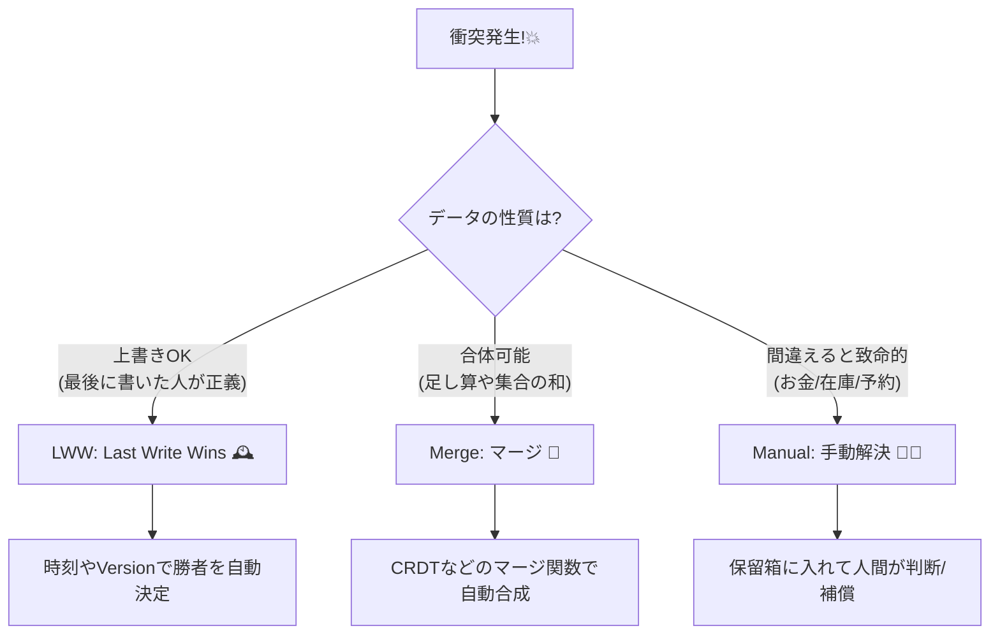

# 第27章：衝突の解決（LWW/マージ/手動解決）🧩🔧

### この章でできるようになること🎯✨

* 「衝突（コンフリクト）」が起きたときに、**どうやって“正しい結果”に着地させるか**を選べるようになる😊
* 解決方法の3つの型👇を、**データの性質ごとに使い分け**できるようになる

  1. **LWW（Last Write Wins）**🕰️
  2. **マージ（自動合成）**🧬
  3. **手動解決（人間 or 業務フロー）**👩‍💼🧑‍💼

---

## 27.1 衝突解決って、結局なに？🤔💥

**衝突**はこういう状況で起きるよ👇

* 同じデータに対して、**別々の場所で同時に更新**が走る
* その後でレプリカが合流したときに、**更新が食い違う**😵‍💫

例：CampusCafe ☕

* Aさんのスマホ📱 と Bさんの店頭端末🖥️ が、同じ「在庫」「予約枠」をほぼ同時に更新
* ネットワークが遅い／切れてた／順番が前後した
* 合流したら「どっちが正しいの…？」ってなる💦

ここで必要なのが **衝突解決ルール** だよ✅
「技術が勝手に直す」じゃなくて、**業務として“正しい”が何か**を決めるのがポイント🌸

---

## 27.2 衝突解決の3つの型🧩✨（まず全体像）




### ① LWW（Last Write Wins）🕰️👑

「**最後に書いた人が勝ち**」

* だいたい **タイムスタンプ**（または数値の優先度）で決める
* Azure Cosmos DB でも LWW ポリシーがあって、既定では `_ts`（更新時刻）などを使うよ ([Microsoft Learn][1])

✅向いてる：

* **ユーザー設定**（テーマ、表示順）
* **メモの最終編集**（多少の取りこぼしが許される）
* 「最後の入力が残ればOK」系

⚠️向いてない：

* **在庫**📦、**決済状態**💳、**予約枠**📅（“最後が勝ち”だと事故る）

---

### ② マージ（自動合成）🧬🔀

「衝突した2つを、**ルールで合体**させる」

* たとえば「いいね数」は **足し算**、「タグ」は **集合の和** みたいに
* こういう “勝ち負けじゃなく合体” の考え方は、CRDT（収束するデータ型）の代表的な発想にもあるよ ([ウィキペディア][2])

✅向いてる：

* **カウンタ**（加算系）👍
* **集合**（タグ・お気に入り）⭐
* **ログ**（追記のみ）

⚠️注意：

* 「在庫＝減算」は単純合成すると破綻しやすい（マイナス在庫地獄😇）

---

### ③ 手動解決（人間 or 業務フロー）👩‍💼🧑‍💼🧾

「ルールだけじゃ決められないから、**保留して判断**する」

* 片方を自動で負かすと炎上する系🔥
* 例：二重予約、二重請求、在庫の取り合い

✅向いてる：

* **お金・在庫・予約**みたいに、間違えると被害が大きい領域

---

## 27.3 LWW（最後勝ち）って実は危ないところがある⚠️🕰️

LWWはラク！でも落とし穴があるよ👇

### 落とし穴①：時計がズレると、負けるべき更新が勝つ🕰️💥

端末の時計がズレてたら…

* 古い内容なのに「時刻が新しい」扱いになって勝つ
* つまり **正しさが“時計”に依存**しちゃう😵‍💫

Cosmos DB のLWWも「タイムスタンプ（または数値）で勝敗を決める」設計だよ ([Microsoft Learn][1])

### 落とし穴②：業務ルールを壊す（在庫・予約は特に）📦⚠️

在庫 1 個のマフィン🧁があるとして…

* A端末：在庫 1 → 0（確保）
* B端末：在庫 1 → 0（確保）
  LWWで片方が勝つと「見た目は整合してる」けど、**実際は2人に売ってる**😇

👉 在庫・予約は、**LWW禁止**が基本ルールになりやすいよ✅

---

## 27.4 マージ（合体）を“安全に”やるコツ🧬🔧

マージで大事なのは、**順番が変わっても同じ結果になる**こと✨
（分散では順番が信用できないからね🔀）

### マージに向いてる代表例🌟

* **いいね数**：加算（ノードごとに増やして後で合体）👍
* **タグ**：集合の和（Union）🏷️
* **既読一覧**：集合の和（見た人を足す）👀

こういう「勝ち負けじゃなく、合体しても収束する」発想は CRDT の説明でもよく出てくるよ ([ウィキペディア][2])

---

## 27.5 手動解決を“設計”する（放置じゃないよ！）🧾🚦

手動解決って「人が見る」だけじゃなくて、ちゃんとシステム側で👇を作るのが大事😊

### 手動解決のテンプレ設計🧩

1. **衝突を検出**する
2. **衝突レコード**を保存する（どっちの更新も残す）🗃️
3. 対応フローを用意（オペレーター画面／管理画面）🖥️
4. 決まったら **確定反映**＋必要なら補償（返金など）💳↩️
5. 二度と同じ衝突が起きないように **ルールを改善**✨

---

## 27.6 CampusCafeで「どれを使う？」判定例☕📱

### ルール早見表🏷️✨

* **プロフィール表示名**：LWWでOK（最後の編集が残れば良い）🕰️
* **お気に入りメニュー**：マージ（集合の和）⭐
* **在庫数**：基本は “衝突させない設計” ＋ 起きたら手動解決📦
* **予約枠**：手動解決 or 業務ルール（例：先に決済完了した方を優先）📅💳

---

## 27.7 ミニ演習：衝突を検出して、解決戦略を差し替える🧪🔧✨

ここでは **「衝突を検出する」**ところまでをまず固めて、
その上で「LWW」「マージ」「手動解決」を差し替えるよ😊

### ① 衝突の検出：楽なのは“楽観的同時実行制御”🛡️

EF Core では、**Concurrency Token（同時更新チェック用の値）**を付けると、
保存時に「他の誰かが先に更新してたら例外になる」仕組みが使えるよ ([Microsoft Learn][3])

EF Core 10 は .NET 10 世代のLTSラインとして案内されてるよ ([Microsoft Learn][4])
（.NET 10 は 2025-11-11 リリースのLTSで、2026-01 時点では 10.0.2 が最新パッチとして載ってる ([Microsoft][5])）

---

### ② サンプル：在庫を “Version” で守る📦🔒

```csharp
using Microsoft.EntityFrameworkCore;
using System.ComponentModel.DataAnnotations;

public sealed class CampusCafeDb : DbContext
{
    public DbSet<InventoryItem> Inventory => Set<InventoryItem>();

    protected override void OnConfiguring(DbContextOptionsBuilder options)
        => options.UseSqlite("Data Source=campuscafe.db");

    protected override void OnModelCreating(ModelBuilder modelBuilder)
    {
        // Version を同時更新チェックに使う（楽観ロック）
        modelBuilder.Entity<InventoryItem>()
            .Property(x => x.Version)
            .IsConcurrencyToken();
    }
}

public sealed class InventoryItem
{
    public string Id { get; set; } = default!;
    public int Quantity { get; set; }

    // ✅ 同時更新チェック用
    public int Version { get; set; }

    public long UpdatedAtTicks { get; set; } // LWW用に使える（後で）
}
```

---

### ③ 衝突したら例外！→ ここで「解決戦略」を選ぶ🧩

```csharp
using Microsoft.EntityFrameworkCore;

public sealed class InventoryService
{
    private readonly CampusCafeDb _db;

    public InventoryService(CampusCafeDb db) => _db = db;

    public async Task<bool> TryReserveAsync(string itemId, int amount, long nowTicks)
    {
        var item = await _db.Inventory.SingleAsync(x => x.Id == itemId);

        if (item.Quantity < amount) return false;

        item.Quantity -= amount;
        item.Version += 1;
        item.UpdatedAtTicks = nowTicks;

        try
        {
            await _db.SaveChangesAsync();
            return true;
        }
        catch (DbUpdateConcurrencyException)
        {
            // 👇 ここで衝突解決へ！
            // 今回は「在庫」は LWW禁止なので、手動解決へ回す例にする
            await RecordManualConflictAsync(itemId, amount, nowTicks);
            return false;
        }
    }

    private Task RecordManualConflictAsync(string itemId, int amount, long nowTicks)
    {
        // 本当は Conflict テーブルに「自分が見てた値」「今DBにある値」「要求」を保存して、
        // 管理画面で処理する感じ🧾✨（ここでは簡略化）
        Console.WriteLine($"[CONFLICT] item={itemId} amount={amount} at={nowTicks}");
        return Task.CompletedTask;
    }
}
```

ポイント💡

* **衝突検出（例外になる）**まではフレームワークが助けてくれる
* でも **どう解決するか**（LWW？マージ？手動？）は、**業務の選択**だよ😊

---

## 27.8 LWW／マージ／手動解決：実装方針の“型”まとめ🧩📌

### ✅ LWW を使うなら（向いてるデータだけ）🕰️

* 争点：**どの値を“新しい”とみなすか**

  * タイムスタンプ
  * 連番（Version）
  * 優先度（管理者の更新を強くする等）

Cosmos DB だと「数値プロパティの大小で勝敗」みたいに設定できるよ ([Microsoft Learn][1])

---

### ✅ マージを使うなら（順番がズレても同じ結論になるように）🧬

* 足し算（カウンタ）
* 集合の和（タグ）
* “追記のみログ”

CRDT の基本説明に「独立に更新しても、マージで収束する」って特徴が書かれてるよ ([ウィキペディア][2])

---

### ✅ 手動解決を使うなら（人間の判断が必要な領域）🧾

* 「保留箱（Conflict）」を作る
* オペレーション手順を用意
* 必要なら補償（返金・キャンセル）

---

## 27.9 ミニ演習（問題）📝💞

### 問題1：LWWが危険な理由を説明しよう📦⚠️

CampusCafe の「在庫」や「予約枠」で LWW を使うと何が起きる？

* 例を1つ作って、短い文章で説明してね😊

### 問題2：マージできるデータ／できないデータを仕分けよう🧩

次の項目を「マージ向き／LWW向き／手動向き」に分類してみよう👇

* お気に入りメニュー一覧 ⭐
* 注文の支払い状態 💳
* 既読一覧 👀
* 在庫数 📦
* ニックネーム 🧑‍🎓

---

## 27.10 AI活用（衝突解決ルールの草案づくり）🤖📝✨

### 使えるプロンプト例💬

* 「この項目は LWW / マージ / 手動 のどれが適切？理由もつけて」
* 「マージ関数を“順不同でも同じ結果”になるように設計して」
* 「在庫の衝突を手動解決に回すときの Conflict レコード項目を提案して」
* 「DbUpdateConcurrencyException のテストケースを xUnit で作って」

---

## まとめ🎀✨

* 衝突は“起きる前提”で、**解決の型**を持っておくのが勝ち😊
* **LWW**は手軽だけど、時計・業務ルールに弱い🕰️⚠️
* **マージ**は「合体しても収束する」データで強い🧬✨
* **手動解決**は「お金・在庫・予約」みたいに被害が大きい領域で必須🧾💳📦

[1]: https://learn.microsoft.com/en-us/azure/cosmos-db/conflict-resolution-policies?utm_source=chatgpt.com "Conflict Resolution Types and Resolution Policies"
[2]: https://en.wikipedia.org/wiki/Conflict-free_replicated_data_type?utm_source=chatgpt.com "Conflict-free replicated data type"
[3]: https://learn.microsoft.com/en-us/ef/core/saving/concurrency?utm_source=chatgpt.com "Handling Concurrency Conflicts - EF Core"
[4]: https://learn.microsoft.com/en-us/ef/core/what-is-new/ef-core-10.0/whatsnew?utm_source=chatgpt.com "What's New in EF Core 10"
[5]: https://dotnet.microsoft.com/ja-jp/platform/support/policy/dotnet-core?utm_source=chatgpt.com ".NET および .NET Core の公式サポート ポリシー"
