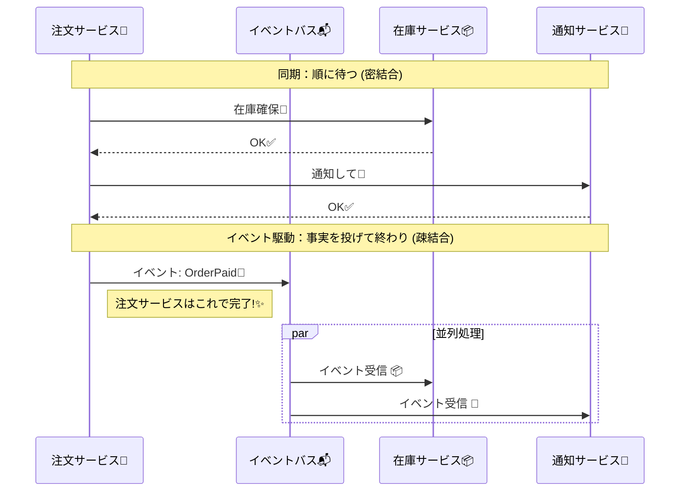

# 第28章：イベント駆動の入口（疎結合でつなぐ）📣🔌

### 1) まずは結論：イベント駆動ってなに？🤔✨


イベント駆動（Event-Driven）は、**「何かが起きた（事実）」を“イベント”として配信して、関係ある人（サービス）がそれぞれ勝手に動く**スタイルだよ〜📣💡
ポイントはこれ👇

* ✅ **同期の呼び出し連鎖**を減らせる（止まりにくい）⛑️
* ✅ **疎結合**になる（相手のURLや実装に依存しにくい）🔌
* ✅ **非同期**で広がる（必要な人だけ反応）📬✨

この「発信する人（Publisher）」と「受け取る人（Subscriber）」を分ける考え方は、Pub/Sub（パブサブ）として整理されてるよ〜📣➡️📬（送信側と受信側を結びつけすぎないのが狙い！）([Microsoft Learn][1])

---

### 2) CampusCafeを“同期連鎖”で作ると、何がつらい？😵‍💫📡

たとえば「注文確定」のAPIがこうなってたら…👇

1. 注文サービス → 在庫サービスを呼ぶ📦
2. 注文サービス → 決済サービスを呼ぶ💳
3. 注文サービス → 通知サービスを呼ぶ🔔

これ、**どれか1つでも遅い/落ちてると注文が失敗**しやすいのがツラい🥲
しかも、だんだん「つなぎ先」が増えて、注文サービスが**司令塔でパンパン**になる…📌💥

---

### 3) イベント駆動にすると、どう変わる？🌸🔀




イベント駆動だと、こうするよ👇

* 注文サービスは、まず **「支払いが完了した」** という事実（イベント）を出す📣
* 在庫サービスはそれを聞いて、在庫確保する📦
* 通知サービスはそれを聞いて、通知する🔔

つまり、注文サービスは **「知ってる相手を直接呼ばない」** 方向へ寄せるのがコツ✨
イベント駆動アーキテクチャにはいくつか形があるけど、まずはこの章では **Pub/Sub型**（イベント通知して広げる）を入口にするよ📣🌱([Microsoft Learn][2])

---

### 4) “イベント”って何？“コマンド”と何が違うの？🧩📨

ここめっちゃ大事〜！💡

#### ✅ イベント（Event）📣

* **起きた事実**の通知
* 例：OrderPaid（支払いが完了した）💳✅

#### ✅ コマンド（Command）🧾

* **やってほしいお願い**（命令）
* 例：ReserveStock（在庫を確保して！）📦🙏

イベント駆動の入口では、まず **イベント＝事実** をちゃんと意識しようね📣✨
（“命令”じゃなくて“起きたこと”！）

---

### 5) この章のゴール🎯✨

この章では、CampusCafeで使えるように👇をできるようにするよ〜😊

* ✅ イベントを設計できる（名前・誰が出す・誰が聞く）📣📬
* ✅ ペイロード（中身）を「ちょうどよく」決められる🧾✨
* ✅ C#で“最小のイベント駆動”を動かしてみる（まずはアプリ内）🧪
* ✅ 「疎結合ってこういうことか〜！」を体感する🔌🌸

---

## 6) イベント設計：名前の付け方（超重要）🏷️✨

### ✅ 命名の基本ルール（おすすめ）📌

* **過去形っぽい事実**にする（〜した / 〜された）🕰️
* **ドメイン用語**を使う（アプリの言葉）☕
* **短く・一意に・誤解なく**📏

例（CampusCafe）👇

* ✅ OrderPaid（支払い完了）💳
* ✅ StockReserved（在庫確保済み）📦
* ✅ PaymentFailed（決済失敗）💥

---

## 7) ペイロード設計：中身に何を入れる？🧾✨

### ✅ “入れすぎ”の落とし穴💣

イベントに「注文の全情報」「ユーザー情報」「金額詳細」…って全部入れたくなるけど、入れすぎると👇になりがち😇

* ❌ 個人情報が流れやすい
* ❌ 変更が怖い（ちょっと変更で全購読者が壊れる）
* ❌ 「それ注文サービスの責任だよね？」が混ざる

### ✅ “ちょうどいい”の目安🍰

イベントは基本これを入れると強いよ👇

* ✅ 識別子（OrderId / PaymentId など）🆔
* ✅ “何が起きたか”に必要な最小情報（例：金額、理由コード）💡
* ✅ 発生時刻（OccurredAt）🕒
* ✅ 追跡用（CorrelationId）🧵

---

## 8) CampusCafe：イベントカタログを作ろう📚✨（ミニ演習）

### 🎯ミニ演習：3イベントを設計してみよう🧩

次の3つを、表を埋めるつもりで決めよう👇（紙でもOK！）📝✨

| イベント名             | 何が起きた？   | 発行者（誰が出す？） | 購読者（誰が聞く？）      | 目的（何のため？） |
| ----------------- | -------- | ---------- | --------------- | --------- |
| OrderPaid 💳✅     | 支払いが完了した | 決済サービス     | 在庫サービス / 通知サービス | 在庫確保・通知開始 |
| StockReserved 📦✅ | 在庫が確保できた | 在庫サービス     | 注文サービス / 通知サービス | 注文を進める・通知 |
| PaymentFailed 💥  | 決済が失敗した  | 決済サービス     | 注文サービス / 通知サービス | 注文失敗扱い・案内 |

ここで大事なのは、**イベントは「お願い」じゃなく「事実」**ってことだよ📣✨
（「在庫確保して！」じゃなく「支払い完了したよ！」）

---

## 9) C#で“最小イベント駆動”を動かす🧪✨（まずはアプリ内）

いきなり別プロセスのメッセージブローカー（RabbitMQとか）に行く前に、まずは**アプリ内（in-process）でイベント駆動の形**を体験しよう🌱

ここでは .NET の “Channel” を使って、**イベントをキューに入れて、バックグラウンドで処理**するよ📬➡️⚙️
Channel は「プロデューサー（発行者）とコンシューマ（処理側）を非同期につなぐ」道具として、公式に整理されてるよ〜📮✨([Microsoft Learn][3])
バックグラウンド処理は BackgroundService を使うのが王道だよ🧑‍🍳（長く動く処理に向いてる）([Microsoft Learn][4])

---

### 9-1) 実装①：イベントの共通インターフェース📣🧾

```csharp
public interface IIntegrationEvent
{
    Guid EventId { get; }
    DateTimeOffset OccurredAtUtc { get; }
    string CorrelationId { get; }
    string EventType { get; }
    int SchemaVersion { get; }
}
```

---

### 9-2) 実装②：イベント型（3つ）🧩✨

```csharp
public sealed record OrderPaid(
    Guid EventId,
    DateTimeOffset OccurredAtUtc,
    string CorrelationId,
    int SchemaVersion,
    Guid OrderId,
    Guid PaymentId,
    int AmountYen
) : IIntegrationEvent
{
    public string EventType => nameof(OrderPaid);
}

public sealed record StockReserved(
    Guid EventId,
    DateTimeOffset OccurredAtUtc,
    string CorrelationId,
    int SchemaVersion,
    Guid OrderId,
    Guid ReservationId
) : IIntegrationEvent
{
    public string EventType => nameof(StockReserved);
}

public sealed record PaymentFailed(
    Guid EventId,
    DateTimeOffset OccurredAtUtc,
    string CorrelationId,
    int SchemaVersion,
    Guid OrderId,
    string ReasonCode
) : IIntegrationEvent
{
    public string EventType => nameof(PaymentFailed);
}
```

💡 SchemaVersion を入れておくと、将来イベントが育っても管理しやすいよ🌱✨（後で超効く！）

---

### 9-3) 実装③：インメモリ EventBus（Channelでキュー）📬🛤️

```csharp
using System.Threading.Channels;

public interface IEventBus
{
    ValueTask PublishAsync(IIntegrationEvent ev, CancellationToken ct = default);
    IAsyncEnumerable<IIntegrationEvent> ReadAllAsync(CancellationToken ct = default);
}

public sealed class InMemoryEventBus : IEventBus
{
    private readonly Channel<IIntegrationEvent> _channel =
        Channel.CreateUnbounded<IIntegrationEvent>();

    public ValueTask PublishAsync(IIntegrationEvent ev, CancellationToken ct = default)
        => _channel.Writer.WriteAsync(ev, ct);

    public IAsyncEnumerable<IIntegrationEvent> ReadAllAsync(CancellationToken ct = default)
        => _channel.Reader.ReadAllAsync(ct);
}
```

---

### 9-4) 実装④：ハンドラ（購読者）を作る📬✨

```csharp
public interface IEventHandler<in TEvent> where TEvent : IIntegrationEvent
{
    Task HandleAsync(TEvent ev, CancellationToken ct);
}
```

例：OrderPaid を聞いて在庫確保する（ダミー）📦✅

```csharp
using Microsoft.Extensions.Logging;

public sealed class ReserveStockWhenOrderPaid : IEventHandler<OrderPaid>
{
    private readonly ILogger<ReserveStockWhenOrderPaid> _logger;
    private readonly IEventBus _bus;

    public ReserveStockWhenOrderPaid(ILogger<ReserveStockWhenOrderPaid> logger, IEventBus bus)
    {
        _logger = logger;
        _bus = bus;
    }

    public async Task HandleAsync(OrderPaid ev, CancellationToken ct)
    {
        _logger.LogInformation("Stock reserving... OrderId={OrderId} Corr={Corr}",
            ev.OrderId, ev.CorrelationId);

        // ここでは「確保できたことにする」(デモ)
        var reserved = new StockReserved(
            EventId: Guid.NewGuid(),
            OccurredAtUtc: DateTimeOffset.UtcNow,
            CorrelationId: ev.CorrelationId,
            SchemaVersion: 1,
            OrderId: ev.OrderId,
            ReservationId: Guid.NewGuid()
        );

        await _bus.PublishAsync(reserved, ct);
    }
}
```

例：PaymentFailed を聞いて通知する（ダミー）🔔💥

```csharp
using Microsoft.Extensions.Logging;

public sealed class NotifyWhenPaymentFailed : IEventHandler<PaymentFailed>
{
    private readonly ILogger<NotifyWhenPaymentFailed> _logger;

    public NotifyWhenPaymentFailed(ILogger<NotifyWhenPaymentFailed> logger)
        => _logger = logger;

    public Task HandleAsync(PaymentFailed ev, CancellationToken ct)
    {
        _logger.LogWarning("Notify payment failed! OrderId={OrderId} Reason={Reason} Corr={Corr}",
            ev.OrderId, ev.ReasonCode, ev.CorrelationId);

        return Task.CompletedTask;
    }
}
```

---

### 9-5) 実装⑤：Dispatcher（バックグラウンドで配る）⚙️📬

「キューから読み、イベント型に合うハンドラへ配る」係だよ〜🧑‍🍳✨

```csharp
using Microsoft.Extensions.DependencyInjection;
using Microsoft.Extensions.Hosting;
using Microsoft.Extensions.Logging;

public sealed class EventDispatcherHostedService : BackgroundService
{
    private readonly IEventBus _bus;
    private readonly IServiceProvider _services;
    private readonly ILogger<EventDispatcherHostedService> _logger;

    public EventDispatcherHostedService(
        IEventBus bus,
        IServiceProvider services,
        ILogger<EventDispatcherHostedService> logger)
    {
        _bus = bus;
        _services = services;
        _logger = logger;
    }

    protected override async Task ExecuteAsync(CancellationToken stoppingToken)
    {
        await foreach (var ev in _bus.ReadAllAsync(stoppingToken))
        {
            try
            {
                using var scope = _services.CreateScope();
                var handlerType = typeof(IEventHandler<>).MakeGenericType(ev.GetType());
                var handlers = scope.ServiceProvider.GetServices(handlerType);

                foreach (var handler in handlers)
                {
                    var method = handlerType.GetMethod("HandleAsync")!;
                    await (Task)method.Invoke(handler, new object[] { ev, stoppingToken })!;
                }
            }
            catch (Exception ex)
            {
                _logger.LogError(ex, "Event handling failed. Type={Type} Id={Id} Corr={Corr}",
                    ev.EventType, ev.EventId, ev.CorrelationId);

                // 現実世界では：リトライ、DLQ、Outbox、監視…へ（後の章でやるよ✨）
            }
        }
    }
}
```

---

### 9-6) 実装⑥：Minimal APIからイベントを発行する📣🚀

Minimal API は最新のASP.NET Coreでも入口として定番だよ〜🧩✨([Microsoft Learn][5])

```csharp
using Microsoft.AspNetCore.Builder;
using Microsoft.Extensions.DependencyInjection;

var builder = WebApplication.CreateBuilder(args);

builder.Services.AddSingleton<IEventBus, InMemoryEventBus>();
builder.Services.AddHostedService<EventDispatcherHostedService>();

// ハンドラ登録（購読者）
builder.Services.AddSingleton<IEventHandler<OrderPaid>, ReserveStockWhenOrderPaid>();
builder.Services.AddSingleton<IEventHandler<PaymentFailed>, NotifyWhenPaymentFailed>();

var app = builder.Build();

// デモ：支払い完了イベントを発行する
app.MapPost("/orders/{orderId:guid}/pay", async (Guid orderId, IEventBus bus) =>
{
    var corr = Guid.NewGuid().ToString("N");

    var ev = new OrderPaid(
        EventId: Guid.NewGuid(),
        OccurredAtUtc: DateTimeOffset.UtcNow,
        CorrelationId: corr,
        SchemaVersion: 1,
        OrderId: orderId,
        PaymentId: Guid.NewGuid(),
        AmountYen: 580
    );

    await bus.PublishAsync(ev);

    // 非同期で進むので「受け付けたよ」の 202 が相性良い✨
    return Results.Accepted(new { orderId, correlationId = corr });
});

app.Run();
```

✅ これで「注文API → 在庫確保」が **直呼びじゃなくイベント経由**になったよ〜📣➡️📦✨
この時点で、注文APIは「在庫サービスのURL」も「在庫確保の実装」も知らない！疎結合〜🔌🌸

---

## 10) “疎結合”のチェックポイント✅🔌

イベント駆動らしさが出てるかは、これでチェックしてね👇

* ✅ 発行側が「誰が聞くか」を知らない📣🙈
* ✅ 受信側を増やしても発行側を直さない📬➕
* ✅ 発行側は「事実」を言うだけ（お願いしない）📣
* ✅ ペイロードが最小で、変更に強い🧾🛡️

---

## 11) ちょい現実：イベント駆動は“万能”じゃない⚠️😇

イベント駆動は強いけど、向き不向きあるよ〜🌿

### ✅ 得意✨

* 通知、集計、履歴、ポイント付与、メール送信🔔📈📮
* 「多少遅れてもOK」な処理🕒🌸

### ⚠️ 苦手（工夫が必要）🧯

* その場で“絶対に確定”を返したい処理（例：残高の即時確定）💥
* 「失敗したら全部なかったことにしたい」系（分散だと難しい）🧩

イベント駆動は、アーキテクチャとして Pub/Sub やストリームなどの形があり、選び方で性質が変わるよ〜🧠✨([Microsoft Learn][2])

---

## 12) AI活用（Copilot / Codex）🤖✨

そのままコピペで使えるプロンプト例だよ〜📝🌸

### ✅ イベント名レビュー📣

* 「CampusCafeで “支払い成功 / 在庫確保 / 決済失敗” のイベント名を、過去形の事実として10案出して。短く、英語で、意味がブレないように。」

### ✅ ペイロード設計レビュー🧾

* 「OrderPaidイベントのペイロード設計をレビューして。入れすぎの危険と、最小にする案を提案して。識別子中心で。」

### ✅ “疎結合”チェック🔌

* 「この設計は疎結合？発行側が受信側を知ってしまってる箇所があれば指摘して、イベント駆動に直して。」

### ✅ 例外や失敗時の扱い💥

* 「イベント処理が失敗したときの方針（リトライ、DLQ、監視）を、初心者向けにチェックリスト化して。」

---

## 13) 理解度チェック（ミニクイズ）🎓✨

1. 「ReserveStock」はイベント？コマンド？どっち？📦
2. 「OrderPaid」に“ユーザー住所”を入れたくなった。危険は？🏠💥
3. “発行側が受信側を知らない”って、コード上はどんな状態？🔌
4. イベント処理が2回走っても壊れないようにする発想は何？🛡️
5. 「通知」は同期呼び出しよりイベント駆動が向きやすい理由は？🔔

---

## 14) まとめ📌✨

* イベント駆動は **「事実を通知して、疎結合で広げる」** 仕組み📣🔌
* CampusCafeなら **OrderPaid / StockReserved / PaymentFailed** から始めると学びやすい💳📦💥
* まずはアプリ内で「イベント→バックグラウンド処理」を動かすと体感が速い🧪⚙️
* 次章以降で「少なくとも1回届く」「重複」「Outbox」「運用」へ進むと、現実に強くなるよ🛡️📬✨

（補足：最新の .NET は .NET 10 系が提供されていて、学習・実装の土台として使えるよ。）([dotnet.microsoft.com][6])

[1]: https://learn.microsoft.com/en-us/azure/architecture/patterns/publisher-subscriber?utm_source=chatgpt.com "Publisher-Subscriber pattern - Azure Architecture Center"
[2]: https://learn.microsoft.com/en-us/azure/architecture/guide/architecture-styles/event-driven?utm_source=chatgpt.com "Event-Driven Architecture Style - Azure Architecture Center"
[3]: https://learn.microsoft.com/en-us/dotnet/core/extensions/channels?utm_source=chatgpt.com "Channels - .NET"
[4]: https://learn.microsoft.com/en-us/dotnet/api/microsoft.extensions.hosting.backgroundservice?view=net-10.0-pp&utm_source=chatgpt.com "BackgroundService Class (Microsoft.Extensions.Hosting)"
[5]: https://learn.microsoft.com/en-us/aspnet/core/tutorials/min-web-api?view=aspnetcore-10.0&utm_source=chatgpt.com "Tutorial: Create a Minimal API with ASP.NET Core"
[6]: https://dotnet.microsoft.com/en-us/download/dotnet?utm_source=chatgpt.com "Browse all .NET versions to download | .NET"
