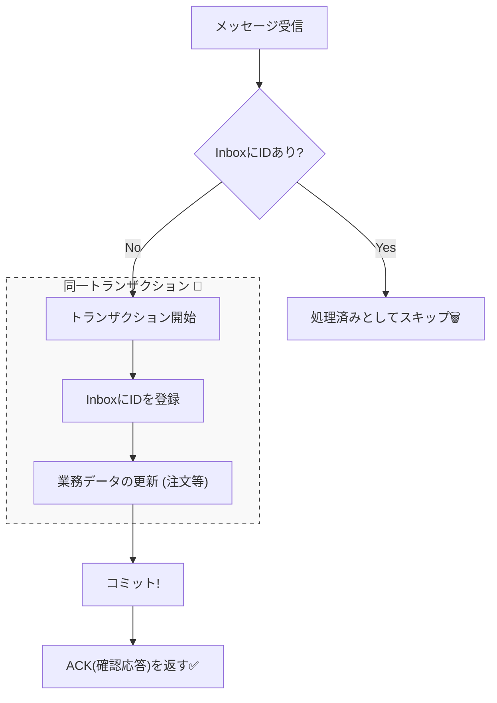

# 第29章：コンシューマ設計（少なくとも1回届く世界の作法）📬🛡️

## この章でできるようになること🎯✨

* 「**同じイベントが2回来ても壊れない**」コンシューマを作れる（冪等コンシューマ）🛡️
* **重複・順不同・再配達**が“ふつうに起きる”前提で設計できる📨📨🔀
* **リトライ**と**DLQ（配信不能キュー）**を「運用できる形」で組み込める🧯🗑️
* CampusCafeのイベント（例：`OrderPaid` / `StockReserved`）を安全に処理できる☕📦💳

---

## まず結論：分散メッセージは「だいたい少なくとも1回」届く📬

メッセージングでは、ネットワークの都合で「受け取ったのにACKが返せなかった」「処理中に落ちた」みたいなことが起きるよね…😵‍💫
だから多くのブローカーは **at-least-once（少なくとも1回）** の世界になりがち。

* RabbitMQは **ACK（確認応答）を使うと at-least-once** になる（ACKしない限り再配達されうる）📨🔁 ([rabbitmq.com][1])
* Azure Service Busも「ロック＆確定（Complete）/放棄（Abandon）/DLQ」みたいに、処理結果に応じて明示的に扱う設計が基本になるよ📦✅ ([Microsoft Learn][2])

---

## CampusCafeで「壊れやすい」代表例💥

たとえば `OrderPaid`（決済完了イベント）を受けたコンシューマが、

* 注文ステータスをPaidに更新する
* 通知を送る（「決済できたよ〜🔔」）
* ポイントを付与する

…をやるとして、同じイベントが2回来たらどうなる？😇
そのままだと「ポイント2倍」「通知2回」「二重処理」が起きるかも💦

だから必要なのが **冪等コンシューマ（Idempotent Consumer）** だよ🛡️✨

---

## 冪等コンシューマの王道パターンは2つ🧩




### パターンA：処理そのものを“自然に冪等”にする（Upsert/一意制約）🌱

* 例：注文ステータス更新を「`Paid` 以外なら `Paid` にする」みたいにする
* 例：ポイント付与を「（OrderId, Rule）に一意制約」して二重付与をDBで止める

**DBの一意制約で守る**のは強いよ💪
ただし「通知送信」みたいな外部副作用は、DBだけで完結しないから注意⚠️

---

### パターンB：Inbox（処理済みテーブル）で“重複排除”する📥🗃️

イベント（メッセージ）には **ユニークなID**（`MessageId` / `EventId`）を持たせて、
コンシューマ側で「このID、もう処理した？」をDBに記録する方式だよ✨

* `Inbox`（または `processed_messages`）に `EventId` を保存
* **ユニークインデックス**で二重登録を防ぐ
* すでに存在したら「重複だからスキップ」📨➡️🗑️

この考え方が「Idempotent Consumer / Inbox」パターンとしてよく使われるよ📌 ([event-driven.io][3])

---

## 今日のミニ実装：Inbox方式で「2回来ても壊れない」コンシューマを作る🧪✅

### つくるもの🛠️

* `OrderPaid` イベントを処理するコンシューマ
* SQLiteに `Inbox` と `Orders` を作る
* 同じ `EventId` を2回流しても結果が1回分になるのを確認🎉

---

## DB設計（最小構成）🗃️

### テーブルイメージ📌

* `inbox_messages`

  * `EventId`（ユニーク！）
  * `ProcessedAt`
* `orders`

  * `OrderId`（ユニーク）
  * `Status`（例：Created / Paid / Cancelled）

> ポイント：**「Inbox登録」と「Orders更新」を同じトランザクションでやる**こと！
> これで「Inboxだけ登録された/Ordersだけ更新された」みたいな事故を減らせるよ🛡️✨

---

## 実装（SQLite + ADO.NETでシンプル版）🧁

以下は「メッセージを受けた」想定で `HandleOrderPaidAsync` を呼ぶミニ構成だよ📨

```csharp
using Microsoft.Data.Sqlite;

public sealed record OrderPaidEvent(string EventId, string OrderId, DateTimeOffset PaidAt);

public static class Consumer
{
    public static async Task HandleOrderPaidAsync(SqliteConnection conn, OrderPaidEvent ev)
    {
        // 1) トランザクション開始（Inboxと業務更新を同じトランザクションで！）
        await using var tx = await conn.BeginTransactionAsync();

        // 2) InboxにEventIdを登録（重複ならユニーク制約で弾かれる）
        //    → ここが「重複排除の栓」🛡️
        var insertInbox = conn.CreateCommand();
        insertInbox.Transaction = tx;
        insertInbox.CommandText = """
            INSERT INTO inbox_messages (event_id, processed_at)
            VALUES ($event_id, $processed_at);
        """;
        insertInbox.Parameters.AddWithValue("$event_id", ev.EventId);
        insertInbox.Parameters.AddWithValue("$processed_at", DateTimeOffset.UtcNow.ToString("O"));

        try
        {
            await insertInbox.ExecuteNonQueryAsync();
        }
        catch (SqliteException ex) when (ex.SqliteErrorCode == 19) // SQLITE_CONSTRAINT
        {
            // もう処理済み＝重複イベント📨📨
            await tx.RollbackAsync();
            return;
        }

        // 3) 業務更新：注文をPaidにする（すでにPaidでも結果が同じになるように）
        var updateOrder = conn.CreateCommand();
        updateOrder.Transaction = tx;
        updateOrder.CommandText = """
            UPDATE orders
               SET status = 'Paid'
             WHERE order_id = $order_id
               AND status <> 'Paid';
        """;
        updateOrder.Parameters.AddWithValue("$order_id", ev.OrderId);

        await updateOrder.ExecuteNonQueryAsync();

        // 4) コミット
        await tx.CommitAsync();
    }
}
```

### 事前に作るDDL（SQLite）📄

```sql
CREATE TABLE IF NOT EXISTS inbox_messages (
  event_id     TEXT PRIMARY KEY,
  processed_at TEXT NOT NULL
);

CREATE TABLE IF NOT EXISTS orders (
  order_id TEXT PRIMARY KEY,
  status   TEXT NOT NULL
);
```

---

## ミニ演習：同じイベントを2回流して確認しよう📨📨✅

### 手順🪄

1. `orders` に `order_id='O-100' , status='Created'` を入れる
2. `EventId='E-1'` の `OrderPaid` を2回処理する
3. 結果：`orders.status` は `Paid` のまま、`inbox_messages` は `E-1` が1行だけ✨

### 期待する“壊れない挙動”💯

* 2回目は `inbox_messages` の一意制約で止まって **何も起きない**
* だから「ポイント2倍」みたいな事故が消える🛡️

---

## “順番”が必要なときだけ、専用の仕組みを使う🔀➡️📌

順不同は普通に起きるよ〜😵‍💫
でも全部を「順番保証」にするとコストが高い（遅くなる/詰まりやすい）💦

### どうしても順番が必要な例📌

* `OrderCreated → OrderPaid → OrderCompleted` を**必ず順に**処理したい
* “同じOrderIdのイベントだけ”順番が守れればOK

この手のケースでは、Azure Service Busの **Sessions（FIFO）** が使えるよ✨
「同じ `SessionId=OrderId` のイベントは順に処理」みたいな感じ！ ([Microsoft Learn][4])

---

## DLQ（配信不能キュー）は「失敗の墓場」じゃなく「調査の保管庫」🗑️🔎

何度やっても失敗する“毒メッセージ”はあるある…🥲
そこでDLQに逃がして、あとで**調査・修正・再投入**できるようにするのが大事！

* Azure Service BusのDLQは「処理できない/配信できないメッセージを保管して検査できる」目的だよ📦🔍 ([Microsoft Learn][5])

### DLQ運用のミニルール（おすすめ）🧭

* DLQに入ったら「原因タグ（理由）」を必ず記録する（例：ValidationError / SchemaMismatch）🏷️
* DLQの滞留件数を監視する（増えたら異常）📈
* 「直せる失敗」は修正して再投入、「直せない」は隔離してアーカイブ🧯

---

## Azure Service Busでの“確定/放棄”のイメージ（超ざっくり）✅↩️🕰️

Service Busの .NET クライアントでは、メッセージに対して代表的にこんな操作があるよ👇

* `Complete`：処理成功 → キューから削除✅
* `Abandon`：今は失敗 → ロック解除して再配達へ↩️
* `Defer`：いったん保留（あとでシーケンス番号で回収）🕰️

（用語の整理に便利！） ([Microsoft Learn][2])

---

## 重要アップデート（2026視点）📣

Azure Service Busの古いSDK（`WindowsAzure.ServiceBus` / `Microsoft.Azure.ServiceBus` など）は **2026-09-30 に退役予定**で、移行が推奨されてるよ⚠️
今から書くなら “最新のAzure SDK” 側で進めるのが安心！ ([Microsoft Learn][6])

---

## フレームワークの助けも借りてOK（MassTransit例）🚌✨

「コンシューマ内で処理して、その後にイベントを発行したい」みたいなとき、
MassTransitの **In-Memory Outbox** を使うと「処理が成功するまで発行を保留」してくれるよ📤🧠 ([masstransit.io][7])

> ただし！それでも**コンシューマが冪等であること**は前提になるよ🛡️ ([masstransit.io][7])

---

## 実装チェックリスト（そのままコピペで使える）✅✅✅

* [ ] イベントに `EventId`（ユニーク）を持たせた？🔑
* [ ] `Inbox`（処理済み記録）をDBに持った？📥
* [ ] `Inbox登録` と `業務更新` を**同一トランザクション**にした？🧱
* [ ] 業務更新は「すでに適用済みでも結果が同じ」になってる？（冪等）🛡️
* [ ] 外部副作用（通知/他API呼び出し）は“二重でも平気”にできてる？🔔
* [ ] リトライしていい失敗/ダメな失敗の線引きがある？🚥
* [ ] 毒メッセージはDLQに逃がして調査できる？🗑️🔎
* [ ] 監視：失敗率、リトライ回数、DLQ滞留を見れる？📈

---

## AI活用（Copilot / Codex向けプロンプト例）🤖✨

### ① Inboxパターンの実装レビューをしてもらう🔍

* 「この `HandleOrderPaidAsync` が冪等になってるか、重複時の挙動とトランザクション境界をチェックして。改善点も出して」

### ② “副作用”の洗い出しをさせる🧨

* 「このコンシューマ内の副作用（通知、外部API、イベント発行）を列挙して、二重実行でも安全にする方法を提案して」

### ③ DLQの運用ルールを作らせる🧹

* 「DLQに落ちたメッセージを調査・復旧する運用手順（原因分類、再投入条件、監視項目）をCampusCafe向けに作って」

---

## 章末まとめ🌸

* “少なくとも1回届く”世界では、**重複はバグじゃなく仕様**📨📨
* だからコンシューマは **冪等** にするのが正義🛡️✨
* 王道は **Inbox（処理済みテーブル＋一意制約）** 📥
* 順序が本当に必要なときだけ、**Sessions（FIFO）** など専用機能を使う🔀➡️ ([Microsoft Learn][4])
* 失敗はDLQで“見える化”して、運用で勝つ🗑️🔎 ([Microsoft Learn][5])

[1]: https://www.rabbitmq.com/docs/reliability?utm_source=chatgpt.com "Reliability Guide"
[2]: https://learn.microsoft.com/en-us/dotnet/api/overview/azure/messaging.servicebus-readme?view=azure-dotnet&utm_source=chatgpt.com "Azure Service Bus client library for .NET"
[3]: https://event-driven.io/en/outbox_inbox_patterns_and_delivery_guarantees_explained/?utm_source=chatgpt.com "Outbox, Inbox patterns and delivery guarantees explained"
[4]: https://learn.microsoft.com/en-us/azure/service-bus-messaging/message-sessions?utm_source=chatgpt.com "Azure Service Bus message sessions"
[5]: https://learn.microsoft.com/en-us/azure/service-bus-messaging/service-bus-dead-letter-queues?utm_source=chatgpt.com "Service Bus dead-letter queues - Azure"
[6]: https://learn.microsoft.com/en-us/azure/service-bus-messaging/duplicate-detection?utm_source=chatgpt.com "Azure Service Bus duplicate message detection"
[7]: https://masstransit.io/documentation/patterns/in-memory-outbox?utm_source=chatgpt.com "In-Memory Outbox"
