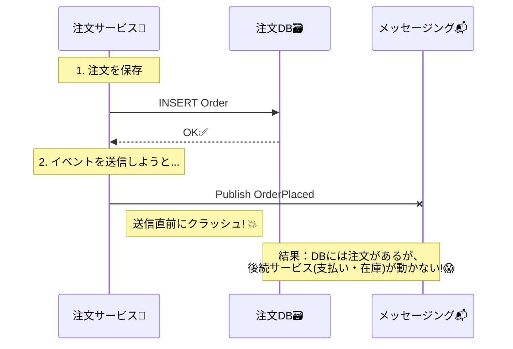

# 第30章：Outbox① なぜ必要？（DB更新と送信のズレ問題）📤🧾

### 1. まず結論：Outboxは「二重書き（Dual Write）の地獄」を避けるための保険🛟😵‍💫

分散システムでよくあるのが、このセットです👇

* **DBに保存する（注文を作る）** 🗃️
* **メッセージを送る（在庫サービスへ依頼イベント）** 📨

この2つを「別々に」やると、途中で落ちた瞬間にズレます💥
これを一般に **Dual Write（2系統への書き込み）問題**って呼びます。([AWS ドキュメント][1])

Outbox（トランザクショナルOutbox）パターンは、
**“DB更新と同じトランザクションで、送るべきメッセージをOutboxテーブルに確実に残す”**ことで、ズレを回避します✅([microservices.io][2])

---

### 2. “ズレ問題”が起きると何がヤバい？（CampusCafeあるある）☕📱💥




CampusCafeで「注文→在庫→決済→通知」って流れがありましたよね。

ここで **注文サービス**がやりがちな処理👇

1. 注文をDBに保存 🗃️
2. `OrderPlaced` を発行して在庫サービスへ伝える 📨

これが落ちると…こうなる😇

| 落ち方              | 起きること               | ユーザー体験（最悪）             |
| ---------------- | ------------------- | ---------------------- |
| DBは成功、送信は失敗      | 注文は存在するのに、在庫が確保されない | 画面は「注文できた」っぽいのに裏で止まる😵 |
| DBは失敗、送信は成功      | 在庫だけ確保される（幽霊注文）     | 在庫が減るのに注文が見えない👻📦     |
| 送信は成功、でもクライアント再送 | 同じ注文が2回分飛ぶ          | 二重注文・二重確保の地獄📨📨💣     |

このへん、**“ネットワークは普通に切れる/遅れる/再送される”**が前提なので、いつでも起きます📡🐢

---

### 3. Outboxのアイデア：送信を「DBの外」へ追い出す🏃‍♀️📤

Outboxの考え方はシンプル✨

**ポイントはここ👇**

* 「DB更新」と「送信」を同じ“同期処理”で完璧にやろうとしない🙅‍♀️
* まず **DBトランザクションの中で**

  * 注文データ ✅
  * 送るべきイベント（Outboxレコード）✅
    を **一緒に保存**する
* 実際の送信は、別プロセス/別スレッドが **後で確実に送る**📮🔁

図で見るとこう👇([microservices.io][2])


* リクエスト処理（同期）

  * `Orders` 更新 🗃️
  * `Outbox` に「送る予定」記録 🧾✅（同じトランザクション）
* Outboxリレー（非同期）

  * `Outbox` を読んでブローカーへ送信 📨
  * 送れたら“送信済み”にする（運用は次章で！）🧹

Microsoftのガイダンスでも、信頼できるイベント配信の方法として「トランザクショナルOutbox」が紹介されています。([Microsoft Learn][3])

---

### 4. じゃあOutboxテーブルに「何を保存する」の？🗃️🧩

第30章のミニゴールはここです👇
**Outboxに入れる“最低限セット”を決められるようになること**🎯✨

おすすめの最低限（まずはこれでOK）👇

* `Id`：OutboxメッセージID（GUID）🔑
* `OccurredAt`：いつ起きたイベント？⏰
* `Type`：イベント種類（例：`OrderPlaced`）🏷️
* `AggregateId`：関連する注文ID（例：`OrderId`）🧾
* `Payload`：イベント本文（JSON）📦
* `Headers`：相関ID（CorrelationId）や TraceId（任意）🧵

「送ったかどうか（Pending/Sent/Failed）」みたいな状態管理は次章（第31章）で運用として育てます🧹📈

---

### 5. まず“ダメな例”→ Outbox版へ（C#イメージ）🧠💡

#### ❌ ダメな例：DB保存と送信を直列にやる（落ちたらズレる）

```csharp
public async Task<Guid> PlaceOrderAsync(PlaceOrderRequest req)
{
    var order = Order.Create(req);

    db.Orders.Add(order);
    await db.SaveChangesAsync(); // ✅ DBは保存できた

    await bus.PublishAsync(new OrderPlaced(order.Id)); // 💥 ここで落ちたら「DBだけ成功」

    return order.Id;
}
```

#### ✅ Outboxの考え方：同じトランザクションでOutboxへ“送る予定”を書き込む

```csharp
public sealed class OutboxMessage
{
    public Guid Id { get; set; }
    public DateTimeOffset OccurredAt { get; set; }
    public string Type { get; set; } = default!;
    public Guid AggregateId { get; set; }
    public string PayloadJson { get; set; } = default!;
}

public async Task<Guid> PlaceOrderAsync(PlaceOrderRequest req)
{
    var order = Order.Create(req);

    // ここでは "送信" しない。送る予定を Outbox に書くだけ。
    var evt = new OrderPlaced(order.Id);

    using var tx = await db.Database.BeginTransactionAsync();

    db.Orders.Add(order);

    db.OutboxMessages.Add(new OutboxMessage
    {
        Id = Guid.NewGuid(),
        OccurredAt = DateTimeOffset.UtcNow,
        Type = nameof(OrderPlaced),
        AggregateId = order.Id,
        PayloadJson = System.Text.Json.JsonSerializer.Serialize(evt),
    });

    await db.SaveChangesAsync();
    await tx.CommitAsync(); // ✅ 注文 + Outbox が「一緒に」確定

    return order.Id;
}
```

この時点では「Outboxに確実に残った」だけ。
実際の送信（Outboxを読んでPublishする）は次章で“運用として完成”させます📤🔁✨

---

### 6. ミニ演習：CampusCafeのOutboxに入れる“イベント候補”を決めよう☕📚✨

以下の機能で、**Outboxに残すべきイベント**に丸をつけてみてね😊✅

* 注文作成：`OrderPlaced` ☕🧾 ✅（だいたい必要）
* 在庫確保依頼：`ReserveStockRequested` 📦 ✅
* 決済開始：`PaymentRequested` 💳 ✅
* 決済成功：`PaymentSucceeded` ✅
* 決済失敗：`PaymentFailed` ❌/✅（通知したいなら✅）
* 通知：`NotifyUserRequested` 🔔 ✅（通知はAP寄りでOutboxと相性良い）

**判断のコツ**🎛️

* 「他サービスが動くための合図」＝Outbox候補になりやすい📣
* 「後からでも送れればOK」＝Outboxと相性よし🐢✨
* 「送れなかったら業務が止まる」＝なおさらOutboxが欲しい😵‍💫

---

### 7. AI活用（Copilot / Codex向け）🤖✨

そのままコピペで使えるプロンプト例👇

* 「CampusCafeの注文サービス向けに、Outboxテーブルの最小スキーマ案を作って。Id/Type/Payload/OccurredAt/AggregateId/Headersを含めて」🧱🗃️
* 「EF Coreで、Ordersの保存とOutboxMessageの追加を同一トランザクションにする実装例を出して」🧩✅
* 「OutboxのPayloadに入れるJSONの設計方針（バージョニング、必須フィールド）を初心者向けに説明して」📦📝

---

### 8. ここだけは押さえる！Outbox“必要性”チェックリスト✅🧾

* DB更新とイベント送信を **別々に成功/失敗**しうる（＝ズレる）📡💥
* Outboxは **同一トランザクションで“送る予定”をDBに残す**ことでズレを消す✅([microservices.io][2])
* 送信は「後で」別プロセスがやる（再送できる形にする）🔁📤([microservices.io][2])
* 実運用では「少なくとも1回届く」前提になるので、受け手側の冪等性も大事🛡️📬
  （Outboxは“送信側の地獄”を減らすもの、全部を魔法で解決はしない🪄❌）

---

### 9. 小まとめ😊✨

Outboxが必要になる理由はただ1つ！
**「DB更新」と「メッセージ送信」を別々にやると、落ちた瞬間にズレて地獄を見るから」**😵‍💫📤

次章では、このOutboxを現実に回すために
**再送・掃除・監視**（Pending/Sent/Failed、滞留、失敗率…）の“運用の肌感覚”を作っていきます🧹🔁📈([docs.particular.net][4])

[1]: https://docs.aws.amazon.com/prescriptive-guidance/latest/cloud-design-patterns/transactional-outbox.html?utm_source=chatgpt.com "Transactional outbox pattern - AWS Prescriptive Guidance"
[2]: https://microservices.io/patterns/data/transactional-outbox.html?utm_source=chatgpt.com "Pattern: Transactional outbox"
[3]: https://learn.microsoft.com/en-us/azure/architecture/databases/guide/transactional-outbox-cosmos?utm_source=chatgpt.com "Transactional Outbox pattern with Azure Cosmos DB"
[4]: https://docs.particular.net/nservicebus/outbox/?utm_source=chatgpt.com "Outbox • NServiceBus - Particular Developer Portal"
