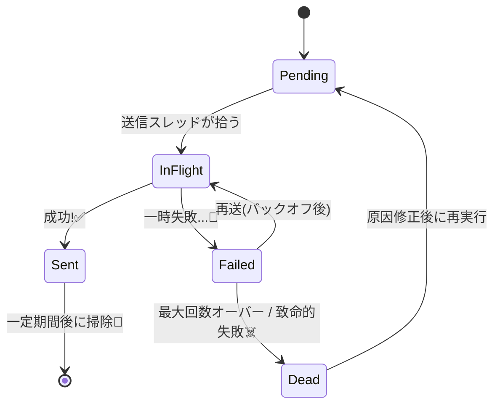

# 第31章：Outbox② 運用の肌感覚（再送・掃除・監視）🧹🔁📈

---

## 31.1 Outboxは「作っただけ」だとすぐ詰まるよ😵‍💫📦


Outbox（Transactional Outbox）は、**DB更新とイベント送信の“ズレ事故”**を避けるための定番パターンだよね📤🧾
基本は「**DBトランザクションで Outbox に“送る予定”を書いておいて**、あとで確実に送る」方式。([microservices.io][1])

でも…運用が雑だとこうなる😇

* 送信失敗が続く → **Outboxが溜まる**🧊
* 溜まる → DBが重い/遅い → さらに失敗 → **雪だるま**☃️
* 毒メッセージ（永久に失敗するやつ）で **無限リトライ地獄**♾️🔥
* 送れた/送れてないが分からない → **誰も安心できない**🥺

なのでこの章は「運用の肌感覚」を作るよ〜！✨

---

## 31.2 CampusCafeでのOutbox運用イメージ☕📱📨

例：注文が入ったら、注文DBの更新と同時に Outbox に `OrderPlaced` を積む。

* DB更新：注文を `Created` にする🧾
* Outbox：`OrderPlaced`（在庫サービスへ送る予定）を `Pending` で保存📨

在庫サービスが一時ダウンしてても、**注文を受け付けて（A寄り）あとで送る**選択ができる。
ただしその代わり、**Outboxの滞留と再送**を運用でさばく必要がある…って感じ😊🧠

---

## 31.3 Outboxレコードの状態設計（最重要）🚦✨





まずは Outbox に「状態」を持たせるよ。おすすめはこの5つ👇

| 状態         | 意味             | 次に起きること                  |
| ---------- | -------------- | ------------------------ |
| `Pending`  | 送信待ち           | 送信処理が拾う📤                |
| `InFlight` | いま送信中（ロック中）    | 成功→`Sent` / 失敗→`Failed`  |
| `Sent`     | 送信済み           | 後で掃除対象🧹                 |
| `Failed`   | 送信失敗（再送待ち）     | `NextAttemptAt` 以降に再挑戦🔁 |
| `Dead`     | 毒メッセージ隔離（DLQ的） | 人が見る👀                   |

さらに運用で効く“メタ情報”も入れると強いよ💪

* `AttemptCount`：何回失敗した？🔢
* `NextAttemptAtUtc`：次いつ再送する？🕒
* `LockedUntilUtc`：並列実行で二重処理しないためのロック⛓️
* `LastError`：最後の失敗理由（短くでOK）🧾
* `OccurredAtUtc`：発生順（並べ替え用）🗂️

---

## 31.4 再送（Retry）は“やさしく”設計する🔁🌿

### 31.4.1 再送の基本ルール🧠


* **一時的な失敗**（ネットワーク、相手が一瞬落ちた、タイムアウト）→ 再送OK✅
* **永続的な失敗**（入力不正、送信先設定ミス、契約違反）→ 再送しても無駄❌ → `Dead`へ

そして、バックグラウンド処理の再送はだいたい
✅ **指数バックオフ + ジッター** が鉄板だよ（混雑を増やさないため）📉✨ ([Microsoft Learn][2])

* 指数バックオフ：1秒→2秒→4秒→8秒…みたいに待つ⏳
* ジッター：ちょっとランダムにずらす🎲（全員同時に再送しないため）

### 31.4.2 「最大回数」と「上限待ち」を決めよう🧯

* `MaxAttempts`：例）10回
* `MaxDelay`：例）30秒〜5分で上限
* `Dead`へ送る条件：例）`AttemptCount >= MaxAttempts` で隔離

---

## 31.5 二重送信は“起きる前提”😇📨📨

Outboxは「確実に送る」に強いけど、基本的に世界は **少なくとも1回（at-least-once）** になりがち。
つまり **二重送信は普通に起きうる** 🥺

だから運用としては、

* 送る側（Outbox）：重複して送ることがある
* 受ける側（コンシューマ）：**冪等で受ける**（第29章の復習）🛡️

このペアが大事だよ〜！

---

## 31.6 DLQ（Dead Letter）的な扱い：毒メッセージを隔離☠️📮


`Dead` は「捨てる箱」じゃなくて **“隔離して人が判断する箱”** だよ👀✨

### 31.6.1 `Dead` に入れる代表例

* 仕様違反（必須項目がない、型が違う）📛
* 送信先が永久に無い（Topic名ミスなど）🫠
* 10回失敗してもダメ（MaxAttempts超え）🥲

### 31.6.2 `Dead` の運用フロー（おすすめ）

1. `Dead` が増えたらアラート🚨
2. 一覧で原因を見る（`LastError`）👀
3. 対応を選ぶ

   * 修正して **再キュー**（`Pending`に戻す）🔁
   * 仕様的に無理なら **破棄**（監査ログだけ残す）🗑️

---

## 31.7 掃除（Cleanup）と肥大化対策🧹🗄️


Outboxは放置すると増える一方📈
なので「保持期間」を決めよう！

* `Sent`：例）7日で削除🧹
* `Failed/Dead`：例）30日保持（調査のため）🕵️‍♀️
* 監査が必要なら「別テーブル/別ストレージにアーカイブ」📦

さらに性能のために
✅ **`Status` と `NextAttemptAtUtc` で探しやすい索引（Index）** を意識すると運用が安定しやすいよ🧠✨
（Outboxは「送信対象の抽出」がボトルネックになりやすいからね）

---

## 31.8 監視（Monitoring）で“詰まり”を即発見📈🚨


監視は「CPU/メモリ」より、まず **Outboxの健康状態**！

### 31.8.1 最低限ほしい監視項目（まずこれ）✅

* `outbox_pending_count`：Pending+Failedが何件？📦
* `outbox_oldest_age`：一番古い未送信は何分前？🕰️
* `outbox_publish_success_total`：成功回数✅
* `outbox_publish_failure_total`：失敗回数❌
* `outbox_dead_total`：Dead行き回数☠️

.NETでは `System.Diagnostics.Metrics` でメトリクス計測できるよ。([Microsoft Learn][3])
OpenTelemetry で Prometheus/Grafana につなぐ定番ルートもあるよ。([OpenTelemetry][4])

### 31.8.2 アラートの例（CampusCafe向け）🔔

* `outbox_oldest_age > 5分` → 「在庫/決済連携が詰まってるかも」🚨
* `outbox_dead_total が増加` → 「毒メッセージ発生」☠️
* `failure_rate > 20%` が5分続く → 「送信先が落ちてる」🧯

---

## 31.9 最小実装：Outbox Dispatcher（ポーリング送信）🧩💻

ASP.NET Core のバックグラウンド処理は `Hosted Service`（`BackgroundService`）で書けるよ。([Microsoft Learn][5])
（Windowsサービスとして動かす形も作れるよ）([Microsoft Learn][6])

> ここでは「学習用にわかりやすく」最小構成にしてるよ😊
> 本番でスケールアウトする場合は“ロックの取り方”をより厳密にするのがポイント（後述）🔐

### 31.9.1 Outboxエンティティ例🚦

```csharp
public enum OutboxStatus
{
    Pending = 0,
    InFlight = 1,
    Sent = 2,
    Failed = 3,
    Dead = 4,
}

public sealed class OutboxMessage
{
    public Guid Id { get; set; } = Guid.NewGuid();

    public DateTime OccurredAtUtc { get; set; } = DateTime.UtcNow;

    public string Type { get; set; } = default!;        // 例: "OrderPlaced"
    public string PayloadJson { get; set; } = default!; // JSON

    public OutboxStatus Status { get; set; } = OutboxStatus.Pending;

    public int AttemptCount { get; set; } = 0;
    public DateTime NextAttemptAtUtc { get; set; } = DateTime.UtcNow;

    public DateTime? LockedUntilUtc { get; set; }
    public string? LastError { get; set; }

    public DateTime? SentAtUtc { get; set; }
    public string? DeadReason { get; set; }
}
```

### 31.9.2 再送待ち時間（指数バックオフ + ジッター）🎲⏳

```csharp
public static class RetryDelay
{
    public static TimeSpan ComputeDelay(int attemptCount)
    {
        // attemptCount: 1,2,3... を想定
        var expSeconds = Math.Pow(2, Math.Min(attemptCount - 1, 10)); // 爆発しすぎ防止
        var baseDelay = TimeSpan.FromSeconds(Math.Min(expSeconds, 60)); // 上限60秒

        // ジッター（0〜250ms）
        var jitter = TimeSpan.FromMilliseconds(Random.Shared.Next(0, 250));
        return baseDelay + jitter;
    }
}
```

バックオフ＋ジッターは「バックグラウンド処理の再送」に推奨されやすいよ。([Microsoft Learn][2])

### 31.9.3 送信部（ダミー）📤


```csharp
public interface IEventBus
{
    Task PublishAsync(string type, string payloadJson, CancellationToken ct);
}
```

### 31.9.4 Dispatcher（BackgroundService）🔁

```csharp
using Microsoft.EntityFrameworkCore;
using Microsoft.Extensions.Hosting;

public sealed class OutboxDispatcher : BackgroundService
{
    private readonly IServiceScopeFactory _scopeFactory;
    private readonly TimeSpan _pollInterval = TimeSpan.FromSeconds(1);
    private const int BatchSize = 20;
    private const int MaxAttempts = 10;
    private readonly TimeSpan _lockFor = TimeSpan.FromSeconds(30);

    public OutboxDispatcher(IServiceScopeFactory scopeFactory)
        => _scopeFactory = scopeFactory;

    protected override async Task ExecuteAsync(CancellationToken stoppingToken)
    {
        while (!stoppingToken.IsCancellationRequested)
        {
            try
            {
                await DispatchOnce(stoppingToken);
            }
            catch
            {
                // 学習用：握りつぶし。実務ではログに出すよ🧾
            }

            await Task.Delay(_pollInterval, stoppingToken);
        }
    }

    private async Task DispatchOnce(CancellationToken ct)
    {
        using var scope = _scopeFactory.CreateScope();
        var db = scope.ServiceProvider.GetRequiredService<AppDbContext>();
        var bus = scope.ServiceProvider.GetRequiredService<IEventBus>();

        var now = DateTime.UtcNow;

        // 1) 送信対象を拾う（期限が来ていて、ロックされてないもの）
        var targets = await db.OutboxMessages
            .Where(m =>
                (m.Status == OutboxStatus.Pending || m.Status == OutboxStatus.Failed) &&
                m.NextAttemptAtUtc <= now &&
                (m.LockedUntilUtc == null || m.LockedUntilUtc < now))
            .OrderBy(m => m.OccurredAtUtc)
            .Take(BatchSize)
            .ToListAsync(ct);

        if (targets.Count == 0) return;

        // 2) いったんロック（学習用の簡易版）
        foreach (var m in targets)
        {
            m.Status = OutboxStatus.InFlight;
            m.LockedUntilUtc = now.Add(_lockFor);
        }
        await db.SaveChangesAsync(ct);

        // 3) 送信して結果を書く
        foreach (var m in targets)
        {
            try
            {
                await bus.PublishAsync(m.Type, m.PayloadJson, ct);

                m.Status = OutboxStatus.Sent;
                m.SentAtUtc = DateTime.UtcNow;
                m.LockedUntilUtc = null;
                m.LastError = null;
            }
            catch (Exception ex)
            {
                m.AttemptCount += 1;
                m.LastError = ex.Message;

                if (m.AttemptCount >= MaxAttempts)
                {
                    m.Status = OutboxStatus.Dead;
                    m.DeadReason = $"MaxAttempts({MaxAttempts}) exceeded";
                    m.LockedUntilUtc = null;
                }
                else
                {
                    m.Status = OutboxStatus.Failed;
                    m.NextAttemptAtUtc = DateTime.UtcNow + RetryDelay.ComputeDelay(m.AttemptCount);
                    m.LockedUntilUtc = null;
                }
            }
        }

        await db.SaveChangesAsync(ct);
    }
}
```

#### ⚠️運用メモ（ちょい上級）🔐

複数台でDispatcherを動かすなら、上の「簡易ロック」だと競合しやすいよ💦
本番では「**DBで原子的に“取り分け（claim）”する**」方式（`UPDATE ... OUTPUT` など）にすると強い。
ここは環境（DB種類）で実装が変わるので、「まず概念→次にDB別実装」でOK😊

---

## 31.10 ミニ演習：CampusCafeのOutbox運用を設計しよう🧠📝

### 演習A：状態設計🚦

`Pending / InFlight / Sent / Failed / Dead` に加えて、次を決めてね👇

* `MaxAttempts` は何回？🔢（例：10）
* `MaxDelay` は何秒？⏳（例：60秒）
* `Dead` に入ったら誰が見る？どこで見る？👀

### 演習B：監視の閾値を決める📈🚨

次の3つに「赤信号」を付けよう！

* `outbox_oldest_age` が何分でアラート？🕰️
* `dead_total` が何件増えたらアラート？☠️
* `failure_rate` の許容は？❌

### 演習C：毒メッセージ対応フローを作る☠️➡️🛠️

* 例：`Dead` を一覧表示 → `LastError` を見て原因分類 → 「再キュー / 破棄 / 修正して再送」
  この一連を文章で書いてみてね📝✨

---

## 31.11 AI活用（Copilot / Codex向け）プロンプト集🤖✨

### ① 状態・カラムのレビューをさせる🔍

* 「Outboxの状態を `Pending/InFlight/Sent/Failed/Dead` にしたい。必要なカラム（AttemptCount/NextAttemptAt/Lock/LastError等）を提案して、運用の観点で理由も付けて」

### ② アラート設計を手伝わせる🚨

* 「Outboxの監視項目（滞留、最古の年齢、失敗率、Dead件数）について、CampusCafe（注文・在庫・決済・通知）でおすすめの閾値案を出して」

### ③ “毒メッセージ”の分類を作らせる☠️

* 「OutboxがDeadになる原因を『再送して直る系/直らない系』に分類して、判断フローを作って」

### ④ スケールアウトの方向性を整理させる🧠

* 「Outbox Dispatcherを複数インスタンスで動かす場合の“取り分け（claim）”戦略を、DBロック/楽観的同時実行/UPDATEで取り分け、の観点で比較して」

---

## 31.12 チェックリスト（この章のゴール）✅✨

* [ ] Outboxの状態（`Pending/InFlight/Sent/Failed/Dead`）が決まってる🚦
* [ ] リトライは指数バックオフ＋ジッターで、上限と回数がある🔁🎲 ([Microsoft Learn][2])
* [ ] `Dead` は隔離＆人が見て再キューできる導線がある☠️📮
* [ ] `Sent` の保持期間が決まってて掃除できる🧹
* [ ] 「滞留件数」「最古の年齢」「失敗率」「Dead増加」を監視できる📈🚨
* [ ] バックグラウンド処理はHosted Serviceで動く（まずはここ！）🔧

[1]: https://microservices.io/patterns/data/transactional-outbox.html?utm_source=chatgpt.com "Pattern: Transactional outbox"
[2]: https://learn.microsoft.com/en-us/azure/well-architected/design-guides/handle-transient-faults?utm_source=chatgpt.com "Recommendations for handling transient faults"
[3]: https://learn.microsoft.com/en-us/dotnet/core/diagnostics/metrics-instrumentation?utm_source=chatgpt.com "Creating Metrics - .NET"
[4]: https://opentelemetry.io/docs/languages/dotnet/exporters/?utm_source=chatgpt.com "Exporters"
[5]: https://learn.microsoft.com/en-us/aspnet/core/fundamentals/host/hosted-services?view=aspnetcore-10.0&utm_source=chatgpt.com "Background tasks with hosted services in ASP.NET Core"
[6]: https://learn.microsoft.com/ja-jp/dotnet/core/extensions/windows-service?utm_source=chatgpt.com "を使用して Windows サービスを作成する BackgroundService"
