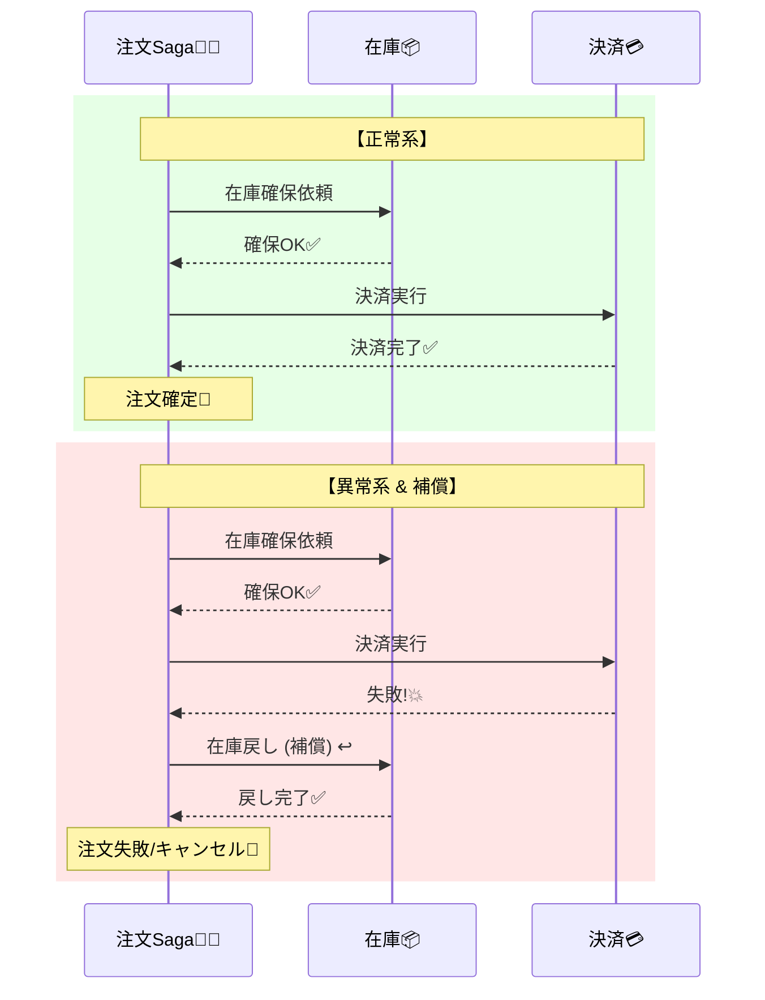

# 第32章：版のポイントまとめ😊✨

（題材：学食モバイルオーダー “CampusCafe” ☕🍰📱）

---

### 32.1 Sagaって何？いきなり結論からいくよ〜😊✨

Sagaはひとことで言うと、

**「分散の世界で、途中まで成功しちゃった処理を“ビジネス的に”帳尻合わせする作法」**だよ〜🧩🌍✨

* ✅ **全部まとめて一発で成功**しない（しないことが多い）😇
* ✅ だから **各ステップを“確定”**させながら進む🚶‍♀️🚶‍♂️
* ✅ ダメだったら **“補償（Compensation）”**で戻す↩️🧹

> DBのトランザクションみたいな「完全ロールバック✨」はできないことが多いんだ〜😵‍💫
> （外部決済、別DB、別サービス…が出た瞬間、世界が変わるよ📡）

---

### 32.2 CampusCafeで、何が“途中まで成功”になる？☕📦💳🔔

注文フローをもう一回おさらい👇

1. 注文受付（Order）🧾
2. 在庫確保（Stock Reserve）📦
3. 決済（Payment）💳
4. 通知（Notification）🔔

分散あるあるはこう👇😇

* 在庫は確保できたのに、決済が落ちた💥（在庫だけ減ってる…）
* 決済は通ったのに、通知が飛んでない🕳️（ユーザー不安…）
* ネットワークが切れて「成功したのか失敗したのか分からない」😵‍💫

だからSagaでは、**失敗したときの“戻し方”も仕様に入れる**よ📘✨

---

### 32.3 まず「CAP判断」を“仕様”として決める🎛️📘✨（ここが本題）

Sagaは実装の前に、**どこをCP寄り／AP寄りにするか**を決めないと迷子になるよ〜🧭💦

#### よくあるおすすめ（CampusCafe版）🌸

| ステップ | 失敗のコワさ | 方向性               | 理由               |
| ---- | -----: | ----------------- | ---------------- |
| 注文受付 |      中 | **AP寄り**（まず受ける）📨 | 受付だけなら「保留」でUX作れる |
| 在庫確保 |      高 | **CP寄り**📦🔒      | 二重確保・取り合いが起きやすい  |
| 決済   |     最高 | **CP寄り**💳🔒      | お金はズレると致命傷       |
| 通知   |      低 | **AP寄り**🔔🐢      | 遅れても取り返せる（再送できる） |

※ .NETの最新LTSは **.NET 10（2025/11/11）**、C#も **C# 14**が最新だよ〜（教材コードもその前提でOK）📌✨ ([Microsoft][1])

---

### 32.4 Saga設計の2流派：オーケストレーション vs コレオグラフィー🎻🕺✨


#### A) オーケストレーション（指揮者がいる）🧑‍✈️🎼

「Sagaオーケストレータ」が、次に何をするか全部決める。

* 👍 良い：流れが見える／デバッグしやすい／仕様を置きやすい🧠✨
* 👎 悪い：指揮者が太りがち（責務が増える）🍔😇

#### B) コレオグラフィー（みんなで踊る）🕺💃

イベントを受けて各サービスが勝手に次へ進む。

* 👍 良い：疎結合でスケールしやすい🔌✨
* 👎 悪い：全体像が見えにくい／事故ると追うのが大変😵‍💫🔍

この章の総合演習では、初心者が理解しやすい **オーケストレーション型**でいくよ〜🎓✨
（ただし最後に「コレオでも作れるよ」も触れるよ😉）

---

### 32.5 “補償”って具体的に何するの？↩️🧹✨（CampusCafe版）





失敗したらこう戻す👇

* 在庫確保に成功 ✅ → 決済が失敗 ❌
  → **在庫の確保を取り消す（Release）** 📦↩️

* 決済に成功 ✅ → 通知が失敗 ❌
  → **通知は再送**（補償というより“やり直し”）🔔🔁

* 決済が「通ったか不明」😵‍💫（タイムアウト等）
  → **“照会”して確定させる**（決済IDで確認）🔎💳

ポイントはこれ👇✨

* 補償は「戻す」だけじゃなく、**“整える”**も含む🌈
* 補償も分散だから、**補償自体が失敗する**こともある😇💥
  → リトライ・監視・手動介入の道を必ず用意する🧯📈

---

### 32.6 総合演習：Sagaを“仕様→設計→実装”に落とす🧩🛠️✨

ここからは「作る」よ〜！💪😊
（1つの解があるわけじゃないので、“判断の理由”が大事だよ📝✨）

---

## 演習①：Sagaの状態（State）を決める🚦🧠✨

まず注文の状態を、Sagaの進み具合として定義しよう👇

例（おすすめ）🌸

* `Pending`：注文受付した（まだ確定じゃない）⏳
* `StockReserved`：在庫確保OK 📦✅
* `PaymentSucceeded`：決済OK 💳✅
* `Completed`：注文確定（完了）🎉
* `Cancelled`：キャンセル済み（補償で戻した）↩️
* `Failed`：失敗（手動対応が必要）🧯😵‍💫

そして「遷移（ルール）」も書くよ👇📋✨

```text
Pending
  ├─(ReserveStock OK)→ StockReserved
  └─(ReserveStock NG)→ Cancelled（または Failed）

StockReserved
  ├─(Payment OK)→ PaymentSucceeded
  └─(Payment NG)→ Cancelled（→ ReleaseStock）

PaymentSucceeded
  ├─(Notify OK)→ Completed
  └─(Notify NG)→ PaymentSucceeded（Notifyをリトライ）
```

🧠コツ：

* 「通知失敗」は、注文自体は成立してることが多いよね？
  だから `Completed` にする前に **通知を“再送タスク”に分離**すると運用がラクだよ🔔🧹✨

---

## 演習②：「コマンド」と「イベント」を決める📨📣✨

オーケストレーション型なので、指揮者が送るのは **コマンド**が中心🎼

### コマンド（お願い）

* `ReserveStock(orderId, items, idempotencyKey)` 📦
* `ReleaseStock(orderId, …)` ↩️
* `CapturePayment(orderId, amount, …)` 💳
* `RefundPayment(orderId, paymentId, …)` 💸↩️
* `SendNotification(orderId, message, …)` 🔔

### イベント（起きた事実）

* `StockReserved(orderId, …)` ✅
* `StockReserveFailed(orderId, reason)` ❌
* `PaymentCaptured(orderId, paymentId)` ✅
* `PaymentFailed(orderId, reason)` ❌
* `NotificationSent(orderId)` ✅
* `NotificationFailed(orderId, reason)` ❌

🧠コツ：**イベントは“過去形”**にすると事故りにくいよ〜🕰️✨

---

## 演習③：どこをCP寄り／AP寄りにするか、文章で確定させる📝🌸✨

ここがCAP判断のゴール！🎯
“短くていい”から、仕様として書くよ👇

例👇（このまま教材に使えるテンプレ✨）

* 注文受付は「受付完了（確認中）」を即返す（AP寄り）📨⏳
* 在庫確保は「二重確保しない」を最優先（CP寄り）📦🔒
* 決済は「二重請求ゼロ」を最優先（CP寄り）💳🔒
* 通知は遅延してもよい。再送で回収する（AP寄り）🔔🐢

---

## 演習④：実装の骨組み（“Sagaオーケストレータ”）を作る🧑‍✈️🛠️✨

ここでは、**OrderService内に SagaOrchestrator を置く**構成にするよ😊
（本番でサービス分けても、考え方は同じだよ🌍✨）

### 重要テーブル（最低限）🗃️✨

* `Orders`：注文本体（状態含む）🧾🚦
* `Outbox`：送る予定のメッセージ📤🧾
* `Inbox`：処理済みメッセージ（重複排除）📥🛡️

> Outbox/InBoxは前章までの内容がここで効くよ〜📤📥✨
> 「少なくとも1回届く」前提なので、重複排除がないとSagaが壊れる😇💥

---

### SagaOrchestrator の疑似コード🧩✨

```csharp
public class SagaOrchestrator
{
    public async Task Handle(OrderPlaced evt)
    {
        // 受付直後：在庫確保へ
        await EnqueueCommand(new ReserveStock(evt.OrderId, evt.Items, evt.IdempotencyKey));
        await UpdateOrderState(evt.OrderId, OrderState.Pending);
    }

    public async Task Handle(StockReserved evt)
    {
        await UpdateOrderState(evt.OrderId, OrderState.StockReserved);

        // 次：決済へ
        await EnqueueCommand(new CapturePayment(evt.OrderId, evt.Amount, evt.IdempotencyKey));
    }

    public async Task Handle(StockReserveFailed evt)
    {
        await UpdateOrderState(evt.OrderId, OrderState.Cancelled);
        // ここで補償は不要（まだ確保できてない）
    }

    public async Task Handle(PaymentCaptured evt)
    {
        await UpdateOrderState(evt.OrderId, OrderState.PaymentSucceeded);

        // 次：通知へ（AP寄り、失敗しても再送できる）
        await EnqueueCommand(new SendNotification(evt.OrderId, "注文が確定しました🎉"));
    }

    public async Task Handle(PaymentFailed evt)
    {
        // 補償：在庫を戻す
        await EnqueueCommand(new ReleaseStock(evt.OrderId, evt.IdempotencyKey));
        await UpdateOrderState(evt.OrderId, OrderState.Cancelled);
    }

    public async Task Handle(NotificationSent evt)
    {
        await UpdateOrderState(evt.OrderId, OrderState.Completed);
    }

    public async Task Handle(NotificationFailed evt)
    {
        // 注文は成立してることが多いので、状態は維持して再送へ
        await EnqueueCommand(new SendNotification(evt.OrderId, "再送：注文が確定しました🎉"));
        // ここはリトライ戦略＆DLQ的運用が大事🧯
    }
}
```

---

## 演習⑤：失敗を“わざと”起こして、肌感覚を作る💥🐢🔀✨

Sagaは **失敗が主役** だよ〜😇
次の「事故」を、テストかデバッグで再現してみよう👇

### 事故シナリオA：決済失敗💳❌ → 在庫戻し📦↩️

* 期待：`ReleaseStock` が必ず走る
* 監視：在庫戻しが滞留してない？📈👀

### 事故シナリオB：通知だけ失敗🔔❌（でも注文は成立）

* 期待：注文は `PaymentSucceeded` のまま
* 期待：通知は再送される（最終的に届く）🐢✨

### 事故シナリオC：イベントが重複で2回来る📨📨😇

* 期待：状態遷移が二重に進まない（冪等）🛡️
* 例：`PaymentCaptured` が2回来ても、二重通知しない

### 事故シナリオD：順番が前後する🔀😵‍💫

* 例：`NotificationSent` が先に来た（バグや運用事故で起きる想定）
* 期待：状態が矛盾したら `Failed` にして止める🧯
  （“握りつぶして進める”のが一番危ない⚠️）

---

### 32.7 「リトライ・回復性」も“仕様の一部”だよ🧯🔁✨

分散は失敗するので、**回復性（resilience）**を組み込むのが基本だよ😊
.NETには回復性の仕組みが用意されていて、`Microsoft.Extensions.Resilience` 系が案内されてるよ📚✨ ([Microsoft Learn][2])

（たとえばHTTPで外部決済に当てるなら、バックオフやタイムアウトの設計が超大事💳⏱️）

※ ここは「第22章/第23章（リトライ＆サーキットブレーカ）」の復習ポイントだよ🔁🧯✨

---

### 32.8 UX（ユーザーにどう見せる？）まで書いて初めて“正解”🌸💬✨

Sagaは裏側だけ整ってても、ユーザーが不安だと負ける😇💦

おすすめ文言（例）👇

* 注文直後：
  **「注文を受け付けました☕✨（確認中…）」** ⏳
* 在庫NG：
  **「ごめんね💦 売り切れでした。別のメニューを選んでね🍰」**
* 決済NG：
  **「決済に失敗しました💳💦 もう一度試してね」**

  * 「在庫は戻しました📦↩️」みたいに安心を足すのもアリ🌸
* 通知遅延：
  **「注文は確定しています🎉 通知が遅れています（自動で再送します🔔）」**

---

### 32.9 AI活用（穴あきチェック＆ADR作成）🤖🔍📝✨

#### ① 設計の穴を指摘させる（超おすすめ）🧠✨

* 「このSaga設計で、重複・順不同・遅延・補償漏れが起きるポイントを列挙して。対策もセットでお願い🙏」

#### ② “事故ったときの運用”を作らせる🧯📈

* 「Outbox滞留、補償失敗、DLQ相当の状態になった時の運用手順を、初心者向けにチェックリスト化して✅」

#### ③ ADRを短く書かせる📝✨（CAP判断の証拠を残す）

テンプレ👇（短くてOK！）

```text
ADR: CampusCafe 注文SagaのCAP判断

Context:
- 注文→在庫→決済→通知で分散が起きる
- 少なくとも1回配送、遅延、順不同、重複が前提

Decision:
- 注文受付はAP寄り（受付→確認中）
- 在庫と決済はCP寄り（重複適用を許さない）
- 通知はAP寄り（再送で回収）
- 失敗時は補償（在庫戻し/払い戻し）をSagaで実施

Consequences:
- UX文言が必要（確認中/確定/失敗の見せ方）
- 補償失敗の監視と手動対応導線が必要
```

---

### 32.10 仕上げチェックリスト✅🧩✨（これ通れば“実戦寄り”）

* ✅ どのステップがCP寄り／AP寄りか文章で決まってる？📘
* ✅ 失敗時の補償が“漏れなく”書けてる？↩️
* ✅ 補償も冪等になってる？（2回戻しても壊れない）🛡️
* ✅ 重複イベント（少なくとも1回）で状態が進みすぎない？📨📨
* ✅ 順不同が来たら「止める」設計になってる？🧯
* ✅ 通知が落ちても、注文が成立してるなら再送できる？🔔🔁
* ✅ 監視項目がある？（滞留件数、失敗率、補償失敗数）📈👀

---

### 32.11 まとめ😊🎉✨


Sagaは「分散の途中成功」を、**仕様（UX）→設計（状態遷移）→実装（冪等＋Outbox）→運用（監視＋再送）**まで落とす技術だよ🧩🌍✨

この章のゴールはこれ👇🎯
**CAP判断を“気分”じゃなく、仕様と状態遷移と補償フローとして書けること**📘🚦↩️✨

（最新の.NETは .NET 10（LTS）で、C# 14が対応だよ📌✨） ([Microsoft][1])

[1]: https://dotnet.microsoft.com/ja-jp/platform/support/policy/dotnet-core?utm_source=chatgpt.com ".NET および .NET Core の公式サポート ポリシー"
[2]: https://learn.microsoft.com/ja-jp/dotnet/core/resilience/?utm_source=chatgpt.com "回復性のあるアプリ開発の概要 - .NET"
