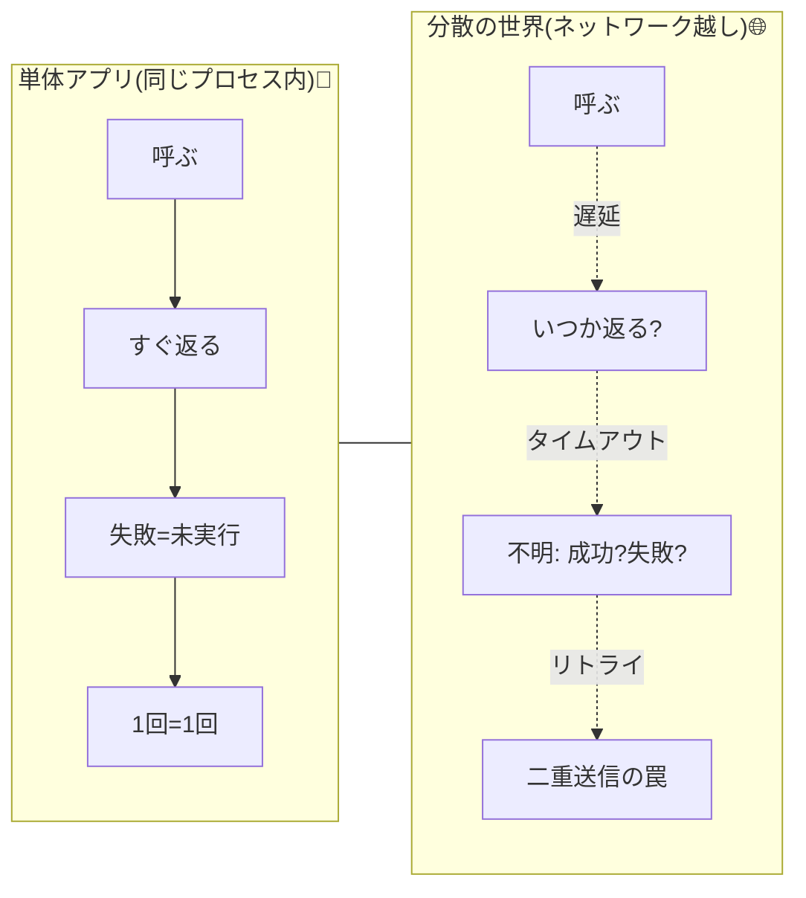

# 第01章：分散って何が大変なの？を先に体感😵‍💫🌍

## この章の1行結論✍️✨

分散の世界は「遅い⏳／途中で落ちる💥／同じ要求が2回届く📨／順番がズレる🔀」が“普通”になるので、単体アプリの常識がそのまま通りません。


---

# 1) まず「単体アプリの常識」を確認しよう🧠✅

単体アプリ（同じプロセス内）だと、だいたいこう思いがち👇

* 呼んだらすぐ返ってくる（遅くても一定）🏃‍♀️💨
* 失敗したら「実行されてない」ことが多い🙅‍♀️
* 1回押したら1回だけ処理される（重複しない）🔘
* 先に送った方が先に反映される（順番どおり）🧵

でも「ネットワークを挟んだ瞬間」この前提が壊れます😵‍💫



---

# 2) 分散で壊れる4大あるある😇（今日ここだけ覚えればOK）

## ① 遅延（Latency）⏳🐢

呼び出しが“遅い”だけで、画面も気持ちも不安になります😖
しかも遅さは毎回違う（ブレる）ので、予測が当たりません🎲

## ② 部分故障（Partial Failure）💥🧩

「Aは生きてるけどBが死んでる」みたいな**中途半端な失敗**が起きます。
単体アプリの“全部落ちるor全部OK”とは違う世界🌍

## ③ 二重送信（Duplicate）📨📨

タイムアウトしたら「もう1回送ろ！」ってやりたくなるけど…
**最初の要求がサーバー側では処理されてた**、が普通に起きます😱

## ④ 順序ズレ（Out-of-order）🔀

先に送ったのに、あとから送った方が先に処理されることがあります。
「最後に来たやつで上書き」みたいな雑設計だと事故りやすい🔥

---

# 3) ハンズオン：わざと遅いAPIを作って「待ち」を見る🐢👀

ここでは「遅い」「タイムアウト」「リトライで二重」を一気に体験します💡
（TypeScriptは安定版として5.9系が配布されています。([typescriptlang.org][1])）

## 3-1) セットアップ（最小）🧰✨

作業フォルダで👇（PowerShellでもOK）

```bash
mkdir ch01-slow-api
cd ch01-slow-api
npm init -y
npm i express
npm i -D typescript tsx @types/express
```

> `tsx` はTypeScriptをサクッと実行するための道具です（開発体験が軽い🥳）。([LogRocket Blog][2])

---

## 3-2) 遅いAPI（server.ts）を作る🛠️

```ts
import express from "express";
import { randomUUID } from "crypto";

const app = express();
app.use(express.json());

const sleep = (ms: number) => new Promise<void>((r) => setTimeout(r, ms));

app.get("/fast", (_req, res) => {
  res.json({ ok: true, kind: "fast", at: new Date().toISOString() });
});

app.get("/slow", async (req, res) => {
  const requestId = (req.header("x-request-id") ?? randomUUID()).toString();

  // 100〜2000msのランダム遅延
  const delayMs = 100 + Math.floor(Math.random() * 1900);

  console.log(`[IN ] id=${requestId} delay=${delayMs}ms at=${new Date().toISOString()}`);

  await sleep(delayMs);

  console.log(`[OUT] id=${requestId} at=${new Date().toISOString()}`);
  res.json({ ok: true, kind: "slow", requestId, delayMs });
});

app.listen(3000, () => {
  console.log("http://localhost:3000");
});
```

起動👇

```bash
npx tsx server.ts
```

---

## 3-3) クライアント（client.ts）で「待ち」と「タイムアウト」を見る⏳💥

```ts
const timeoutFetch = async (url: string, ms: number, headers: Record<string, string>) => {
  const ac = new AbortController();
  const t = setTimeout(() => ac.abort(), ms);

  const start = Date.now();
  try {
    const res = await fetch(url, { signal: ac.signal, headers });
    const body = await res.json();
    return { ok: true as const, took: Date.now() - start, body };
  } catch (e) {
    return { ok: false as const, took: Date.now() - start, error: String(e) };
  } finally {
    clearTimeout(t);
  }
};

const run = async () => {
  for (let i = 0; i < 8; i++) {
    const requestId = `req-${i}`; // わざと固定IDで観察しやすくする📌
    const url = "http://localhost:3000/slow";

    // 700msでタイムアウトにしてみる（短め！）⏱️
    const r1 = await timeoutFetch(url, 700, { "x-request-id": requestId });

    console.log("1st", requestId, r1);

    // タイムアウトしたら「もう1回！」（=リトライ）🔁
    // これが“二重送信”の入口…😇
    if (!r1.ok) {
      const r2 = await timeoutFetch(url, 700, { "x-request-id": requestId });
      console.log("retry", requestId, r2);
    }

    console.log("----");
  }
};

run().catch(console.error);
```

別ターミナルで実行👇

```bash
npx tsx client.ts
```

---

# 4) 観察ポイント👀🔍（ここが“分散の入口”）

## ✅ タイムアウトしても、サーバー側は動いてるかも😱

クライアントが「待てない！」って諦めただけで、サーバーはのんびり処理してることがあります🐢
ログで `[IN]` が出てるのに、クライアント側は失敗扱い…みたいなのが見えたら大成功🎉

## ✅ リトライすると、同じrequestIdが2回処理されうる📨📨

今回の例は「同じIDで送り直す」ので、ログで同じidが複数回出たら
「二重送信ってこうやって起きるんだ…😇」が体感できます。

## ✅ “遅さが毎回違う”だけで、設計が難しくなる🎲

速いときは一瞬、遅いときは数秒…みたいにブレます。
このブレが、UX・タイムアウト・リトライ・混雑を全部ややこしくします🌀

---

# 5) AI（Copilot等）で学びを加速するコツ🤖✨

## そのまま使えるプロンプト例📝

* 「Express + TypeScriptで、ランダム遅延入りのGET /slow を作って。ログにrequestIdと処理時間を出して」
* 「Nodeのfetchでタイムアウト（AbortController）付きのクライアントを作って。タイムアウト時だけ1回リトライして」
* 「このコードの“二重送信が起きる理由”を、初心者向けに箇条書きで説明して」

## 使い方のコツ🎯

* 生成して終わりじゃなくて、「ログの意味を説明して」「どこが危険？」って**解説役**にするのが強いです🤖👀

---

# 6) ちょい注意（安全）🛡️⚠️

最近は「求人課題っぽいGitリポジトリ」を開かせて攻撃する事例も報告されています。知らないリポジトリは“信頼”する前に必ず中身確認しようね🙏([TechRadar][3])

---

# 7) ミニ練習問題✏️🌸（答えつき）

## Q1. タイムアウトしたら「サーバー側も絶対に処理されていない」？

* A. はい
* B. いいえ ✅

**答え：B**（クライアントが諦めただけで、サーバーは処理してるかも）

## Q2. リトライが危険になる代表例は？

* A. 画面が綺麗になる
* B. 同じ処理が2回走る ✅

**答え：B**（二重送信📨📨 → お金・在庫・ポイントは特に危険💸）

## Q3. 「先に送った更新が、あとから送った更新より後に反映」される現象は？

* A. 順序ズレ ✅
* B. 型推論

**答え：A**（Out-of-order🔀）

---

# 8) この章で手に入る“感覚”🎁✨

* 分散はまず「遅い」から始まる⏳
* タイムアウトは“失敗”じゃなく“待てなかった”だけかも😇
* リトライは二重送信の入口🔁📨
* 順序も保証されない前提が必要🔀

次章からは、この実験をベースに「実験用プロジェクトの型」を作って、どんどん壊して直していきます🧪🔨✅

（参考：Nodeは偶数メジャーがLTSになりやすく、現行のLTS状況は公式のリリース表で確認できます。([nodejs.org][4])）

[1]: https://www.typescriptlang.org/download/?utm_source=chatgpt.com "How to set up TypeScript"
[2]: https://blog.logrocket.com/running-typescript-node-js-tsx-vs-ts-node-vs-native/?utm_source=chatgpt.com "Running TypeScript in Node.js: tsx vs. ts-node vs. native"
[3]: https://www.techradar.com/pro/security/north-korean-hackers-target-microsoft-virtual-studio-code?utm_source=chatgpt.com "North Korean hackers target Microsoft Virtual Studio Code"
[4]: https://nodejs.org/en/about/previous-releases?utm_source=chatgpt.com "Node.js Releases"
