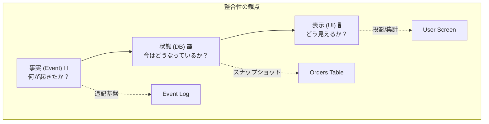

# 第05章：「整合性」って何が一致してる状態？🧠🔍

## この章でできるようになること ✅✨

* 「整合性」と言ったとき、**何と何が一致している話なのか**を言葉で分けられるようになる 🧩
* 一致対象を **状態（DB）／事実（イベント）／表示（画面）** の3つに分解できるようになる 🧠
* わざと“ズレ”を起こして、**「画面は処理中・DBは確定」**みたいな状態を実際に作って観察できる 👀⏳
* ついでに、AIで「用語ミニ辞典」を作って貼れる 📖🤖


---

## 5.1 そもそも「整合性」って何？（ざっくり1行）📝

**整合性 = “一致していてほしいもの同士”が同じ内容になってること**です ✅

…なんだけど、分散っぽい世界では「一致してほしいもの」が1種類じゃないのが落とし穴 😵‍💫
なので、この章はまず **一致対象を3種類に分ける**ところからやるよ〜！🧠✨

---

## 5.2 一致対象は3つある（ここが超大事）🧠🔍


### ① 状態（DB）🗃️

「今この注文はどんな状態？」みたいな、**いま現在のスナップショット**。
例：`orders` の `status = confirmed`

* 上書きされる（更新される）
* “今”を取り出すのが得意

### ② 事実（イベント）📨

「何が起きた？」のログ。**起きたことの履歴（追加されるだけ）**。
例：`OrderAccepted` が起きた、`OrderConfirmed` が起きた

* 追記が基本（消さない・直さない）
* “起きた順番”や“いつ起きたか”を残しやすい

### ③ 表示（画面）🖥️

ユーザーが見る「注文状況：処理中です…」みたいな **見せ方**。
例：UIにはまだ「処理中」って出てる

* たいてい「状態」や「事実」から作られる（投影／集計）
* つまり **遅れてもおかしくない**（むしろ遅れるのが普通）⏳

---

## 5.3 3つの関係を1枚でイメージ🗺️✨


```text
（事実）イベント     →  （状態）DBの現在地     →  （表示）画面の見え方
 OrderAccepted         orders.status=processing     UI: 「処理中です」
 OrderConfirmed        orders.status=confirmed      UI: 「まだ処理中…」 ←ズレ！
 (少し後)                                      UI: 「確定しました！」 ←追いつく
```

この「ズレ」が、CAPとか最終的整合性とかの入口になるよ〜！🚪✨



（CAPの“C”は、そもそも「何が一致してるの？」を決めないと語れないのね）

---

## 5.4 ハンズオン：同じ注文で「画面は処理中・DBは確定」を作る 🧪🐢


### ねらい 🎯

* 注文を作る → Workerが後で確定させる（ここまではよくある）
* **DBは先に確定**させる
* でも **画面用データはわざと遅らせる**
* すると「画面は処理中・DBは確定」が発生する！🎉

---

### 5.4.1 使うバージョン感（2026の“今”）🧰✨

* Node.js は **v24 が Active LTS**（2026年1月時点） ([Node.js][1])
* TypeScript は **5.9 がリリース済み**（2025年8月リリース） ([Microsoft for Developers][2])
* TypeScript はネイティブ移行（Project Corsa / TS7系）の進捗も公式が継続発信中（将来の高速化の流れ） ([Microsoft for Developers][3])
* VS Code は 2026年1月に 1.108 系のリリースノートが出てるよ ([Visual Studio Code][4])

（ここは“用語の理解”が主役なので、細かい差は気にしなくてOKだよ😊）

---

### 5.4.2 データ置き場（3種類を分ける）📁


ルートに `data/` を作って、3種類を分けて保存するよ〜！

* `data/orders.json` …… **状態（DB役）** 🗃️
* `data/events.jsonl` …… **事実（イベント役）** 📨
* `data/orderViews.json` …… **表示（画面役）** 🖥️

初期化用に、まず空ファイルを作る：

```powershell
mkdir data

'{}' | Out-File -Encoding utf8 data/orders.json
'{}' | Out-File -Encoding utf8 data/orderViews.json
''   | Out-File -Encoding utf8 data/events.jsonl
```

---

### 5.4.3 依存関係の追加（API用）📦

```powershell
npm i express nanoid
npm i -D typescript tsx @types/express
```

（`tsx` はTSをサクッと実行するランナーだよ🚀）

---

### 5.4.4 API（注文を作って、イベントを追記する）🛒📨


`apps/api/src/index.ts`（例）

```ts
import express from "express";
import { nanoid } from "nanoid";
import { appendFile, readFile, writeFile } from "node:fs/promises";
import path from "node:path";

type OrderStatus = "processing" | "confirmed" | "failed";

type Order = {
  orderId: string;
  status: OrderStatus;
  createdAt: string;
  updatedAt: string;
};

type OrderView = {
  orderId: string;
  uiStatus: "処理中" | "確定" | "失敗";
  message: string;
  updatedAt: string;
};

type Event = {
  eventId: string;
  type: "OrderAccepted" | "OrderConfirmed" | "OrderFailed";
  orderId: string;
  at: string;
  traceId: string;
};

const app = express();
app.use(express.json());

const DATA_DIR = path.join(process.cwd(), "data");
const ORDERS_PATH = path.join(DATA_DIR, "orders.json");
const VIEWS_PATH = path.join(DATA_DIR, "orderViews.json");
const EVENTS_PATH = path.join(DATA_DIR, "events.jsonl");

async function readJson<T>(filePath: string): Promise<T> {
  const text = await readFile(filePath, "utf8");
  return JSON.parse(text) as T;
}

async function writeJson(filePath: string, value: unknown): Promise<void> {
  await writeFile(filePath, JSON.stringify(value, null, 2), "utf8");
}

async function appendEvent(e: Event): Promise<void> {
  await appendFile(EVENTS_PATH, JSON.stringify(e) + "\n", "utf8");
}

app.post("/orders", async (_req, res) => {
  const orderId = nanoid();
  const now = new Date().toISOString();
  const traceId = nanoid();

  const orders = await readJson<Record<string, Order>>(ORDERS_PATH);
  orders[orderId] = { orderId, status: "processing", createdAt: now, updatedAt: now };
  await writeJson(ORDERS_PATH, orders);

  const views = await readJson<Record<string, OrderView>>(VIEWS_PATH);
  views[orderId] = {
    orderId,
    uiStatus: "処理中",
    message: "ご注文を受け付けました！処理中です…⏳",
    updatedAt: now,
  };
  await writeJson(VIEWS_PATH, views);

  await appendEvent({
    eventId: nanoid(),
    type: "OrderAccepted",
    orderId,
    at: now,
    traceId,
  });

  res.status(201).json({ orderId, uiStatus: "処理中", traceId });
});

app.get("/orders/:id", async (req, res) => {
  const orders = await readJson<Record<string, Order>>(ORDERS_PATH);
  const order = orders[req.params.id];
  if (!order) return res.status(404).json({ message: "not found" });
  res.json(order);
});

app.get("/ui/orders/:id", async (req, res) => {
  const views = await readJson<Record<string, OrderView>>(VIEWS_PATH);
  const view = views[req.params.id];
  if (!view) return res.status(404).json({ message: "not found" });
  res.json(view);
});

app.get("/events/:id", async (req, res) => {
  const orderId = req.params.id;
  const lines = (await readFile(EVENTS_PATH, "utf8"))
    .split("\n")
    .filter(Boolean)
    .map((s) => JSON.parse(s) as Event)
    .filter((e) => e.orderId === orderId);

  res.json(lines);
});

app.listen(3000, () => {
  console.log("API listening on http://localhost:3000");
});
```

ポイントはこれ👇✨

* **状態**は `orders.json`（上書きされる）
* **事実**は `events.jsonl`（追記）
* **表示**は `orderViews.json`（画面用の“別データ”）

---

### 5.4.5 Worker（注文を確定させる。でも画面更新は遅らせる）🐢🧪

`apps/worker/src/index.ts`（例）

```ts
import { appendFile, readFile, writeFile } from "node:fs/promises";
import path from "node:path";

type OrderStatus = "processing" | "confirmed" | "failed";

type Order = {
  orderId: string;
  status: OrderStatus;
  createdAt: string;
  updatedAt: string;
};

type OrderView = {
  orderId: string;
  uiStatus: "処理中" | "確定" | "失敗";
  message: string;
  updatedAt: string;
};

type Event = {
  eventId: string;
  type: "OrderAccepted" | "OrderConfirmed" | "OrderFailed";
  orderId: string;
  at: string;
  traceId: string;
};

const DATA_DIR = path.join(process.cwd(), "data");
const ORDERS_PATH = path.join(DATA_DIR, "orders.json");
const VIEWS_PATH = path.join(DATA_DIR, "orderViews.json");
const EVENTS_PATH = path.join(DATA_DIR, "events.jsonl");

async function readJson<T>(filePath: string): Promise<T> {
  const text = await readFile(filePath, "utf8");
  return JSON.parse(text) as T;
}

async function writeJson(filePath: string, value: unknown): Promise<void> {
  await writeFile(filePath, JSON.stringify(value, null, 2), "utf8");
}

async function appendEvent(e: Event): Promise<void> {
  await appendFile(EVENTS_PATH, JSON.stringify(e) + "\n", "utf8");
}

function sleep(ms: number) {
  return new Promise((r) => setTimeout(r, ms));
}

let lastHandledLine = 0;

async function tick() {
  const allLines = (await readFile(EVENTS_PATH, "utf8")).split("\n").filter(Boolean);

  for (; lastHandledLine < allLines.length; lastHandledLine++) {
    const e = JSON.parse(allLines[lastHandledLine]) as Event;

    if (e.type !== "OrderAccepted") continue;

    console.log(`[worker] accept orderId=${e.orderId} traceId=${e.traceId}`);

    // ① まず“処理”を待つ（外部決済っぽい遅延）
    await sleep(1500);

    // ② DB（状態）を先に確定させる 🗃️✅
    const orders = await readJson<Record<string, Order>>(ORDERS_PATH);
    const order = orders[e.orderId];
    if (!order) continue;

    const now = new Date().toISOString();
    orders[e.orderId] = { ...order, status: "confirmed", updatedAt: now };
    await writeJson(ORDERS_PATH, orders);

    await appendEvent({
      eventId: e.eventId + "_confirmed",
      type: "OrderConfirmed",
      orderId: e.orderId,
      at: now,
      traceId: e.traceId,
    });

    console.log(`[worker] DB confirmed! orderId=${e.orderId}`);

    // ③ でも画面用データ（表示）はわざと遅らせる 🖥️🐢
    await sleep(5000);

    const views = await readJson<Record<string, OrderView>>(VIEWS_PATH);
    views[e.orderId] = {
      orderId: e.orderId,
      uiStatus: "確定",
      message: "注文が確定しました！🎉",
      updatedAt: new Date().toISOString(),
    };
    await writeJson(VIEWS_PATH, views);

    console.log(`[worker] UI view updated! orderId=${e.orderId}`);
  }
}

console.log("[worker] started");
setInterval(() => tick().catch(console.error), 800);
```

ここが“事故の再現ポイント”だよ👇😈✨

* **DB（状態）は先に confirmed**
* **表示（画面）は 5 秒遅れる**
  → その5秒間、「画面は処理中・DBは確定」が成立！🎉

---

### 5.4.6 動かして観察する 👀✨

#### 起動（ターミナル2つ）🧑‍💻🧑‍💻

```powershell
# Terminal 1
npx tsx watch apps/api/src/index.ts
```

```powershell
# Terminal 2
npx tsx watch apps/worker/src/index.ts
```

#### 注文を作る 🛒

```powershell
Invoke-RestMethod -Method Post -Uri http://localhost:3000/orders
```

返ってきた `orderId` を使って、3つを見るよ👇

#### ① 表示（画面用）🖥️

```powershell
Invoke-RestMethod http://localhost:3000/ui/orders/<orderId>
```

#### ② 状態（DB）🗃️

```powershell
Invoke-RestMethod http://localhost:3000/orders/<orderId>
```

#### ③ 事実（イベント）📨

```powershell
Invoke-RestMethod http://localhost:3000/events/<orderId>
```

---

### 5.4.7 観察ポイント（ここを“言語化”できると勝ち）🏆✨


タイミングでこうなるはず👇

1. 直後

* 表示：処理中
* 状態：processing
* 事実：OrderAccepted

2. workerがDB確定した直後（ここが主役！）

* 表示：**まだ処理中** 🐢
* 状態：**confirmed** ✅
* 事実：OrderConfirmed ✅

3. さらに5秒後

* 表示：確定 🎉
* 状態：confirmed
* 事実：OrderConfirmed

このときに言えると強いセリフ👇💬✨

* 「**状態は確定してるけど、表示が追いついてない**」
* 「**事実（イベント）としては確定が起きてる**」
* 「“整合性が崩れた”って言う前に、**どの一致を指してるか決めよう**」

---

## 5.5 よくある勘違い3つ（初心者あるある）🧠💥

### 勘違い①：「DBが正なら、画面も正のはず」❌

→ 画面はDBの“写し”かもしれないし、キャッシュかもしれないし、別集計かもしれない。遅れるよ〜⏳

### 勘違い②：「イベントはログだから重要じゃない」❌

→ 分散ではむしろ **“事実（イベント）”が最強の手がかり**になりがち。後で追跡・復旧・再計算に効く🔧

### 勘違い③：「整合性って1種類でしょ？」❌

→ この章の結論：**整合性は“何と何を一致させるか”で別物**！🧩✨
（CAPのCを語る前に、ここを分けるのが先！）

CAPの定義として「C/A/Pの3つの特性のうち2つしか同時に満たせない」という説明は、分散システムの基本としてよく紹介されるよ ([IBM][5])

---

## 5.6 AIパート：用語ミニ辞典を作って貼ろう 📖🤖✨

### 5.6.1 AIに投げるプロンプト例 🧠💬

（そのままコピペでOK）

```text
「最終的整合性と分散」の初心者向けに、
次の用語の “超やさしい定義(1行)” と “よくある誤解(1行)” と “この章での具体例(1行)” を表で作って。

用語：
整合性 / 状態(State) / 事実(Event) / 表示(View) / ソースオブトゥルース / 最終的整合性 / 強整合性
```

### 5.6.2 できた表はこうチェック✅（AIの嘘防止）

* 「状態＝上書き」「事実＝追記」「表示＝遅れてよい」になってる？
* 例がちゃんと「注文」の話になってる？（急にSNSの例とか出してない？😆）

---

## 5.7 ミニ問題（理解チェック）✍️✨

### Q1 🧠


「DBは confirmed なのに、画面が processing を表示している」
このときズレているのはどれとどれ？

* A. 状態と事実
* B. 状態と表示
* C. 事実と表示

✅正解：**B**（状態と表示）

---

### Q2 🧠

イベント（事実）を “追記だけ” にする嬉しさを1つ書いてみて！📨✨
（例：あとから再計算できる、監査できる、原因追跡しやすい…など）

---

## 5.8 この章のまとめ（結論1行）📝✨

**整合性は1種類じゃない。状態（DB）・事実（イベント）・表示（画面）の“どれを一致させたい話か”を先に分ける。** 🧠✅🖥️📨

[1]: https://nodejs.org/en/about/previous-releases?utm_source=chatgpt.com "Node.js Releases"
[2]: https://devblogs.microsoft.com/typescript/announcing-typescript-5-9/?utm_source=chatgpt.com "Announcing TypeScript 5.9"
[3]: https://devblogs.microsoft.com/typescript/progress-on-typescript-7-december-2025/?utm_source=chatgpt.com "Progress on TypeScript 7 - December 2025"
[4]: https://code.visualstudio.com/updates?utm_source=chatgpt.com "December 2025 (version 1.108)"
[5]: https://www.ibm.com/think/topics/cap-theorem?utm_source=chatgpt.com "What Is the CAP Theorem? | IBM"
