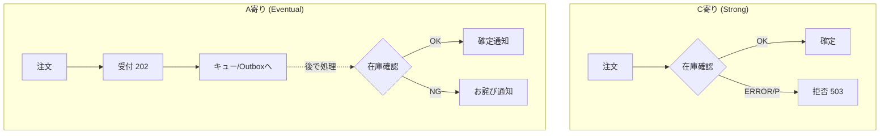

# 第08章：CAPの結論（PがあるならCかAどっち？）⚖️💥

## 結論1行 ✍️✨

**ネットワーク分断（P）が起きた瞬間、システムは「一致を守って止まる（C寄り）」か「止まらず進む（A寄り）」のどちらかを選ぶしかない**んだよね…！😵‍💫💥 ([Princeton CS][1])


---

## 8.1 まずCAPを“動き”として捉えよう 🎬👀

CAPって「3文字の暗記」になりがちだけど、ここで欲しいのはこれ👇

> **分断中に、孤立した側へリクエストが来たらどう返す？** 🤔🔌


* **C（Consistency / 一致）を優先**：最新が保証できないなら **エラーにする** 🙅‍♀️
* **A（Availability / 応答）を優先**：最新か怪しくても **とにかく返す** 🙆‍♀️
* **P（Partition tolerance / 分断耐性）**：分断が起きてもシステムとして破綻しない設計をする（現実のネットワークでは分断・遅延・欠落は起きうる前提）🌍⏳ ([Princeton CS][1])

ここで大事なのは、**Pが起きたときにCとAを“両方MAX”にはできない**ってこと！⚖️💥 ([Princeton CS][1])

---

## 8.2 「A」の意味、ちょっと注意⚠️（ここテストに出る！）

CAPのA（Availability）は、ふだん言う「高可用（落ちない）」と完全一致じゃないよ😳

CAPのAはかなり厳密で、ざっくり言うと👇

* **生きてるノードに来たリクエストは、必ずレスポンスを返す**（最新保証は不要）📩✅ ([Princeton CS][1])

だから「一致を優先してエラー返す」は、CAP的には **Aを捨ててる** ことになるよ🙅‍♀️

---

## 8.3 「2つ選べ」は雑すぎる（でも“分断中はCかA”はガチ）🧠✨

よくある言い方「C/A/Pのうち2つ選べ」は、実はミスリードになりやすい…！😵

* 平常時は、いい感じにCもAも寄せられる
* **でも分断が発生した瞬間**、返し方として **C寄り or A寄り** の決断が必要になる

この“分断中の振る舞いをどう設計するか”がCAPの本体だよ🔥 ([UCSBコンピュータサイエンス][2])

---

## 8.4 ミニ実験：在庫はC寄り、注文受付はA寄り 🧪🛒📦

ここから手を動かすよ〜！💪✨
同じEC題材で、**2つのAPIを作って挙動を比べる**よ👇

* **在庫の確保（C寄り）**：在庫サービスに繋がらないなら **拒否（503）**
* **注文受付（A寄り）**：在庫サービスに繋がらなくても **受付（202）** → あとで確定/失敗

### ざっくり構成 🧩


* `apps/worker`：在庫サービス（Inventory Service）📦
* `apps/api`：注文受付API（Order API）🛒
* `data/`：両者で共有する“超ミニ”データ置き場（ファイル）📁

> この実験では「分断」を、**APIから見て在庫サービスが“見えない/遅い/落ちてる”状態**として再現するよ🔌💥
> （分断の本質は「通信できない」が起点なので、体感としてはこれでOK！）



---

## 8.5 実装：在庫サービス（worker）📦🧑‍🔧

### ① 依存を入れる（worker側）

（すでに入ってたらスキップでOK🙆‍♀️）

```powershell
cd apps\worker
npm i express
npm i -D tsx @types/express
```

### ② `apps/worker/src/index.ts`

```ts
import express from "express";
import { setTimeout as sleep } from "node:timers/promises";
import * as fs from "node:fs/promises";
import * as path from "node:path";

const app = express();
app.use(express.json());

// 共有データ置き場（repoルートの data/ を想定）
const DATA_DIR = path.resolve(process.cwd(), "../../data");
const ORDERS_DIR = path.join(DATA_DIR, "orders");
const OUTBOX_FILE = path.join(DATA_DIR, "outbox", "order-events.jsonl");

// 在庫（超ミニ）
type Stock = { available: number; reserved: number };
const stock: Record<string, Stock> = {
  "coffee-beans": { available: 5, reserved: 0 },
  "sandwich": { available: 3, reserved: 0 },
};

let chaos = {
  minDelayMs: 50,
  maxDelayMs: 400,
  failRate: 0.0, // 0.2 とかにするとたまに失敗する😈
};

async function maybeChaos() {
  const delay =
    chaos.minDelayMs +
    Math.floor(Math.random() * (chaos.maxDelayMs - chaos.minDelayMs + 1));
  await sleep(delay);

  if (Math.random() < chaos.failRate) {
    throw new Error("Inventory service random failure 💥");
  }
}

function ok<T>(res: any, body: T) {
  res.status(200).json(body);
}

app.get("/inventory/:sku", async (req, res) => {
  try {
    await maybeChaos();
    const sku = req.params.sku!;
    const s = stock[sku];
    if (!s) return res.status(404).json({ error: "SKU not found" });
    ok(res, { sku, ...s });
  } catch (e: any) {
    res.status(500).json({ error: e.message });
  }
});

// 予約（C寄りの同期処理で使う）
app.post("/inventory/reserve", async (req, res) => {
  try {
    await maybeChaos();

    const { orderId, sku, qty } = req.body as {
      orderId: string;
      sku: string;
      qty: number;
    };

    const s = stock[sku];
    if (!s) return res.status(404).json({ error: "SKU not found" });

    if (qty <= 0) return res.status(400).json({ error: "qty must be > 0" });

    if (s.available - s.reserved < qty) {
      return res.status(409).json({ error: "OUT_OF_STOCK", sku });
    }

    s.reserved += qty;
    return res.status(200).json({ ok: true, orderId, sku, qty });
  } catch (e: any) {
    res.status(500).json({ error: e.message });
  }
});

// 失敗注入の調整🎛️
app.post("/debug/chaos", (req, res) => {
  const { minDelayMs, maxDelayMs, failRate } = req.body ?? {};
  if (typeof minDelayMs === "number") chaos.minDelayMs = minDelayMs;
  if (typeof maxDelayMs === "number") chaos.maxDelayMs = maxDelayMs;
  if (typeof failRate === "number") chaos.failRate = failRate;
  res.json({ chaos });
});

// ===== A寄りの「あとで確定」処理：outbox を読む =====
type Order = {
  id: string;
  sku: string;
  qty: number;
  status: "PENDING" | "CONFIRMED" | "REJECTED";
  reason?: string;
  createdAt: string;
  updatedAt: string;
};

async function ensureDirs() {
  await fs.mkdir(path.join(DATA_DIR, "outbox"), { recursive: true });
  await fs.mkdir(ORDERS_DIR, { recursive: true });
  // outbox ファイルが無いときは空で作る
  try {
    await fs.access(OUTBOX_FILE);
  } catch {
    await fs.writeFile(OUTBOX_FILE, "", "utf-8");
  }
}

let lastReadBytes = 0;

async function readNewEvents(): Promise<string[]> {
  const buf = await fs.readFile(OUTBOX_FILE);
  if (buf.byteLength === lastReadBytes) return [];
  const slice = buf.subarray(lastReadBytes);
  lastReadBytes = buf.byteLength;

  const text = slice.toString("utf-8");
  return text
    .split("\n")
    .map((l) => l.trim())
    .filter(Boolean);
}

async function loadOrder(id: string): Promise<Order | null> {
  const file = path.join(ORDERS_DIR, `${id}.json`);
  try {
    const json = await fs.readFile(file, "utf-8");
    return JSON.parse(json) as Order;
  } catch {
    return null;
  }
}

async function saveOrder(order: Order) {
  const file = path.join(ORDERS_DIR, `${order.id}.json`);
  await fs.writeFile(file, JSON.stringify(order, null, 2), "utf-8");
}

async function processEvent(line: string) {
  const ev = JSON.parse(line) as { type: "OrderAccepted"; orderId: string };
  if (ev.type !== "OrderAccepted") return;

  const order = await loadOrder(ev.orderId);
  if (!order) return;

  // すでに確定済みなら何もしない（地味だけど事故防止✨）
  if (order.status !== "PENDING") return;

  const s = stock[order.sku];
  if (!s) {
    order.status = "REJECTED";
    order.reason = "SKU_NOT_FOUND";
  } else if (s.available - s.reserved < order.qty) {
    order.status = "REJECTED";
    order.reason = "OUT_OF_STOCK";
  } else {
    s.reserved += order.qty;
    order.status = "CONFIRMED";
  }

  order.updatedAt = new Date().toISOString();
  await saveOrder(order);
}

async function eventLoop() {
  while (true) {
    try {
      const lines = await readNewEvents();
      for (const line of lines) {
        await processEvent(line);
      }
    } catch {
      // ここは黙って耐える（運用っぽい雰囲気😉）
    }
    await sleep(300); // ポーリング間隔
  }
}

await ensureDirs();
eventLoop();

app.listen(4000, () => {
  console.log("worker(inventory) listening on http://localhost:4000");
});
```

---

## 8.6 実装：注文API（api）🛒🧑‍💻

### ① 依存を入れる（api側）

```powershell
cd apps\api
npm i express
npm i -D tsx @types/express
```

### ② `apps/api/src/index.ts`

```ts
import express from "express";
import * as fs from "node:fs/promises";
import * as path from "node:path";

const app = express();
app.use(express.json());

const DATA_DIR = path.resolve(process.cwd(), "../../data");
const ORDERS_DIR = path.join(DATA_DIR, "orders");
const OUTBOX_DIR = path.join(DATA_DIR, "outbox");
const OUTBOX_FILE = path.join(OUTBOX_DIR, "order-events.jsonl");

const INVENTORY_BASE = "http://localhost:4000";

type Order = {
  id: string;
  sku: string;
  qty: number;
  status: "PENDING" | "CONFIRMED" | "REJECTED";
  reason?: string;
  createdAt: string;
  updatedAt: string;
};

let simulatePartitionToInventory = false; // 🔥分断スイッチ

async function ensureDirs() {
  await fs.mkdir(ORDERS_DIR, { recursive: true });
  await fs.mkdir(OUTBOX_DIR, { recursive: true });
  try {
    await fs.access(OUTBOX_FILE);
  } catch {
    await fs.writeFile(OUTBOX_FILE, "", "utf-8");
  }
}

function newId() {
  // 超雑だけど実験には十分（本番はUUIDとかね😉）
  return "ord_" + Math.random().toString(16).slice(2) + Date.now().toString(16);
}

async function saveOrder(order: Order) {
  const file = path.join(ORDERS_DIR, `${order.id}.json`);
  await fs.writeFile(file, JSON.stringify(order, null, 2), "utf-8");
}

async function loadOrder(id: string): Promise<Order | null> {
  const file = path.join(ORDERS_DIR, `${id}.json`);
  try {
    const json = await fs.readFile(file, "utf-8");
    return JSON.parse(json) as Order;
  } catch {
    return null;
  }
}

async function appendOutbox(lineObj: any) {
  await fs.appendFile(OUTBOX_FILE, JSON.stringify(lineObj) + "\n", "utf-8");
}

async function fetchWithTimeout(url: string, init: RequestInit, timeoutMs: number) {
  const ac = new AbortController();
  const t = setTimeout(() => ac.abort(), timeoutMs);
  try {
    const res = await fetch(url, { ...init, signal: ac.signal });
    return res;
  } finally {
    clearTimeout(t);
  }
}

// ===== C寄り：在庫を“今”確保できなきゃ拒否 =====
// 
app.post("/inventory/try-reserve", async (req, res) => {
  const { sku, qty } = req.body as { sku: string; qty: number };

  if (simulatePartitionToInventory) {
    return res.status(503).json({ error: "PARTITION_TO_INVENTORY 🔌💥" });
  }

  const orderId = newId();

  try {
    const invRes = await fetchWithTimeout(
      `${INVENTORY_BASE}/inventory/reserve`,
      {
        method: "POST",
        headers: { "content-type": "application/json" },
        body: JSON.stringify({ orderId, sku, qty }),
      },
      800
    );

    if (!invRes.ok) {
      const body = await invRes.json().catch(() => ({}));
      return res.status(invRes.status).json({ error: "RESERVE_FAILED", detail: body });
    }

    // 予約成功 → ここでは「確保できたよ」のみ返す
    return res.status(200).json({ ok: true, orderId, sku, qty, mode: "C" });
  } catch {
    // タイムアウト/通信エラー → 一致を守るため拒否
    return res.status(503).json({ error: "INVENTORY_UNREACHABLE (C over A) 😵‍💫" });
  }
});

// ===== A寄り：注文は受付だけして、後で確定 =====
// 
app.post("/orders/accept", async (req, res) => {
  const { sku, qty } = req.body as { sku: string; qty: number };
  const id = newId();
  const now = new Date().toISOString();

  const order: Order = {
    id,
    sku,
    qty,
    status: "PENDING",
    createdAt: now,
    updatedAt: now,
  };

  await saveOrder(order);
  await appendOutbox({ type: "OrderAccepted", orderId: id });

  // 受付は成功（在庫の確保は“あとで”）
  return res.status(202).json({
    ok: true,
    orderId: id,
    status: order.status,
    mode: "A",
    message: "注文は受け付けたよ！在庫確認中…⏳✨",
  });
});

app.get("/orders/:id", async (req, res) => {
  const order = await loadOrder(req.params.id!);
  if (!order) return res.status(404).json({ error: "ORDER_NOT_FOUND" });
  res.json(order);
});

// 分断スイッチ🎛️（在庫サービスへの通信が“できない前提”にする）
app.post("/debug/partition/:state", (req, res) => {
  simulatePartitionToInventory = req.params.state === "on";
  res.json({ simulatePartitionToInventory });
});

await ensureDirs();

app.listen(3000, () => {
  console.log("api listening on http://localhost:3000");
});
```

---

## 8.7 動かして比べる！⚡🧪

### 起動（VS Codeでターミナル2つ）🪟🧑‍💻

**ターミナルA（worker）**

```powershell
cd apps\worker
npx tsx watch src\index.ts
```

**ターミナルB（api）**

```powershell
cd apps\api
npx tsx watch src\index.ts
```

---

### ① 分断OFFで、C寄り（在庫確保）を試す ✅📦

```powershell
curl.exe -s -X POST http://localhost:3000/inventory/try-reserve ^
  -H "content-type: application/json" ^
  -d "{\"sku\":\"coffee-beans\",\"qty\":1}"
```

成功したら、こういう感じ👇

* `200 OK`
* `mode: "C"`

---

### ② 分断ONにして、C寄りが“止まる”のを見る 🔌💥


```powershell
curl.exe -s -X POST http://localhost:3000/debug/partition/on
```

もう一回、在庫確保👇

```powershell
curl.exe -s -X POST http://localhost:3000/inventory/try-reserve ^
  -H "content-type: application/json" ^
  -d "{\"sku\":\"coffee-beans\",\"qty\":1}"
```

ここで狙いは👇

* **503** が返る
* 「在庫が見えないなら一致を守って拒否」🙅‍♀️✅

👉 これが **P下でCを優先**したときの挙動だよ！ ([Princeton CS][1])

---

### ③ 分断ONのまま、A寄り（注文受付）を試す 🛒⏳


```powershell
curl.exe -s -X POST http://localhost:3000/orders/accept ^
  -H "content-type: application/json" ^
  -d "{\"sku\":\"coffee-beans\",\"qty\":1}"
```

狙いは👇

* **202 Accepted** が返る
* `status: "PENDING"`
* つまり「今は在庫を確約してないけど、とにかく受付はする」🙆‍♀️📩

---

### ④ 受付した注文が“後で確定/失敗”に変わるのを見る 👀✨

レスポンスで返ってきた `orderId` を使って👇

```powershell
curl.exe -s http://localhost:3000/orders/ord_XXXXXXXXXXXXXXXX
```

しばらくすると `PENDING` → `CONFIRMED`（または `REJECTED`）に変わるよ！🎉

* **A寄り**は「後で整合する」設計が必要
* その分、**分断中でも受付できる** 🙆‍♀️✨

---

## 8.8 体感まとめ：「C寄り」と「A寄り」は“良し悪し”じゃなく“事故の種類” 🚧🧠

### C寄り（拒否する）🙅‍♀️✅

* 👍 事故が起きにくい（在庫の二重販売とか避けやすい）
* 👎 分断やタイムアウトで、すぐエラーになりがち

### A寄り（受付る）🙆‍♀️⏳

* 👍 とにかく応答できる（ユーザー体験は良くしやすい）
* 👎 後で「ごめん在庫なかった🥲」が起きる → **UX・運用が必須**

CAPは「どっちが正しい？」じゃなくて、
**“分断中にどっちの事故を選ぶ？”** の話だよ⚖️💥 ([UCSBコンピュータサイエンス][2])

---

## 8.9 どっちを選ぶ？ミニ判断ガイド🧭✨


### C寄りにしたいもの（例）🟥

* お金💸（決済確定、返金処理）
* 在庫📦（物理在庫、座席、予約枠）
* 法務⚖️（規約同意、監査ログ）

→ **間違うと損害がでかい** から、止まってでも一致を守りたい😵‍💫

### A寄りにしやすいもの（例）🟩

* 注文の“受付”だけ（後で確定でもOKな形）🛒
* 閲覧数・いいね👍（多少ズレても世界が終わらない）
* おすすめ表示・ランキング📈（だいたい合ってればOK）

→ **止まるより進む方が価値が高い**ことが多い🙆‍♀️

---

## 8.10 AI活用（判断理由を文章化→自分の言葉に直す）🤖✍️✨

### ① まずAIに“説明文”を作らせる（たたき台）📝

Copilot/Codexにこう聞く👇

* 「この実験で、`/inventory/try-reserve` がC寄り、`/orders/accept` がA寄りな理由を、初心者向けに200〜300字で説明して」
* 「分断（P）中に起きる“困りごと”を、ユーザー目線で3つ書いて」

### ② そのまま貼らずに“自分の言葉”へ変換💬✨

チェックポイントはこれ👇

* 「止まる」と「ズレる」を、ちゃんと区別できてる？🧠
* “どんな事故を避けたいから” って理由が入ってる？🚧
* ユーザーにどう見せるか（PENDING表示とか）まで触れてる？🎨

---

## 8.11 よくある勘違いコーナー😵‍💫➡️😌

* 「Pは選べる」→ 現実のネットワークでは分断/遅延/欠落は起きる前提になりやすいよ🌍🔌 ([UCSBコンピュータサイエンス][2])
* 「APかCPか、DBで決まる」→ 実際は **機能ごと**に決めることが多いよ🧩✨ ([UCSBコンピュータサイエンス][2])
* 「Aって“落ちない”こと」→ CAPのAはもっと数学っぽい定義（とにかく返す）だよ📩✅ ([Princeton CS][1])

---

## 8.12 章末ミニ問題（3分）⏱️📌

次の機能、**C寄り / A寄り**どっちが合いそう？理由も1行で✍️✨

1. 決済確定（クレカ引き落とし）💳
2. 注文の受付だけ（あとで在庫チェック）🛒
3. いいね数👍
4. 在庫の引当（残り1個）📦
5. 閲覧履歴（おすすめの材料）👀

---

## まとめ 🧁✨

* **分断（P）が起きたら、CとAは同時にMAXにできない**⚖️💥 ([Princeton CS][1])
* **C寄り＝一致を守って止まる** 🙅‍♀️✅
* **A寄り＝止まらず進んで後で整える** 🙆‍♀️⏳
* どっちも正解。**避けたい事故の種類で決める**🚧🧠

[1]: https://www.cs.princeton.edu/courses/archive/spr22/cos418/papers/cap.pdf?utm_source=chatgpt.com "Brewer's Conjecture and the Feasibility of Consistent ..."
[2]: https://sites.cs.ucsb.edu/~rich/class/cs293b-cloud/papers/brewer-cap.pdf?utm_source=chatgpt.com "CAP Twelve Years Later: How the “Rules” Have Changed"
