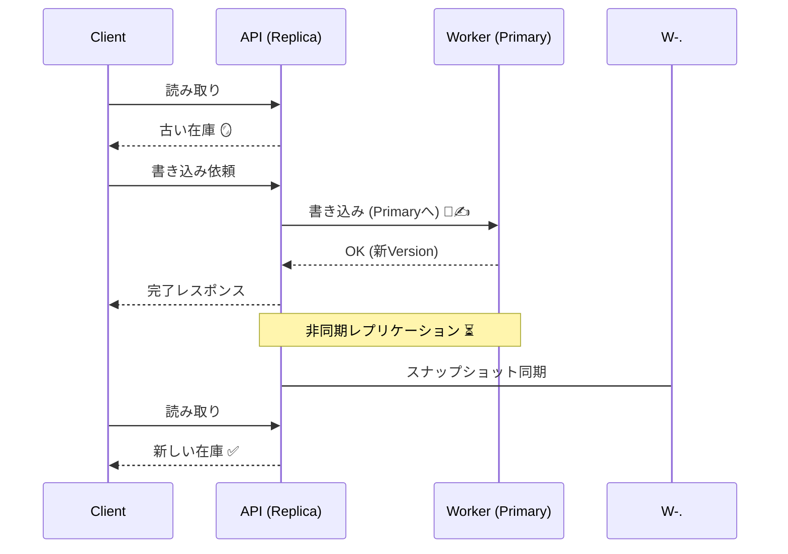

# 第11章：整合性レベル① Strong vs Eventual 🧱🕊️

**結論1行✍️**：**Strong（強整合）**は「今この瞬間に必ず一致」を守る代わりに**遅くなりがち＆分断に弱い**😵‍💫、**Eventual（最終的整合）**は「まず返事してあとで一致」で**速い＆強い**けど**ズレが起きる**ので**UXで支える**🎨⏳

---

## 11.0 この章でできるようになること 🎯✨

* Strong / Eventual を **まず2択で説明**できる🗣️💡
* 「速いけどズレる」「遅いけど一致する」を **手元の実験で体感**できる🧪⚡
* どっちを選ぶかを「お金💸」「法務⚖️」「UX😌」でざっくり判断できる✅

---

## 11.1 Strong と Eventual を“1分で”つかむ ⏱️🧠

### ✅ Strong（強整合）って？

「書いたら、**次の読み取りで必ずその結果が見える**」を強く守るやつ💪
イメージ：レジで会計した瞬間に、在庫が**どの端末でも同じ数**になる🧾📦✨

### ✅ Eventual（最終的整合）って？

「書いた直後はズレてもいいけど、**時間がたてば一致する**」やつ🕊️
イメージ：会計はすぐ終わるけど、在庫表示が**数秒あとに追いつく**⏳📦

---

## 11.2 Strong はなぜ遅くなりがち？（超ざっくり）🐢💥

つまり Strong は、**一致の保証のぶん、待ち時間が増える** or **分断時に止まりやすい**のが“肌感覚”🌍⚖️


---

## 11.3 ざっくり比較表（まずこれだけ覚えよ📊✨）

| 観点        | Strong（強整合）🧱         | Eventual（最終的整合）🕊️      |
| --------- | --------------------- | ----------------------- |
| 返事の速さ     | 遅くなりがち🐢              | 速いことが多い⚡                |
| 分断/障害に強い？ | 弱くなりがち（止める/拒否する）💥    | 強くなりがち（受け付ける）🛡️        |
| 読み取りの新しさ  | いつも新しい✨               | 古い読み取りが起きる😵‍💫         |
| 実装の難しさ    | 仕組みが重い/複雑になりがち🧰      | UX・再試行・衝突が課題🎨🔁        |
| 向いてる所     | 決済💳、残高💰、在庫の確保（厳密）📦 | いいね👍、閲覧数👀、通知🔔、集計📈   |
| 代表的な“つらみ” | 遅延・タイムアウト・可用性低下⏳      | 画面にズレが出る（だから見せ方大事）🧑‍🎨 |

---

# 11.4 ハンズオン：Strong版/ Eventual版を作って“差”を体感しよう 🧪🔥

ここでは **「Worker＝主データ（Primary）」**、**「API＝レプリカ（Replica）を持って読む」** みたいな形で作るよ👑🪞
（現実のDBそのままではないけど、“体感”には十分！）

## 全体図（ざっくり）🗺️✨

* Worker：在庫を保持（Primary）📦👑
* API：在庫のコピーを保持（Replica）🪞
* APIは定期的に Worker からスナップショットを取って Replica を更新（＝レプリケーション遅延を作れる）⏳



---

## 11.4.1 Worker を作る（Primary担当）👑📦

`apps/worker/src/index.ts`

```ts
import Fastify from "fastify";

type Inventory = Record<string, number>;

const fastify = Fastify({ logger: true });

// Primary在庫（本物のつもり）
let inventory: Inventory = {
  "apple-juice": 10,
  "cafe-latte": 10,
};

// 変更のたびに増える版数（“新しさ”の目印）
let version = 0;

// 故障注入：遅延(ms) と 失敗率(0〜1)
let writeDelayMs = 0;
let failRate = 0;

function sleep(ms: number) {
  return new Promise((r) => setTimeout(r, ms));
}
function maybeFail() {
  if (Math.random() < failRate) {
    const err = new Error("Injected failure 💥 (worker)");
    // Fastifyが500を返してくれる
    throw err;
  }
}

fastify.get("/snapshot", async () => {
  return { version, inventory };
});

fastify.post<{
  Body: { sku: string; qty: number };
}>("/reserve", async (req) => {
  const { sku, qty } = req.body;

  maybeFail();
  if (writeDelayMs > 0) await sleep(writeDelayMs);

  const current = inventory[sku] ?? 0;
  if (qty <= 0) return { ok: false, reason: "qty must be > 0", version, inventory };
  if (current < qty) return { ok: false, reason: "out of stock", version, inventory };

  inventory = { ...inventory, [sku]: current - qty };
  version++;

  return { ok: true, version, inventory };
});

fastify.post<{
  Body: { writeDelayMs?: number; failRate?: number };
}>("/chaos", async (req) => {
  writeDelayMs = req.body.writeDelayMs ?? writeDelayMs;
  failRate = req.body.failRate ?? failRate;
  return { ok: true, writeDelayMs, failRate };
});

await fastify.listen({ port: 4001, host: "127.0.0.1" });
```

> ✅ポイント：`version` が「どの更新まで反映済み？」の目印になるよ🧵✨

---

## 11.4.2 API を作る（Replica担当）🪞👀

`apps/api/src/index.ts`

```ts
import Fastify from "fastify";

type Inventory = Record<string, number>;

const fastify = Fastify({ logger: true });

const WORKER = "http://127.0.0.1:4001";

// APIが持つレプリカ（古いかもしれない在庫）
let replica: Inventory = {};
let replicaVersion = 0;

// レプリケーション遅延（この値を変えると“古さ”が増える）
let replicationLagMs = 800;

// 同期ループ（Worker → Replica）
async function pullSnapshotOnce() {
  const res = await fetch(`${WORKER}/snapshot`);
  const data = (await res.json()) as { version: number; inventory: Inventory };

  // ここで遅延を入れて“レプリカが追いつくのが遅い”を再現⏳
  if (replicationLagMs > 0) {
    await new Promise((r) => setTimeout(r, replicationLagMs));
  }

  replica = data.inventory;
  replicaVersion = data.version;
}

setInterval(() => {
  pullSnapshotOnce().catch(() => {
    // 失敗しても次で回復する想定（ログだけでOK）
  });
}, 500);

// 読み取り：replica / primary を切り替え
fastify.get<{
  Params: { sku: string };
  Querystring: { read?: "replica" | "primary" };
}>("/inventory/:sku", async (req) => {
  const sku = req.params.sku;
  const read = req.query.read ?? "replica";

  if (read === "primary") {
    const res = await fetch(`${WORKER}/snapshot`);
    const data = (await res.json()) as { version: number; inventory: Inventory };
    return {
      read,
      version: data.version,
      sku,
      qty: data.inventory[sku] ?? 0,
    };
  }

  return {
    read,
    version: replicaVersion,
    sku,
    qty: replica[sku] ?? 0,
  };
});

// 強整合っぽい：書いたあと「レプリカが追いつくまで待つ」🧱
fastify.post<{
  Body: { sku: string; qty: number };
}>("/strong/reserve", async (req, reply) => {
  const started = performance.now();

  const res = await fetch(`${WORKER}/reserve`, {
    method: "POST",
    headers: { "content-type": "application/json" },
    body: JSON.stringify(req.body),
  });

  const write = (await res.json()) as { ok: boolean; version: number; reason?: string };
  if (!write.ok) return reply.code(409).send({ mode: "strong", ...write });

  // ✅ここがStrong体感ポイント：replicaが write.version まで追いつくのを待つ
  const deadline = Date.now() + 2500; // 待ちすぎ防止（タイムアウト）
  while (replicaVersion < write.version) {
    if (Date.now() > deadline) {
      // “強整合がつらい瞬間”：待ち切れない・分断中など😵‍💫
      const ms = Math.round(performance.now() - started);
      return reply.code(504).send({
        mode: "strong",
        ok: false,
        reason: "timeout waiting replica to catch up",
        writeVersion: write.version,
        replicaVersion,
        tookMs: ms,
      });
    }
    await new Promise((r) => setTimeout(r, 50));
  }

  const ms = Math.round(performance.now() - started);
  return {
    mode: "strong",
    ok: true,
    writeVersion: write.version,
    replicaVersion,
    tookMs: ms,
  };
});

// 最終的整合っぽい：書いたらすぐ返す（追いつき待ちはしない）🕊️
fastify.post<{
  Body: { sku: string; qty: number };
}>("/eventual/reserve", async (req) => {
  const started = performance.now();

  const res = await fetch(`${WORKER}/reserve`, {
    method: "POST",
    headers: { "content-type": "application/json" },
    body: JSON.stringify(req.body),
  });

  const write = (await res.json()) as { ok: boolean; version: number; reason?: string };

  const ms = Math.round(performance.now() - started);
  if (!write.ok) return { mode: "eventual", ...write, tookMs: ms };

  // ✅返事は速いけど、replicaはまだ古いかも！
  return {
    mode: "eventual",
    ok: true,
    writeVersion: write.version,
    replicaVersionAtResponse: replicaVersion,
    tookMs: ms,
    uiHint: "画面は『反映待ち…』って出すと安心💬✨",
  };
});

// 遅延の調整（体感用）
fastify.post<{
  Body: { replicationLagMs: number };
}>("/replica/lag", async (req) => {
  replicationLagMs = req.body.replicationLagMs;
  return { ok: true, replicationLagMs };
});

await fastify.listen({ port: 4000, host: "127.0.0.1" });
```

---

## 11.4.3 動かして実験しよう（コマンド例）🧪💻

### ① Worker 起動（別ターミナル）

* `apps/worker` で起動（既存の起動コマンドがあるならそれでOK）🚀

### ② API 起動（別ターミナル）

* `apps/api` で起動🚀

### ③ 在庫を見る（Replica と Primary で見比べ）👀🪞👑

PowerShell なら `curl` が別物になりがちなので **`curl.exe`** を使うと安全だよ👍✨

```bash
curl.exe http://127.0.0.1:4000/inventory/apple-juice?read=replica
curl.exe http://127.0.0.1:4000/inventory/apple-juice?read=primary
```

---

## 11.4.4 Strong と Eventual の“差”を出す実験 🔥⏳

### 実験A：レプリカ遅延を大きくする（ズレが目立つ）🪞⏳

```bash
curl.exe -X POST http://127.0.0.1:4000/replica/lag ^
  -H "content-type: application/json" ^
  -d "{\"replicationLagMs\":1500}"
```

### 実験B：Strong で予約（遅くなるのを感じる）🧱🐢

```bash
curl.exe -X POST http://127.0.0.1:4000/strong/reserve ^
  -H "content-type: application/json" ^
  -d "{\"sku\":\"apple-juice\",\"qty\":1}"
```

📌見どころ👀

* `tookMs` が **待ち時間ぶん増える**
* `timeout waiting replica...` が出たら「強整合がつらい瞬間」を再現できてる😵‍💫💥

### 実験C：Eventual で予約（返事が速い）🕊️⚡

```bash
curl.exe -X POST http://127.0.0.1:4000/eventual/reserve ^
  -H "content-type: application/json" ^
  -d "{\"sku\":\"apple-juice\",\"qty\":1}"
```

その直後に👇

```bash
curl.exe http://127.0.0.1:4000/inventory/apple-juice?read=replica
curl.exe http://127.0.0.1:4000/inventory/apple-juice?read=primary
```

📌見どころ👀

* **primary は減ってる**のに、**replica はまだ古い**ことがある😵‍💫
* しばらくしてまた `replica` を読むと追いつく🕊️✨

---

# 11.5 体感のまとめ（ここが“肌感覚”💡）

* Strong 🧱：

  * 「**一致**」のために **待つ**（=遅い）🐢
  * 分断っぽい状況だと **タイムアウト/拒否** が起きやすい😵‍💫💥

* Eventual 🕊️：

  * 「**まず返す**」ので **速い**⚡
  * ただし **ズレる** → だから **画面で支える**🎨💬

---

# 11.6 “選び方”のミニ指針（超ざっくり）🧭✨

* **Strong寄り**にしたい✅

  * お金💸（二重請求はダメ）
  * 在庫確保📦（売れない物を売ったら事故）
  * 法務⚖️（規約/契約が絡む）

* **Eventual寄り**でOK🕊️

  * いいね👍、閲覧数👀、通知🔔
  * 多少ズレても困らない集計📈
  * “反映待ち”を出せばユーザーが納得できるUX😌✨

---

# 11.7 AI の使い方（この章は“比較”が強い📊🤖）

## ✅ 比較表を作らせるプロンプト例 📊🤖

* 「Strong整合性とEventual整合性を、**速さ/可用性/実装コスト/UX**の観点で比較表にして。日本語で。初心者向けで。」

## ✅ ログの読み取りを手伝わせるプロンプト例 🕵️‍♀️🤖

* 「この `strong/reserve` の結果が504になる理由を、**replicaVersion と writeVersion**の関係で説明して。改善案も3つ。」

## ✅ “安心させる文言”を作らせるプロンプト例 💬🤖

* 「最終的整合性で反映待ちになるとき、ユーザーが不安にならない短い文言を10個。かわいめで。」

---

# 11.8 ミニ課題（やると理解が爆上がり🔥）

1. **Workerの故障注入**を使ってみよう💥

```bash
curl.exe -X POST http://127.0.0.1:4001/chaos ^
  -H "content-type: application/json" ^
  -d "{\"writeDelayMs\":800,\"failRate\":0.2}"
```

→ Strong が「止まりやすい」感覚がさらに分かる😵‍💫

2. Eventual のレスポンスに **`status: "PENDING"`** を入れて、画面に出す前提の形にしてみよう🕊️🎨

3. `replica/lag` を **0 / 300 / 1500** に変えて、ズレがどれくらい“気持ち悪いか”メモしよう📝😆

---

# 11.9 この章のまとめ ✅✨

* **Strong＝一致を守る（でも遅い/止まりやすい）**🧱🐢
* **Eventual＝速い（でもズレるのでUXで支える）**🕊️🎨
* “どっちが正しい”じゃなくて、**何を守りたいか**で選ぶのが設計のコツ🧠🧭

---

## 参考（この章の前提になってる最新情報）📌

* TypeScript の最新安定版は 5.9 として案内されている。([typescriptlang.org][1])
* Node.js のリリースライン（LTS/Current）は公式で一覧化されている。([nodejs.org][2])
* TypeScript の “Native” 系のプレビュー（高速化の流れ）が進行中。([developer.microsoft.com][3])

[1]: https://www.typescriptlang.org/download/?utm_source=chatgpt.com "How to set up TypeScript"
[2]: https://nodejs.org/en/about/previous-releases?utm_source=chatgpt.com "Node.js Releases"
[3]: https://developer.microsoft.com/blog/typescript-7-native-preview-in-visual-studio-2026?utm_source=chatgpt.com "TypeScript 7 native preview in Visual Studio 2026"
