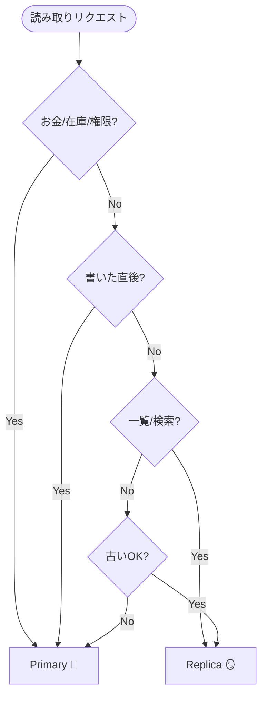

# 第14章：読む場所を選ぶ（Primary/Replica/Cache）👀🧭

## 結論1行 ✍️✨

**「速さ」か「新しさ」かを毎回“意識して選ぶ”だけで、最終的整合性のUXは一気に安定するよ！** 🥰⚖️


---

## 1) なにが問題？「同じデータ」でも“読む場所”で見え方が変わる😵‍💫

分散っぽい構成になると、だいたいこうなるよ👇

* **Primary（本店）**：いちばん新しい（だいたい正しい）✅
* **Replica（支店）**：速いけど、ちょっと古いことがある⏳
* **Cache（メモ帳）**：めちゃ速いけど、古い率が上がる🧊⚡

そして怖いのはこれ👇
**「書いた直後に読んだのに古い！」**（Read-after-writeが崩れる）😱💥

---

## 2) 3つの読み先を“キャラ化”して覚えよう🧠🎭


### Primary（Primary Read）👑

* ✅ **新しさ最強**
* ❌ **混むと遅くなる/落ちやすくなる**（書き込みも集中しがち）💦
* 🧑‍⚖️向いてる：決済💳、在庫の最終確定📦、管理画面🔧、ユーザーの「今の状態」表示

### Replica（Replica Read）🪞

* ✅ **読みが速い/負荷分散できる**⚡
* ❌ **遅延レプリケーションだと古い**（秒〜十数秒、場合によってはもっと）⏳
* 🧑‍⚖️向いてる：商品一覧🛍️、ランキング🏆、検索結果🔍、分析用📊、多少ズレてもOKな画面

### Cache（Cache Read）🧊

* ✅ **爆速**⚡⚡
* ❌ **古い/消えた/更新漏れ**が起きる（キャッシュ事故あるある）😇
* 🧑‍⚖️向いてる：商品カタログ📚、静的寄りの情報🧾、読み多すぎAPIの防波堤🧱

> キャッシュ運用の基本形として「Cache-Aside（必要になったらDBから取ってキャッシュに置く）」がよく使われるよ📌 ([Microsoft Learn][1])

---

## 3) どれを選ぶ？判断のコツ（速さ vs 新しさ）⚖️✨


### まず“新しさが必要な瞬間”を押さえる✅

* **書いた直後に、その結果を画面で見せたい**（例：注文直後のステータス）🧾👀
* **お金・在庫・権限**みたいにズレると事故る領域💥💳📦

このときは基本 **Primary** 👑

### “多少古くてもOK”を明確にする🟨

* 一覧ページ（商品一覧、注文履歴の“だいたい”）🛍️🧾
* 分析・集計（少し遅れてもOK）📊
* “最終確定は別画面”で出せる（例：注文詳細はPrimary）🧩

このときは **Replica** 🪞 or **Cache** 🧊

---

## 4) ハンズオン：読取先を切替できるフラグを実装🎛️🧪

ここからは **「読取先を切り替えるスイッチ」**を作って、**古い読み取り**をわざと体験するよ😆💥

### 今日作るもの（イメージ）🗺️

* Primary：最新データを持つ（メモリDBでOK）👑
* Replica：Primaryの内容が**遅れて**反映される🪞⏳
* Cache：TTLつきの超高速メモ🧊⏲️
* API：`?read=primary|replica|cache` で読み先を変えられる🎛️

---

## 4-1) 型とデータモデルを用意する🧩

```ts
// src/domain/types.ts
export type ReadSource = "primary" | "replica" | "cache";

export type Inventory = {
  sku: string;
  quantity: number;      // 残り在庫
  version: number;       // 更新番号（あとで「古い読み」を見抜くのに使う）
  updatedAt: number;     // epoch ms
};
```

---

## 4-2) Primary / Replica を“擬似的に”作る（Replicaは遅延反映）🪞⏳

```ts
// src/infra/inMemoryStores.ts
import { Inventory } from "../domain/types";

function now() { return Date.now(); }

export class PrimaryStore {
  private map = new Map<string, Inventory>();

  get(sku: string): Inventory | undefined {
    return this.map.get(sku);
  }

  upsert(sku: string, quantity: number) {
    const prev = this.map.get(sku);
    const next: Inventory = {
      sku,
      quantity,
      version: (prev?.version ?? 0) + 1,
      updatedAt: now(),
    };
    this.map.set(sku, next);
    return next;
  }
}

export class ReplicaStore {
  private map = new Map<string, Inventory>();

  // レプリケーションで反映される想定
  applyReplication(inv: Inventory) {
    this.map.set(inv.sku, inv);
  }

  get(sku: string): Inventory | undefined {
    return this.map.get(sku);
  }
}
```

Replica反映を「遅らせる役」を作るよ👇
（本物のDBレプリケーションの気分を味わう用🧪）

```ts
// src/infra/replicator.ts
import { Inventory } from "../domain/types";
import { ReplicaStore } from "./inMemoryStores";

function sleep(ms: number) {
  return new Promise<void>((r) => setTimeout(r, ms));
}

export class Replicator {
  constructor(private replica: ReplicaStore, private lagMs: number) {}

  async replicate(inv: Inventory) {
    // ここが「遅延レプリケーション」のつもり
    await sleep(this.lagMs);
    this.replica.applyReplication(inv);
  }
}
```

---

## 4-3) Cache（TTLつき）を作る🧊⏲️

「Cache-Aside」っぽく、**無ければStoreから取ってキャッシュに置く**動きをするよ📌 ([Microsoft Learn][1])

```ts
// src/infra/simpleCache.ts
type CacheEntry<T> = { value: T; expiresAt: number };

function now() { return Date.now(); }

export class SimpleCache<T> {
  private map = new Map<string, CacheEntry<T>>();

  get(key: string): T | undefined {
    const hit = this.map.get(key);
    if (!hit) return undefined;
    if (hit.expiresAt < now()) {
      this.map.delete(key);
      return undefined;
    }
    return hit.value;
  }

  set(key: string, value: T, ttlMs: number) {
    this.map.set(key, { value, expiresAt: now() + ttlMs });
  }

  del(key: string) {
    this.map.delete(key);
  }
}
```

---

## 4-4) “読む場所を選ぶ” ReadRouter を作る👀🧭


ここが第14章の主役だよ〜！✨

```ts
// src/app/readRouter.ts
import { Inventory, ReadSource } from "../domain/types";
import { PrimaryStore, ReplicaStore } from "../infra/inMemoryStores";
import { SimpleCache } from "../infra/simpleCache";

type ReadContext = {
  // 「書いた直後？」みたいな判断材料（今回は手動で渡す）
  preferFresh: boolean;   // 新しさ優先にしたいなら true
};

export class ReadRouter {
  constructor(
    private primary: PrimaryStore,
    private replica: ReplicaStore,
    private cache: SimpleCache<Inventory>,
    private cacheTtlMs: number
  ) {}

  readInventory(sku: string, source: ReadSource, ctx: ReadContext): Inventory | undefined {
    // ルール1：書いた直後など「新しさ優先」はPrimaryへ寄せる
    const effective: ReadSource =
      (ctx.preferFresh && source !== "primary") ? "primary" : source;

    if (effective === "cache") {
      const cached = this.cache.get(sku);
      if (cached) return cached;

      // cache-aside：無ければ（今回はreplica）から取り、キャッシュへ
      const fromReplica = this.replica.get(sku);
      if (fromReplica) this.cache.set(sku, fromReplica, this.cacheTtlMs);
      return fromReplica;
    }

    if (effective === "replica") return this.replica.get(sku);
    return this.primary.get(sku);
  }
}
```

> ここでは **「preferFresh（新しさ優先）」が立ったら Primary に寄せる**だけでも、事故がかなり減るよ✅
> これが第12章の“自分の書き込みは見たい（Read-your-writes）”につながっていく感覚だよ👤✅

---

## 4-5) “古い読み”を再現するシナリオ（ミニ実験）🧪💥


### 実験セット

* レプリカ反映遅延：`lagMs = 3000`（3秒遅れ）⏳
* キャッシュTTL：`ttlMs = 5000`（5秒）⏲️

### 実験の流れ（こうなるはず！）🧠

1. Primaryで在庫を更新（例：10→9）✍️📦
2. 直後に **Replica** を読む → まだ古い（10のまま）😇
3. **Cache** を読む → Replica由来の古い値が入る（10）🧊
4. 3秒後に Replicaが更新される（9になる）🪞✅
5. でも Cache はTTLが残ってると、しばらく古い（10）を出し続ける😱

この「気持ち悪さ」こそが、読む場所選びのキモだよ〜！🧡

---

## 5) 事故らないための定番ルール集📋🧷

### ルールA：書いた直後はPrimaryで読む（短時間だけでも）👑✅

* 「注文直後の注文詳細」
* 「在庫引当直後の確認」
* 「ユーザーがボタン押した直後に見る画面」

### ルールB：一覧・検索・ランキングはReplica（またはCache）でOK🪞🧊

* 多少古くてもUXが壊れにくい
* 負荷分散が効く

### ルールC：Cacheは“古い前提”で、更新戦略を持つ🧊⚠️

* TTLで自然に捨てる⏲️
* 更新系のあとに `cache.del(key)` する（無効化）🧹
* もっとやるなら「stale-while-revalidate（古いのを返しつつ裏で更新）」の発想もあるよ✨
  HTTPキャッシュ拡張として定義もあるよ📌 ([datatracker.ietf.org][2])

---

## 6) 判断フローチャート（文章版）🤖🧩


困ったら、これを上から読むだけでOK👇

1. **これ、お金/在庫/権限？** 💳📦🔐

   * Yes → **Primary** 👑
   * No → 2へ
2. **書いた直後に“自分が見る”画面？** 👤👀

   * Yes → **Primary（短時間だけでも）** 👑
   * No → 3へ
3. **一覧/検索/ランキングみたいな読み多い画面？** 🛍️🔍🏆

   * Yes → **Replica** 🪞（さらに速くしたいならCache🧊）
   * No → 4へ
4. **多少古くてもUXが壊れない？（説明できる？）** 🧠

   * Yes → **Replica/Cache** 🪞🧊
   * No → **Primary** 👑



---

## 7) AIにやらせると強いところ🤖✨

### 7-1) 判断フローをAIに“整形”させる🧩

プロンプト例👇

* 「Primary/Replica/Cacheの使い分けを、ECの在庫・注文の例で、初心者向けの判断フロー（箇条書き）にして」
* 「“書いた直後はPrimary”みたいな例外ルールも入れて、短く覚えやすくして」

### 7-2) 自分の設計をAIに“ツッコミ”させる👀🧨

プロンプト例👇

* 「このReadRouterの設計で、古い読みが原因で起きるUX事故を3つ挙げて、対策も提案して」
* 「CacheのTTLを長くすると何が起きる？短くすると何が起きる？初心者向けに」

---

## 8) チェック問題（ミニ）✍️🎓

### Q1 ✅

「注文完了ボタンを押した直後の注文詳細」はどこから読むのが基本？

* A: **Primary** 👑（書いた直後は新しさ優先！）

### Q2 ✅

「商品一覧ページ（アクセス多い）」は？

* A: **Replica** 🪞（もっと速くしたいならCache🧊）

### Q3 ✅

「Cacheから読んだら古かった！」の対策を2つ言ってみて🧊⚠️

* A例：TTLを短くする⏲️／更新後に無効化する🧹／SWRの発想で裏更新する✨ ([datatracker.ietf.org][2])

---

## 9) いまどきメモ（2026感）📌✨

* Node.jsは **v24がActive LTS**、v25はCurrent…みたいに「安定版の流れ」が明確だよ（運用はLTS寄りが安全）🧠🔧 ([nodejs.org][3])
* TypeScriptはnpm上で **5.9.3** がLatestとして案内されていて、さらにコンパイラ/ツールのネイティブ化（TypeScript 7 Native Preview）も進んでるよ⚡（開発体験が速くなる方向） ([npmjs.com][4])

---

## まとめ 🎀✨

* 読む場所は **Primary/Replica/Cache** の3択👑🪞🧊
* 基本は **速さ vs 新しさ** のトレードオフ⚖️
* 事故りやすいのは **「書いた直後に古いのを読む」**😱
* 対策は「短時間Primary」「Replica」「Cacheは古い前提で戦略（TTL/無効化/SWR）」✅🧹⏲️✨

[1]: https://learn.microsoft.com/en-us/azure/architecture/patterns/cache-aside?utm_source=chatgpt.com "Cache-Aside Pattern - Azure Architecture Center"
[2]: https://datatracker.ietf.org/doc/html/rfc5861?utm_source=chatgpt.com "RFC 5861 - HTTP Cache-Control Extensions for Stale ..."
[3]: https://nodejs.org/en/about/previous-releases?utm_source=chatgpt.com "Node.js Releases"
[4]: https://www.npmjs.com/package/typescript?utm_source=chatgpt.com "TypeScript"
