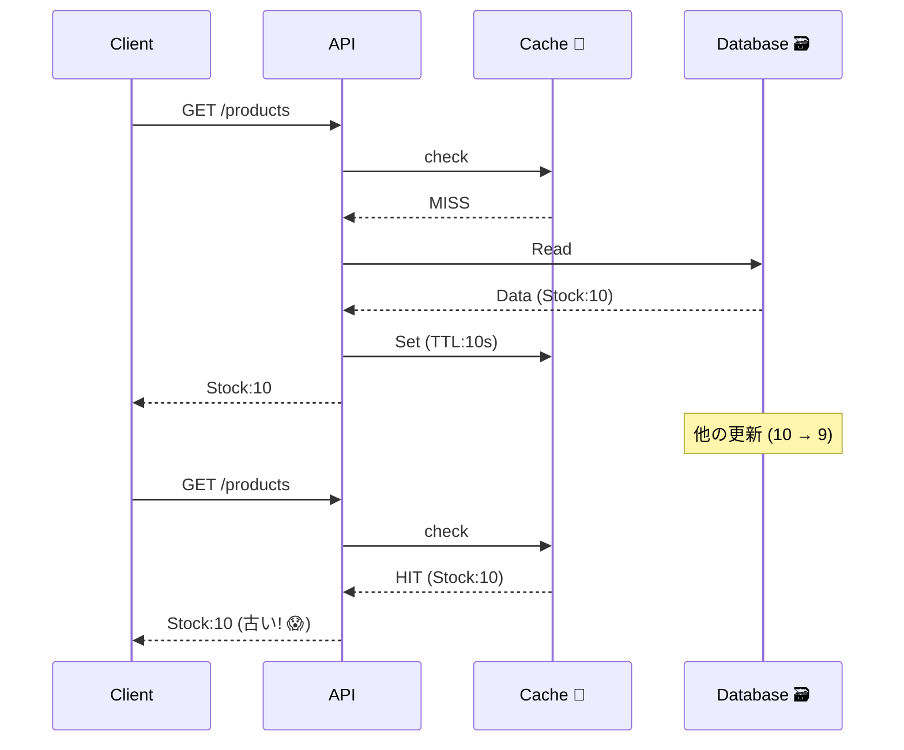

# 第18章：キャッシュの整合性（速いけど古い問題）🧊⚡

## 結論1行✍️✨

**キャッシュは速くなる代わりに“古くなる”ので、`TTL`と`無効化`（必要なら再取得）でコントロールする**📌🧠

---

## 1. この章でできるようになること🎯💪

* キャッシュが「速いけど古い」を起こす理由を、**時間の流れで説明できる**⌛🧩
* `TTL`（Time To Live）を入れて、**古さを“許せる範囲”に収める**🕊️⏳
* 更新（Write）したときに **キャッシュを無効化（delete）**して事故を減らす🧨➡️🧯
* 「キャッシュミス時の再取得」＋「キャッシュが落ちても死なない」設計ができる🛟🧱

---

## 2. まず“古い問題”を体感しよう😵‍💫🧊

### 2.1 よくある悲劇ストーリー📖💥


在庫APIがあるとするね👇

* 画面「在庫：**10**」
* その直後に別の人が購入してDBは「在庫：**9**」
* でもキャッシュが「10」を持ってる → 画面はしばらく「10」😇❌

これが **“速いけど古い”問題**🧊⚡
「キャッシュのせいで嘘つく」ってやつ〜！




---

## 3. キャッシュの基本用語ミニ辞典📖🐣


* **Cache Hit**：キャッシュにあった！速い！🎯⚡
* **Cache Miss**：なかった！DB/APIへ取りに行く！🏃‍♀️💨
* **TTL**：キャッシュの賞味期限⌛（期限切れで捨てる）
* **無効化（Invalidate）**：更新したから、そのキーを消す🗑️
* **Cache-Aside**：
  「まずキャッシュを見る→なければ取りに行って入れる」方式（超よく使う）🧰✨

---

## 4. ハンズオン：TTLで“古さ”が変わるのを見よう🧪👀

ここでは **商品情報（product）** をキャッシュして、TTLを変えて挙動を観察するよ🛒📦
（わざと古くして、あとで直す！🔨✅）

### 4.1 つくるもの🏗️

* `GET /products/:id`：商品を返す（キャッシュあり）🧊
* `POST /products/:id/stock`：在庫を更新する（まずはキャッシュ放置）😈

---

## 5. 実装：TTL付きインメモリキャッシュを作る🧊⌛

### 5.1 `cache.ts`（TTLキャッシュ本体）🧠🧊


```ts
// apps/api/src/cache.ts
type CacheEntry<V> = {
  value: V;
  expiresAt: number; // epoch ms
};

export class TTLCache<V> {
  private store = new Map<string, CacheEntry<V>>();

  constructor(private defaultTtlMs: number) {}

  get(key: string): V | undefined {
    const entry = this.store.get(key);
    if (!entry) return undefined;

    if (Date.now() >= entry.expiresAt) {
      // 期限切れは削除🗑️
      this.store.delete(key);
      return undefined;
    }
    return entry.value;
  }

  set(key: string, value: V, ttlMs = this.defaultTtlMs): void {
    this.store.set(key, { value, expiresAt: Date.now() + ttlMs });
  }

  delete(key: string): void {
    this.store.delete(key);
  }

  // 便利：キャッシュがなければ作って入れる（Cache-Aside）🧰✨
  async getOrSet(key: string, factory: () => Promise<V>, ttlMs?: number): Promise<V> {
    const cached = this.get(key);
    if (cached !== undefined) return cached;

    const fresh = await factory();
    this.set(key, fresh, ttlMs);
    return fresh;
  }
}
```

---

## 6. 実装：ダミーDB（Map）を用意📦🗃️

```ts
// apps/api/src/db.ts
export type Product = {
  id: string;
  name: string;
  stock: number;
  price: number;
  updatedAt: string; // 見やすくするため
};

const products = new Map<string, Product>([
  ["p1", { id: "p1", name: "カフェラテ", stock: 10, price: 480, updatedAt: new Date().toISOString() }],
  ["p2", { id: "p2", name: "ドーナツ", stock: 5, price: 220, updatedAt: new Date().toISOString() }],
]);

export async function getProduct(id: string): Promise<Product | null> {
  // 「DBは遅い」気分を出す🐢
  await sleep(150);
  return products.get(id) ?? null;
}

export async function updateStock(id: string, stock: number): Promise<Product | null> {
  await sleep(150);
  const p = products.get(id);
  if (!p) return null;
  const next = { ...p, stock, updatedAt: new Date().toISOString() };
  products.set(id, next);
  return next;
}

function sleep(ms: number) {
  return new Promise<void>((r) => setTimeout(r, ms));
}
```

---

## 7. 実装：API（キャッシュありGET、キャッシュ放置のPOST）😈🧊


`express`を使う例だよ🚀（読みやすさ優先✨）

```ts
// apps/api/src/server.ts
import express from "express";
import { TTLCache } from "./cache.js";
import { getProduct, updateStock, type Product } from "./db.js";

const app = express();
app.use(express.json());

const productCache = new TTLCache<Product>(10_000); // TTL = 10秒（まずは長め）⌛🧊

function productKey(id: string) {
  return `product:${id}`;
}

app.get("/products/:id", async (req, res) => {
  const id = String(req.params.id);

  const key = productKey(id);
  const cached = productCache.get(key);

  if (cached) {
    res.setHeader("X-Cache", "HIT");
    return res.json(cached);
  }

  res.setHeader("X-Cache", "MISS");
  const p = await getProduct(id);
  if (!p) return res.status(404).json({ message: "not found" });

  productCache.set(key, p); // Cache-Aside（取得したら入れる）🧰✨
  return res.json(p);
});

// まずは「更新してもキャッシュ消さない」悪い例😈（あとで直す✅）
app.post("/products/:id/stock", async (req, res) => {
  const id = String(req.params.id);
  const stock = Number(req.body?.stock);

  if (!Number.isFinite(stock) || stock < 0) {
    return res.status(400).json({ message: "stock must be >= 0" });
  }

  const updated = await updateStock(id, stock);
  if (!updated) return res.status(404).json({ message: "not found" });

  return res.json(updated);
});

app.listen(3000, () => {
  console.log("API listening on http://localhost:3000 🚀");
});
```

`stale-while-revalidate` のように「古いのを返しつつ裏で更新」もHTTPキャッシュには仕組みがあるけど、まずはアプリ内キャッシュで“古さ”の感覚を作るのが先だよ🧠✨（HTTP側の考え方はRFC/MDNにもまとまってるよ）([datatracker.ietf.org][1])

---

## 8. 実験：TTLの長短で“古さ”が変わるのを確認🧪⌛

### 8.1 叩く手順（人力でもOK）👆✨

1. まず見る（キャッシュMISS→HITへ）

* `GET /products/p1` を2回叩く

  * 1回目：`X-Cache: MISS`
  * 2回目：`X-Cache: HIT`

2. 在庫を更新する

* `POST /products/p1/stock` に `{ "stock": 9 }`

3. すぐまた `GET /products/p1`

* **HITのままなら古い値が返りうる**😇🧊（今回の狙い！）

4. 10秒待って `GET /products/p1`

* 期限切れでMISS → 新しい値になる✅✨

### 8.2 自動でやるスクリプト（楽ちん）🤖🧪

```ts
// tools/ttl-demo.ts
const base = "http://localhost:3000";

async function getP1() {
  const r = await fetch(`${base}/products/p1`);
  const cache = r.headers.get("x-cache");
  const body = await r.json();
  console.log("GET p1", "X-Cache=", cache, "stock=", body.stock, "updatedAt=", body.updatedAt);
}

async function setStock(stock: number) {
  const r = await fetch(`${base}/products/p1/stock`, {
    method: "POST",
    headers: { "content-type": "application/json" },
    body: JSON.stringify({ stock }),
  });
  const body = await r.json();
  console.log("POST stock", "stock=", body.stock, "updatedAt=", body.updatedAt);
}

const sleep = (ms: number) => new Promise((r) => setTimeout(r, ms));

await getP1();        // MISS
await getP1();        // HIT
await setStock(9);    // DB更新
await getP1();        // まだHITなら古いかも😇
await sleep(10_500);  // TTL待ち
await getP1();        // MISSで新しい✅
```

TypeScriptをNodeでサクッと動かす用途で `tsx` を使う流れがまとまってるよ([GitHub][2])（開発体験よき✨）

---

## 9. 改善①：更新したら“そのキーだけ消す”🗑️✅


更新系エンドポイントで、最後にこれを入れるだけで事故が激減するよ🧯✨
（キャッシュ無効化の王道！）

```ts
// server.ts の POST /products/:id/stock の最後あたりに追加
productCache.delete(productKey(id)); // これ！🗑️✨
```

### 9.1 これで何が嬉しい？🎉

* 更新直後の `GET` が **MISSになってDBから最新を取れる**✅
* TTLを長くしても「更新時に消える」から、**古さが残りにくい**🧊➡️🫧

---

## 10. 改善②：TTLの決め方（超実務っぽい考え方）🧠📏

TTLって、気合いで決めるとだいたい事故る😇
なので、次の3点で決めるのが強いよ💪✨

### 10.1 TTLを決める3質問❓❓❓

1. **どれくらい古くても許される？（UX/お金/法務）**😌💸⚖️
2. **更新頻度は？（1分に1回？1日に1回？）**🔁
3. **読まれ方は？（めっちゃ読まれる？たまに？）**👀📈

たとえば在庫は古いと困りがち（売り越し💥）だから短め、商品名は変わりにくいから長め、みたいに分けるのが基本🧩✨

キャッシュ戦略は「TTL＋無効化」がまず最初の勝ち筋としてよく挙げられるよ([Dragonfly][3])

---

## 11. “キャッシュがある現実”での注意点あるある⚠️😵‍💫

### 11.1 キャッシュスタンピード（雪崩）❄️💥


TTL切れの瞬間にアクセスが集中すると、**全員がDBに殺到**🏃‍♀️🏃‍♀️🏃‍♀️💨
対策の方向性👇

* TTLに**ジッター**（少しランダム）を入れる🎲
* 1個のキーに対して「今取りに行ってる人がいたら待つ」（singleflight）🧵

### 11.2 キャッシュは“落ちるもの”🧊🪦

Redisみたいな外部キャッシュも万能じゃないよ🥲
だから基本は👇

* **キャッシュが死んだらDBへフォールバック**🛟
* キャッシュ読み取りにもタイムアウトを付ける⏳

（書き込み方法には write-through / write-back みたいな戦略もあるけど、トレードオフがあるよ）([Redis][4])

---

## 12. まとめ：この章の“持ち帰り”🎒✨

* キャッシュは **速いけど古い**🧊⚡
* まずは **TTLで古さを上限化**⌛
* 更新があるデータは **無効化（delete）** を入れて事故を減らす🗑️✅
* さらに余裕が出たら **スタンピード対策**や **stale-while-revalidate** を検討🧠✨ ([datatracker.ietf.org][1])

---

## 13. AI活用（この章のおすすめ聞き方）🤖💬✨

### 13.1 TTL決め（そのままコピペOK）📋

* 「在庫・価格・商品名の3つについて、TTLの初期値案を出して。理由も。更新頻度が高い/低いパターンで」🧠⌛
* 「TTLが短すぎる/長すぎる時の事故例を、ECの例で5個ずつ」😇💥

### 13.2 実装レビュー依頼👀

* 「この `cache.delete(key)` の入れ方で無効化漏れが起きそうな箇所ある？キー設計の改善案も」🗝️🧩
* 「スタンピード対策として singleflight をこのコードに足すならどうする？」🧵❄️

---

## 14. ミニ問題（理解チェック）📝✅

1. TTLを長くすると何が嬉しくて、何が怖い？⌛🧊
2. 更新APIを呼んだのに画面が古いまま、原因としてまず疑うのは？🕵️‍♀️
3. 「無効化」って何をすること？（具体的に1行で）🗑️✨

次章は「マージしやすいデータ設計（加算）」で、そもそも“競合しにくい形”にしていくよ➕🔢💞

[1]: https://datatracker.ietf.org/doc/html/rfc5861?utm_source=chatgpt.com "RFC 5861 - HTTP Cache-Control Extensions for Stale ..."
[2]: https://github.com/privatenumber/tsx?utm_source=chatgpt.com "privatenumber/tsx: ⚡️ TypeScript Execute | The easiest ..."
[3]: https://www.dragonflydb.io/guides/ultimate-guide-to-caching?utm_source=chatgpt.com "Ultimate Guide to Caching in 2026: Strategies and Best ..."
[4]: https://redis.io/blog/why-your-caching-strategies-might-be-holding-you-back-and-what-to-consider-next/?utm_source=chatgpt.com "Why your caching strategies might be holding you back ( ..."
