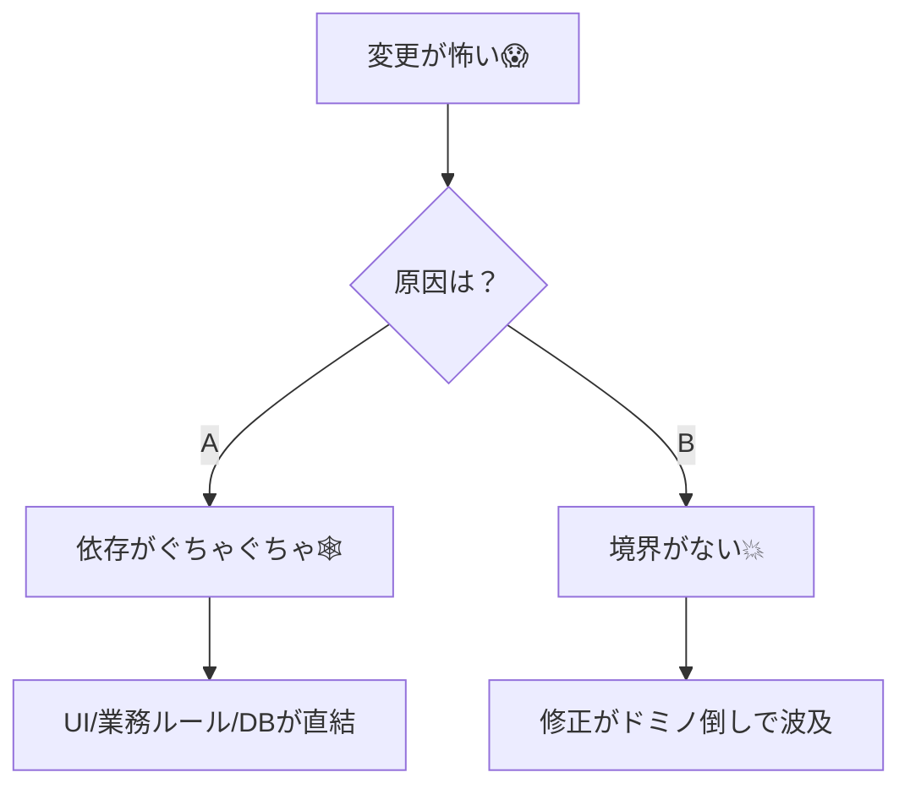
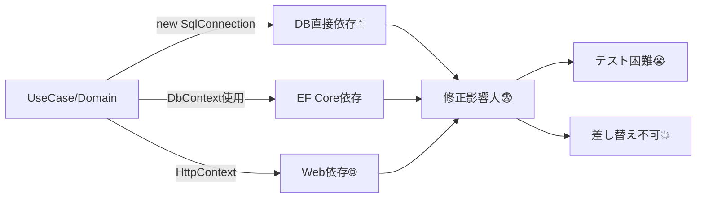

# 第01章：クリーンアーキで何が解決できるの？😌

（ねらい：**「変更が怖い原因」を“依存”と“境界”で説明できる**ようになる💪）

---

## 0. まず、クリーンアーキって「何の薬」？💊🤔

クリーンアーキは、ひとことで言うと…

**「変更の影響範囲を小さくして、修正が怖くなくなる」設計の考え方**だよ😊✨

たとえばこんな“あるある地獄”👇

* 画面の表示をちょっと変えたいだけなのに、DBのコードまで壊れる😇🗄️
* 仕様追加で if が増えまくって、どこが正しいかわからない😵‍💫🧩
* テストしたいのに、DBや外部APIがないと動かない😭🌍
* 「この修正、どこまで影響ある…？」が毎回ギャンブル🎰💥

この「変更が怖い」を、**怖くない状態**に寄せていくのが目的だよ🫶✨

---

## 1. “変更が怖い”の正体はだいたいコレ🧟‍♀️⚡


多くの場合、原因はこの2つに集約されるよ👇



### A) 依存がぐちゃぐちゃ🕸️

「本来、関係なくていいはずのもの」が、直接つながっちゃってる状態。

* 画面（UI）がDBの都合を知りすぎる
* 業務ルールがHTTPやDB型まみれ
* あちこちが相互に呼び合って、切れない

クリーンアーキの超重要ルールとして、**“依存は内側へ”**って考えがあるよ。
内側（ビジネス側）は、外側（DB/フレームワーク/UI）を**知らない**のが理想✨
（これが「Dependency Rule」だよ）([blog.cleancoder.com][1])

### B) 境界がない（or 境界が破れてる）🚪💥

「ここから先は外部の世界（DB/HTTP/外部API）ね！」っていう**境目**がないと、変更が漏れ出す😭

* UI ↔ UseCase ↔ DB が“直結ホース”みたいになる🚿
* ちょい修正が、ドミノ倒しで全域に波及…🁢🁢🁢

---

## 2. 依存ってなに？（C#で超わかる言い方）🧠💡

ここでは超ざっくり、こう覚えよ☺️

> **依存 = 「それが無いとコンパイルできない / 動かせない」関係**

C#だと、わかりやすい依存はこんな感じ👇

* `using` で外の名前を使ってる
* プロジェクト参照 / NuGet参照してる
* `new SqlConnection(...)` とか “直接作る”
* `DbContext` をUseCaseやDomainで握ってる

依存が増えるとどうなるか、感覚でいうと👇



* **修正時の影響範囲が読めない**😨
* **テストが難しくなる**（外部が無いと動かない）😭
* **差し替えが効かない**（DB変更がアプリ中心まで侵入）🗄️➡️🧠

---

## 3. 境界ってなに？（“世界が変わる場所”）🌏🚪

境界は、ひとことで言うと👇

> **境界 = 「ここから先は別世界」って決める線**

別世界って何かというと、たとえば👇

* HTTPの世界（Controller / Minimal API）🌐
* DBの世界（EF Core / SQL）🗄️
* 外部サービスの世界（外部API / SDK）🌍
* ファイル / OS の世界（I/O）📁

境界があると、何が嬉しいかというと👇

* 変更が起きても **境界の外側だけ直せば済む**ようにできる🛡️✨
* 内側（大事な業務ルール）が **外側の都合に振り回されにくい**🧘‍♀️

---

## 4. “つらい設計”のミニ例（なぜ地獄になるのか）😇🔥

たとえば「メモ作成API」を雑に作ると、こうなりがち👇

```csharp
// 例：Controllerが何でもやる（つらい）
app.MapPost("/memos", async (CreateMemoDto dto, AppDbContext db) =>
{
    if (string.IsNullOrWhiteSpace(dto.Title)) return Results.BadRequest("Title required");

    var entity = new MemoEntity { Title = dto.Title, Body = dto.Body };
    db.Memos.Add(entity);
    await db.SaveChangesAsync();

    return Results.Ok(new { entity.Id });
});
```

この状態で起きる“変更の波”🌊

* **仕様変更**：「Titleは最大50文字、禁止ワードも弾いて」
  → Controllerにルールが増殖🧟
* **DB変更**：「Memosテーブル分割した」
  → 画面/APIのコードまで巻き添え🗄️💥
* **外部連携**：「保存後に通知APIを叩く」
  → 失敗時の整合性が地獄（どこまで成功？）😵‍💫

「いまは早い」けど、未来でツケを払うやつ💸😭

---

## 5. クリーンアーキが解決するコト（この章の答え）✅🎯

クリーンアーキは、ざっくりこの2点で効くよ💪✨

### ① 依存の向きを“内側優先”に矯正する🧭

中心（業務ルール・ユースケース）が、外側（DB/フレームワーク）を知らない。
→ **中心は安定する**🧠✨
この考え方は、Microsoftのアーキテクチャガイドでも「Application Coreにモデルとインターフェース（外部操作の抽象）を置く」方向で説明されてるよ。([Microsoft Learn][2])

### ② 境界を作って、変更を“外側に閉じ込める”🚪🧯

DBやUIが変わっても、**中心のルールが壊れにくくなる**。
結果として…

* 仕様変更がしやすい😌✨
* テストがしやすい🧪✨
* 差し替えがしやすい🔁✨

---

## 6. ミニ課題：あなたの「つらい修正」を分類してみよう📝😵‍💫➡️😌

過去の経験でOK！「つらかった修正」を3つ思い出して、下みたいに分類してね😊✨

### ✅ 分類テンプレ（埋めるだけ）

| つらかった修正    | 何が変わった？       | どこまで波及した？       | 原因っぽい依存/境界は？ |
| ---------- | ------------- | --------------- | ------------ |
| 例：入力項目が増えた | UI/Validation | Controller〜DBまで | UIとDBが直結してた  |
| ①          |               |                 |              |
| ②          |               |                 |              |
| ③          |               |                 |              |

**ポイント**：ここでは“正解”より、**言語化**が勝ち🏆✨
「どこ依存が原因？」って考える癖が、このあと効いてくるよ🧠💕

---

## 7. AIの使い方（この章の“補助”🤖✨）

AIは「あなたの経験の棚卸し」を手伝わせると強いよ💪

### 🔸AIプロンプト：原因分類（コピペOK）

```text
以下の「つらかった修正」を、Clean Architectureの観点で分類して。
分類観点は「依存の問題」「境界がない/破れている」「責務の混在」のどれか（複数OK）。
さらに「改善の第一歩」を1つだけ提案して。

--- 修正エピソード ---
1) （ここに書く）
2) （ここに書く）
3) （ここに書く）
```

### 🔸AIプロンプト：波及範囲の見える化（コピペOK）

```text
次の修正について「影響が出る場所」を想像して列挙して。
最後に「境界を置くならどこ？」を3つ候補で出して。

修正：（ここに書く）
現状の構造：（ControllerがDB直叩き、など分かる範囲で）
```

AIの答えはそのまま信じなくてOK🙆‍♀️
**「自分の言葉で直せる形」にする**のがゴールだよ✍️✨

---

## 8. まとめ（この章で持ち帰る言葉）🎒💖

* 「変更が怖い」の正体は **依存** と **境界** に出やすい🧠
* クリーンアーキは **依存の向き** を整えて、変更を **外側に閉じ込める**🏗️
* まずは自分の“つらい修正”を、原因ごとに分類できれば勝ち🏆✨

---

## 9. チェッククイズ（サクッと🤏😆）

1. 「依存」って、C#的にはどういう状態？（自分の言葉でOK）💬
2. 「境界」って、どんな“世界の切り替わり”の場所？🚪
3. 「画面ちょい修正がDBまで巻き込む」っぽいとき、境界が無いのはどこ？🤔

---

次の第2章では、いよいよ「同心円の4層」⭕（Entities / Use Cases / Adapters / Frameworks）を、図でスッキリ整理していくよ〜！😆📘✨

[1]: https://blog.cleancoder.com/uncle-bob/2012/08/13/the-clean-architecture.html?utm_source=chatgpt.com "The Clean Architecture by Uncle Bob - Clean Coder Blog"
[2]: https://learn.microsoft.com/en-us/dotnet/architecture/modern-web-apps-azure/common-web-application-architectures?utm_source=chatgpt.com "Common web application architectures - .NET"
