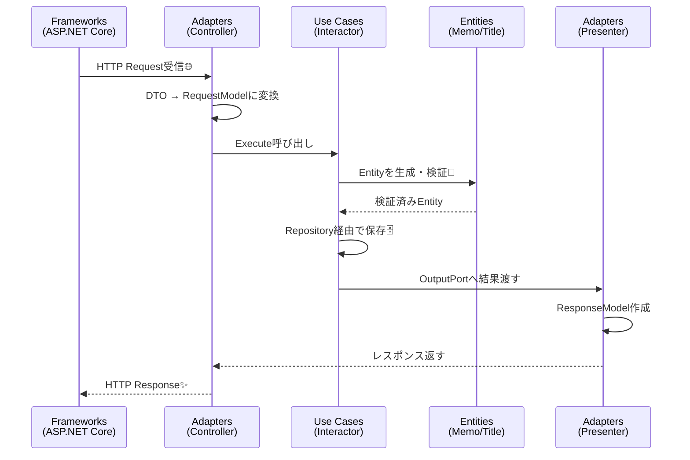

# 第02章：同心円の4層を覚える（Entities / Use Cases / Adapters / Frameworks）⭕

この章は「クリーンアーキって、結局どこに何を置くの？」を**一撃で整理する回**だよ〜！💪😊
クリーンアーキの“同心円”は、**大事なものほど中心に置いて、外側は交換できるようにする**考え方だよ。([blog.cleancoder.com][1])

---

## 0. 今日のゴール🎯💖

最後にこう言えたら勝ち！✨

* 4層の名前を言えて、ざっくり説明できる⭕
* 「これはどの層？」を迷いにくくなる🧭
* “中心ほど大事・外側ほど取り替えOK”の感覚がつかめる🔁

---

## 1. まずは同心円を脳内に貼る🧠📌


「外側の都合（Web/DB/ライブラリ）」に、**中心（ルール）が振り回されない**ようにするのが目的だよ〜！😤✨
この同心円の説明は Uncle Bob の定義が超わかりやすいので、ここが原典として強いよ。([blog.cleancoder.com][1])

```text
   ┌───────────────────────────────┐
   │  Frameworks & Drivers          │  ← Web/DB/外部API/ライブラリ etc
   ├───────────────────────────────┤
   │  Interface Adapters            │  ← 変換係（Controller/Presenter/Repo実装）
   ├───────────────────────────────┤
   │  Use Cases                     │  ← アプリの手順（ユースケース）
   ├───────────────────────────────┤
   │  Entities                      │  ← 中核ルール（ビジネスの本体）
   └───────────────────────────────┘
（本当は“円”だけど、文字で四角にしたよ🙏）
```

> イメージ：🍙
> 具（Entities）が一番大事！海苔（Framework）は替えられる！みたいな感じ😆🍙

---

## 2. 4層を「一言」で覚えるコツ💡✨

* **Entities**：世界のルール（変わりにくい核）👑
* **Use Cases**：アプリとしての手順書（何をどう進める？）🧾
* **Interface Adapters**：翻訳係（外⇄中の形を変える）🗣️🔁
* **Frameworks & Drivers**：外側の道具（Web/DB/外部サービス）🧰🌍

この分け方は「中心がフレームワークを知らない」ことが重要ポイントだよ。([blog.cleancoder.com][1])

---

## 3. 各層を“やること／やらないこと”でスッキリ整理🧼✨

ここからが本番〜！🥳

---

### A) Entities（中核ルール）👑💎

**やること（OK）✅**

* ビジネス上の大事なルール（不変条件・振る舞い）を持つ
* 「この世界ではこう！」を表現する（例：タイトル空はダメ等）
* ID を持つ Entity / 不変の Value Object など

**やらないこと（NG）❌**

* Webの型、DBの型、ライブラリの型に依存しない
* `HttpContext` とか `DbContext` とか一切知らない
* JSON属性やORM属性をベタベタ貼らない（中心が汚れる）

**ミニメモ題材で例📝**

* Memo（メモ）Entity：`Rename()` とか `Archive()` を持つ
* Title（値オブジェクト）：空や長すぎを弾く

この「中心はフレームワーク非依存」がクリーンアーキの大事な核だよ。([blog.cleancoder.com][1])

---

### B) Use Cases（アプリの手順）🎮📦

**やること（OK）✅**

* ユースケース単位の流れをまとめる
  例：「メモ作成」「メモ更新」「メモ検索」
* Entityをどう使うかを決める（手順の司令塔）
* 外部が必要なら **“口”だけ（interface）**を持つ

**やらないこと（NG）❌**

* DBに直接アクセスしない
* 画面表示やHTTPレスポンスの形式を知らない
* `IActionResult` を返したりしない（それ外側！）

Microsoftのアーキテクチャ資料でも「関心の分離」と「層」を意識して整理する考え方が説明されてるよ。([Microsoft Learn][2])

---

### C) Interface Adapters（変換・通訳）🔄🧩

**やること（OK）✅**

* 外側（HTTP/DB/外部API）の形を、内側が扱いやすい形に変換
* 典型：

  * Controller（入力の変換）🚪
  * Presenter（出力の変換）🎤
  * Repository実装（DB ↔ Domain 変換）🗄️

**やらないこと（NG）❌**

* ここに “中心ルール” を置き始めない（それEntities！）
* 変換係なのに、処理の中心になって肥大化しない

---

### D) Frameworks & Drivers（外側の道具）🧱🌐

**やること（OK）✅**

* Webフレームワーク、DB、外部API、設定、DIなど
* “交換されうる詳細”をここに閉じ込める

**やらないこと（NG）❌**

* 中心の都合をここに合わせすぎて、中心を歪めない

---

## 4. 具体例：メモ作成（Create Memo）を4層に流す🌊📝✨

「1ユースケース」が通る道を、イメージで覚えちゃお！😊



```text
[Frameworks]    ASP.NET Core がHTTP受け取る
      ↓
[Adapters]      Controller: DTO → RequestModel に変換して呼ぶ
      ↓
[Use Cases]     Interactor: 手順実行（Entity作る、保存依頼、結果作る）
      ↓
[Entities]      Memo/Title: ルール守って生成・振る舞い
      ↓
[Use Cases]     OutputPortへ結果を渡す
      ↓
[Adapters]      Presenter: ResponseModel → APIレスポンス形に整形
      ↓
[Frameworks]    HTTPレスポンスとして返す
```

この「中心ほど純粋で、外ほど具体的」が同心円のポイントだよ。([blog.cleancoder.com][1])

---

## 5. “どの層？”仕分けゲーム🎮😆✨（ミニ課題）

次の項目を、4層に振り分けてみてね（答えは自分でメモしてOK！📝）
※迷ったら「それは“変換”？ “手順”？ “世界のルール”？」で考えると当たりやすいよ💡

1. `Memo` クラス（IDと状態と振る舞い）
2. `Title`（空禁止など）
3. `CreateMemoInteractor`
4. `CreateMemoInputPort`（interface）
5. `CreateMemoRequestModel`
6. `MemoRepository`（interface）
7. `EfCoreMemoRepository`（EF CoreでDBアクセス）
8. `MemoController`
9. `CreateMemoPresenter`
10. `DbContext`
11. `appsettings.json`
12. `Program.cs`（DI登録）

---

## 6. ありがち事故あるある🧯😂（ここ超大事！）

### 事故①：Use Case が HTTP を知っちゃう😱

* NG例：UseCase が `IActionResult` を返す
* 直し方：UseCase は **ResponseModel** を返す or OutputPortに渡す → PresenterがHTTPに落とす🎤

### 事故②：Entity に DB 都合が混ざる😵

* NG例：EntityにEFの属性や `DbContext` を持たせる
* 直し方：DB用モデルやマッピングは外側（Adapters/Frameworks）に寄せる🗄️🔁

### 事故③：Controller が仕事しすぎ💥

* NG例：Controllerでバリデーションやビジネス判断やDB直叩き
* 直し方：Controllerは「受け取って → 変換して → 呼ぶだけ」🚪✨

---

## 7. AIを“第2章の相棒”にする使い方🤖💞（おすすめ）

### ✅ 仕分けチェック係にする（めちゃ便利！）

* 「このクラスは4層のどこ？理由も！」って聞く
* さらに「違ってたらツッコんで」も追加すると強い😆

### ✅ わざと間違い例を作ってクイズ化

* 「クリーンアーキ違反の例を3つ作って、どこがダメか問題にして」
  → 自分で直すと、めっちゃ定着するよ💪✨

---

## 8. 章末まとめ✅💖

* 4層は「中心ほど大事・外側ほど取り替えOK」⭕
* **Entities＝ルール**、**Use Cases＝手順**、**Adapters＝変換**、**Frameworks＝道具**🧠✨
* 原典の同心円の説明は Uncle Bob の記事が軸になるよ。([blog.cleancoder.com][1])

---

## 9. 次章へのつなぎ（チラ見せ）👀➡️

次の第3章は、この同心円を“憲法”として支える **Dependency Rule（依存は内側へ）** に入るよ〜！🔥
ここが入ると「迷ったらこれで判定できる」ってなるから、一気に楽になるやつ😊✨

---

※参考：C#は今だと **C# 14 が最新**で、**.NET 10** でサポートされてるよ。([Microsoft Learn][3])

[1]: https://blog.cleancoder.com/uncle-bob/2012/08/13/the-clean-architecture.html?utm_source=chatgpt.com "The Clean Architecture by Uncle Bob - Clean Coder Blog"
[2]: https://learn.microsoft.com/ja-jp/dotnet/architecture/modern-web-apps-azure/common-web-application-architectures?utm_source=chatgpt.com "一般的な Web アプリケーションアーキテクチャ - .NET"
[3]: https://learn.microsoft.com/en-us/dotnet/csharp/whats-new/csharp-14?utm_source=chatgpt.com "What's new in C# 14"
