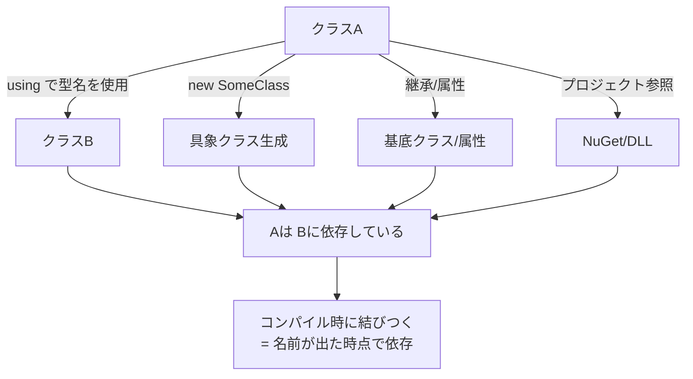
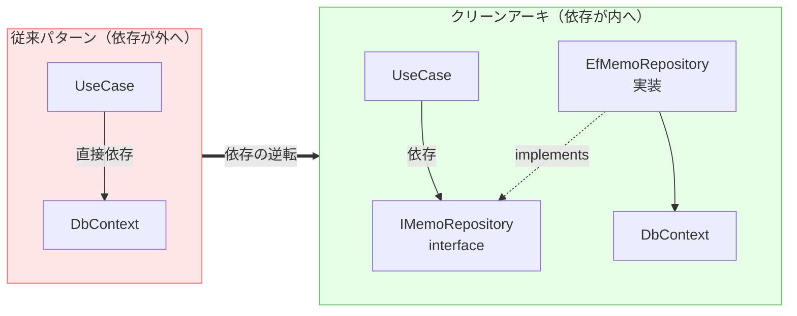

# 第03章：Dependency Rule（依存は内側へ）を体に入れる➡️

この章は「クリーンアーキの憲法」回だよ〜📜✨
これが腹落ちすると、以降の **境界・Ports & Adapters・DI** がスルスル繋がる👍💖
（そして “なんか設計ってむずい…” が一気に減る！🎉）

ちなみに今の最新は **.NET 10（LTS）＋ C# 14** が軸だよ🆕✨ ([Microsoft Learn][1])

---

## 1) まず「依存」ってなに？🧩

ざっくり言うと、

* **AがBを使ってる（知ってる）状態** = AはBに依存してる
* “使ってる” って、具体的にはこういうの👇

### 依存になりやすいもの（超重要チェック！）✅

* `using Xxx;` で **型名** を使う（`DbContext` とか `ControllerBase` とか）
* `new SomeConcreteClass()` で **具象クラスを生成**
* 継承 `: SomeBaseClass` / 属性 `[SomeAttribute]`
* 参照追加（プロジェクト参照 / NuGet参照）
* static 呼び出し（`SomeLibrary.Do()`）

ポイントはこれ👇
**「名前が出た時点で依存」**（コンパイル時に結びつく）って覚えるとラク☺️🫶



---

## 2) Dependency Rule を1行でいうと？➡️⭕️


**「ソースコードの依存は “内側” にしか向いちゃダメ」** だよ🔥
そして **内側は外側のことを何も知らない（名前すら出さない）** がルール✨ ([blog.cleancoder.com][2])

クリーンアーキの同心円でいうと、こう👇

* Entities（中心）
* Use Cases（中心の次）
* Interface Adapters
* Frameworks & Drivers（最外周）

依存の矢印はこうなるのが正解👇

```text
[Frameworks]  --->  [Adapters]  --->  [UseCases]  --->  [Entities]
   (外側)             (変換)            (手順)           (ルール)
```

**逆（内側→外側）はアウト！🚫**
たとえば Entities から `EntityFrameworkCore` が見えたら、もうそれだけで違反になりやすい…😇

---

## 3) なんでそこまで「内側ファースト」なの？🥺

理由はシンプルで、

* **外側は変わりやすい**（DB、Web、ライブラリ、クラウド、UI、外部API…）🌪️
* **内側は守りたい**（業務ルール＝あなたのアプリの価値）👑

もし内側が外側を知ってると、外側の変更が **内側に伝染して**
「修正が怖い」「テスト地獄」「ちょい改修が大工事」になるの💥😵‍💫

Microsoftのガイドでも、Clean/Onion/Hexagonal/Ports-and-Adapters が同系統として整理されてて、要は **依存をインフラから切り離す** 発想がコアだよ〜📚✨ ([Microsoft Learn][3])

---

## 4) どうやって守るの？（結論：interface を内側へ）🔌🪄



Dependency Rule を守る王道はこれ！

### ✅ルールを守る3点セット

1. **内側に interface（Port）を置く**
2. **外側がそれを実装（Adapter）する**
3. **DIで外側の実装を内側へ差し込む**（実行時に合体）🧷

これで **“依存の方向” が反転** するよ！🎉

---

## 5) 例：メモ作成（CreateMemo）で見る “NG→OK” 📝⚙️

### 🚫NG例：UseCaseがDBを直で触る（外側に依存しちゃう）

「UseCase（手順書）が DbContext 知ってる」＝外側依存の混入😭

```csharp
// Application層（UseCases）に置いたつもり…でもこれはNG🙅‍♀️
using Microsoft.EntityFrameworkCore;

public class CreateMemoUseCase
{
    private readonly MyDbContext _db;

    public CreateMemoUseCase(MyDbContext db) => _db = db;

    public async Task Execute(string title)
    {
        _db.Memos.Add(new MemoRecord { Title = title });
        await _db.SaveChangesAsync();
    }
}
```

何がツラいかというと…👇

* DB差し替えが痛い（SQLite→SQL Server→クラウドDB…）😵
* テストでDBが必要になりがち（遅い・だるい）🐢
* “手順書” がインフラ都合に侵食される💧

---

### ✅OK例：UseCaseは「出口（interface）」だけ知る

UseCase側（内側）に **Repository interface** を置くよ🔌✨

```csharp
// Application層（UseCases）: Port（出口）
public interface IMemoRepository
{
    Task AddAsync(Memo memo, CancellationToken ct);
}
```

UseCaseは interface だけ呼ぶ🧠✨

```csharp
// Application層（UseCases）
public sealed class CreateMemoUseCase
{
    private readonly IMemoRepository _repo;

    public CreateMemoUseCase(IMemoRepository repo) => _repo = repo;

    public async Task ExecuteAsync(string title, CancellationToken ct)
    {
        var memo = Memo.Create(title); // Entitiesのルールで生成（例）
        await _repo.AddAsync(memo, ct);
    }
}
```

そして外側（Infrastructure/Adapters）が実装する👇

```csharp
// Infrastructure層（外側）: Adapter（実装）
using Microsoft.EntityFrameworkCore;

public sealed class EfMemoRepository : IMemoRepository
{
    private readonly MyDbContext _db;

    public EfMemoRepository(MyDbContext db) => _db = db;

    public async Task AddAsync(Memo memo, CancellationToken ct)
    {
        _db.Memos.Add(new MemoRecord { Id = memo.Id.Value, Title = memo.Title.Value });
        await _db.SaveChangesAsync(ct);
    }
}
```

これで！🎉

* UseCaseは **EFを知らない**
* Entitiesも **DBを知らない**
* 外側の都合は外側に隔離🧊✨

---

## 6) “禁止参照リスト” を作ろう🧾🚫（ミニ課題つき）

この章のミニ課題はコレ！💪😆
**「内側が参照しちゃダメなもの」を文字にする**✍️✨

### 例：禁止参照リスト（テンプレ）

* **Entities / Domain**

  * `Microsoft.EntityFrameworkCore` を参照しない
  * `Microsoft.AspNetCore.*` を参照しない
  * `System.Net.Http`（外部通信）を参照しない
* **UseCases / Application**

  * `DbContext` / `HttpContext` を参照しない
  * Controller / Presenter の型を参照しない（=外側の表示都合を知らない）

💡コツ：**「名前が出たらアウト」** をベースにしてOKだよ〜👌

---

## 7) 依存違反を “見つける” コツ（VSでラクする）🔍✨

### ✅見る場所（気持ち的には「参照の矢印」だけ見る）

* プロジェクト参照（どこがどこを参照してる？）
* NuGet参照（内側に外側ライブラリが混じってない？）

CLIでも一瞬で見れるよ👇（便利✨）

```bash
dotnet list path\to\YourProject.csproj reference
dotnet list path\to\YourProject.csproj package
```

---

## 8) クイズ：これは依存違反？どこがダメ？🎮😆

### Q1：Entities にこれがあったら？💥

```csharp
using Microsoft.EntityFrameworkCore;

public class Memo
{
    [Key] // ← これ系
    public int Id { get; set; }
}
```

✅答え：**ほぼアウト！**
Entities が **EFの属性** を知ってる＝外側依存が内側に侵入😭
👉 対策：永続化用のクラス（DB用モデル）を外側に置いてマップする🔁✨

---

## 9) AI（Copilot/Codex）で “依存ルール筋トレ” しよう🤖🏋️‍♀️

この章はAIがめっちゃ相性いい✨（レビュー役に最高！）

### そのまま投げて使えるプロンプト例💬

* 「このコード、クリーンアーキの Dependency Rule 違反ある？“内側が外側を知ってる” 観点で指摘して🥺」
* 「このプロジェクト構成で、参照方向のNGパターンを列挙して。禁止参照リストも作って✨」
* 「UseCase が DB を直で触ってる。interface を内側に置く形にリファクタ案を出して💡」

💡AIの答えは“提案”だから、最後はこの章のルールで判定してね😉📜✨
（ルールのほうが偉い！笑）

---

## 10) 今日のまとめ（ここだけは暗記でOK）🧠✨

* Dependency Rule = **依存は内側へ** ➡️ ([blog.cleancoder.com][2])
* **内側は外側を知らない（名前すら出さない）** ([blog.cleancoder.com][2])
* 守り方は **interface を内側、実装を外側、DIで合体** 🔌🪄
* 「名前が出たら依存」＝ **禁止参照リスト** が効く🧾🚫

---

次章（第4章：境界🚪）では、今日の「依存は内側へ」をベースにして、
**どこで切る？（Boundary）** をスパッと言えるようにしていくよ〜✂️✨

[1]: https://learn.microsoft.com/en-us/dotnet/core/whats-new/dotnet-10/overview?utm_source=chatgpt.com "What's new in .NET 10"
[2]: https://blog.cleancoder.com/uncle-bob/2012/08/13/the-clean-architecture.html?utm_source=chatgpt.com "The Clean Architecture by Uncle Bob - Clean Coder Blog"
[3]: https://learn.microsoft.com/en-us/dotnet/architecture/modern-web-apps-azure/common-web-application-architectures?utm_source=chatgpt.com "Common web application architectures - .NET"
