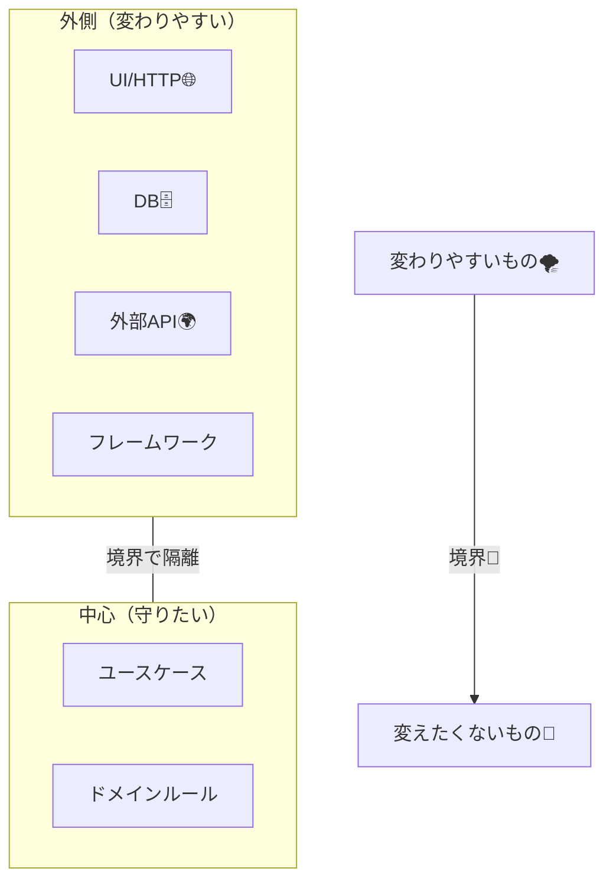

# 第04章：境界（Boundary）とは何か？🚪

（クリーンアーキ初めて＆設計は超入門者向け）

---

## この章でできるようになること🎯💖

* 「境界ってなに？」を**自分の言葉で説明**できるようになる🙆‍♀️✨
* どこに境界を置くとラクか（＝どこで切ると変更に強いか）を**判断**できるようになる🧠🔪
* 「境界をまたぐデータ」と「またいじゃダメなもの」を**仕分け**できるようになる📦🚫

---

## 1) 境界ってなに？いちばんカンタンな説明🍩🚪

**境界（Boundary）**は、ざっくり言うと…

> **“変わりやすいもの” と “変えたくないもの” の間に置く「仕切り（ゲート）」** 🚪✨

* 変わりやすいもの：UI（画面/HTTP）、DB（種類/構造）、外部API、フレームワーク、ライブラリ、クラウド設定…など🌪️
* 変えたくないもの：アプリの「やりたいこと（ユースケース）」や「業務ルール（ドメイン）」💎

クリーンアーキの狙いは「関心の分離（Separation of Concerns）」で、層に分けて守るやつだよ〜、ってのが大本の思想だよ📚✨ ([blog.cleancoder.com][1])

---

## 2) 境界がないと何がつらいの？😵‍💫💥（あるある）

例えば「メモ作成」機能で…

* Controller が HTTP の都合で分岐しまくる😵
* ついでに DbContext を直叩きする😇
* ついでに Entity に EF の属性を貼る😇😇
* ついでに例外メッセージが UI 文言になる😇😇😇

こうなると、
**UI変更**・**DB変更**・**例外設計**が全部からみ合って「ちょい修正」が地獄になるよ〜🫠🔥

境界はこれを防ぐための「交通整理」なんだ🚦✨



---

## 3) 境界で守る“お約束”は2つだけ🧡

### ルールA：境界をまたぐのは「データ」中心📦

境界をまたぐものは、なるべく **シンプルなデータ**にするのが基本✨
（DTO / RequestModel / ResponseModel みたいな “ただの入れ物”）

逆に、境界をまたがせないほうがいいのは👇

* HTTPっぽい型（HttpContext / IActionResult など）🌐🚫
* DBっぽい型（DbContext / EF Entity など）🗄️🚫
* フレームワークのクラスや属性🧩🚫

### ルールB：境界の内側は、外側を知らない🙈➡️

クリーンアーキの超コアは「依存は内側へ」だよね（前章）➡️
境界を置くってことは、**内側が外側に引っ張られないようにする**ってこと💪✨ ([blog.cleancoder.com][1])

---

## 4) 境界には“種類”があるよ🧰✨（まずは3つ覚えよ）

この章では、よく使う境界候補をまず3つに絞って覚えよう〜😊💕

### ① API境界（HTTP/Controller との境界）🌐🚪

**変更理由**：ルーティング、HTTPステータス、入力バリデーション、レスポンス形式が変わる
**ここでやること**：

* HTTPの入力を「中の入力データ」に変換する📨→📦
* 中の結果を「HTTPの出力」に変換する📦→📨

### ② DB境界（永続化との境界）🗄️🚪

**変更理由**：DB種類、テーブル設計、ORM、クエリ最適化が変わる
**ここでやること**：

* 「保存/取得」は**インターフェース**越しに呼ぶ（中はDBを知らない）🔌✨

### ③ 外部API境界（外のサービスとの境界）🌍🚪

**変更理由**：API仕様、認証、レート制限、タイムアウト、失敗時の扱いが変わる
**ここでやること**：

* 外部呼び出しもインターフェース越しにする（中はHTTPクライアントを知らない）📡✨

---

## 5) “入力境界/出力境界”って何？（超やさしく）🔌⬅️➡️

クリーンアーキでよく出る用語👇

* **入力境界（Input Boundary）**：中に「お願い」する窓口（＝ユースケースを呼ぶ入口）🔌⬅️
* **出力境界（Output Boundary）**：中から「結果」を渡す窓口（＝表示用に整える出口）🔌➡️

つまり、**ユースケースは「入力境界を実装」して、結果は「出力境界に渡す」**みたいな形になりやすいよ〜✨ ([coreworks.co][2])

---

## 6) 例：メモ作成で “境界を置く” とこうなる✍️💖

ここでは「何をどこに置くか」のイメージが目的だよ😊
（細かいPort/Adapterの実装は次章以降で育てる🌱）

### 6-1. ざっくり構造（図）🗺️✨


* 外側（Web/API）→ **入力を変換**して中へ
* 中（UseCase）→ ルールに沿って処理
* 外側（Presenter）→ **出力を変換**して返す

```text
[HTTP Request]
    ↓  (Controller: 変換)
[UseCase RequestModel]  ←——— ここが「境界をまたぐデータ」📦
    ↓
[UseCase / Domain]
    ↓
[UseCase ResponseModel] ←——— ここも「境界をまたぐデータ」📦
    ↓  (Presenter: 変換)
[HTTP Response]
```

### 6-2. “境界をまたぐデータ”の例（C#）📦✨

※ここでは「ただの入れ物」にしておくのがポイントだよ〜😊

```csharp
// 入力（UseCase用）: HTTP DTOとは別物にするのがコツ✨
public sealed record CreateMemoRequest(
    string Title,
    string Body
);

// 出力（UseCase用）
public sealed record CreateMemoResponse(
    Guid MemoId,
    string Title
);
```

✅ **ここにHTTPの都合（ステータスコードとか）を入れない**
✅ **ここにDBの都合（列名とか）を入れない**
これが境界の“清潔感”だよ〜🧼✨

---

## 7) 境界をどこに置くか？決め方は「変更理由」💡💖

境界で迷ったら、次の質問を自分にするのが最強だよ😊✨

### 質問①：それ、何が原因で変わる？🧐

* UIの都合で変わる？ → UI境界
* DBの都合で変わる？ → DB境界
* 外部サービスの都合で変わる？ → 外部境界

### 質問②：それが変わったら、どこまで波及してほしい？🌊

* **波及してほしくない** → 境界を置く（隔離する）🧯
* **波及してOK** → 無理に境界を増やさない（やりすぎ注意）⚖️

---

## 8) “境界が守れてる”サイン✅✨（チェックリスト）

次のうち、3つ以上当てはまったらかなり良い感じ💖

* UseCaseの中に「HTTPっぽい型」が出てこない🌐🚫
* UseCaseの中に「DBっぽい型」が出てこない🗄️🚫
* Controllerは「受け取って変換して呼ぶだけ」になってる🚪✨
* Presenter（出力整形）が「表示の都合」を吸収してる🎤✨
* DBを InMemory に差し替えても UseCase が動く（将来のテストが楽）🧪✨

---

## 9) ミニ課題（この章のゴール）📝💕

### ミニ課題A：境界候補を3つ宣言しよう🚪🚪🚪

あなたの題材（メモ管理）で、次の3つを書き出してね😊

1. API境界：どことどこの間？
2. DB境界：どことどこの間？
3. 外部API境界：もし追加するとしたら何？（例：翻訳API、要約APIなど）

### ミニ課題B：「境界をまたぐデータ」を2つ書こう📦✨

* CreateMemoRequest に入れるべき項目
* CreateMemoResponse に入れるべき項目

※「HTTPの都合」「DBの都合」を混ぜないのが正解だよ🙆‍♀️✨

---

## 10) AIに手伝ってもらうコツ🤖💕（この章で使うならコレ）

“設計の超入門”のときほど、AIは相棒になるよ〜😊
ただし **丸コピじゃなくて、ツッコミ役**にすると強い✨

### 使えるプロンプト例（そのまま貼ってOK）📎

```text
あなたはクリーンアーキテクチャのレビュアーです。
メモ管理アプリの「境界候補」を3つ（API/DB/外部API）挙げて、
それぞれ「変わりやすい理由」と「境界の内側に入れてはいけないもの」を箇条書きで教えて。
```

```text
CreateMemoRequest/CreateMemoResponse に入れるべき項目と、
入れてはいけない項目（HTTPやDB都合）を具体例つきで指摘して。
```

---

## まとめ🍰✨

* 境界は「変わりやすいもの」と「守りたい中心」の間に置くゲート🚪
* 境界をまたぐのは「データ中心」📦（HTTP/DB/フレームワークは持ち込まない）
* 境界の置き方は「変更理由」で決めるのがいちばんラク💡

次の第5章で、この境界を“処理の流れ（Ports & Adapters）”として手触りよく理解していくよ〜🔌✨

[1]: https://blog.cleancoder.com/uncle-bob/2012/08/13/the-clean-architecture.html?utm_source=chatgpt.com "The Clean Architecture by Uncle Bob - Clean Coder Blog"
[2]: https://www.coreworks.co/adventures-with-clean-architecture?utm_source=chatgpt.com "Adventures with Clean Architecture | CoreWorks"
