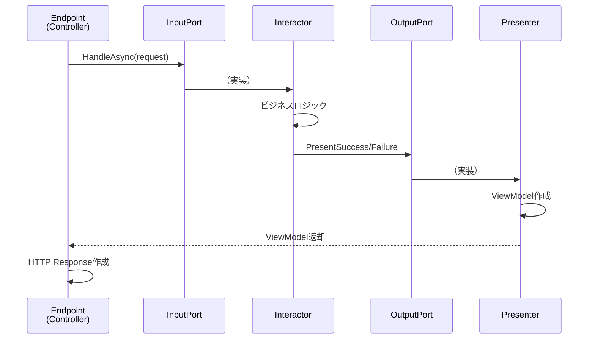

# 第05章：Ports & Adapters を“処理の流れ”で理解する🔌

（Controller → InputPort → Interactor → OutputPort → Presenter）

---

## この章でできるようになること🎯💖

この章が終わったら、こんな状態になってます👇✨

* 「処理の流れ」を **1本のストーリー**として説明できる📖
* **Input Port / Output Port** が何のためにあるか言える🔌
* Controller と Presenter を “薄く” 保つ理由が腹落ちする🪶
* 「依存の向き（Dependency Rule）」を **コード上で守れる**🛡️

Clean Architecture では、**“処理の流れ（Flow of Control）”** と **“依存の向き（Dependency Direction）”** がズレます。
このズレこそがポイントです🧠✨（ここを掴むと、一気に視界が晴れます🌤️）

---

## 5.1 Ports & Adapters って結局なに？🧩🔌

Ports & Adapters（別名：Hexagonal Architecture）は、外の世界（UI/DB/外部API）と中心（ユースケース/ドメイン）を **“差し替え可能”**にする考え方だよ〜ってやつです🔁✨
名前が色々あるけど、同じ方向性の親戚だと思ってOKです🙆‍♀️
（Hexagonal / Ports-and-Adapters / Onion / Clean Architecture…など） ([Microsoft Learn][1])

### たとえ話🍳✨

* **アプリの中心（UseCase/Domain）**：料理人👩‍🍳（料理の腕が本体）
* **Controller（入力側のAdapter）**：注文を受ける店員さん🧾
* **Presenter（出力側のAdapter）**：盛り付け係🍽️（見せ方を整える）
* **Port（Interface）**：厨房の「受け口」🔌（この形なら繋げるよ、って約束）
* **Adapter（実装）**：変換プラグ🔁（外の都合を中に合わせる）

中心は「料理」だけに集中したいので、店員の事情や皿の形で料理を変えない！って感じです🍱✨

---

## 5.2 いちばん大事：「処理の流れ」と「依存の向き」は別物⚡


Clean Architecture の核心はこれ👇

* ✅ **処理の流れ（Flow of Control）**：外 → 内 → 外
* ✅ **依存（コンパイル時の参照）**：外 → 内（内は外を知らない）

Uncle Bob の図でも、ユースケースは presenter を直接呼べないので、**Output Port（インターフェース）** を介して呼ぶ、って説明されます。 ([blog.cleancoder.com][2])
また、.NET公式のアーキテクチャ解説でも「UIがCoreにあるインターフェースを使う（依存は内側へ）」が強調されています。 ([Microsoft Learn][1])

### ここで一旦、超大事な図🖼️✨

（※矢印の意味が違うのがポイント！）

* **処理の流れ（実行時）**
  Controller → InputPort → Interactor → OutputPort → Presenter

* **依存（参照の向き）**
  Controller（外） → InputPort（内）
  Interactor（内） → OutputPort（内）
  Presenter（外） → OutputPort（内）

> “呼び出し”は内→外っぽく見えるのに、
> “依存”は外→内に揃う。ここが気持ちいいところ〜🥰

---

## 5.3 登場人物まとめ（最短で迷子を防ぐ）🧭💡


この章で扱う役者は5人だけです👇✨

1. **Controller**（入力アダプタ）🚪

* HTTP/画面入力などを受け取る
* UseCase 用の Request に変換して渡す
* 判断や業務ロジックは持たない（薄く！）

2. **Input Port**（入力の口）🔌⬅️

* 「ユースケースをこう呼んでね」という **インターフェース**
* 外側（Controller）がこれを呼ぶ

3. **Interactor**（ユースケース本体）🧱

* 手順の中心
* Entity を使う
* Output Port を呼ぶ

4. **Output Port**（出力の口）🔌➡️

* 「結果はこう渡してね」という **インターフェース**
* 内側（UseCase）がこれを呼ぶ（でも依存はインターフェースだけ！）

5. **Presenter**（出力アダプタ）🎤

* Output Port を実装して、表示用に整形する
* HTTPレスポンス向けDTOやViewModelへ変換する

---

## 5.4 例題：「メモ作成」ユースケースで流れを固定する📝✨

ここからは **“メモ作成”** で一本の流れを作るよ〜💖
（DBはまだ要らない！まずは流れだけ掴もう🛝）

---

## 5.5 コードで「流れ」を作る（まずはコピペでOK）📦✨

### ① Core側：Port と Model を作る（中心の約束）🔌

* InputPort / OutputPort / Request / Response を用意します
* ここは **外側の都合を入れない**（HTTPとか入れない）🧼

```csharp
// Core/UseCases/CreateMemo/CreateMemoModels.cs
namespace Core.UseCases.CreateMemo;

public sealed record CreateMemoRequest(string Title, string Body);

public sealed record CreateMemoResponse(Guid MemoId, string Title, string Body);
```

```csharp
// Core/UseCases/CreateMemo/ICreateMemoInputPort.cs
namespace Core.UseCases.CreateMemo;

public interface ICreateMemoInputPort
{
    Task HandleAsync(CreateMemoRequest request, CancellationToken ct);
}
```

```csharp
// Core/UseCases/CreateMemo/ICreateMemoOutputPort.cs
namespace Core.UseCases.CreateMemo;

public interface ICreateMemoOutputPort
{
    Task PresentSuccessAsync(CreateMemoResponse response, CancellationToken ct);
    Task PresentFailureAsync(string message, CancellationToken ct);
}
```

> Output Port を “成功/失敗” に分けるのは、後のHTTP変換がめちゃ楽になるからおすすめ💡✨

---

### ② Core側：Interactor（ユースケース本体）を書く🧱🔥

今はDBなしでOKなので、メモIDを生成して返すだけにします🎈

```csharp
// Core/UseCases/CreateMemo/CreateMemoInteractor.cs
namespace Core.UseCases.CreateMemo;

public sealed class CreateMemoInteractor : ICreateMemoInputPort
{
    private readonly ICreateMemoOutputPort _output;

    public CreateMemoInteractor(ICreateMemoOutputPort output)
        => _output = output;

    public async Task HandleAsync(CreateMemoRequest request, CancellationToken ct)
    {
        // 形式チェックは外側（Adapter）でもできるけど、
        // “ルール”は中心でも守る（例：空タイトル禁止）✨
        if (string.IsNullOrWhiteSpace(request.Title))
        {
            await _output.PresentFailureAsync("タイトルは空にできません🥺", ct);
            return;
        }

        var memoId = Guid.NewGuid();

        var response = new CreateMemoResponse(
            MemoId: memoId,
            Title: request.Title.Trim(),
            Body: request.Body ?? string.Empty
        );

        await _output.PresentSuccessAsync(response, ct);
    }
}
```

ここで重要なのは👇
Interactor は **HTTPを知らない**、Controllerも知らない、Presenterも知らない。
知ってるのは **Output Port（インターフェース）だけ**🫶✨
この発想が、Dependency Rule を守るコツです ([blog.cleancoder.com][2])

---

### ③ Adapter側：Presenter を作る（結果を“見せる形”へ）🎤🍽️

Presenter は OutputPort を実装し、**外側で使いやすい形（ViewModel）** を作ります✨

```csharp
// Adapters/Presenters/CreateMemoPresenter.cs
using Core.UseCases.CreateMemo;

namespace Adapters.Presenters;

public sealed class CreateMemoPresenter : ICreateMemoOutputPort
{
    public CreateMemoViewModel? ViewModel { get; private set; }
    public string? Error { get; private set; }

    public Task PresentSuccessAsync(CreateMemoResponse response, CancellationToken ct)
    {
        ViewModel = new CreateMemoViewModel(
            Id: response.MemoId,
            Title: response.Title,
            Body: response.Body
        );
        Error = null;
        return Task.CompletedTask;
    }

    public Task PresentFailureAsync(string message, CancellationToken ct)
    {
        ViewModel = null;
        Error = message;
        return Task.CompletedTask;
    }
}

public sealed record CreateMemoViewModel(Guid Id, string Title, string Body);
```

> Presenter は「盛り付け係」🍽️✨
> UseCase から渡された結果を、外側（Web/画面）に合わせて整えます。
> これを UseCase 内でやると、中心が外側都合で汚れちゃうの🥲

---

### ④ Adapter側：Controller（またはMinimal API）を薄く書く🚪🪶

ここでは Minimal API でいきます（Controllerでも同じ考え方だよ🙆‍♀️）

```csharp
// Frameworks/Web/Program.cs (一部)
using Adapters.Presenters;
using Core.UseCases.CreateMemo;

var builder = WebApplication.CreateBuilder(args);

// DI（配線）: Presenter と Interactor をつなぐ🧵
builder.Services.AddScoped<CreateMemoPresenter>();
builder.Services.AddScoped<ICreateMemoOutputPort>(sp => sp.GetRequiredService<CreateMemoPresenter>());
builder.Services.AddScoped<ICreateMemoInputPort, CreateMemoInteractor>();

var app = builder.Build();

app.MapPost("/memos", async (
    CreateMemoDto dto,
    ICreateMemoInputPort inputPort,
    CreateMemoPresenter presenter,
    CancellationToken ct) =>
{
    // Controller/Endpoint は変換して呼ぶだけ🪶✨
    var request = new CreateMemoRequest(dto.Title, dto.Body);

    await inputPort.HandleAsync(request, ct);

    if (presenter.Error is not null)
        return Results.BadRequest(new { message = presenter.Error });

    return Results.Created($"/memos/{presenter.ViewModel!.Id}", presenter.ViewModel);
});

app.Run();

public sealed record CreateMemoDto(string Title, string Body);
```



💡ここが「処理の流れ」そのもの！

* Endpoint（Controller役）→ InputPort → Interactor → OutputPort → Presenter
* 最後に Controller が Presenter の結果をHTTPにする🌈

---

## 5.6 “薄いController”が正義な理由🪶💖

Controller が太ると、だいたいこうなります👇💥

* 例外処理や分岐が増える
* DB触りだす
* “とりあえずここに書く” が積み上がる
* 結果、テストしづらい＆修正が怖い😭

Ports & Adapters にすると、Controller は「変換して呼ぶだけ」になりやすいです✨
（入力は InputPort、出力は OutputPort が担当、という説明もよくされます） ([Qiita][3])

---

## 5.7 よくあるつまずきポイント集（先に潰す）🧯😆

### つまずき①：Interactor が Presenter クラス名を知ってしまう❌

* 「CreateMemoPresenter を new しちゃう」みたいなのはアウト〜🙅‍♀️
* Interactor は **ICreateMemoOutputPort** だけ見てね🧼

### つまずき②：Request/Response が HTTP DTO と混ざる🍱💥

* Core の Request/Response は “アプリ都合”
* Web の DTO は “HTTP都合”
* 混ぜると、将来 UI を変えた時に中心が崩れやすい🥲

### つまずき③：Presenter の ViewModel をドメインに寄せすぎる🤝💦

* ViewModel は “表示向け”
* Domain は “ルール向け”
* 似てても別物！分けてOK🙆‍♀️✨

---

## 5.8 ミニ課題（手を動かすやつ）🧪💖

### 課題A：フロー図を描く🖊️✨

「メモ作成」を、これで描いてみて👇

* Controller
* InputPort
* Interactor
* OutputPort
* Presenter

**AIにレビューさせる用プロンプト例🤖✨**

* 「このフロー図、Ports & Adaptersとして責務がズレてないか、Controllerが太くなりそうな点も含めて指摘して〜！」

---

### 課題B：失敗ケースを2つ追加⚠️

Interactor にルール追加してみよ〜👇

* タイトルが 1文字だけは禁止🥺
* 本文が 5000文字超えは禁止📚

Presenter の PresentFailureAsync を使って返す✨

**AIプロンプト例🤖**

* 「Interactorに追加するルール案と境界値テスト案をセットで出して〜！」

---

### 課題C：Presenter の出力を “統一レスポンス形式” にする📦

成功でも失敗でも、こういう形に揃える👇✨

* `{ ok: true, data: ... }`
* `{ ok: false, error: ... }`

（この統一ができると、次の章以降がラク！）

---

## 5.9 まとめ（この章の“合言葉”）🔑💖

* **処理の流れ**：Controller → InputPort → Interactor → OutputPort → Presenter
* **依存の向き**：外 → 内（内は外を知らない） ([blog.cleancoder.com][2])
* Ports は “差し替えできる約束”🔌
* Adapters は “外の都合を吸収する変換係”🔁
* Controller と Presenter を薄くすると、変更が怖くなくなる😌✨

---

次の章（第6章）では、この登場人物たちを **Solution/Project 構成（参照方向）** としてどう置くかを、迷子にならない形で固めていこうね🏠💖

[1]: https://learn.microsoft.com/en-us/dotnet/architecture/modern-web-apps-azure/common-web-application-architectures?utm_source=chatgpt.com "Common web application architectures - .NET"
[2]: https://blog.cleancoder.com/uncle-bob/2012/08/13/the-clean-architecture.html?utm_source=chatgpt.com "The Clean Architecture by Uncle Bob - Clean Coder Blog"
[3]: https://qiita.com/arkuchy/items/874656b33d2e5acdf281?utm_source=chatgpt.com "Go言語とClean ArchitectureでAPIサーバを構築する"
