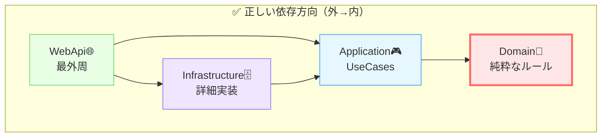

# 第06章：C#で層をどう置く？（プロジェクト/参照方向）🏠

この章はね、「**クリーンアーキのルール（依存は内側へ）**」を **“C#のソリューション構造そのもの”** で守れるようにする回だよ〜！💪😊
ここが決まると、以後の章がぜんぶスムーズになるよ🧠💖

---

## 6-1. なんで「プロジェクト分割」がそんなに大事なの？🤔🔧


クリーンアーキって、図を理解するだけだと **すぐ崩れがち** なのね🥲
でも C# は **Project（プロジェクト参照）** で境界をガチガチにできるのが強い！✨

* **「参照できない」＝ うっかり汚せない** 🚫
* “気をつける”じゃなくて、**構造で防げる** 🛡️

つまり…

> **クリーンアーキは、設計の話だけじゃなくて、Solution構造で勝つゲーム** 🎮✨


---

## 6-2. 2026の最新C#/.NETだと、何を中心に置くの？🧠🌟

いま（本日時点）だと、**.NET 10（LTS）** が土台にしやすいよ📦✨（長期サポート） ([Microsoft for Developers][1])
C#も **C# 14** が最新として整理されてるよ〜🧁 ([Microsoft Learn][2])

そして公式のアーキテクチャ資料でも、Clean Architecture を **プロジェクト分割で組む考え方** が紹介されてる（eShopOnWebの例など）📚 ([Microsoft Learn][3])

---

## 6-3. まずは“置き方の正解”を1つ決めよう✅🏗️

クリーンアーキの「4層」を C# のプロジェクトに落とすとき、初心者さんが迷わない鉄板はこれ👇✨

### ✅おすすめ構成（超定番）🧡

* **Domain**：Entities（エンティティ・VO・ドメインルール）👑
* **Application**：Use Cases（Input/Output Port、Interactor、Request/Response）🎮
* **Infrastructure**：DB/外部APIなど “詳細” 🗄️🌍
* **WebApi**：入口（Controller / Minimal API）＋DI（Composition Root）🌐🧵

> 名前は好みで変えてOKだけど、**参照方向だけは絶対に守る** のがポイントだよ🚦✨

---

## 6-4. 参照方向（依存の矢印）を“暗記”しよう➡️🧠


これが今日の本題！いちばん大事！！📌💥

### ✅依存の向き（正解）✨

* **WebApi → Application**
* **WebApi → Infrastructure**
* **Infrastructure → Application**
* **Application → Domain**
* **Domain →（何も参照しない）** 👑✨

図にするとこんな感じ👇

```text
[WebApi]  ─────▶  [Application]  ─────▶  [Domain]
    │                  ▲
    └──────▶  [Infrastructure] ─────────┘
```



Domain が “無敵の中心” になるのが気持ちいいのだ😆💖

---

## 6-5. 各プロジェクトに「入れていいもの／ダメなもの」仕分け🍱🧼


ここ、最初に決めると超ラク！✨
（迷子防止マップ🗺️💗）

### 🟣 Domain（Entities）に入れるもの👑

* Entity / Value Object / ドメインエラー
* 不変条件（例：タイトル空は禁止、長さ制限など）🚧
* “業務ルールの核” 🔥

#### ❌Domainに入れない！

* EF Core の属性や DbContext 🗄️
* HTTP、Controller、DTO 🌐
* DI、設定ファイル、ILogger など（外側の都合）🧯

---

### 🟦 Application（Use Cases）に入れるもの🎮

* InputPort / OutputPort（interface）🔌
* RequestModel / ResponseModel 📨
* Interactor（UseCase本体）🧱
* Repositoryなど **外へ出るための口（interface）** 🚪

#### ❌Applicationに入れない！

* DbContext 直叩き
* HttpContext や IActionResult
* 「画面表示の都合の整形」🎨（それはPresenter側へ）

---

### 🟫 Infrastructure（詳細）に入れるもの🗄️

* EF Core 実装（Repositoryの実装）
* 外部APIクライアント実装
* ファイル保存などの実装

#### ✅ここは “汚れてOK” な場所😆（ただし汚れは外側に閉じ込める！🧼）

---

### 🟩 WebApi（最外周）に入れるもの🌐

* エンドポイント（Controller / Minimal API）
* DI登録（Composition Root）🧵
* 認証・認可など “Webの都合”

---

## 6-6. ハンズオン：Solutionを作って「参照だけ」完成させよう🛠️✨


ここは超大事なので、まずは **中身ゼロでもいい** から、骨格を作ろう！💀✨
（骨格ができると、次章以降で肉付けが爆速🐇）

---

### ① ソリューション構造（フォルダ）📁✨

おすすめはこんな感じ👇

```text
MemoApp/
  src/
    MemoApp.Domain/
    MemoApp.Application/
    MemoApp.Infrastructure/
    MemoApp.WebApi/
  tests/
    MemoApp.Domain.Tests/
    MemoApp.Application.Tests/
```

---

### ② プロジェクト種類の選び方🧩

* Domain：**Class Library**
* Application：**Class Library**
* Infrastructure：**Class Library**
* WebApi：**ASP.NET Core Web API**
* Tests：**xUnit**（好きなのでもOK）🧪

---

### ③ “参照” を設定する（これがメイン）🔗💕

#### ✅正しい参照一覧（もう一回）✨

* Application → Domain
* Infrastructure → Application, Domain
* WebApi → Application, Infrastructure

Domain は “誰も参照しないのが正しい” じゃなくて、
**「誰も参照しなくていい」じゃなくて「Domainは外を参照しない」** が正しいニュアンスだよ💡😊
（外側はDomainを参照してOK！むしろそれが設計の勝ち筋🏆）

---

## 6-7. 最小のコードを置いて「境界」を体感しよう🔌✨

“参照方向だけ”だとイメージが湧きにくいから、**超ミニ** を置くね😊💕

### ✅Applicationに「出口の口（Repository interface）」を置く🚪

`MemoApp.Application` に：

```csharp
namespace MemoApp.Application.Ports;

public interface IMemoRepository
{
    Task SaveAsync(Memo memo, CancellationToken ct);
    Task<Memo?> FindByIdAsync(Guid id, CancellationToken ct);
}
```

でも `Memo` は Domain に置きたいよね？👑
だから Domain に Entity を置く：

`MemoApp.Domain` に：

```csharp
namespace MemoApp.Domain;

public sealed class Memo
{
    public Guid Id { get; }
    public string Title { get; private set; }

    public Memo(Guid id, string title)
    {
        if (string.IsNullOrWhiteSpace(title)) 
            throw new ArgumentException("タイトルは必須だよ🥺", nameof(title));

        Id = id;
        Title = title.Trim();
    }

    public void Rename(string newTitle)
    {
        if (string.IsNullOrWhiteSpace(newTitle))
            throw new ArgumentException("新しいタイトルも必須だよ🥺", nameof(newTitle));

        Title = newTitle.Trim();
    }
}
```

ポイントはこれ👇✨

* Domain は **Applicationのことを知らない**
* Application は Domain を参照していい
* DBの話はまだ一切出てこない（最高にクリーン🧼💖）

---

## 6-8. “よくある事故” を先に潰しておく🩺💥


### ❌事故①：DomainがEF Coreを参照しちゃう

例：Domain に `[Key]` とか DbContext とか置き始めるやつ🥲
→ **Domainは純C#で閉じる** が正解🧼

### ❌事故②：UseCaseがHTTPを知り始める

例：Interactorの戻り値が `IActionResult` 🥶
→ OutputPort で外へ出して、Presenterで整形🎤

### ❌事故③：Controllerが“仕事しすぎ”

例：Controllerがバリデーション・分岐・DB保存までやる
→ Controller は “受け取って呼ぶだけ” が理想🚪✨

---

## 6-9. 依存関係のセルフチェック✅🔍（超かんたん）

### ✅Visual Studioで見る👀

Solution Explorer で各プロジェクトの **Dependencies** を見て、

* Domainが変な外部参照を持ってないか
* ApplicationがWeb/DB系パッケージを持ってないか
  をチェックするだけで、だいぶ強いよ💪✨

### ✅CLIでも確認できる（便利）🧪

```bash
dotnet list src/MemoApp.Application/MemoApp.Application.csproj reference
dotnet list src/MemoApp.Domain/MemoApp.Domain.csproj package
```

Domainに余計なNuGetが入ってたら、だいたい黄色信号🚥💛

---

## 6-10. AIに手伝わせるコツ🤖💖（章テーマじゃなく“補助”として）

### ✅Copilot / Codexに投げると強いプロンプト例🪄

* 「この4プロジェクト構成で、参照方向がクリーンアーキの依存ルールに合ってるかチェックして。NGなら理由も。」
* 「Domainに入れてはいけない依存の例を10個、C#/.NET文脈で出して。初心者向けに。」
* 「Applicationに置くPort（interface）の命名ルールを提案して。Repository/Gatewayで。」

AIは “設計の監視役” にするとめっちゃ働くよ😆✨

---

## 6-11. ミニ課題（この章のゴール）🎯💕

### ✅課題A：骨格だけ完成させる🏗️

* 4プロジェクト（Domain/Application/Infrastructure/WebApi）を作る
* 参照を正しい向きに設定する
* Domainに **余計な外部依存が無い** ことを確認する

### ✅課題B：Portを1個だけ作る🔌

* `IMemoRepository` を Application に置く
* Domainに `Memo` を置く
* “参照の向きが自然にそうなる” のを体感する✨

---

## まとめ（今日の勝ち🎉）

* クリーンアーキの最初の山場は「概念」じゃなくて **配置** 🏔️
* **Project参照の向き** が守れたら、設計は一気に安定する🧘‍♀️✨
* Domainを中心にして、外側（DB/Web）を “閉じ込める” と勝ち🏆💖

次章からは、この骨格の上に「題材（メモ管理）」をちゃんと固定して、UseCaseを増やしても崩れない形にしていくよ〜！📣✨

[1]: https://devblogs.microsoft.com/dotnet/announcing-dotnet-10/?utm_source=chatgpt.com "Announcing .NET 10"
[2]: https://learn.microsoft.com/en-us/dotnet/csharp/whats-new/csharp-14?utm_source=chatgpt.com "What's new in C# 14"
[3]: https://learn.microsoft.com/en-us/dotnet/architecture/modern-web-apps-azure/common-web-application-architectures?utm_source=chatgpt.com "Common web application architectures - .NET"
